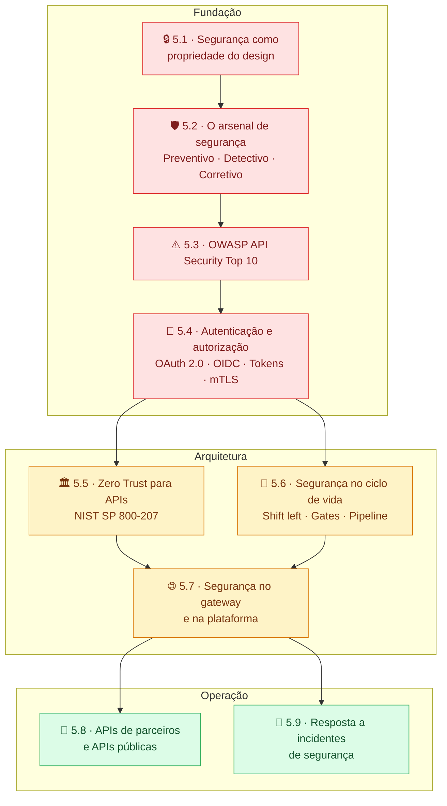

# Módulo 5 — Segurança de APIs

> **Série:** Gerenciamento e Governança de APIs
> **Nível:** Técnico e estratégico
> **Pré-requisito:** Módulos 1 a 4 — especialmente Cap 2.3, Cap 3.4 e Cap 4.4

---

## Por que segurança merece um módulo próprio?

APIs são superfícies de ataque por natureza: elas expõem intencionalmente recursos e dados para consumidores externos. Cada endpoint é uma porta aberta. A questão não é *se* ela será testada por adversários, mas *quando* — e se o design resistirá.

O erro mais comum é tratar segurança como uma camada adicionada ao final: firewall na frente, WAF no gateway, e "tá seguro". Esse modelo falha porque ignora que as vulnerabilidades mais críticas (exposição excessiva de dados, quebra de autorização, injeção) nascem no design e no contrato da API, não na infraestrutura.

Este módulo constrói a visão completa em três camadas: a **fundação conceitual** (5.1–5.4) que cobre design seguro, arsenal de controles, riscos OWASP e identidade; a **camada arquitetural** (5.5–5.7) que aplica Zero Trust, integra segurança ao ciclo de vida e fortalece o gateway; e a **camada operacional** (5.8–5.9) que trata parceiros, APIs públicas e resposta a incidentes.

---

## Mapa do módulo

---

## Capítulos

### [5.1 · Segurança como propriedade do design](cap_5_1_seg_propriedade_desing.md)

Segurança não é uma feature — é uma qualidade estrutural presente desde a primeira linha do contrato de API. O capítulo apresenta a distinção entre *security by design* e *security by addition*, introduz o **threat modeling** como prática sistemática de identificação de superfícies de ataque, e discute os princípios de design seguro (menor privilégio, fail-safe defaults, separação de deveres). Fecha com a **modelagem de escopos OAuth** como instrumento de governança.

---

### [5.2 · O arsenal de segurança de APIs](cap_5_2_arsenal_seguranca.md)

Organiza os controles de segurança em três camadas: **preventivos** (autenticação, rate limiting, validação de entrada, TLS), **detectivos** (logging estruturado, monitoramento de anomalias, SIEM) e **corretivos** (revogação de token, bloqueio de IP, incident response). Explica como os três tipos formam um sistema de *defense in depth* — e por que operar apenas com controles preventivos é uma aposta perigosa.

---

### [5.3 · OWASP API Security Top 10](cap_5_3_oswap.md)

O catálogo mais referenciado de riscos em APIs. Percorre as dez categorias do OWASP API Security Top 10 (edição 2023): desde **Broken Object Level Authorization** (BOLA) e **Broken Authentication** até **Unsafe Consumption of APIs** e **Server Side Request Forgery**. Cada categoria é examinada com exemplos, padrão de exploração e mitigações. Termina com orientações práticas de como usar o Top 10 em políticas de governança e revisões de design.

---

### [5.4 · Autenticação e autorização — os fundamentos](cap_5_4_autenticacao_autorizacao.md)

O capítulo mais denso do módulo. Cobre **OAuth 2.0** como framework de autorização delegada, os tipos de **tokens** (opaque, JWT, estrutura, ciclo de vida e validação), **OpenID Connect** como camada de identidade, os **grant types** e quando usar cada um, **mTLS** e proof-of-possession, **provedores de identidade** (IdP) e **SAML** como ponte legada. Fecha com propagação de identidade em microserviços e trade-offs explícitos para decisões de design.

---

### [5.5 · Zero Trust para APIs](cap_5_5_zero_trust.md)

Segurança baseada em perímetro de rede falha para APIs por uma razão estrutural: APIs existem para romper o perímetro. O capítulo aplica os **sete tenets do NIST SP 800-207** ao contexto de APIs — identidade como o novo perímetro, cada requisição como não-confiável por padrão. Cobre **verificação contínua** além do token na entrada, **microsegmentação** para limitar lateral movement, e o modelo de **maturidade de adoção** de Zero Trust em quatro níveis incrementais.

---

### [5.6 · Segurança no ciclo de vida — shift left](cap_5_6_seguranca_ciclo_vida.md)

Aplica o princípio **shift left** à segurança de APIs: quanto mais cedo uma vulnerabilidade é identificada, menor o custo de corrigi-la. O capítulo cobre segurança em cada fase do ciclo de vida — **concepção e design** (threat modeling como gate), **pipeline** (SAST, SCA, testes de segurança automatizados), **publicação e runtime** (revisão de segurança, monitoramento) e **depreciação** (descomissionamento seguro). Referência normativa central: NIST SP 800-218 (SSDF).

---

### [5.7 · Segurança no gateway e na plataforma](cap_5_7_seguranca_gtw_plat.md)

O gateway é o plano de controle centralizado de segurança do portfólio — o lugar onde políticas de autenticação, rate limiting, validação de schema e WAF se aplicam a todas as APIs sem que cada time as reimplemente. O capítulo cobre **controles de autenticação e autorização no gateway**, **proteção contra abuso** (rate limiting avançado, throttling), **validação e filtragem de tráfego**, **gestão de TLS e segredos**, e — criticamente — o que o gateway *não pode fazer* e precisa ser resolvido na aplicação.

---

### [5.8 · Segurança em APIs de parceiros e APIs públicas](cap_5_8_seguranca_parceiros.md)

Quando uma API é exposta a parceiros ou ao público, o modelo de risco muda fundamentalmente: consumidores são desconhecidos, intenções são opacas e o suporte a incidentes é indireto. O capítulo cobre a **ampliação da superfície de ataque**, controles específicos para **APIs de parceiros** (SLAs de segurança, credenciamento, auditoria bilateral) e **APIs públicas** (proteção contra abuso massivo, anonimato, scraping), o **ciclo de vida de consumidores externos** e as **obrigações regulatórias** em mercados como Open Finance e saúde.

---

### [5.9 · Resposta a incidentes de segurança](cap_5_9_resposta_incidentes.md)

Incidentes de segurança têm características que os distinguem de outros incidentes: preservação de evidências é obrigatória antes da restauração, o escopo de comprometimento é inicialmente desconhecido e pode haver obrigações legais de notificação. O capítulo cobre as sete fases — **preparação**, **detecção e triagem**, **contenção**, **investigação forense**, **recuperação**, **notificação** e **post-mortem** — e fecha com como cada incidente alimenta a evolução do programa de segurança.

---

## Anexos relacionados

| Anexo | Tema |
|-------|------|
| [Anexo E · Falhas de design seguro em APIs — casos práticos](../anexos/e_design_seguro.md) | Exemplos reais de falhas de design (complementa 5.1) |
| [Anexo F · SIEM e correlação de eventos de segurança](../anexos/f_siem.md) | Arquitetura de SIEM para APIs (complementa 5.2 e 5.9) |
| [Anexo G · Autorização e controle de acesso em APIs](../anexos/g_autorizacao_controle.md) | RBAC, ABAC, ReBAC (complementa 5.4) |
| [Anexo H · Exposição de dados em APIs](../anexos/h_exposicao_dados.md) | Padrões de vazamento e proteção (complementa 5.3) |
| [Anexo I · Recursos, injeção e gestão em APIs](../anexos/i_recursos_injecao_gestao.md) | Injeção, DoS por recurso e gestão (complementa 5.3) |
| [Anexo J · Guia de leitura — os RFCs do OAuth 2.0](../anexos/j_rfcs_oauth.md) | Mapa dos RFCs do ecossistema OAuth (complementa 5.4) |
| [Anexo K · Guia de leitura — os RFCs dos tokens](../anexos/k_rfcs_token.md) | RFCs de JWT, JWS, JWE, JWK (complementa 5.4) |
| [Anexo L · Modelos e ferramentas de autorização fina](../anexos/l_rbac.md) | OPA, Casbin, Cedar, OpenFGA (complementa 5.4) |
