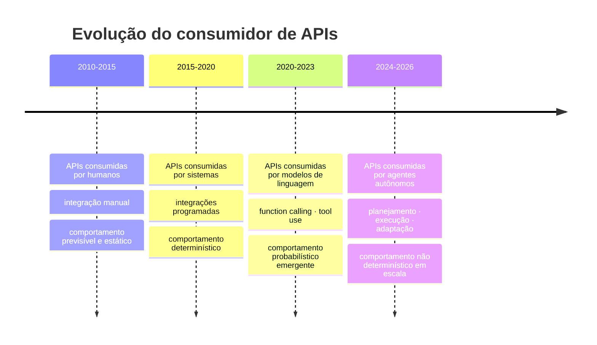
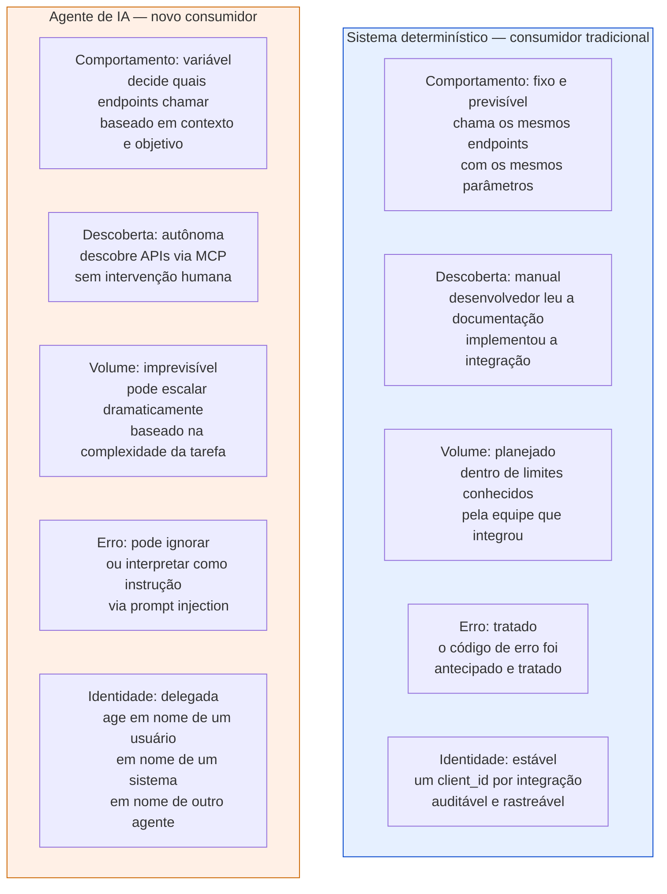
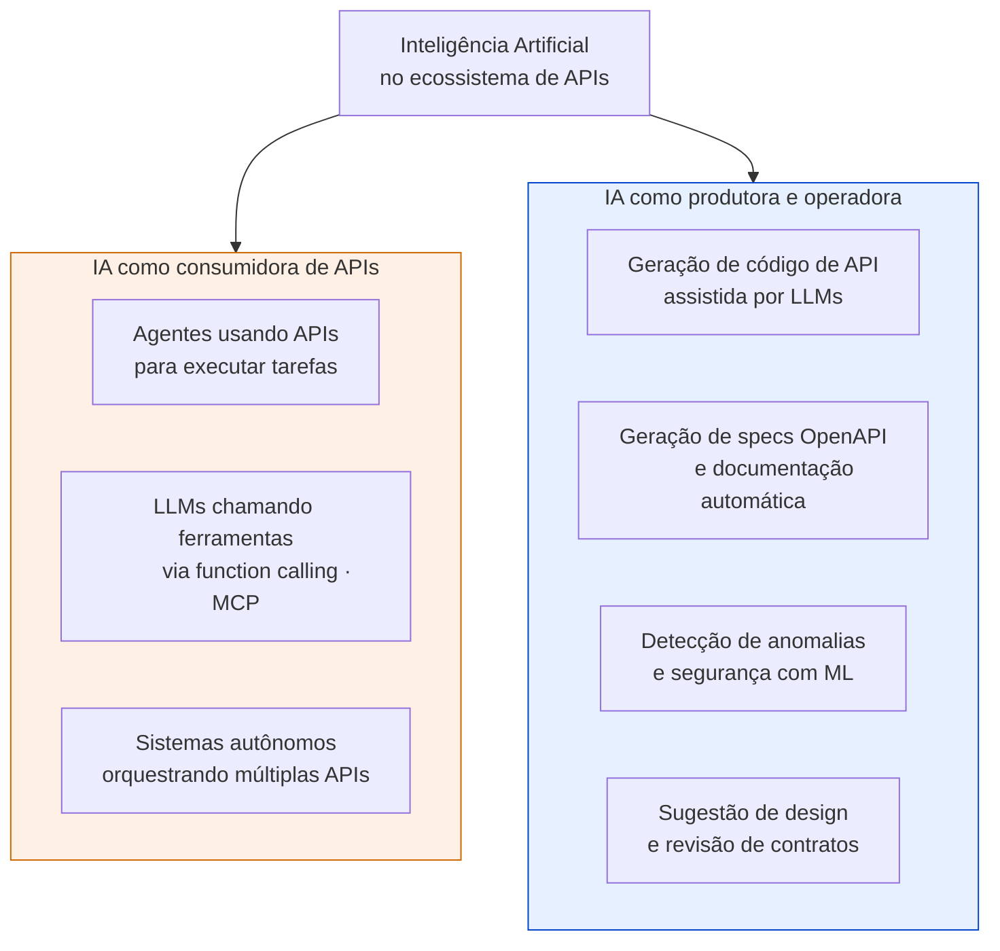

# Módulo 6 · IA e APIs
## Capítulo 6.1 · IA e APIs — o novo paradigma

> **Série:** Gerenciamento e Governança de APIs
> **Nível:** Estratégico e conceitual
> **Pré-requisito:** Módulos 1 a 5

---

## Sumário

- [6.1.1 · A mudança que este módulo documenta](#611--a-mudança-que-este-módulo-documenta)
- [6.1.2 · O consumidor que não é humano](#612--o-consumidor-que-não-é-humano)
- [6.1.3 · O que muda no modelo de governança](#613--o-que-muda-no-modelo-de-governança)
- [6.1.4 · A dupla face da IA nas APIs](#614--a-dupla-face-da-ia-nas-apis)
- [6.1.5 · O que permanece válido](#615--o-que-permanece-válido)
- [Fontes e referências](#fontes-e-referências)

---

## 6.1.1 · A mudança que este módulo documenta

Os módulos anteriores construíram um programa de APIs projetado para um mundo específico: APIs são contratos entre sistemas, criados por humanos, consumidos por sistemas determinísticos que seguem integrações planejadas. Um desenvolvedor lê a documentação, implementa a integração, e o sistema resultante chama a API de formas previsíveis dentro de limites conhecidos.

Esse mundo não desapareceu. Mas um novo tipo de consumidor emergiu que viola sistematicamente as premissas sobre as quais esse modelo foi construído.

**Sistemas de IA agênticos** — sistemas que percebem contexto, raciocinam sobre objetivos, planejam sequências de ações e executam operações autonomamente — estão consumindo APIs em produção hoje. Não como experimento. Como infraestrutura operacional em organizações de todos os portes.

A pesquisa empírica documenta a velocidade dessa mudança. O Gartner projeta que até 2026, 40% das aplicações empresariais embutirão agentes de IA específicos para tarefas — ante menos de 5% em 2025. O ecossistema MCP — o protocolo que padroniza como agentes descobrem e usam APIs — passou de zero servidores em novembro de 2024 para mais de 10.000 servidores públicos ativos em menos de 18 meses, com 97 milhões de downloads mensais do SDK.

Essa velocidade de adoção não dá ao programa de governança de APIs o luxo de esperar que o ecossistema se estabilize para então adaptar as políticas. A adaptação precisa acontecer em paralelo com a adoção.

---

## 6.1.2 · O consumidor que não é humano

Para entender o que muda, é necessário entender precisamente o que torna um agente de IA diferente de um sistema determinístico como consumidor de APIs.

---

### As quatro propriedades que definem o consumidor agêntico

**Autonomia** — um agente não segue um script fixo. Ele recebe um objetivo — "crie um relatório de vendas do último trimestre" — e decide autonomamente quais APIs chamar, em que ordem, com quais parâmetros, e como tratar os resultados intermediários. O mesmo objetivo pode resultar em sequências de chamadas completamente diferentes em execuções diferentes.

**Não-determinismo** — dado o mesmo input, um agente de IA pode produzir outputs diferentes. Isso é uma propriedade fundamental dos modelos de linguagem, não um bug. Para APIs que presumem comportamento determinístico dos consumidores, isso cria um novo tipo de superfície de ataque e um novo desafio de monitoramento.

**Escala potencial** — um humano que usa uma API pode fazer dezenas de chamadas por hora. Um agente executando uma tarefa complexa pode fazer milhares. Um swarm de agentes coordenados pode fazer milhões. Rate limits calibrados para consumidores humanos bloqueiam agentes legítimos. Rate limits calibrados para agentes podem permitir abuso em escala.

**Delegação em cascata** — um agente age em nome de alguém. Mas esse alguém pode ser um usuário humano, que autorizou um sistema, que orquestrou outro agente, que então chama a API. A cadeia de delegação pode ter múltiplos saltos, e rastrear quem é o responsável final por uma ação torna-se um problema não trivial.

---

## 6.1.3 · O que muda no modelo de governança

As premissas sobre as quais o programa de governança dos módulos anteriores foi construído precisam ser revisitadas — não descartadas, mas estendidas.

```mermaid
graph LR
    subgraph premissas_antigas["Premissas do modelo anterior"]
        pa1["O consumidor leu a documentação
        antes de integrar"]
        pa2["O comportamento do consumidor
        é previsível após a integração"]
        pa3["A identidade do consumidor
        é estável e conhecida"]
        pa4["O volume de chamadas
        pode ser antecipado"]
        pa5["A intenção do consumidor
        pode ser inferida pelo escopo"]
    end

    subgraph premissas_novas["Premissas revisadas para agentes"]
        pn1["O agente descobre APIs
        autonomamente via protocolo"]
        pn2["O comportamento do agente
        varia por execução e contexto"]
        pn3["A identidade do agente
        é delegada em múltiplos níveis"]
        pn4["O volume de chamadas
        é função da complexidade da tarefa"]
        pn5["A intenção do agente
        é inferida do objetivo delegado
        não do escopo do token"]
    end

    premissas_antigas -->|"revisadas"| premissas_novas

    style premissas_antigas fill:#ffe6e6,stroke:#cc0000
    style premissas_novas fill:#e6ffe6,stroke:#009900
```

---

### Onde a governança tradicional falha para agentes

**Catálogo como ferramenta de descoberta humana** — o catálogo do Cap 3.5 foi projetado para que desenvolvedores humanos encontrem APIs. Agentes descobrem APIs via protocolos como MCP — e podem usar APIs que nunca passaram pelo processo de registro no catálogo se essas APIs estiverem acessíveis tecnicamente.

**Rate limiting calibrado para humanos** — os limites do Cap 5.2.2 e 5.7.3 foram calibrados para padrões de uso humano. Um agente legítimo executando uma tarefa complexa pode legalmente precisar de volumes que qualquer limite razoável para humanos bloquearia.

**Autorização baseada em escopo estático** — escopos OAuth definem o que um consumidor pode fazer. Um agente que recebeu o objetivo "gerencie minha agenda" pode interpretar que "gerenciar" inclui deletar eventos, criar reuniões em nome de outros e enviar convites — tudo dentro de um escopo `calendar:write` que nenhum desenvolvedor humano usaria dessa forma.

**Processos de credenciamento manuais** — o onboarding de consumidores do Cap 5.8.4 pressupõe revisão humana de caso de uso. Agentes são instanciados programaticamente, em escala, sem que nenhum humano revise cada instância individualmente.

---

### Onde a governança se torna mais crítica

A ironia do cenário agêntico é que as propriedades que tornam agentes poderosos — autonomia, escala, encadeamento de ações — são as mesmas que tornam o dano potencial muito maior quando algo dá errado.

Um humano que acessa uma API com credenciais comprometidas causa dano limitado pela velocidade e capacidade humanas. Um agente com as mesmas credenciais comprometidas pode causar o mesmo tipo de dano em segundos e em escala massiva.

Auditoria, FGA, revogação rápida, monitoramento comportamental — todos os controles do Módulo 5 que já eram importantes tornam-se críticos em ambientes agênticos. A velocidade com que um agente pode tomar ações exige que os controles de segurança sejam automáticos e operam em tempo real — não processos manuais de revisão.

---

## 6.1.4 · A dupla face da IA nas APIs

A IA não é apenas um novo tipo de consumidor de APIs — é também uma ferramenta que transforma como APIs são criadas, governadas e operadas. O Módulo 6 trata as duas faces:

---

### IA como consumidora — o foco dos Caps 6.2 a 6.7

Quando a IA consome APIs, os desafios são de identidade, autorização, segurança agêntica e governança. Como garantir que agentes têm apenas o acesso que precisam? Como auditar o que um agente fez em nome de quem? Como detectar quando um agente foi comprometido via prompt injection? Como o catálogo e os contratos precisam evoluir para servir bem a agentes?

### IA como produtora e operadora — o foco do Cap 6.5 e 6.8

Quando a IA produz código de API, os desafios são de qualidade e segurança. A pesquisa empírica é inequívoca: código gerado por IA contém mais vulnerabilidades do que código humano — especialmente vulnerabilidades arquiteturais que escapam de revisão superficial. O programa de governança precisa de gates específicos para código e specs gerados por IA.

Quando a IA opera o programa de APIs — gerando alertas de segurança, sugerindo design, detectando anomalias — ela é uma ferramenta de governança. Mas uma ferramenta que introduz seus próprios riscos: alucinações, vieses, dependência de modelo e falta de rastreabilidade das decisões.

---

## 6.1.5 · O que permanece válido

Antes de entrar nos capítulos que documentam o que precisa mudar, é importante registrar o que não muda — porque a tentação de tratar IA como ruptura total pode levar a descarte de fundamentos que continuam sendo essenciais.

**Os princípios de design seguro do Cap 5.1 continuam válidos.** Uma API bem projetada com autorização por objeto, exposição mínima de dados e contratos restritivos é mais difícil de abusar por um agente do que por um humano — e por um humano também. Security by design é mais importante em ambientes agênticos, não menos.

**A observabilidade do Cap 3.8 continua sendo a base.** Sem visibilidade do que está acontecendo, não há como detectar comportamento agêntico anômalo. Os princípios de logging, métricas e rastreabilidade continuam sendo os mesmos — o que muda é o que precisa ser monitorado.

**O catálogo e o CMDB do Caps 3.5 e 4.3 continuam sendo fontes de verdade.** APIs que não estão no catálogo não devem ser acessíveis a agentes — da mesma forma que não deveriam ser acessíveis a humanos. Shadow APIs são ainda mais perigosas em ambientes agênticos.

**OAuth 2.0 e os mecanismos de autorização do Cap 5.4 continuam sendo a base.** O que muda é como são usados em cadeias de delegação agêntica — não os protocolos em si. Token Exchange, FGA e escopos granulares tornam-se ainda mais críticos.

---

## Pontos-chave do capítulo

- Sistemas de IA agênticos estão consumindo APIs em produção hoje — não como experimento. O MCP passou de zero para mais de 10.000 servidores públicos em 18 meses. O Gartner projeta 40% das aplicações empresariais com agentes embutidos até 2026
- O consumidor agêntico é fundamentalmente diferente do determinístico em quatro dimensões: autonomia no comportamento, não-determinismo nas chamadas, escala imprevisível e identidade delegada em cascata
- A governança tradicional tem lacunas específicas para agentes: catálogo como ferramenta humana, rate limits calibrados para humanos, autorização por escopo estático e credenciamento manual
- Onde a governança se torna mais crítica: as propriedades que tornam agentes poderosos — autonomia, escala, encadeamento — são as mesmas que amplificam o dano potencial. FGA, auditoria, revogação rápida e monitoramento em tempo real tornam-se indispensáveis
- A IA tem dupla face no ecossistema de APIs: como consumidora (agentes usando APIs) e como produtora/operadora (geração de código, detecção de anomalias, sugestão de design)
- Os fundamentos dos módulos anteriores continuam válidos — design seguro, observabilidade, catálogo, OAuth 2.0. O que muda é como são aplicados e estendidos para o contexto agêntico

---

## Fontes e referências

| Fonte | Referência completa |
|---|---|
| **MCP — Model Context Protocol** | Anthropic / Agentic AI Foundation. *Model Context Protocol Specification*. Lançado novembro 2024, doado à Linux Foundation dezembro 2025. Disponível em: [modelcontextprotocol.io](https://modelcontextprotocol.io) |
| **Gartner Market Guide for AI Gateways (2025)** | Humphreys, A. et al. *Market Guide for AI Gateways*. Gartner, outubro 2025. Disponível em: [gartner.com/en/documents/7051698](https://www.gartner.com/en/documents/7051698) |
| **OWASP Top 10 para Aplicações Agênticas 2026** | OWASP Foundation. *OWASP Top 10 for Agentic Applications 2026*. Dezembro 2025. Disponível em: [genai.owasp.org/resource/owasp-top-10-for-agentic-applications-for-2026](https://genai.owasp.org/resource/owasp-top-10-for-agentic-applications-for-2026/) |
| **State of AI Agent Security (2025)** | Gravitee. *State of AI Agent Security Report*. 2025. Disponível em: [gravitee.io/state-of-ai-agent-security](https://www.gravitee.io/state-of-ai-agent-security) |

---

## Próximo capítulo

**6.2 · MCP e os protocolos agênticos** — como o Model Context Protocol funciona, o que resolve, como APIs existentes se tornam ferramentas para agentes e o que o programa de APIs precisa fazer para ser AI-Ready.

---

*Série: Gerenciamento e Governança de APIs · Módulo 6 · Capítulo 6.1*