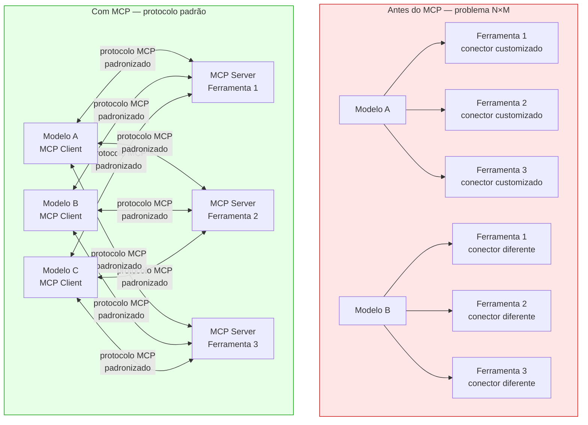
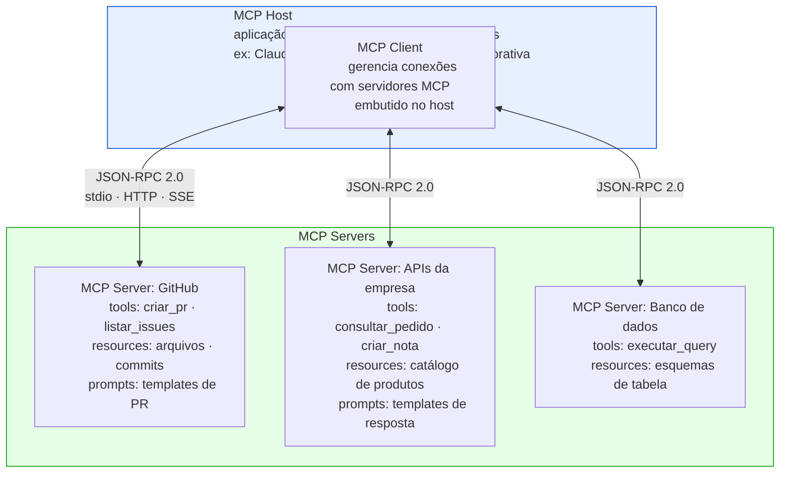
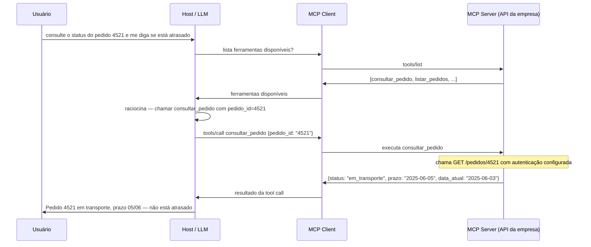
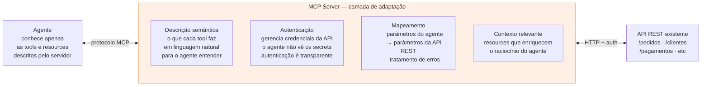
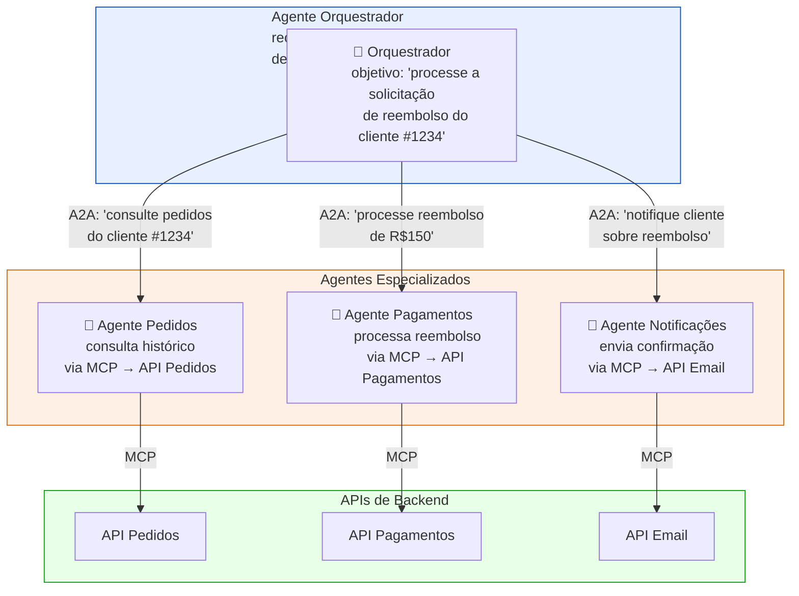
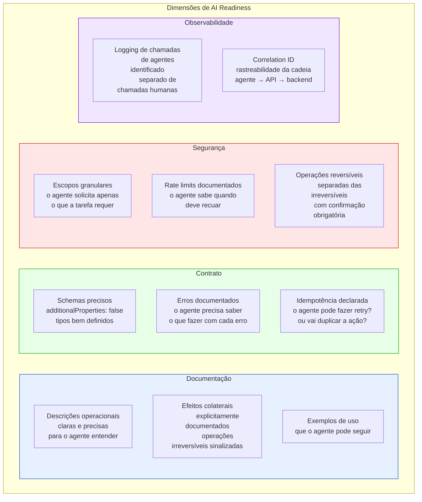
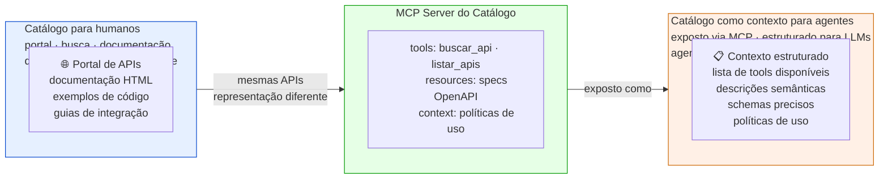

# Módulo 6 · IA e APIs
## Capítulo 6.2 · MCP e os protocolos agênticos

> **Série:** Gerenciamento e Governança de APIs
> **Nível:** Técnico e arquitetural
> **Pré-requisito:** Cap 6.1 · Cap 2.1 · Cap 3.5

---

## Sumário

- [6.2.1 · O problema que o MCP resolve](#621--o-problema-que-o-mcp-resolve)
- [6.2.2 · Arquitetura e funcionamento do MCP](#622--arquitetura-e-funcionamento-do-mcp)
- [6.2.3 · Como APIs existentes se tornam ferramentas para agentes](#623--como-apis-existentes-se-tornam-ferramentas-para-agentes)
- [6.2.4 · Agent-to-Agent — o protocolo A2A](#624--agent-to-agent--o-protocolo-a2a)
- [6.2.5 · AI Readiness do portfólio de APIs](#625--ai-readiness-do-portfólio-de-apis)
- [6.2.6 · O catálogo como contexto para agentes](#626--o-catálogo-como-contexto-para-agentes)
- [Fontes e referências](#fontes-e-referências)

---

## 6.2.1 · O problema que o MCP resolve

Antes do MCP, conectar um sistema de IA a ferramentas e fontes de dados externas exigia uma integração customizada para cada par — um problema N×M. Cada modelo de IA precisava de um conector diferente para cada ferramenta. Cada ferramenta precisava de uma implementação diferente para cada modelo. O resultado era fragmentação, duplicação de esforço e ecossistemas de IA isolados.

O Model Context Protocol — lançado pela Anthropic em novembro de 2024, open-sourced e adotado pela indústria ao longo de 2025, e doado à Linux Foundation via Agentic AI Foundation em dezembro de 2025 — resolve esse problema com a mesma lógica que o USB resolveu a fragmentação de conectores físicos: um protocolo padrão que qualquer cliente e qualquer servidor podem implementar.

> *Model Context Protocol. Agentic AI Foundation / Linux Foundation. Disponível em: [modelcontextprotocol.io](https://modelcontextprotocol.io)*



---

## 6.2.2 · Arquitetura e funcionamento do MCP

O MCP usa uma arquitetura cliente-servidor transportada sobre JSON-RPC 2.0. Reutiliza as ideias de fluxo de mensagens do Language Server Protocol — o protocolo que padroniza como IDEs se comunicam com ferramentas de linguagem.

### Os três papéis do MCP



**Host** — a aplicação que incorpora o modelo de IA e precisa conectá-lo a ferramentas. Pode ser um assistente de código (Cursor), um chatbot corporativo, ou qualquer aplicação que usa LLMs.

**Client** — o componente dentro do host que gerencia as conexões com servidores MCP. Mantém o estado das conexões, descobre capacidades e roteia chamadas.

**Server** — expõe capacidades ao agente através de três tipos de primitivas:

### As três primitivas do MCP

**Tools (Ferramentas)** — funções que o agente pode chamar para executar ações. São o equivalente das operações de uma API REST — mas expostas de forma que o agente descobre e seleciona autonomamente.

```json
{
  "name": "consultar_pedido",
  "description": "Consulta os detalhes de um pedido pelo ID. Retorna status, itens e valor total.",
  "inputSchema": {
    "type": "object",
    "properties": {
      "pedido_id": {
        "type": "string",
        "description": "Identificador único do pedido"
      }
    },
    "required": ["pedido_id"]
  }
}
```

**Resources (Recursos)** — fontes de dados que o agente pode ler como contexto. Arquivos, registros de banco de dados, páginas de documentação. Diferentes de tools — resources são lidos, não executados.

**Prompts (Prompts)** — templates de prompts pré-definidos que o servidor expõe. Permitem que o servidor guie o comportamento do agente para casos de uso específicos.

---

### O fluxo de uma interação MCP



---

### O que o MCP não é

O MCP não substitui APIs REST, GraphQL ou qualquer protocolo de API existente. É uma **camada de adaptação** que expõe capacidades existentes de forma que agentes de IA possam descobri-las e usá-las de forma padronizada. Por baixo de cada MCP Server, geralmente há APIs REST sendo chamadas.

---

## 6.2.3 · Como APIs existentes se tornam ferramentas para agentes

A transição de "API REST" para "ferramenta MCP" envolve criar um MCP Server que encapsula a API e a expõe via protocolo MCP. O servidor MCP é responsável por:



---

### A importância da descrição semântica

Em uma API REST tradicional, a documentação é para humanos — um desenvolvedor lê e decide como integrar. Em um MCP Server, a descrição é para o modelo de linguagem — o agente usa a descrição para decidir se e quando chamar aquela tool.

A qualidade da descrição determina diretamente a qualidade do comportamento do agente. Uma descrição imprecisa leva o agente a chamar a tool quando não deveria, ou a não chamar quando deveria. Uma descrição que não especifica claramente os efeitos colaterais de uma operação pode levar o agente a executar ações destrutivas sem intenção.

```
❌ Descrição ruim:
"cancela_pedido: cancela um pedido"

✅ Descrição boa:
"cancela_pedido: Cancela permanentemente um pedido existente.
Esta ação é IRREVERSÍVEL — o pedido não pode ser recuperado após o cancelamento.
Use apenas quando o usuário confirmou explicitamente que deseja cancelar.
Retorna erro se o pedido já estiver em status 'entregue' ou 'cancelado'.
Parâmetros: pedido_id (string, obrigatório) — ID único do pedido a cancelar."
```

A descrição como artefato de governança é um conceito novo que o programa de APIs precisa incorporar: além da spec OpenAPI, os MCP Servers que expõem as APIs precisam de descrições semânticas de qualidade que façam parte do processo de revisão do CoE.

---

## 6.2.4 · Agent-to-Agent — o protocolo A2A

O MCP resolve a comunicação entre agente e ferramentas. O protocolo A2A — Agent-to-Agent, anunciado pelo Google em 2025 — resolve a comunicação entre agentes.

Em arquiteturas de multi-agent systems, agentes orquestradores delegam tarefas a agentes especializados. O A2A padroniza como esse handoff acontece: como um agente descobre outro agente, como delega uma tarefa, como recebe o resultado, e como a identidade é propagada ao longo da cadeia.



Do ponto de vista de governança de APIs, o A2A cria um novo desafio: quando o `agente_pagamentos` chama a `API Pagamentos`, quem é o responsável pela ação? O agente? O orquestrador que delegou? O usuário humano que originou o objetivo? A cadeia de delegação precisa ser rastreável — e o Token Exchange do Cap 5.4.9 com o claim `act` é a base técnica para isso.

---

## 6.2.5 · AI Readiness do portfólio de APIs

O conceito de AI Readiness — introduzido nos Caps 2.4 e 3.5 como promessa de aprofundamento — é a avaliação de quão bem preparado está o portfólio de APIs para ser consumido por agentes de IA.



---

### O score de AI Readiness

O CoE pode avaliar cada API do portfólio em um score de AI Readiness baseado nas quatro dimensões. Uma API com score baixo não é necessariamente inadequada para uso humano — mas não deve ser exposta via MCP sem que as lacunas sejam endereçadas.

| Dimensão | Critério mínimo | Critério ideal |
|---|---|---|
| **Documentação** | Descrições de operações existem | Descrições incluem efeitos colaterais, casos de erro e exemplos |
| **Contrato** | Schema OpenAPI válido | `additionalProperties: false`, idempotência declarada, erros documentados |
| **Segurança** | Autenticação OAuth 2.0 | Escopos granulares, rate limits por operação, operações destrutivas com confirmação |
| **Observabilidade** | Logging básico | Logging de agentes identificado, correlation ID, rastreabilidade de delegação |

---

## 6.2.6 · O catálogo como contexto para agentes

O catálogo do Cap 3.5 foi projetado para que desenvolvedores humanos encontrem APIs. Para agentes, o catálogo tem um papel diferente — é contexto que o agente recebe para saber quais ferramentas estão disponíveis e como usá-las.



Um MCP Server do catálogo permite que um agente pergunte "quais APIs de pagamento estão disponíveis?" e receba uma lista estruturada com as specs, as políticas de uso e as instruções de autenticação. Isso é a materialização do conceito de catálogo como infraestrutura de descoberta — não apenas para humanos, mas para sistemas autônomos.

O CoE precisa manter duas representações do catálogo: a representação humana (portal, documentação HTML, guias) e a representação agêntica (MCP Server, descrições semânticas, schemas estruturados para consumo por LLMs). Ambas derivam da mesma fonte de verdade — a spec OpenAPI — mas são otimizadas para audiências diferentes.

---

## Pontos-chave do capítulo

- O MCP resolve o problema N×M de integração — um protocolo padrão que qualquer agente e qualquer ferramenta implementam. Lançado em novembro de 2024, passou de zero para 10.000+ servidores públicos e 97 milhões de downloads mensais de SDK até 2026. Doado à Linux Foundation em dezembro de 2025
- A arquitetura MCP tem três papéis — Host, Client, Server — e três primitivas: Tools (ações), Resources (dados) e Prompts (templates). Transportado sobre JSON-RPC 2.0
- O MCP não substitui APIs REST — é uma camada de adaptação que encapsula APIs existentes e as expõe de forma que agentes descobrem e usam autonomamente
- A descrição semântica das tools é um artefato de governança: imprecisões levam o agente a comportamentos incorretos. Operações irreversíveis precisam ser explicitamente sinalizadas
- O protocolo A2A (Agent-to-Agent) padroniza comunicação entre agentes em sistemas multi-agente. Cria novos desafios de rastreabilidade de delegação — Token Exchange com claim `act` é a base técnica
- AI Readiness avalia o portfólio em quatro dimensões: documentação semântica, contrato preciso, segurança granular e observabilidade de agentes. APIs com score baixo não devem ser expostas via MCP sem remediação
- O catálogo precisa de duas representações: humana (portal, HTML) e agêntica (MCP Server, descrições semânticas). Ambas derivam da mesma spec OpenAPI mas são otimizadas para audiências diferentes

---

## Fontes e referências

| Fonte | Referência completa |
|---|---|
| **MCP — Model Context Protocol** | Agentic AI Foundation / Linux Foundation. *Model Context Protocol Specification*. Disponível em: [modelcontextprotocol.io](https://modelcontextprotocol.io) |
| **MCP: Standardizing Agentic Interoperability** | *The Model Context Protocol (MCP): Standardizing Agentic Interoperability*. ResearchGate / JISEM, 2026. Disponível em: [researchgate.net/publication/400262276](https://www.researchgate.net/publication/400262276_The_Model_Context_Protocol_MCP_Standardizing_Agentic_Interoperability) |

---

## Próximo capítulo

**6.3 · Identidade e autorização de agentes** — como OAuth 2.0, escopos e FGA se adaptam para agentes, o problema de delegação em cascata e o gap da IAM tradicional.

---

*Série: Gerenciamento e Governança de APIs · Módulo 6 · Capítulo 6.2*