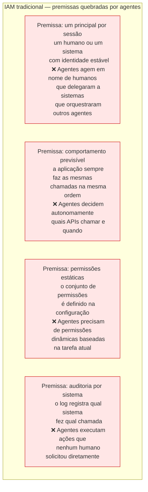
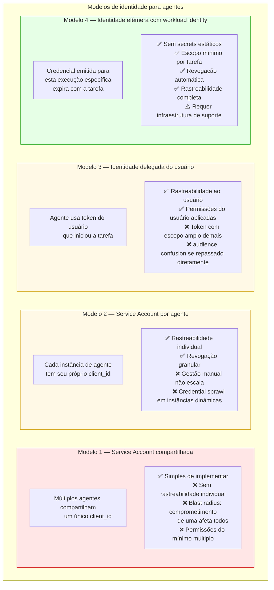
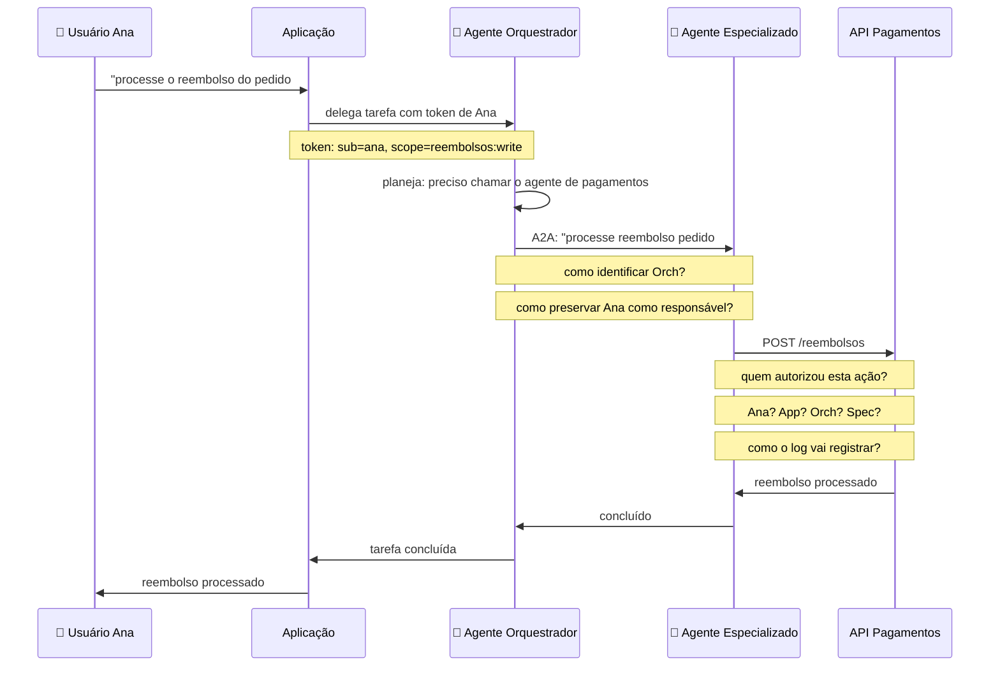
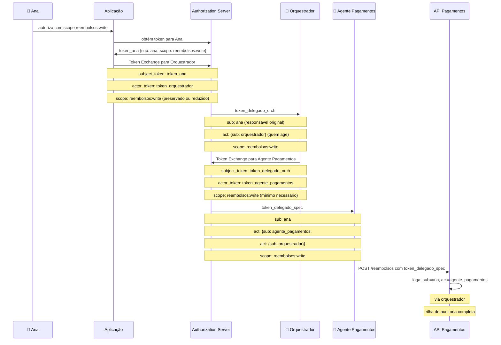
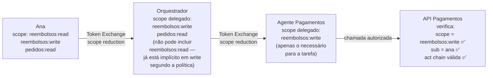
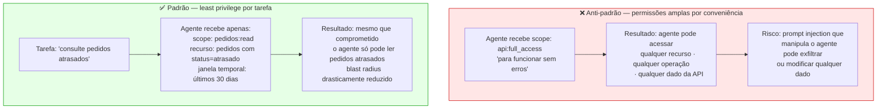
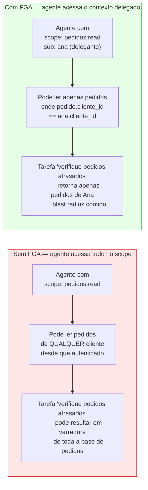
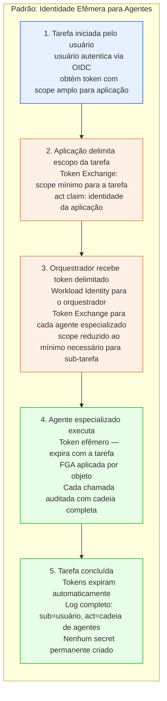

# Módulo 6 · IA e APIs
## Capítulo 6.3 · Identidade e autorização de agentes

> **Série:** Gerenciamento e Governança de APIs
> **Nível:** Técnico e arquitetural
> **Pré-requisito:** Cap 5.4 · Cap 5.4.12 · Cap 6.1 · Cap 6.2

---

## Sumário

- [6.3.1 · Por que IAM tradicional falha para agentes](#631--por-que-iam-tradicional-falha-para-agentes)
- [6.3.2 · Identidade de agentes — os modelos disponíveis](#632--identidade-de-agentes--os-modelos-disponíveis)
- [6.3.3 · Delegação em cascata — o problema central](#633--delegação-em-cascata--o-problema-central)
- [6.3.4 · Token Exchange em cadeias agênticas](#634--token-exchange-em-cadeias-agênticas)
- [6.3.5 · Least privilege para agentes](#635--least-privilege-para-agentes)
- [6.3.6 · FGA em contexto agêntico](#636--fga-em-contexto-agêntico)
- [6.3.7 · Identidade efêmera — o padrão recomendado](#637--identidade-efêmera--o-padrão-recomendado)
- [Fontes e referências](#fontes-e-referências)

---

## 6.3.1 · Por que IAM tradicional falha para agentes

O Identity and Access Management tradicional foi construído sobre premissas que sistemas agênticos violam sistematicamente.



A ISACA documentou esse gap em 2025 como "a crise de autorização iminente": IAM legado usa permissões pré-existentes estáticas e granulares que são muito grossas para lidar com agentes que raciocinam e planejam autonomamente. O resultado prático é que organizações estão solucionando o problema de duas formas inadequadas: dando aos agentes permissões excessivamente amplas "para funcionar", ou bloqueando completamente o acesso agêntico "por segurança".

Ambas as soluções são insustentáveis. A primeira cria superfície de ataque massiva. A segunda inviabiliza casos de uso legítimos.

---

## 6.3.2 · Identidade de agentes — os modelos disponíveis

Há quatro modelos de identidade que organizações estão usando para agentes, com trade-offs distintos:



O Modelo 4 — identidade efêmera com workload identity — é o padrão recomendado para ambientes agênticos maduros. Ele implementa o princípio Zero Trust do Cap 5.5 de credenciais efêmeras: cada execução de agente obtém uma identidade específica para aquela tarefa, com escopo mínimo, que expira automaticamente ao final da execução.

---

## 6.3.3 · Delegação em cascata — o problema central

O cenário mais comum em sistemas agênticos não é um único agente agindo de forma independente — é uma cadeia de delegação onde múltiplos atores estão envolvidos em uma única ação sobre uma API.



A questão crítica não é técnica — é de responsabilização. Quando a API Pagamentos registra no log de auditoria que um reembolso foi processado, quem é o ator registrado? O agente especializado que fez a chamada? O orquestrador que delegou? A aplicação que iniciou a cadeia? O usuário Ana que deu a instrução original?

Para fins de auditoria, conformidade regulatória e investigação de incidentes, a resposta precisa ser: **todos eles, com sua posição na cadeia explicitamente registrada**.

---

## 6.3.4 · Token Exchange em cadeias agênticas

O RFC 8693 — Token Exchange — é a base técnica para resolver delegação em cascata de forma rastreável. O Cap 5.4.9 introduziu o Token Exchange no contexto de microserviços; em cadeias agênticas, o mesmo mecanismo resolve um problema ainda mais complexo.



O claim `act` aninhado preserva toda a cadeia de delegação. A API que recebe a chamada sabe:
- **Quem** é o responsável original: `sub = ana`
- **Quem** está executando agora: `act.sub = agente_pagamentos`
- **Por delegação de quem**: `act.act.sub = orquestrador`

Essa rastreabilidade completa é o que permite investigação forense, conformidade regulatória e responsabilização em sistemas agênticos.

---

### Constraint de scope na cadeia agêntica

Uma propriedade fundamental do Token Exchange que se torna ainda mais importante em cadeias agênticas: **um ator não pode delegar mais permissões do que tem**.



O Authorization Server enforça essa constraint — se o orquestrador tentar delegar um scope que Ana não tem, o Token Exchange é rejeitado. Se o agente especializado tentar ampliar o scope recebido, é rejeitado. A cadeia só pode reduzir, nunca ampliar.

---

## 6.3.5 · Least privilege para agentes

O princípio de least privilege do Cap 5.1.4 — um consumidor deve ter acesso apenas ao que precisa para o caso de uso específico — é ainda mais importante para agentes do que para sistemas determinísticos.

Um sistema determinístico usa exatamente as permissões que o desenvolvedor configurou. Um agente pode usar qualquer permissão que tiver disponível de formas que nenhum desenvolvedor antecipou. Permissões excessivas em um agente não são apenas desnecessárias — são risco ativo.



---

### Just-in-Time e Just-Enough-Access para agentes

Dois padrões de IAM que ganham importância crítica em ambientes agênticos:

**Just-in-Time (JIT)** — permissões são concedidas apenas quando necessário e revogadas imediatamente após o uso. Um agente que precisa executar uma operação de alto risco solicita a permissão, executa, e a permissão é revogada. Não há permissões permanentes de alto risco — apenas janelas de acesso auditadas.

**Just-Enough-Access (JEA)** — o escopo concedido é o mínimo para aquela tarefa específica. Em vez de `pagamentos:write` genérico, o agente recebe `pagamentos:reembolso:write` para aquela categoria específica de operação.

A combinação JIT + JEA é o padrão de identidade efêmera descrito no Modelo 4 do 6.3.2.

---

## 6.3.6 · FGA em contexto agêntico

A autorização fina do Cap 5.4.12 — verificar se este sujeito pode acessar este objeto específico neste contexto — é especialmente crítica para agentes porque:

Um agente com `scope: pedidos:read` pode tecnicamente tentar ler qualquer pedido. Sem FGA, um agente que recebeu a tarefa "verifique todos os pedidos atrasados" pode ler os pedidos de todos os clientes, não apenas dos relevantes para a tarefa. Com FGA, a API verifica que o agente — agindo em nome do usuário Ana — só pode acessar pedidos da conta de Ana.



---

### Contextual authorization para agentes

Em cenários agênticos avançados, a decisão de autorização pode incluir o contexto da tarefa em andamento — não apenas a identidade do agente e o objeto:

```
Autorização contextual para agente:
- Quem delegou: usuário Ana (sub = ana)
- Tarefa em andamento: consulta de pedidos atrasados (objetivo documentado)
- Objeto solicitado: pedido #4521
- Verificações: pedido pertence à Ana? ✅
                tarefa permite leitura de pedidos? ✅
                horário dentro da janela autorizada? ✅
                volume de requisições dentro do esperado? ✅
→ ALLOW
```

Essa contextual authorization vai além do que OpenFGA e OPA fazem nativamente hoje — é uma área de desenvolvimento ativo em frameworks de AI governance.

---

## 6.3.7 · Identidade efêmera — o padrão recomendado

Consolidando os princípios deste capítulo, o padrão de identidade efêmera para agentes combina:



---

### O que o CoE governa neste modelo

**Políticas de identidade agêntica** — quais modelos de identidade são permitidos para agentes em produção. Service accounts compartilhadas são proibidas para agentes com acesso a dados sensíveis.

**Registro de agentes** — análogo ao credenciamento de consumidores do Cap 5.8.4, agentes que operam em produção devem ser registrados com: propósito documentado, owner responsável, escopos máximos autorizados e tipo de identidade.

**Auditoria obrigatória** — toda chamada de agente a APIs deve registrar a cadeia completa de delegação — não apenas o agente imediato. Log sem `sub` original e cadeia `act` é log insuficiente.

**Revisão periódica de permissões** — agentes acumulam permissões ao longo do tempo. O CoE realiza revisões periódicas para identificar privilege drift — permissões que foram necessárias em algum momento mas não são mais.

---

## Pontos-chave do capítulo

- IAM tradicional falha para agentes em quatro premissas: um principal por sessão, comportamento previsível, permissões estáticas e auditoria por sistema
- Quatro modelos de identidade para agentes — service account compartilhada, por agente, delegada do usuário, efêmera com workload identity. O Modelo 4 (efêmero) é o padrão recomendado
- Delegação em cascata é o problema central: quando um agente age em nome de um usuário via um orquestrador, a responsabilização precisa rastrear toda a cadeia — não apenas o ator imediato
- Token Exchange (RFC 8693) com claim `act` aninhado é a base técnica para rastreabilidade completa em cadeias agênticas. Scope reduction é enforçado em cada hop — a cadeia só pode reduzir, nunca ampliar
- Least privilege para agentes é mais crítico do que para sistemas determinísticos: agentes podem usar qualquer permissão disponível de formas não antecipadas. JIT + JEA é o padrão operacional
- FGA é indispensável em contextos agênticos: sem verificação por objeto, um agente com scope válido pode acessar dados além do contexto delegado
- O CoE governa: políticas de identidade agêntica, registro de agentes com propósito e owner, auditoria obrigatória com cadeia completa e revisão periódica de privilege drift

---

## Fontes e referências

| Fonte | Referência completa |
|---|---|
| **RFC 8693 — Token Exchange** | Jones, M. & Campbell, B. *OAuth 2.0 Token Exchange*. RFC 8693, janeiro 2020. Disponível em: [datatracker.ietf.org/doc/html/rfc8693](https://datatracker.ietf.org/doc/html/rfc8693) |
| **ISACA — The Looming Authorization Crisis (2025)** | ISACA. *The Looming Authorization Crisis: Why Traditional IAM Fails Agentic AI*. 2025. Disponível em: [isaca.org/resources/news-and-trends/industry-news/2025](https://www.isaca.org/resources/news-and-trends/industry-news/2025/the-looming-authorization-crisis-why-traditional-iam-fails-agentic-ai) |
| **NIST AI RMF** | NIST. *AI Risk Management Framework*. Disponível em: [nist.gov/artificial-intelligence](https://www.nist.gov/artificial-intelligence) |
| **State of AI Agent Security (2025)** | Gravitee. *State of AI Agent Security Report*. 2025. Disponível em: [gravitee.io/state-of-ai-agent-security](https://www.gravitee.io/state-of-ai-agent-security) |

---

## Próximo capítulo

**6.4 · Segurança no ecossistema agêntico** — prompt injection como vetor de ataque em APIs, OWASP LLM Top 10 e OWASP Agentic Top 10, tool poisoning, casos documentados.

---

*Série: Gerenciamento e Governança de APIs · Módulo 6 · Capítulo 6.3*