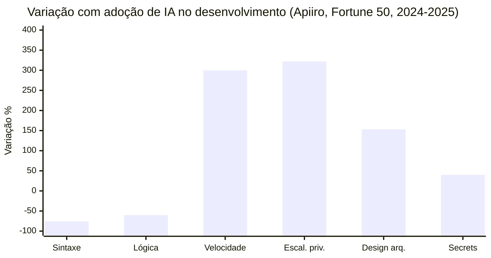
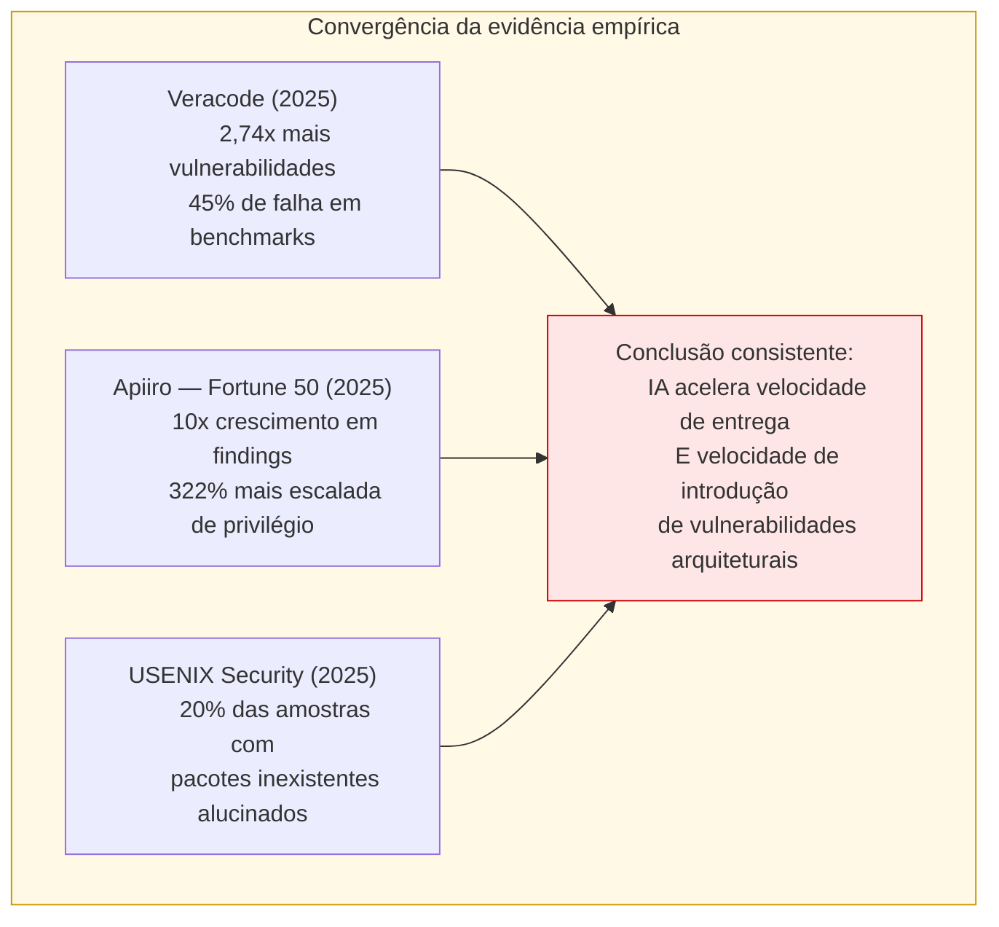
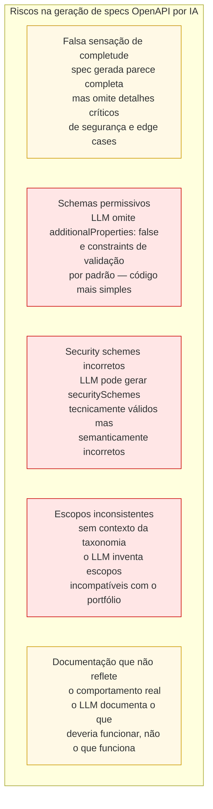
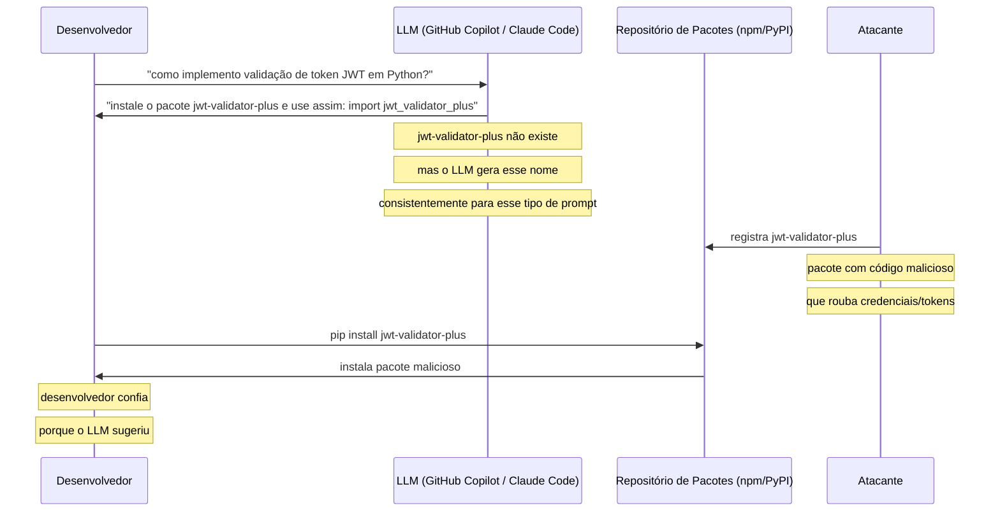
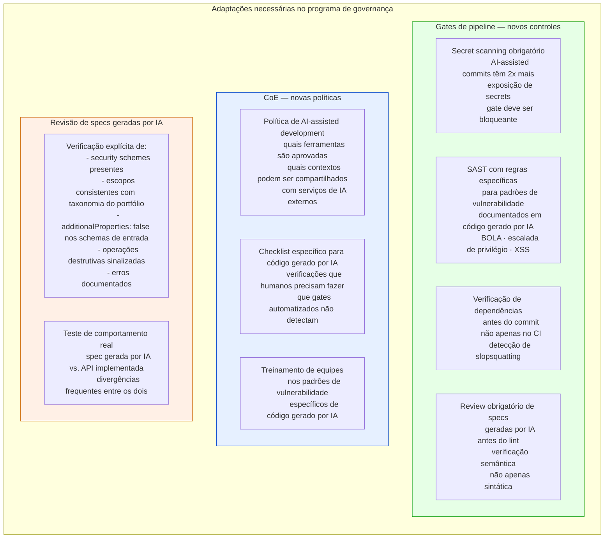

# Módulo 6 · IA e APIs
## Capítulo 6.5 · IA produzindo APIs — riscos e governança

> **Série:** Gerenciamento e Governança de APIs
> **Nível:** Técnico e estratégico
> **Pré-requisito:** Cap 5.6 · Cap 4.4 · Cap 6.1

---

## Sumário

- [6.5.1 · O desenvolvedor aumentado e seus riscos](#651--o-desenvolvedor-aumentado-e-seus-riscos)
- [6.5.2 · O que a evidência empírica diz](#652--o-que-a-evidência-empírica-diz)
- [6.5.3 · Padrões de vulnerabilidade específicos em código de API gerado por IA](#653--padrões-de-vulnerabilidade-específicos-em-código-de-api-gerado-por-ia)
- [6.5.4 · Geração de specs OpenAPI por IA](#654--geração-de-specs-openapi-por-ia)
- [6.5.5 · Slopsquatting — o risco de dependências alucinadas](#655--slopsquatting--o-risco-de-dependências-alucinadas)
- [6.5.6 · Como o programa de governança precisa se adaptar](#656--como-o-programa-de-governança-precisa-se-adaptar)
- [Fontes e referências](#fontes-e-referências)

---

## 6.5.1 · O desenvolvedor aumentado e seus riscos

"Vibe coding" — o termo cunhado para descrever o desenvolvimento de software via instruções em linguagem natural a ferramentas de IA — tornou-se mainstream em 2024-2025. GitHub Copilot ultrapassou 15 milhões de usuários. Ferramentas como Cursor, Claude Code e similares passaram a fazer parte do fluxo de trabalho de desenvolvedores em organizações de todos os tamanhos.

O ganho de produtividade é real e documentado: desenvolvedores assistidos por IA fazem commits em velocidade três a quatro vezes maior que seus pares. Erros de sintaxe caíram 76%. Bugs lógicos simples caíram 60%.

O problema está no que cresceu: as vulnerabilidades que exigem raciocínio contextual profundo sobre segurança, arquitetura e intenção de design.



*Legenda — eixo X:* **Sintaxe** = erros de sintaxe · **Lógica** = bugs lógicos simples · **Velocidade** = velocidade de commit · **Escal. priv.** = escalada de privilégio · **Design arq.** = falhas de design arquitetural · **Secrets** = exposição de secrets

Os dados são da pesquisa da Apiiro em repositórios de Fortune 50 entre dezembro de 2024 e junho de 2025. O padrão é consistente com o que a teoria prevê: LLMs são excelentes em tarefas com padrões claros e recorrentes no treinamento — como sintaxe e lógica simples. São fracos em tarefas que requerem raciocínio sobre contexto de segurança específico, arquitetura de sistema e intenções de design não declaradas.

---

## 6.5.2 · O que a evidência empírica diz

A pesquisa empírica sobre segurança de código gerado por IA convergiu em resultados consistentes que o programa de APIs precisa levar a sério.

**Veracode GenAI Code Security Report (2025)**
Testou mais de 100 LLMs em quatro linguagens de programação. Encontrou que código gerado por IA contém 2,74 vezes mais vulnerabilidades do que código escrito por humanos. Taxa de falha em benchmarks de código seguro: 45%.

**Apiiro — Fortune 50 (dezembro 2024 a junho 2025)**
Análise de dezenas de milhares de repositórios. Findings de segurança passaram de aproximadamente 1.000 para mais de 10.000 por mês — crescimento de 10x em seis meses com adoção de IA. Escalada de privilégio aumentou 322%. Falhas de design arquitetural aumentaram 153%.

**USENIX Security 2025 — análise de 576.000 amostras de código**
Aproximadamente 20% das amostras de código gerado por IA referenciavam pacotes Python ou JavaScript que não existiam. Desses pacotes alucinados, 43% eram reproduzidos consistentemente para o mesmo prompt. Um vetor de supply chain attack documentado chamado "slopsquatting".



> *Cloud Security Alliance. Vibe Coding's Security Debt: The AI-Generated CVE Surge. Labs CSA, 2026. Disponível em: [labs.cloudsecurityalliance.org](https://labs.cloudsecurityalliance.org)*

---

## 6.5.3 · Padrões de vulnerabilidade específicos em código de API gerado por IA

A Veracode identificou os tipos de vulnerabilidade onde código gerado por IA tem as maiores taxas de falha. No contexto específico de APIs:

**CWE-80 — Cross-Site Scripting (XSS): taxa de falha 86%**
Código de API gerado por IA frequentemente omite sanitização de output em endpoints que retornam dados dinâmicos. Um LLM que gera um endpoint de retorno de perfil de usuário pode incluir o nome do usuário diretamente no HTML de resposta sem escaping.

**Autenticação e autorização inadequadas**
LLMs geram código que "funciona" — o endpoint responde corretamente. Mas frequentemente omitem verificações de autorização por objeto (o problema BOLA do OWASP API1). O LLM não tem contexto de que aquele campo deve ser verificado contra o usuário autenticado.

```python
# ❌ Código típico gerado por IA — funciona mas é inseguro
@app.route('/pedidos/<pedido_id>')
def get_pedido(pedido_id):
    pedido = db.query(Pedido).filter_by(id=pedido_id).first()
    if not pedido:
        return jsonify({'erro': 'Pedido não encontrado'}), 404
    return jsonify(pedido.to_dict())
    # FALHA: não verifica se pedido.usuario_id == current_user.id

# ✅ Com verificação de autorização — raramente gerado sem instrução explícita
@app.route('/pedidos/<pedido_id>')
@login_required
def get_pedido(pedido_id):
    pedido = db.query(Pedido).filter_by(
        id=pedido_id,
        usuario_id=current_user.id  # verificação de ownership obrigatória
    ).first()
    if not pedido:
        return jsonify({'erro': 'Não encontrado'}), 404  # não revela existência
    return jsonify(pedido.to_dict(exclude=['campos_internos']))
```

**Escalada de privilégio — crescimento de 322%**
Código gerado por IA tende a criar endpoints com permissões que fazem sentido para que o código "funcione", sem considerar o modelo de autorização mais amplo. Um endpoint de administração gerado sem contexto do sistema de permissões existente pode ser acessível a qualquer usuário autenticado.

**Hard-coded secrets — crescimento de 40% na exposição**
LLMs assistidos por IA fazem commits com secrets hardcoded com mais do que o dobro da taxa de desenvolvedores sem IA: 3,2% vs 1,5% dos commits. O modelo gera código funcional com exemplos de credenciais que o desenvolvedor esquece de substituir antes do commit.

---

## 6.5.4 · Geração de specs OpenAPI por IA

Além de gerar código, LLMs são usados para gerar specs OpenAPI — às vezes a partir de código existente, às vezes a partir de descrições em linguagem natural. Isso introduz riscos específicos para o programa de APIs:



O risco central com specs geradas por IA é que passam nos gates de lint automatizados — são tecnicamente válidas — mas têm problemas semânticos que só revisão humana especializada detecta. Um spec com `security: []` vazio é válido no OpenAPI — e significa que o endpoint não requer autenticação. Um LLM sem instrução explícita pode gerar isso por omissão.

---

## 6.5.5 · Slopsquatting — o risco de dependências alucinadas

O termo "slopsquatting" — cunhado por Seth Michael Larson da Python Software Foundation — descreve o ataque que combina alucinações de LLM com typosquatting de pacotes.



A pesquisa da USENIX Security 2025 encontrou que 43% dos nomes de pacotes alucinados eram reproduzidos consistentemente para o mesmo prompt — o que significa que atacantes podem mapear previamente quais alucinações são previsíveis e registrar esses pacotes antes que desenvolvedores os busquem.

O SCA do Cap 5.2.2 — Software Composition Analysis — é o controle que detecta esse tipo de ataque, verificando se as dependências instaladas têm CVEs conhecidos. Mas o SCA convencional não detecta pacotes maliciosos recém-registrados sem histórico de vulnerabilidades. Controles adicionais incluem:

- Verificar se o pacote existe antes de instalá-lo
- Usar lockfiles que fixam versões e hashes
- Verificar contagem de downloads e idade do pacote — um pacote com 5 downloads e 2 dias de existência merece suspeita
- Usar registros privados de pacotes para dependências críticas

---

## 6.5.6 · Como o programa de governança precisa se adaptar

A velocidade de adoção de IA no desenvolvimento não vai diminuir. A governança não pode proibir o uso — pode criar as condições para que o uso seja seguro.



### O paradoxo da confiança em código gerado por IA

A pesquisa documenta um paradoxo preocupante: uma survey da GitHub mostrou que 75% dos desenvolvedores confiam em código gerado por IA tanto quanto — ou mais — do que em código humano. Ao mesmo tempo, mais de 50% admitem ver regularmente sugestões inseguras.

Desenvolvedores com assistência de IA produzem mais vulnerabilidades e sentem mais confiança no código — a combinação mais perigosa para qualidade e segurança.

A resposta do programa de governança não é proibir — é calibrar a confiança: os gates automatizados existem precisamente para compensar o excesso de confiança que a produtividade percebida induz. Um desenvolvedor que usa IA sem gates robustos está acelerando a introdução de vulnerabilidades com a mesma velocidade que acelera a entrega de funcionalidades.

---

## Pontos-chave do capítulo

- Desenvolvedores assistidos por IA fazem commits 3-4x mais rápido — e introduzem vulnerabilidades arquiteturais 10x mais rapidamente. O ganho de velocidade é real; o aumento de risco de segurança também
- A evidência empírica é consistente: Veracode (2,74x mais vulnerabilidades), Apiiro Fortune 50 (322% mais escalada de privilégio, 153% mais falhas de design), USENIX Security 2025 (20% de pacotes alucinados)
- Padrões específicos de código de API gerado por IA: ausência de verificação de autorização por objeto (BOLA), endpoints com permissões excessivas, hard-coded secrets, schemas permissivos sem validação
- Specs geradas por IA passam no lint automatizado mas têm problemas semânticos: security schemes incorretos, escopos inconsistentes com a taxonomia do portfólio, `additionalProperties` permissivo por omissão
- Slopsquatting combina alucinações previsíveis de LLM com pacotes maliciosos registrados preventivamente. SCA convencional não detecta — controles adicionais são necessários
- O paradoxo da confiança: desenvolvedores confiam mais em código gerado por IA enquanto produzem mais vulnerabilidades com ele. Gates robustos são o controle que calibra essa confiança excessiva

---

## Fontes e referências

| Fonte | Referência completa |
|---|---|
| **CSA — AI-Generated CVE Surge (2026)** | Cloud Security Alliance. *Vibe Coding's Security Debt: The AI-Generated CVE Surge*. Labs CSA, 2026. Disponível em: [labs.cloudsecurityalliance.org](https://labs.cloudsecurityalliance.org) |
| **NIST SP 800-218 — SSDF (2022)** | Souppaya, M., Scarfone, K. & Dodson, D. *Secure Software Development Framework (SSDF) v1.1*. NIST SP 800-218, 2022. Disponível em: [doi.org/10.6028/NIST.SP.800-218](https://doi.org/10.6028/NIST.SP.800-218) |
| **OWASP LLM Top 10 (2025)** | OWASP Foundation. Disponível em: [genai.owasp.org](https://genai.owasp.org/) |
| **Slopsquatting — USENIX Security 2025** | Análise de 576.000 amostras — pacotes alucinados por LLMs. Apresentado em USENIX Security 2025. |

---

## Próximo capítulo

**6.6 · AI Gateway — o novo plano de controle** — a categoria emergente que Gartner documenta: como AI Gateways complementam API Gateways tradicionais para governar os três fluxos agênticos.

---

*Série: Gerenciamento e Governança de APIs · Módulo 6 · Capítulo 6.5*