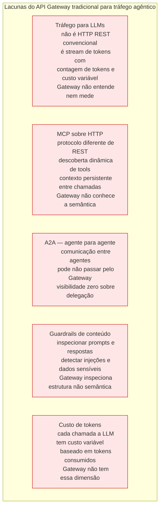
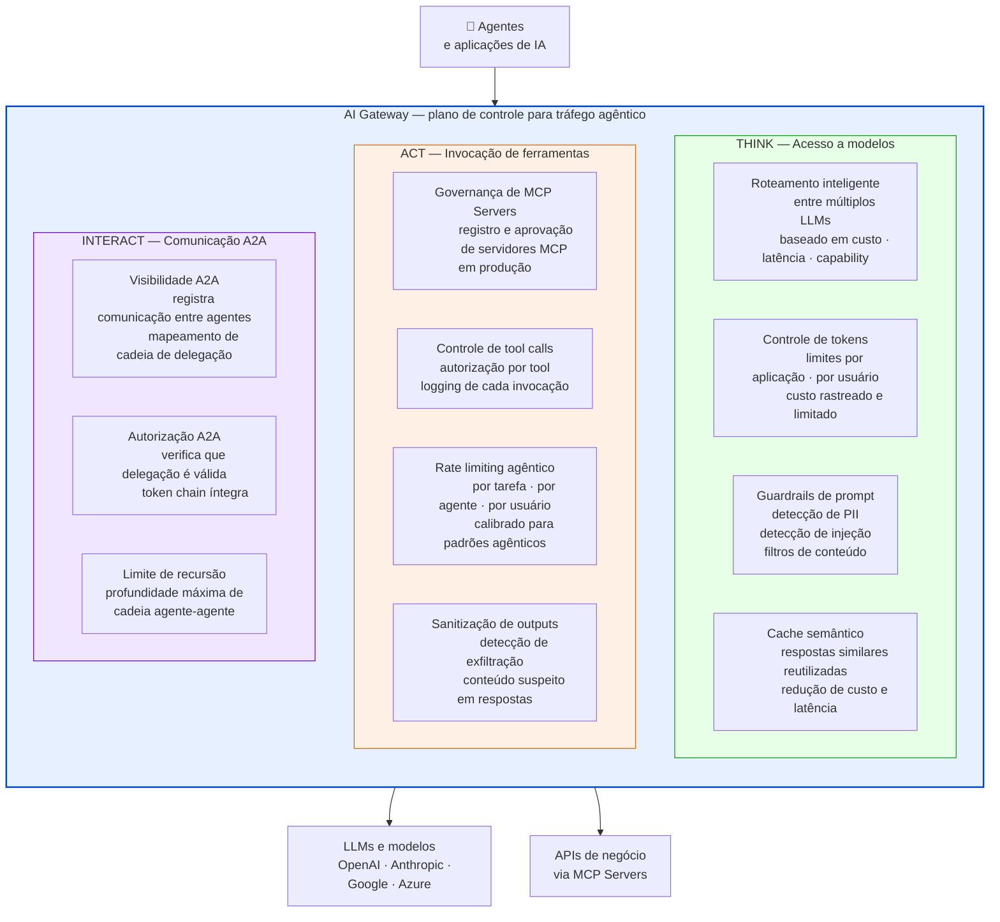
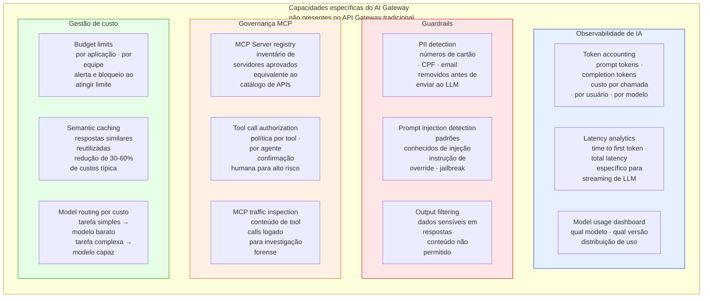
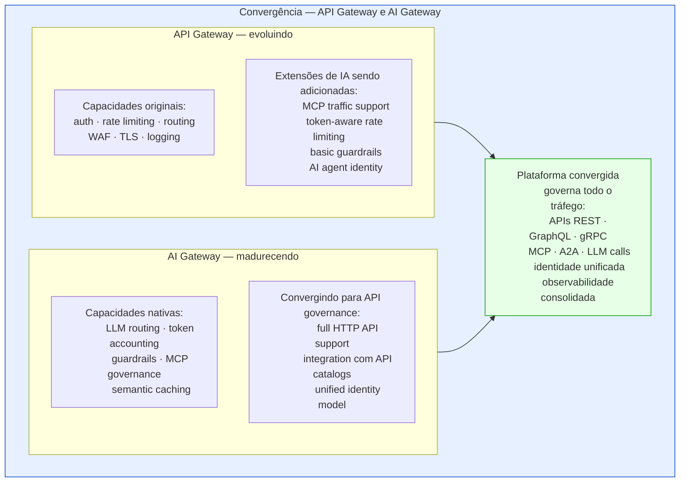
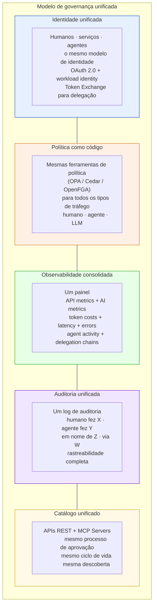

# Módulo 6 · IA e APIs
## Capítulo 6.6 · AI Gateway — o novo plano de controle

> **Série:** Gerenciamento e Governança de APIs
> **Nível:** Arquitetural e operacional
> **Pré-requisito:** Cap 5.7 · Cap 6.2 · Cap 6.3 · Cap 6.4

---

## Sumário

- [6.6.1 · Por que o API Gateway tradicional não é suficiente](#661--por-que-o-api-gateway-tradicional-não-é-suficiente)
- [6.6.2 · O que é um AI Gateway](#662--o-que-é-um-ai-gateway)
- [6.6.3 · Os três fluxos agênticos a governar](#663--os-três-fluxos-agênticos-a-governar)
- [6.6.4 · Capacidades específicas do AI Gateway](#664--capacidades-específicas-do-ai-gateway)
- [6.6.5 · API Gateway e AI Gateway — convergência e coexistência](#665--api-gateway-e-ai-gateway--convergência-e-coexistência)
- [6.6.6 · Governança unificada — o modelo de controle](#666--governança-unificada--o-modelo-de-controle)
- [Fontes e referências](#fontes-e-referências)

---

## 6.6.1 · Por que o API Gateway tradicional não é suficiente

O API Gateway do Cap 5.7 foi projetado para um modelo específico de tráfego: requisições HTTP estruturadas com schemas definidos, consumidores com identidades estáveis e comportamento previsível, volume mensurável e padrões estabelecidos.

O tráfego agêntico tem características que o API Gateway tradicional não consegue governar adequadamente:

O Gartner Market Guide for AI Gateways, publicado em outubro de 2025, identifica esse gap e projeta que até 2028, 70% dos times de engenharia construindo aplicações multimodelo usarão AI Gateways para melhorar confiabilidade e otimizar custos — ante 25% em 2025.

> *Humphreys, A. et al. Market Guide for AI Gateways. Gartner, outubro 2025. Disponível em: [gartner.com/en/documents/7051698](https://www.gartner.com/en/documents/7051698)*

---

## 6.6.2 · O que é um AI Gateway

O Gartner define AI Gateway como uma tecnologia ou plataforma que **atua como intermediário entre aplicações e vários serviços ou modelos de IA**, provendo um plano de controle centralizado para proteger, governar e observar workloads de IA.

---

## 6.6.3 · Os três fluxos agênticos a governar

O framework Think-Act-Interact — usado pela Gravitee e outros players do mercado para descrever os fluxos agênticos — é uma forma útil de organizar o que precisa ser governado:

### Think — Acesso a modelos de linguagem

O fluxo onde agentes consultam LLMs. As dimensões específicas de governança:

**Custo de tokens** — cada chamada a um LLM tem custo variável baseado no número de tokens no prompt e na resposta. Sem controle centralizado, o custo de uma aplicação agêntica pode escalar de forma imprevisível. O AI Gateway mede e limita o consumo de tokens por aplicação, por equipe e por usuário.

**Roteamento entre modelos** — organizações usam múltiplos modelos com diferentes capacidades e custos. Uma tarefa simples pode ser roteada para um modelo menor e mais barato; uma tarefa complexa para um modelo mais capaz. O AI Gateway implementa essa lógica de roteamento de forma centralizada.

**Guardrails de conteúdo** — inspecionar prompts antes de enviá-los ao modelo (detecção de PII, detecção de tentativas de jailbreak) e inspecionar respostas antes de entregá-las ao agente (detecção de alucinações, dados sensíveis, conteúdo inadequado).

### Act — Invocação de ferramentas via MCP

O fluxo onde agentes chamam tools MCP — que por baixo chamam APIs de negócio. As dimensões específicas:

**Registro e aprovação de MCP Servers** — análogo ao catálogo de APIs para consumidores humanos. Cada MCP Server que agentes podem acessar deve estar registrado, ter um owner responsável e ter passado por revisão de segurança. MCP Servers não registrados são bloqueados.

**Logging granular de tool calls** — cada chamada a uma tool MCP é registrada com: qual agente chamou, qual tool foi invocada, com quais parâmetros, qual foi o resultado, e qual é a cadeia de delegação completa.

**Rate limiting calibrado para agentes** — diferente de rate limiting para humanos, o rate limiting para agentes precisa considerar o contexto da tarefa. Um agente processando um relatório complexo legitimamente precisa de volume muito maior do que um humano fazendo consultas manuais.

### Interact — Comunicação A2A

O fluxo onde agentes se comunicam com outros agentes. O menos maduro dos três — o protocolo A2A ainda está sendo adotado — mas com as dimensões de governança mais críticas:

**Visibilidade** — apenas 24,4% das organizações têm visibilidade completa sobre comunicação A2A, segundo o relatório State of AI Agent Security. O AI Gateway é o ponto onde essa visibilidade pode ser centralizada.

**Integridade da cadeia de delegação** — verificar que os tokens trocados entre agentes são válidos, que a cadeia `act` é íntegra, e que nenhum agente está assumindo permissões que não foram delegadas.

**Controle de recursão** — agentes que chamam agentes que chamam agentes podem criar loops involuntários ou cadeias de profundidade excessiva que consomem recursos sem limites. O AI Gateway pode impor um limite máximo de profundidade.

---

## 6.6.4 · Capacidades específicas do AI Gateway

---

## 6.6.5 · API Gateway e AI Gateway — convergência e coexistência

O Gartner nota uma convergência rápida: fornecedores tradicionais de API management estão adicionando extensões específicas para IA, enquanto plataformas de IA nativas estão construindo capacidades de gateway.

Para organizações que já têm um API Gateway maduro, a decisão prática é:

**Opção 1 — Estender o API Gateway existente** com plugins ou extensões de IA. Menor disrupção, reutiliza políticas e identidade existentes. Capacidades mais limitadas no curto prazo.

**Opção 2 — Adicionar um AI Gateway dedicado** em camada separada. Mais capacidade imediata para tráfego agêntico. Requer gestão de duas plataformas e integração entre elas.

**Opção 3 — Aguardar a convergência** usando o API Gateway existente com extensões mínimas até que a convergência do mercado produza uma plataforma unificada madura. Menor risco de aposta em tecnologia que pode ser absorvida.

A escolha depende da velocidade de adoção agêntica na organização — quanto mais rápida a adoção, mais urgente a necessidade de capacidades dedicadas.

---

## 6.6.6 · Governança unificada — o modelo de controle

A visão de destino — independente de como se chega lá — é uma governança unificada que aplica os mesmos princípios a todo o tráfego: APIs REST chamadas por humanos, APIs chamadas por agentes via MCP, chamadas A2A entre agentes e chamadas de agentes a LLMs.

O CoE que governa APIs REST é o mesmo CoE que governa MCP Servers e AI Gateways. Os princípios de governança — catálogo como fonte de verdade, policy as code, auditoria com rastreabilidade, least privilege — são os mesmos. O que muda são as ferramentas e as dimensões específicas a monitorar.

---

## Pontos-chave do capítulo

- O API Gateway tradicional não é suficiente para tráfego agêntico: não entende tokens de LLM, não governa MCP semanticamente, não tem visibilidade A2A e não inspeciona conteúdo de prompts e respostas
- O Gartner projeta que 70% dos times de engenharia usarão AI Gateways até 2028. AI Gateway é intermediário entre aplicações e serviços de IA, provendo controle centralizado de segurança, governança e observabilidade
- Três fluxos a governar: Think (acesso a modelos — custo, roteamento, guardrails), Act (invocação de tools MCP — registro, logging, rate limiting agêntico), Interact (A2A — visibilidade, integridade de delegação, controle de recursão)
- Capacidades específicas do AI Gateway: token accounting, semantic caching, PII detection, prompt injection detection, MCP Server registry, budget limits por aplicação
- API Gateway e AI Gateway estão convergindo. Três opções práticas: estender o existente, adicionar dedicado, ou aguardar convergência — dependendo da velocidade de adoção agêntica
- A visão de destino é governança unificada: mesma identidade, mesma política, mesma observabilidade e mesmo catálogo para humanos, agentes e LLMs

---

## Fontes e referências

| Fonte | Referência completa |
|---|---|
| **Gartner Market Guide for AI Gateways (2025)** | Humphreys, A. et al. *Market Guide for AI Gateways*. Gartner, outubro 2025. Disponível em: [gartner.com/en/documents/7051698](https://www.gartner.com/en/documents/7051698) |
| **State of AI Agent Security (2025)** | Gravitee. *State of AI Agent Security Report*. 2025. Disponível em: [gravitee.io/state-of-ai-agent-security](https://www.gravitee.io/state-of-ai-agent-security) |

---

## Próximo capítulo

**6.7 · Governança de APIs na era agêntica — tensões e equilíbrios** — onde a governança tradicional atrapalha, onde se torna mais crítica, e como o CoE precisa evoluir.

---

*Série: Gerenciamento e Governança de APIs · Módulo 6 · Capítulo 6.6*