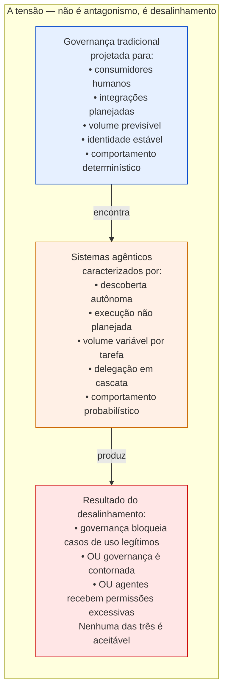
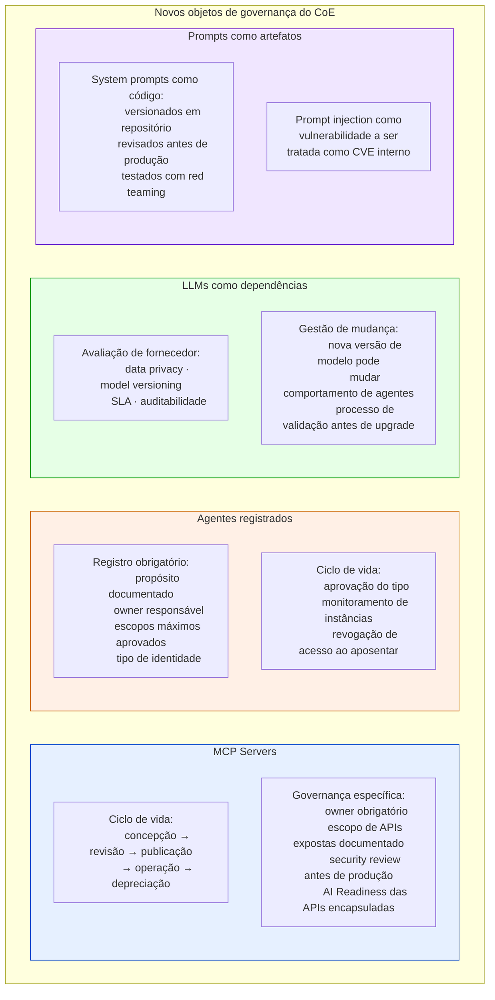
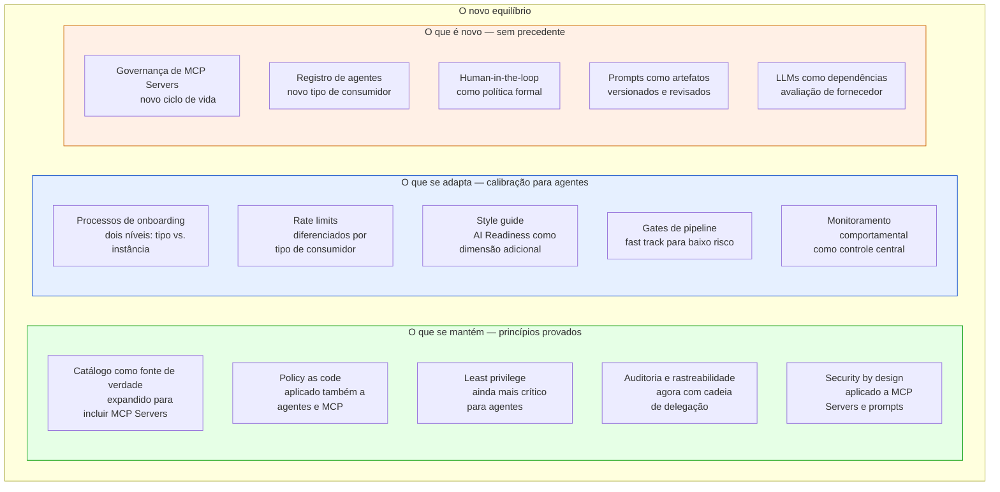

# Módulo 6 · IA e APIs
## Capítulo 6.7 · Governança de APIs na era agêntica — tensões e equilíbrios

> **Série:** Gerenciamento e Governança de APIs
> **Nível:** Estratégico e organizacional
> **Pré-requisito:** Módulos 1 a 5 · Cap 6.1 a 6.6

---

## Sumário

- [6.7.1 · A tensão genuína](#671--a-tensão-genuína)
- [6.7.2 · Onde a governança tradicional atrapalha](#672--onde-a-governança-tradicional-atrapalha)
- [6.7.3 · Onde a governança se torna mais crítica](#673--onde-a-governança-se-torna-mais-crítica)
- [6.7.4 · Como o CoE precisa evoluir](#674--como-o-coe-precisa-evoluir)
- [6.7.5 · Novos objetos de governança](#675--novos-objetos-de-governança)
- [6.7.6 · O novo equilíbrio](#676--o-novo-equilíbrio)
- [Fontes e referências](#fontes-e-referências)

---

## 6.7.1 · A tensão genuína

Existe uma tensão real — não retórica — entre governança de APIs e sistemas agênticos. Reconhecê-la honestamente é o ponto de partida para resolvê-la bem.

A governança de APIs foi construída sobre um conjunto de premissas que agentes violam: consumidores conhecidos com comportamento previsível, integração planejada e revisada por humanos, volume antecipável dentro de limites estabelecidos, identidade estável e rastreável. Os processos, as políticas e os gates foram calibrados para esse modelo.

Sistemas agênticos não são adversários da governança — são consumidores com perfil fundamentalmente diferente. O problema não é que agentes são maus consumidores. É que o programa de governança não foi projetado para eles.

---

## 6.7.2 · Onde a governança tradicional atrapalha

Ser honesto sobre onde a governança cria friction desnecessária é necessário para que o CoE não se torne o obstáculo que times contornam — criando exatamente o ecossistema de shadow agents e shadow APIs que o programa de governança existe para prevenir.

---

### Onboarding manual não escala para agentes instanciados programaticamente

O processo de credenciamento do Cap 5.8.4 foi projetado para revisão humana de caso de uso. Um time de produto pode criar dezenas de instâncias de agentes por dia — para diferentes tarefas, diferentes usuários, diferentes contextos. Exigir aprovação manual para cada instância paralisa o desenvolvimento.

**O que precisa mudar:** o credenciamento precisa de dois níveis. O tipo de agente é aprovado uma vez — com seu escopo máximo, seu owner e seus limites. Instâncias desse tipo são criadas programaticamente dentro dos limites aprovados, sem aprovação adicional por instância.

---

### Rate limits calibrados para humanos bloqueiam agentes legítimos

Um rate limit de 1.000 requisições por hora por consumidor foi calibrado para padrões de uso humano. Um agente processando um relatório complexo pode legitimamente precisar de 5.000 chamadas para completar a tarefa — e o rate limit bloqueia um uso completamente legítimo no meio da execução.

**O que precisa mudar:** rate limits precisam ser diferenciados por tipo de consumidor. Agentes registrados têm limites calibrados para suas tarefas documentadas — não os mesmos limites de consumidores humanos. Rate limits adaptativos que consideram o contexto da tarefa em andamento são mais adequados do que limites absolutos por janela de tempo.

---

### Style guides para documentação humana não servem a agentes

O style guide do Cap 3.4 define convenções para APIs consumidas por desenvolvedores humanos — nomeação de campos, estrutura de respostas, convenções de URL. Essas convenções foram otimizadas para legibilidade humana.

Agentes são indiferentes ao nome dos campos — mas são sensíveis à precisão semântica das descrições, à clareza dos erros e à completude da documentação de edge cases. Uma API com excelente developer experience para humanos pode ser difícil para agentes usarem bem — e vice-versa.

**O que precisa mudar:** o style guide precisa de uma seção de AI Readiness que define padrões adicionais — não alternativos — para APIs que serão expostas via MCP: descrições de operação obrigatórias, sinalização de operações irreversíveis, documentação de idempotência, schemas de erro precisos.

---

### Gates de revisão humana criam latência incompatível com ciclos agênticos

O processo de revisão do CoE antes de publicação tem sentido quando uma API será integrada manualmente por um desenvolvedor humano que vai levar dias ou semanas para completar a integração. Mas um time de produto que precisa adicionar uma tool a um MCP Server para uma tarefa agêntica urgente não pode esperar dias por aprovação.

**O que precisa mudar:** fast track para mudanças de baixo risco. Adição de uma nova tool a um MCP Server existente, dentro do escopo aprovado, com cobertura de testes adequada, pode ser aprovada automaticamente pelo pipeline sem revisão humana. Mudanças de escopo, novos tipos de dados ou operações destrutivas ainda passam por revisão.

---

## 6.7.3 · Onde a governança se torna mais crítica

As mesmas propriedades que tornam agentes valiosos — autonomia, escala, encadeamento de ações — amplificam o dano potencial quando os controles falham. Onde a governança tinha importância moderada para sistemas determinísticos, passa a ter importância crítica para sistemas agênticos.

---

### Catálogo como controle de segurança, não apenas de descoberta

Em sistemas determinísticos, um endpoint não catalogado é um problema de governança — alguém pode não saber que ele existe. Em sistemas agênticos, um endpoint não catalogado acessível tecnicamente é um vetor de ataque imediato. Um agente que descobre esse endpoint autonomamente pode chamá-lo repetidamente, em volume, sem que nenhum controle detecte.

O catálogo deixa de ser apenas uma ferramenta de descoberta e torna-se um controle de segurança: a lista de endpoints que agentes têm permissão de usar. O que não está no catálogo não deve ser acessível a agentes — bloqueado no AI Gateway.

---

### FGA torna-se indispensável, não opcional

Para sistemas determinísticos, um endpoint sem FGA é um risco aceito em alguns contextos — volume baixo, dados não sensíveis, consumidores confiáveis. Para sistemas agênticos, um endpoint sem FGA é um risco inaceitável: um agente com `scope: pedidos:read` pode varrer toda a base de pedidos em minutos se não há verificação por objeto.

A diferença de escala e velocidade torna o "vamos adicionar FGA depois" inviável para APIs expostas a agentes.

---

### Auditoria com rastreabilidade de delegação é inegociável

Para sistemas determinísticos, um log com client_id e endpoint é suficiente para auditoria. Para sistemas agênticos, um log sem a cadeia completa de delegação — `sub` original, cadeia `act`, tarefa em andamento — é um log que não permite investigação forense quando algo dá errado.

E algo vai dar errado. A questão não é se haverá um incidente envolvendo um agente — é quando. Sem rastreabilidade completa, a investigação forense é impossível.

---

### Revogação rápida torna-se operação crítica

Para sistemas determinísticos, uma credencial comprometida é um incidente sério mas com blast radius limitado pela velocidade humana. Para sistemas agênticos, uma credencial comprometida explorada por outro agente pode causar dano massivo em segundos. O processo de revogação precisa ser medido em segundos, não minutos.

---

### Monitoramento comportamental é o único detector eficaz

Um agente comprometido via prompt injection usa credenciais legítimas e chama endpoints válidos. WAF, validação de schema e autenticação não detectam esse ataque — porque o atacante não violou nenhuma regra técnica. O único controle que detecta é o monitoramento comportamental: o padrão de chamadas desviou do histórico do agente para aquela tarefa.

O monitoramento do Cap 5.2.3 que era importante para sistemas determinísticos torna-se o controle de segurança mais importante para sistemas agênticos.

---

## 6.7.4 · Como o CoE precisa evoluir

O CoE do Cap 3.3 foi projetado para governar APIs consumidas por desenvolvedores humanos. O escopo, os processos e as políticas precisam evoluir para incluir o ecossistema agêntico — sem abandonar o que funciona bem.

```mermaid
graph TB
    subgraph evolucao["Evolução do CoE para a era agêntica"]
        direction LR

        subgraph escopo["Escopo expandido"]
            e1["APIs REST · GraphQL · gRPC
            ↓ continua
            + MCP Servers como objetos de governança
            + AI Gateways como infraestrutura
            + Agentes como consumidores registrados
            + LLMs como dependências de terceiros"]
        end

        subgraph processos["Processos adaptados"]
            p1["Credenciamento em dois níveis
            tipo de agente aprovado uma vez
            instâncias criadas programaticamente"]
            p2["Fast track para mudanças de baixo risco
            automação de aprovação
            para casos bem definidos"]
            p3["Revisão de MCP Servers
            análoga à revisão de APIs
            com AI Readiness como requisito"]
        end

        subgraph politicas["Políticas novas ou expandidas"]
            po1["Política de identidade agêntica
            modelos permitidos · proibições
            registro obrigatório com owner"]
            po2["Política de AI Readiness
            requisitos para APIs expostas via MCP
            descrições semânticas obrigatórias"]
            po3["Política de human-in-the-loop
            quais operações requerem aprovação
            mesmo quando chamadas por agentes"]
            po4["Política de código gerado por IA
            ferramentas aprovadas
            gates obrigatórios
            review checklist específico"]
        end

        subgraph metricas["Novas métricas de saúde do programa"]
            m1["% do portfólio com AI Readiness score alto
            % de chamadas agênticas com cadeia de delegação completa
            % de MCP Servers com owner registrado
            tempo médio de detecção de comportamento agêntico anômalo"]
        end

        escopo --- processos --- politicas --- metricas
    end

    style escopo fill:#e6f0ff,stroke:#0044cc
    style processos fill:#e6ffe6,stroke:#009900
    style politicas fill:#fff0e6,stroke:#cc6600
    style metricas fill:#f0e6ff,stroke:#6600cc
```

---

## 6.7.5 · Novos objetos de governança

Além de APIs, o CoE passa a governar novos tipos de objeto — cada um com seu próprio ciclo de vida, seus próprios riscos e seus próprios processos:

---

## 6.7.6 · O novo equilíbrio

O programa de APIs na era agêntica não é nem o programa tradicional aplicado sem modificação — que cria friction que times contornam — nem a ausência de governança na esperança de que times façam as coisas certas autonomamente.

É um programa que aprendeu com o que construiu nos cinco módulos anteriores e se adapta a um novo tipo de consumidor mantendo os princípios que provaram funcionar:

O CoE que chegar a esse equilíbrio não será lembrado como o obstáculo que atrasou a adoção de IA — será o habilitador que permitiu que a organização adotasse IA de forma sustentável, segura e auditável.

---

## Pontos-chave do capítulo

- A tensão entre governança e sistemas agênticos é real e genuína — não retórica. O programa foi calibrado para consumidores humanos com comportamento previsível. Agentes têm perfil fundamentalmente diferente
- Onde a governança atrapalha: onboarding manual que não escala para instâncias programáticas, rate limits calibrados para humanos que bloqueiam agentes legítimos, style guides não otimizados para consumo por LLMs, gates de revisão com latência incompatível com ciclos agênticos
- Onde a governança se torna mais crítica: catálogo como controle de segurança ativo, FGA indispensável para qualquer API exposta a agentes, auditoria com cadeia de delegação completa como requisito inegociável, revogação rápida em segundos, monitoramento comportamental como único detector eficaz de agentes comprometidos
- O CoE evolui em escopo (MCP Servers, agentes, LLMs, prompts como novos objetos), processos (dois níveis de credenciamento, fast track) e políticas (identidade agêntica, AI Readiness, human-in-the-loop, código gerado por IA)
- Novos objetos de governança: MCP Servers com ciclo de vida próprio, agentes registrados com owner, LLMs como dependências de fornecedor, prompts como artefatos versionados
- O novo equilíbrio mantém os princípios provados, adapta os processos ao perfil agêntico e adiciona o que é genuinamente novo — sem ser nem o programa tradicional imutável nem a ausência de governança

---

## Fontes e referências

| Fonte | Referência completa |
|---|---|
| **NIST AI RMF (2023)** | NIST. *AI Risk Management Framework 1.0*. janeiro 2023. Disponível em: [doi.org/10.6028/NIST.AI.100-1](https://doi.org/10.6028/NIST.AI.100-1) |
| **Agentic AI Governance — NIST Standards** | Cloud Security Alliance. *Agentic AI Governance: NIST Standards for Autonomous Systems*. 2026. Disponível em: [labs.cloudsecurityalliance.org](https://labs.cloudsecurityalliance.org) |
| **OWASP Top 10 Agentic Apps (2026)** | OWASP Foundation. Disponível em: [genai.owasp.org/resource/owasp-top-10-for-agentic-applications-for-2026](https://genai.owasp.org/resource/owasp-top-10-for-agentic-applications-for-2026/) |

---

## Próximo capítulo

**6.8 · AI Readiness do portfólio — avaliação e roadmap** — como avaliar se as APIs do portfólio estão prontas para consumo agêntico e construir um roadmap de evolução.

---

*Série: Gerenciamento e Governança de APIs · Módulo 6 · Capítulo 6.7*