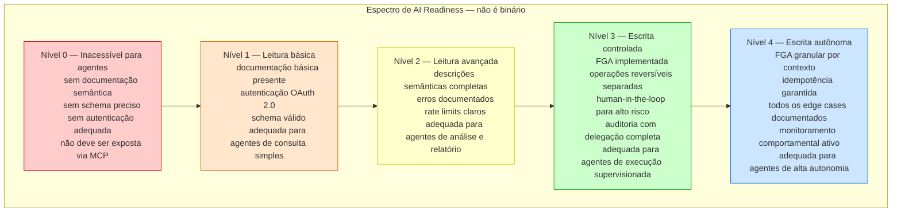
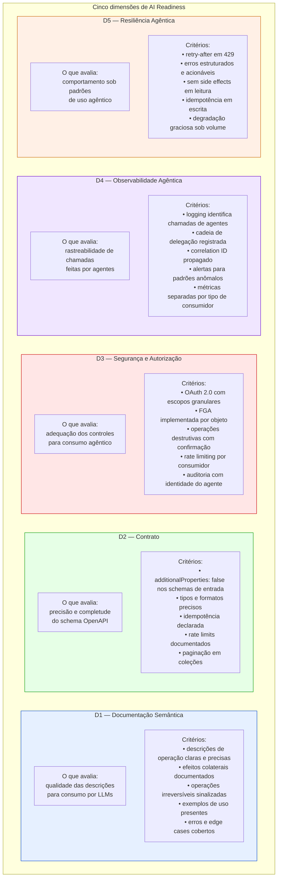
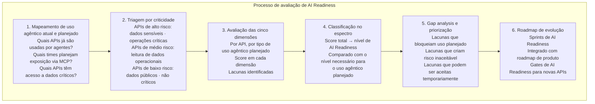
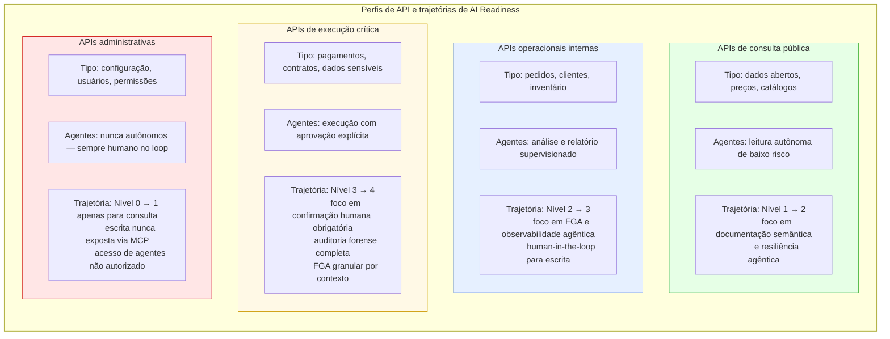
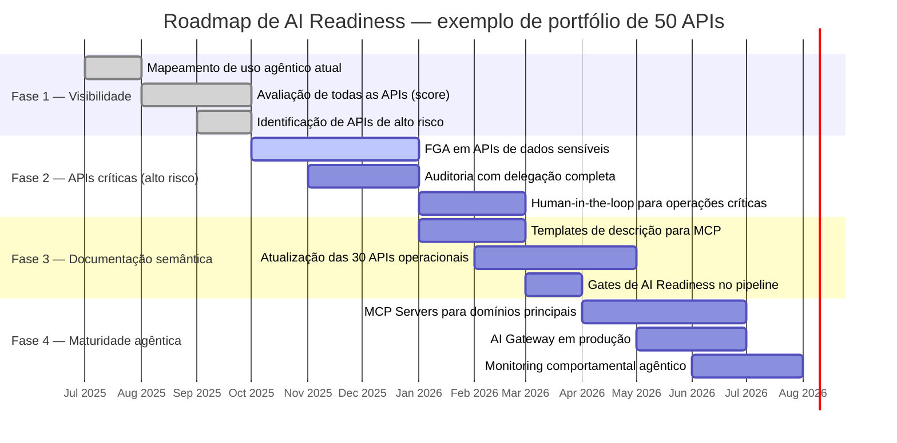
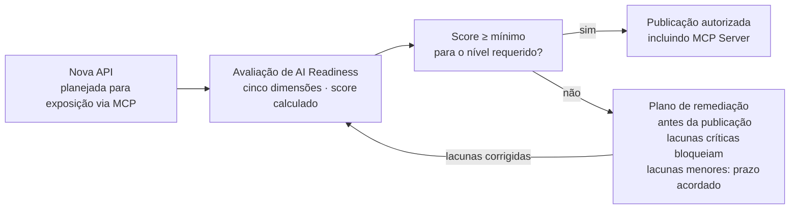
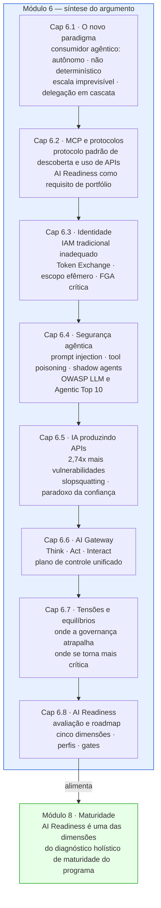

# Módulo 6 · IA e APIs
## Capítulo 6.8 · AI Readiness do portfólio — avaliação e roadmap

> **Série:** Gerenciamento e Governança de APIs
> **Nível:** Estratégico e operacional
> **Pré-requisito:** Cap 6.1 a 6.7

---

## Sumário

- [6.8.1 · O que é AI Readiness de portfólio](#681--o-que-é-ai-readiness-de-portfólio)
- [6.8.2 · As cinco dimensões de avaliação](#682--as-cinco-dimensões-de-avaliação)
- [6.8.3 · O processo de avaliação](#683--o-processo-de-avaliação)
- [6.8.4 · Perfis de API e suas trajetórias](#684--perfis-de-api-e-suas-trajetórias)
- [6.8.5 · O roadmap de AI Readiness do portfólio](#685--o-roadmap-de-ai-readiness-do-portfólio)
- [6.8.6 · Módulo 6 — síntese e conexão com o Módulo 8](#686--módulo-6--síntese-e-conexão-com-o-módulo-8)
- [Fontes e referências](#fontes-e-referências)

---

## 6.8.1 · O que é AI Readiness de portfólio

AI Readiness não é uma propriedade binária — uma API não é simplesmente "pronta" ou "não pronta" para consumo por agentes. É um espectro de adequação ao longo de múltiplas dimensões, avaliado no contexto do tipo de agente que vai consumir a API e do tipo de tarefa que esse agente vai executar.

Uma API pode ser altamente adequada para um agente de leitura que consulta dados para gerar relatórios — e completamente inadequada para um agente de escrita que executa operações críticas de negócio. O mesmo contrato, a mesma implementação, avaliações diferentes dependendo do contexto de uso agêntico.

---

## 6.8.2 · As cinco dimensões de avaliação

O framework de AI Readiness avalia cada API em cinco dimensões, derivadas dos capítulos anteriores do módulo:

---

### Matriz de avaliação

Para cada API, cada dimensão recebe uma pontuação de 0 a 3:

| Pontuação | Significado |
|---|---|
| **0** | Ausente ou inadequado — bloqueia uso agêntico |
| **1** | Básico — permite uso agêntico limitado com riscos |
| **2** | Adequado — permite uso agêntico supervisionado |
| **3** | Maduro — permite uso agêntico autônomo |

O score total (0-15) mapeia para o nível de AI Readiness do 6.8.1. Um score de 0-5 é Nível 0-1, 6-9 é Nível 2, 10-12 é Nível 3, 13-15 é Nível 4.

---

## 6.8.3 · O processo de avaliação

A avaliação de AI Readiness do portfólio não precisa acontecer de uma vez — um portfólio grande pode ter centenas de APIs. O processo é incremental e priorizado.

---

### Automação da avaliação

Parte significativa da avaliação pode ser automatizada:

**D1 — Documentação Semântica** → análise do schema OpenAPI com LLM que avalia qualidade e completude das descrições. Ferramentas como 42Crunch e Spectral com regras customizadas cobrem parte da avaliação.

**D2 — Contrato** → lint automático com Spectral usando regras de AI Readiness — presença de `additionalProperties: false`, rate limits declarados, idempotência marcada.

**D3 — Segurança** → análise estática da spec — securitySchemes presentes, escopos declarados, operações destrutivas sinalizadas.

**D4 e D5** → requerem análise de implementação e comportamento em runtime — parcialmente automatizável via testes, parcialmente manual.

---

## 6.8.4 · Perfis de API e suas trajetórias

Diferentes APIs têm perfis de uso agêntico diferentes, e portanto trajetórias de AI Readiness diferentes. Não faz sentido elevar todas as APIs ao Nível 4 — o custo não justifica para APIs que nunca serão usadas por agentes autônomos.

---

## 6.8.5 · O roadmap de AI Readiness do portfólio

O roadmap de AI Readiness não é um projeto separado do programa de APIs — é integrado ao ciclo de vida existente. Cada API que passa por manutenção, revisão ou evolução incorpora melhorias de AI Readiness nas dimensões com maior gap.

---

### Gates de AI Readiness como política obrigatória

A partir de um ponto de maturidade do programa, novas APIs que serão expostas via MCP devem atingir um score mínimo de AI Readiness antes da publicação — integrado ao gate de publicação do Cap 4.4:

---

## 6.8.6 · Módulo 6 — síntese e conexão com o Módulo 8

O Módulo 6 documentou a transformação mais profunda no ecossistema de APIs desde a consolidação do REST como padrão dominante. Não é uma evolução incremental — é uma mudança de paradigma no perfil do consumidor, nas ameaças, nas ferramentas de governança e nos processos do CoE.

O Módulo 6 não fecha o tema de IA e APIs — o campo está evoluindo rápido demais para qualquer fechamento definitivo. O que fecha é o framework de raciocínio: os princípios para navegar o ecossistema agêntico, os riscos documentados empiricamente, as adaptações necessárias na governança, e o processo de avaliação e evolução do portfólio.

O Módulo 8 — Maturidade — retomará AI Readiness como uma das dimensões do diagnóstico holístico de maturidade do programa. Uma organização que implementou os fundamentos dos Módulos 1 a 5 e começou a Fase 1 do roadmap de AI Readiness está em um nível de maturidade diferente de uma que ainda trata IA como experimento. O Módulo 8 terá as ferramentas para fazer esse diagnóstico de forma contextual.

---

## Pontos-chave do capítulo

- AI Readiness não é binária — é um espectro de quatro níveis determinado por cinco dimensões: documentação semântica, contrato, segurança/autorização, observabilidade agêntica e resiliência agêntica
- O processo de avaliação é incremental e priorizado: mapeamento de uso atual e planejado, triagem por criticidade, avaliação das cinco dimensões, gap analysis e roadmap
- Diferentes perfis de API têm trajetórias diferentes: APIs de consulta pública vão ao Nível 2, operacionais ao Nível 3, críticas ao Nível 4, administrativas ficam no Nível 0-1 com escrita nunca exposta via MCP
- O roadmap de AI Readiness é integrado ao ciclo de vida existente — não um projeto separado. Gates de AI Readiness são incorporados ao processo de publicação para novas APIs expostas via MCP
- Parte da avaliação é automatizável via lint e análise estática. D4 e D5 requerem análise de comportamento em runtime
- O Módulo 6 documenta uma mudança de paradigma, não evolução incremental. AI Readiness alimenta o diagnóstico de maturidade do Módulo 8

---

## Fontes e referências

| Fonte | Referência completa |
|---|---|
| **MCP Specification** | Agentic AI Foundation. Disponível em: [modelcontextprotocol.io](https://modelcontextprotocol.io) |
| **NIST AI RMF (2023)** | NIST. *AI Risk Management Framework 1.0*. Disponível em: [doi.org/10.6028/NIST.AI.100-1](https://doi.org/10.6028/NIST.AI.100-1) |
| **Gartner Market Guide for AI Gateways (2025)** | Humphreys, A. et al. Gartner, outubro 2025. Disponível em: [gartner.com/en/documents/7051698](https://www.gartner.com/en/documents/7051698) |

---

> **Módulo 6 · IA e APIs — completo**
>
> Cap 6.1 · IA e APIs — o novo paradigma
> Cap 6.2 · MCP e os protocolos agênticos
> Cap 6.3 · Identidade e autorização de agentes
> Cap 6.4 · Segurança no ecossistema agêntico
> Cap 6.5 · IA produzindo APIs — riscos e governança
> Cap 6.6 · AI Gateway — o novo plano de controle
> Cap 6.7 · Governança de APIs na era agêntica — tensões e equilíbrios
> Cap 6.8 · AI Readiness do portfólio — avaliação e roadmap

---

*Série: Gerenciamento e Governança de APIs · Módulo 6 · Capítulo 6.8*