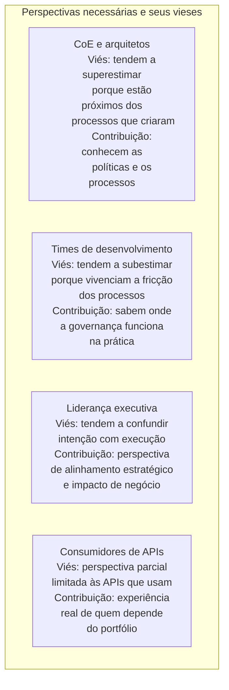
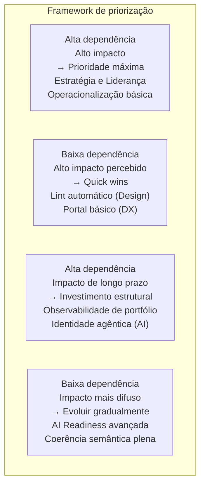

# Módulo 7 · Maturidade em Governança de APIs
## Capítulo 7.12 · O diagnóstico holístico

> **Série:** Gerenciamento e Governança de APIs
> **Nível:** Aplicação prática do framework
> **Pré-requisito:** Cap 7.3 a 7.11

---

## Sumário

- [7.12.1 · Da teoria à prática](#7121--da-teoria-à-prática)
- [7.12.2 · Conduzindo o diagnóstico](#7122--conduzindo-o-diagnóstico)
- [7.12.3 · Lendo o perfil de maturidade](#7123--lendo-o-perfil-de-maturidade)
- [7.12.4 · Da leitura às prioridades](#7124--da-leitura-às-prioridades)
- [7.12.5 · Construindo o roadmap de evolução](#7125--construindo-o-roadmap-de-evolução)
- [7.12.6 · Armadilhas do diagnóstico](#7126--armadilhas-do-diagnóstico)
- [7.12.7 · Maturidade como prática contínua](#7127--maturidade-como-prática-contínua)

---

## 7.12.1 · Da teoria à prática

Os capítulos anteriores construíram o framework: cinco níveis, oito dimensões, com descrições detalhadas de como cada nível se manifesta na prática em cada dimensão. Este capítulo trata de como usar esse framework num contexto organizacional real — com suas restrições, suas dinâmicas políticas e sua resistência a qualquer diagnóstico que revele mais do que as pessoas estão dispostas a ver.

Um diagnóstico de maturidade pode ser feito de duas formas muito diferentes. Na primeira, é um exercício de autoavaliação que produz um número — "estamos no Nível 3" — que vai para uma apresentação e não muda nada. Na segunda, é um processo de análise que revela onde a governança está funcionando, onde não está, por quê, e o que fazer a seguir.

A diferença entre as duas formas não está no framework — está em como o diagnóstico é conduzido, com quem, e o que acontece depois.

---

## 7.12.2 · Conduzindo o diagnóstico

### Quem deve participar

Um diagnóstico preciso requer perspectivas múltiplas. Cada grupo tem um viés sistemático que precisa ser reconhecido e compensado.



O diagnóstico mais robusto combina as quatro perspectivas — não como média, mas como triangulação. Quando CoE e times de desenvolvimento discordam sobre o nível de uma dimensão, a discrepância é em si informativa: revela onde existe gap entre o processo declarado e a experiência vivida.

### O papel das evidências

Cada posicionamento num nível deve ser fundamentado em evidência observável. O Anexo N desta série contém o questionário de autodiagnóstico com perguntas específicas por dimensão. Mas o princípio vale além do questionário: qualquer afirmação sobre o nível atual deve responder a pergunta "como sabemos disso?"

```
Afirmação: "Estamos no Nível 3 em Design e Padrões"

Evidência insuficiente:
"Temos um style guide e os times o seguem"

Evidência adequada:
"Temos um style guide versionado publicado em [data].
O lint automático está integrado ao CI/CD de todos os 
12 times de desenvolvimento desde [data].
A taxa de conformidade do portfólio nos últimos 
90 dias foi de 87% — medida pelo número de APIs
que passaram no gate sem violações."
```

### Quanto tempo leva

Um diagnóstico superficial — baseado em percepções sem evidências — pode ser feito numa tarde. Um diagnóstico rigoroso de um portfólio de tamanho médio tipicamente requer duas a quatro semanas, incluindo coleta de evidências, entrevistas com diferentes grupos e análise dos dados.

O investimento de tempo é proporcional ao valor que se espera extrair. Um diagnóstico que vai gerar um roadmap de transformação merece mais rigor do que um diagnóstico anual de acompanhamento.

---

## 7.12.3 · Lendo o perfil de maturidade

O resultado do diagnóstico é um perfil — não uma nota. O perfil mostra os níveis atuais em cada uma das oito dimensões e permite leituras que uma nota única não permite.

### Três padrões de perfil comuns

**Perfil de segurança-forward**

Organizações com histórico de incidentes de segurança ou em setores regulados frequentemente têm Segurança num nível significativamente mais alto do que as demais dimensões. A governança nasceu de uma necessidade de compliance, não de uma visão de portfólio.

```
Estratégia e Liderança   ●●●○○  3
Design e Padrões         ●●○○○  2
Ciclo de Vida            ●●○○○  2
Segurança                ●●●●○  4
Observabilidade          ●●○○○  2
Developer Experience     ●●○○○  2
AI Readiness             ●○○○○  1
Operacionalização        ●●○○○  2
```

*Leitura:* A governança tem base sólida em segurança mas não evoluiu de forma equilibrada. O risco é que o programa continue sendo visto como "coisa de segurança" em vez de programa de qualidade de portfólio. A prioridade estratégica é construir as dimensões que ampliam a percepção de valor da governança além de compliance.

---

**Perfil de plataforma-forward**

Organizações que investiram em platform engineering têm Operacionalização e Developer Experience avançadas, mas podem ter lacunas em dimensões mais organizacionais como Estratégia e Liderança.

```
Estratégia e Liderança   ●●○○○  2
Design e Padrões         ●●●○○  3
Ciclo de Vida            ●●●○○  3
Segurança                ●●●○○  3
Observabilidade          ●●●○○  3
Developer Experience     ●●●●○  4
AI Readiness             ●●○○○  2
Operacionalização        ●●●●○  4
```

*Leitura:* A plataforma funciona bem tecnicamente mas a governança pode não ter o mandato necessário para enforçar padrões quando há resistência. O risco é que a excelência técnica da plataforma mascara a fragilidade organizacional — que se revelará quando houver conflito entre times e o CoE não tiver autoridade para resolver.

---

**Perfil de estratégia-sem-execução**

Organizações com forte patrocínio executivo e CoE bem estruturado mas investimento técnico limitado têm Estratégia e Liderança avançada mas dimensões técnicas defasadas.

```
Estratégia e Liderança   ●●●●○  4
Design e Padrões         ●●○○○  2
Ciclo de Vida            ●●○○○  2
Segurança                ●●○○○  2
Observabilidade          ●○○○○  1
Developer Experience     ●●○○○  2
AI Readiness             ●○○○○  1
Operacionalização        ●○○○○  1
```

*Leitura:* A governança tem legitimidade e mandato mas não tem os meios para se operacionalizar. O risco é que o CoE seja percebido como burocracia que atrasa sem agregar valor, porque o enforcement depende de revisão humana que não escala. A prioridade é investir em Operacionalização para que o mandato existente se materialize em enforcement consistente.

---

## 7.12.4 · Da leitura às prioridades

Nem toda dimensão tem o mesmo impacto na evolução global. Dois critérios orientam a priorização.

**Critério 1: dependências estruturais**

Como o Cap 7.3 estabeleceu, algumas dimensões habilitam outras. Estratégia e Liderança é pré-requisito para todas as demais — sem mandato, avanços em qualquer dimensão são frágeis. Design e Padrões fundamenta Ciclo de Vida e AI Readiness. Operacionalização amplifica todas as outras mas precisa de algo para automatizar.

A implicação: quando o diagnóstico revela lacunas em múltiplas dimensões, dimensões habilitadoras têm prioridade, independentemente de onde a lacuna parece maior.

**Critério 2: impacto percebido vs. esforço**

Nem toda melhoria tem o mesmo custo. Algumas evoluções de nível requerem mudanças organizacionais profundas — semanas ou meses de trabalho. Outras requerem mudanças técnicas relativamente simples. A priorização deve considerar onde o investimento produz o maior impacto perceptível no menor prazo — porque resultados visíveis rapidamente sustentam o momentum político do programa de governança.



---

## 7.12.5 · Construindo o roadmap de evolução

Um roadmap de maturidade não é uma lista de projetos — é uma sequência de estados pretendidos com critérios claros de transição entre eles.

### Estrutura de um roadmap de maturidade

**Estado atual** — o perfil resultante do diagnóstico, com evidências que o fundamentam.

**Estado alvo em 12 meses** — quais dimensões evoluirão, para qual nível, por quê essa combinação específica. Não é necessário nem desejável evoluir todas as dimensões simultaneamente — foco produz resultado.

**Critérios de transição** — como a organização saberá que cada dimensão atingiu o nível pretendido. Critérios de transição são o antídoto contra o governance theater: eles transformam "achamos que chegamos lá" em "temos evidências de que chegamos lá".

**Marcos de revisão** — checkpoints periódicos onde o progresso é avaliado com honestidade. Um roadmap que nunca é revisado não é um instrumento de gestão — é uma declaração de intenção.

### O que um roadmap não é

Um roadmap de maturidade não é uma lista de ferramentas a implementar, de processos a documentar ou de treinamentos a realizar. Essas são atividades — meios para atingir estados de maturidade. O roadmap descreve os estados; o plano de ação descreve as atividades.

A diferença importa porque permite avaliar se as atividades estão produzindo os resultados esperados. Um time que implementou uma ferramenta de lint mas não aumentou a taxa de conformidade do portfólio fez a atividade mas não atingiu o estado — e precisa entender por quê antes de continuar.

---

## 7.12.6 · Armadilhas do diagnóstico

### Diagnóstico como justificativa

O diagnóstico foi conduzido com a conclusão já definida — não para descobrir onde a organização está, mas para justificar um investimento já decidido ou para validar o trabalho já feito. Os dados são selecionados para suportar a conclusão, as perspectivas discordantes são minimizadas, os problemas mais sérios são enquadrados como "áreas de melhoria contínua".

O diagnóstico como justificativa não é inútil — é pior do que inútil, porque consome a credibilidade do processo e torna mais difícil conduzir diagnósticos honestos no futuro.

### Precisão falsa

O diagnóstico produziu números com casas decimais. "Estamos em 3,2 em Design e Padrões e 2,8 em Ciclo de Vida." A precisão é falsa — o framework não distingue 3,2 de 2,8 de forma significativa, e a aparência de precisão pode criar confiança indevida nos resultados.

Diagnósticos de maturidade têm incerteza inerente. Reconhecer essa incerteza — "estamos entre 2 e 3 em Ciclo de Vida, com evidências sólidas para o 2 e evidências parciais para o 3" — é mais honesto e mais útil do que falsa precisão.

### Instantâneo sem contexto

O diagnóstico captura o estado num momento específico sem contexto de trajetória. Uma organização que estava no Nível 1 há dois anos e está no Nível 3 agora tem uma história de evolução significativa que o snapshot não captura. Uma organização que está no Nível 3 mas estava no Nível 4 há seis meses e regrediu tem uma situação muito diferente de uma que chegou ao Nível 3 de forma orgânica.

Diagnósticos periódicos — não apenas pontuais — revelam trajetórias que diagnósticos únicos não conseguem mostrar.

---

## 7.12.7 · Maturidade como prática contínua

O framework de maturidade desta série não é um projeto com data de término. É um instrumento de diagnóstico que a organização usa periodicamente para entender onde está, onde quer chegar e o que está entre os dois.

Organizações que mais se beneficiam de frameworks de maturidade não são as que chegaram ao Nível 5 em todas as dimensões — são as que desenvolveram a capacidade de se diagnosticar honestamente, de priorizar com inteligência e de evoluir de forma deliberada.

Governança de APIs matura não é um estado — é uma prática. E como toda prática, o que importa não é onde você está, mas a direção em que está indo e a consistência com que está se movendo nessa direção.

---

## Pontos-chave do capítulo

- Um diagnóstico útil combina múltiplas perspectivas — CoE, times de desenvolvimento, liderança e consumidores — cada uma com seu viés reconhecido e compensado
- Evidências observáveis distinguem diagnóstico rigoroso de autoilusão coletiva
- O perfil de maturidade revela padrões — segurança-forward, plataforma-forward, estratégia-sem-execução — que uma nota única não captura
- Priorização considera dependências estruturais (dimensões habilitadoras primeiro) e impacto percebido versus esforço (quick wins sustentam momentum político)
- Um roadmap de maturidade descreve estados com critérios de transição — não listas de atividades
- Diagnóstico como justificativa, precisão falsa e instantâneo sem contexto são as três armadilhas mais comuns
- Maturidade é uma prática contínua, não um projeto com data de término

---

## Material de referência

O [Anexo N · Questionário de autodiagnóstico](../anexos/n_diagnostico_formulario.md) contém o instrumento completo para conduzir o diagnóstico descrito neste capítulo — perguntas por dimensão, critérios de evidência e template de consolidação do perfil.

---

*Série: Gerenciamento e Governança de APIs · Módulo 7 · Capítulo 7.12*