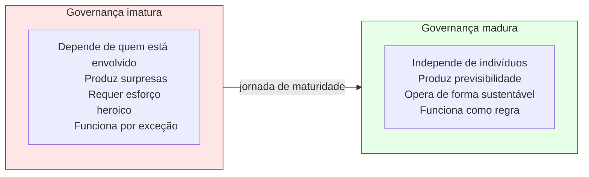
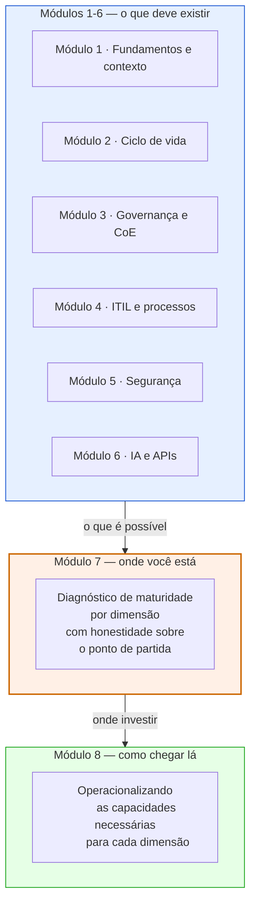

# Módulo 7 · Maturidade em Governança de APIs
## Capítulo 7.1 · O que é maturidade — e por que importa

> **Série:** Gerenciamento e Governança de APIs
> **Nível:** Estratégico e diagnóstico
> **Pré-requisito:** Módulos 1 a 6

---

## Sumário

- [7.1.1 · O problema do espelho](#711--o-problema-do-espelho)
- [7.1.2 · O que maturidade significa em governança de APIs](#712--o-que-maturidade-significa-em-governança-de-apis)
- [7.1.3 · Por que maturidade não é uma linha reta](#713--por-que-maturidade-não-é-uma-linha-reta)
- [7.1.4 · O diagnóstico antes da solução](#714--o-diagnóstico-antes-da-solução)
- [7.1.5 · O que maturidade não é](#715--o-que-maturidade-não-é)
- [7.1.6 · A relação entre maturidade e os módulos anteriores](#716--a-relação-entre-maturidade-e-os-módulos-anteriores)

---

## 7.1.1 · O problema do espelho

Toda organização que começa a falar seriamente sobre governança de APIs enfrenta uma primeira dificuldade que raramente é nomeada: não saber onde está.

Não é falta de ambição. A maioria das organizações tem clareza sobre onde quer chegar — APIs bem documentadas, políticas enforçadas automaticamente, um portfólio gerenciado com visibilidade. O problema é diferente: sem um diagnóstico honesto do ponto de partida, qualquer iniciativa de governança começa no vazio. Investe-se em ferramentas que a organização ainda não está pronta para usar. Criam-se políticas que ninguém tem capacidade de enforçar. Contrata-se um CoE antes de existir o contexto organizacional que o sustente.

O resultado são programas de governança que morrem não por falta de intenção, mas por falta de calibração. A solução proposta está três passos à frente de onde a organização realmente está.

Um modelo de maturidade existe para resolver esse problema. Não para criar mais um framework que as organizações precisam implementar — para criar um espelho no qual a organização pode se ver com precisão suficiente para decidir o que fazer a seguir.

---

## 7.1.2 · O que maturidade significa em governança de APIs

Maturidade em governança de APIs não é uma medida de sofisticação tecnológica. É uma medida de **capacidade organizacional para governar o ciclo de vida de APIs de forma consistente, previsível e sustentável**.

Três palavras nessa definição merecem atenção:

**Consistência** — os mesmos padrões se aplicam a todas as APIs do portfólio, independentemente do time que as desenvolveu ou do domínio a que pertencem. Uma organização imatura tem governança que depende de quem está envolvido. Uma organização matura tem governança que independe disso.

**Previsibilidade** — o que acontece com uma API ao longo de seu ciclo de vida é previsível para todos os envolvidos: o desenvolvedor sabe o que é esperado, o consumidor sabe o que vai receber, o gestor sabe o estado do portfólio. Imaturidade produz surpresas. Maturidade produz expectativas calibradas.

**Sustentabilidade** — a governança funciona sem depender de esforço heroico de indivíduos específicos. Uma organização cujo programa de governança depende do entusiasmo de uma única pessoa não tem governança madura — tem uma boa intenção frágil.

Essa definição tem uma implicação importante: **maturidade não é sobre ter as ferramentas certas**. Uma organização pode ter o melhor gateway de mercado e ainda ter governança imatura. Pode ter políticas documentadas impecavelmente em wikis que ninguém lê. Pode ter um CoE formal que não tem autoridade para fazer suas decisões valerem.

Ferramentas, documentos e estruturas organizacionais são meios. Maturidade é sobre o que acontece na prática — se a governança funciona quando ninguém está olhando.

---

## 7.1.3 · Por que maturidade não é uma linha reta

Uma das ilusões mais comuns sobre modelos de maturidade é que eles implicam uma progressão linear e uniforme: a organização está no Nível 2, portanto o próximo passo é o Nível 3 em tudo.

A realidade é mais complexa — e mais útil. Maturidade em governança de APIs é **multidimensional**. Uma organização pode estar em níveis diferentes em dimensões diferentes, e isso é absolutamente normal.

<svg viewBox="0 0 580 330" xmlns="http://www.w3.org/2000/svg" role="img">
  <title>Perfil de maturidade de uma organização típica</title>
  <desc>Gráfico radar mostrando 8 dimensões de maturidade em níveis de 1 a 5. Segurança em 4, Estratégia e Design em 3, Ciclo de Vida/Observabilidade/Operacionalização em 2, Developer Experience e AI Readiness em 1.</desc>
  <defs>
    
  </defs>
  <polygon points="290,60 366,92 398,168 366,244 290,276 214,244 182,168 214,92" fill="none" stroke="#D3D1C7" stroke-width="0.5"/>
  <polygon points="290,82 351,107 376,168 351,229 290,254 229,229 204,168 229,107" fill="none" stroke="#D3D1C7" stroke-width="0.5"/>
  <polygon points="290,103 336,122 355,168 336,214 290,233 244,214 225,168 244,122" fill="none" stroke="#D3D1C7" stroke-width="0.5"/>
  <polygon points="290,125 321,138 333,168 321,199 290,211 260,199 247,168 260,138" fill="none" stroke="#D3D1C7" stroke-width="0.5"/>
  <polygon points="290,146 305,153 312,168 305,183 290,190 275,183 268,168 275,153" fill="none" stroke="#D3D1C7" stroke-width="0.5"/>
  <line x1="290" y1="168" x2="290" y2="60" stroke="#C8C6C0" stroke-width="0.5"/>
  <line x1="290" y1="168" x2="366" y2="92" stroke="#C8C6C0" stroke-width="0.5"/>
  <line x1="290" y1="168" x2="398" y2="168" stroke="#C8C6C0" stroke-width="0.5"/>
  <line x1="290" y1="168" x2="366" y2="244" stroke="#C8C6C0" stroke-width="0.5"/>
  <line x1="290" y1="168" x2="290" y2="276" stroke="#C8C6C0" stroke-width="0.5"/>
  <line x1="290" y1="168" x2="214" y2="244" stroke="#C8C6C0" stroke-width="0.5"/>
  <line x1="290" y1="168" x2="182" y2="168" stroke="#C8C6C0" stroke-width="0.5"/>
  <line x1="290" y1="168" x2="214" y2="92" stroke="#C8C6C0" stroke-width="0.5"/>
  <text x="292" y="152" class="lvl">1</text>
  <text x="292" y="130" class="lvl">2</text>
  <text x="292" y="108" class="lvl">3</text>
  <text x="292" y="87" class="lvl">4</text>
  <text x="292" y="65" class="lvl">5</text>
  <polygon points="290,82 336,122 355,168 321,199 290,211 275,183 268,168 260,138"
           fill="#378ADD" fill-opacity="0.18" stroke="#185FA5" stroke-width="1.5" stroke-linejoin="round"/>
  <circle cx="290" cy="82" r="3.5" fill="#185FA5"/>
  <circle cx="336" cy="122" r="3.5" fill="#185FA5"/>
  <circle cx="355" cy="168" r="3.5" fill="#185FA5"/>
  <circle cx="321" cy="199" r="3.5" fill="#185FA5"/>
  <circle cx="290" cy="211" r="3.5" fill="#185FA5"/>
  <circle cx="275" cy="183" r="3.5" fill="#185FA5"/>
  <circle cx="268" cy="168" r="3.5" fill="#185FA5"/>
  <circle cx="260" cy="138" r="3.5" fill="#185FA5"/>
  <circle cx="290" cy="168" r="2" fill="#C8C6C0"/>
  <text x="290" y="46" class="lbl" text-anchor="middle">Segurança</text>
  <text x="372" y="84" class="lbl-sm" text-anchor="start">Estratégia e</text>
  <text x="372" y="96" class="lbl-sm" text-anchor="start">Liderança</text>
  <text x="406" y="163" class="lbl-sm" text-anchor="start">Design e</text>
  <text x="406" y="175" class="lbl-sm" text-anchor="start">Padrões</text>
  <text x="372" y="248" class="lbl-sm" text-anchor="start">Ciclo de Vida</text>
  <text x="290" y="293" class="lbl" text-anchor="middle">Observabilidade</text>
  <text x="207" y="248" class="lbl-sm" text-anchor="end">Developer</text>
  <text x="207" y="260" class="lbl-sm" text-anchor="end">Experience</text>
  <text x="174" y="172" class="lbl" text-anchor="end">AI Readiness</text>
  <text x="207" y="88" class="lbl-sm" text-anchor="end">Operacionalização</text>
</svg>

*Perfil típico de uma organização com histórico de preocupação com segurança mas que ainda não investiu em experiência do desenvolvedor nem em prontidão agêntica.*

Este perfil é comum em organizações que têm um histórico de preocupação com segurança — investiram mais nessa dimensão — mas negligenciaram developer experience e ainda não começaram a pensar em AI Readiness.

A multidimensionalidade do modelo tem consequências práticas:

**Para o diagnóstico** — não basta uma nota geral. É necessário avaliar cada dimensão separadamente para entender onde o esforço vai produzir mais resultado.

**Para a priorização** — nem sempre vale a pena avançar na dimensão mais fraca. Às vezes, avançar na dimensão que desbloqueia outras é mais estratégico. Uma organização sem estratégia e liderança clara (dimensão 1) não vai conseguir avançar em nenhuma outra dimensão de forma sustentável.

**Para a comunicação** — um perfil multidimensional é mais honesto com executivos e stakeholders do que uma nota única. Ele mostra onde a organização é forte, onde é fraca, e onde o investimento vai produzir retorno.

---

## 7.1.4 · O diagnóstico antes da solução

Os Módulos 1 a 6 desta série construíram o vocabulário e os frameworks para entender o que é governança de APIs — o que deve existir, como deve funcionar, quais riscos deve mitigar. O Módulo 7 responde a uma pergunta diferente: **como saber o que a sua organização precisa agora?**

A sequência importa. Implementar capacidades de operacionalização (Módulo 8) sem um diagnóstico de maturidade (Módulo 7) é o erro mais comum em programas de governança: investir na solução errada para o problema certo.

Uma organização no Nível 1 de estratégia e liderança que investe em automação de políticas vai produzir automação de regras que ninguém entende nem acredita. Uma organização no Nível 2 de ciclo de vida que adota um portal sofisticado de developer experience vai ter um portal bonito com conteúdo desatualizado.

O diagnóstico não é um exercício burocrático. É a diferença entre transformação e desperdício.

---

## 7.1.5 · O que maturidade não é

É igualmente importante nomear o que maturidade **não é**, porque há confusões frequentes que levam organizações a medir as coisas erradas.

**Maturidade não é conformidade regulatória**

Uma organização pode estar em conformidade com todas as regulamentações aplicáveis e ter governança de APIs imatura. Conformidade é sobre não violar regras externas. Maturidade é sobre a capacidade interna de operar de forma consistente e sustentável. As duas coisas podem coexistir em qualquer combinação.

**Maturidade não é quantidade de ferramentas**

O número de ferramentas no stack de governança não é um indicador de maturidade. Na prática, organizações imaturas frequentemente têm mais ferramentas do que as maduras — acumuladas de forma não coordenada ao longo do tempo, resolvendo problemas pontuais sem visão sistêmica.

**Maturidade não é velocidade de entrega**

Uma organização que entrega APIs rapidamente pode ter governança imatura. Velocidade sem consistência produz portfólios difíceis de manter, consumir e evoluir. A maturidade adiciona disciplina à velocidade — não a substitui.

**Maturidade não é um destino**

Atingir o Nível 5 em todas as dimensões não é o objetivo final. O contexto organizacional muda, o mercado muda, a tecnologia muda. Governança madura é uma capacidade dinâmica de adaptação — não um estado estático a ser alcançado e preservado.

---

## 7.1.6 · A relação entre maturidade e os módulos anteriores

Cada dimensão de maturidade que este módulo examina tem raízes teóricas nos módulos anteriores. A maturidade não é um framework independente — é uma lente diagnóstica aplicada sobre o que foi construído conceitualmente nos Módulos 1 a 6.

| Dimensão de maturidade | Fundamentos nos módulos anteriores |
|---|---|
| Estratégia e Liderança | Cap 3.3 · CoE · Cap 3.2 · Governança organizacional |
| Design e Padrões | Cap 3.4 · Style Guide · Cap 2.2 · Design de APIs |
| Ciclo de Vida | Módulo 2 completo · Cap 4.4 · Change management |
| Segurança | Módulo 5 completo · OWASP · Cap 5.4 · Zero Trust |
| Observabilidade | Cap 3.8 · Métricas · Cap 4.6 · Monitoramento |
| Developer Experience | Cap 3.5 · Catálogo · Cap 3.6 · Portal |
| AI Readiness | Módulo 6 completo · Cap 6.8 · AI Readiness |
| Operacionalização | Cap 3.7 · Automação · Módulo 8 |

Quando este módulo descreve o Nível 3 de maturidade em segurança, ele está descrevendo o quanto das práticas do Módulo 5 estão efetivamente em operação na organização — não apenas conhecidas ou documentadas, mas praticadas de forma consistente.

É essa conexão que torna o diagnóstico de maturidade significativo: ele não avalia a organização em abstrato, mas em relação ao que o estado da arte do campo — documentado nos módulos anteriores — estabelece como referência.

---

## Pontos-chave do capítulo

- Maturidade em governança de APIs é uma medida de capacidade organizacional — não de sofisticação tecnológica
- Os três atributos de uma governança madura: consistência, previsibilidade e sustentabilidade
- Maturidade é multidimensional: organizações amadurecem em ritmos diferentes em dimensões diferentes, e isso é esperado
- O diagnóstico precede a solução — implementar capacidades sem saber onde se está produz desperdício, não transformação
- Maturidade não é conformidade, não é quantidade de ferramentas, não é velocidade, e não é um destino
- As dimensões de maturidade têm raízes nos módulos anteriores — o diagnóstico avalia o quanto das práticas estabelecidas estão efetivamente em operação

---

## Próximo capítulo

**7.2 · Os frameworks existentes** — análise comparativa dos principais modelos de maturidade de governança e gestão de APIs disponíveis no mercado, o que cada um contribui e onde convergem.

---

*Série: Gerenciamento e Governança de APIs · Módulo 7 · Capítulo 7.1*