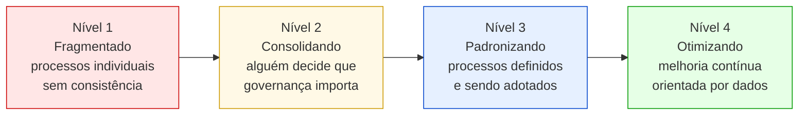
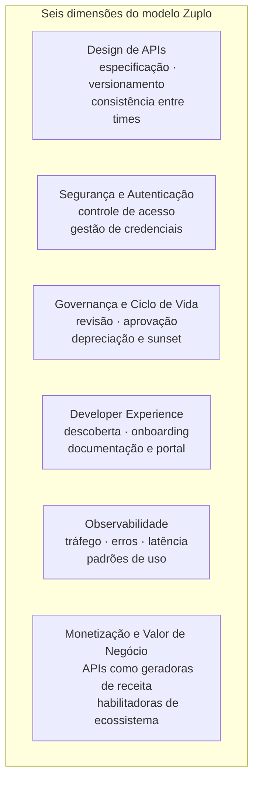
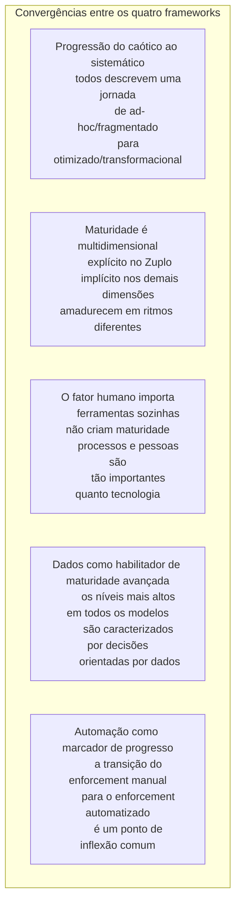
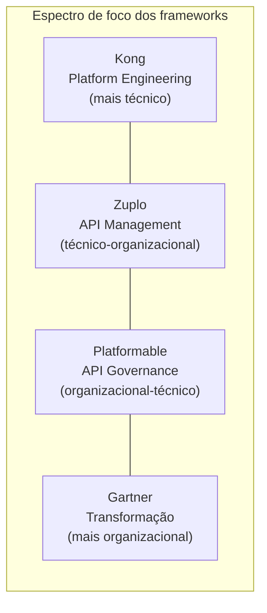

# Módulo 7 · Maturidade em Governança de APIs
## Capítulo 7.2 · Os frameworks existentes

> **Série:** Gerenciamento e Governança de APIs
> **Nível:** Analítico e comparativo
> **Pré-requisito:** Cap 7.1

---

## Sumário

- [7.2.1 · Como ler um modelo de maturidade](#721--como-ler-um-modelo-de-maturidade)
- [7.2.2 · Platformable — API Governance Maturity Model](#722--platformable--api-governance-maturity-model)
- [7.2.3 · Zuplo — API Management Maturity Model](#723--zuplo--api-management-maturity-model)
- [7.2.4 · Kong — API Platform Engineering Maturity Model](#724--kong--api-platform-engineering-maturity-model)
- [7.2.5 · Gartner — o padrão de cinco estágios](#725--gartner--o-padrão-de-cinco-estágios)
- [7.2.6 · Análise comparativa — convergências e divergências](#726--análise-comparativa--convergências-e-divergências)
- [7.2.7 · O que os frameworks deixam em aberto](#727--o-que-os-frameworks-deixam-em-aberto)

---

## 7.2.1 · Como ler um modelo de maturidade

Antes de examinar os frameworks individualmente, é importante estabelecer como avaliá-los com honestidade. Modelos de maturidade são instrumentos de diagnóstico — não verdades absolutas. Cada framework reflete as prioridades e a perspectiva de quem o criou, e essa perspectiva influencia o que é medido, como os níveis são definidos e o que constitui "maturidade plena".

Três perguntas úteis para avaliar qualquer framework de maturidade:

**Para quem foi criado?** Um modelo criado por um vendor de API management tende a valorizar as dimensões que seu produto resolve. Um modelo criado por uma consultoria independente tende a ter visão mais organizacional e menos tecnológica. Nenhum dos dois é necessariamente errado — mas o viés importa.

**O que ele mede?** Alguns frameworks medem capacidades técnicas. Outros medem processos organizacionais. Os melhores medem os dois. A ausência de uma dimensão num framework não significa que ela não importa — pode significar apenas que não era o foco dos autores.

**O que acontece além do Nível 5?** Todo framework de maturidade tem um teto. O que está além do teto costuma ser mais revelador do que o que está dentro dele — porque mostra as limitações do modelo e o que ele não consegue ver.

Com essas perguntas em mente, os quatro frameworks a seguir.

---

## 7.2.2 · Platformable — API Governance Maturity Model

O modelo da Platformable, publicado e atualizado em 2025, é um dos poucos frameworks focados especificamente em **governança** — não em gestão ou infraestrutura de APIs. Essa distinção é relevante: governança é sobre garantir que o portfólio de APIs evolui de acordo com padrões e objetivos organizacionais, não apenas sobre operá-las.

### Os quatro níveis

**Nível 1 — Fragmentado:** cada time tem seus próprios padrões não escritos. Pode haver uso de especificações OpenAPI e algum teste de integração, mas sem coordenação. As APIs são geridas individualmente, não como portfólio.

**Nível 2 — Consolidando:** alguém dentro da organização decide que é necessário ter abordagens mais consistentes. O Platformable observa que esse impulso geralmente vem de um de três perfis: alguém com responsabilidade delegada formalmente, alguém em um time de plataforma que precisa criar consistência, ou um desenvolvedor frustrado com a fragmentação que quer propor uma abordagem melhor.

**Nível 3 — Padronizando:** padrões de design existem e estão sendo adotados. O catálogo de APIs está sendo construído. O ciclo de vida está documentado. O esforço passa de convencer sobre a necessidade de governança para implementar e sustentar os processos.

**Nível 4 — Otimizando:** a governança é orientada por dados, melhoria contínua está incorporada, e o portfólio de APIs está sendo gerenciado como um ativo estratégico — não apenas como infraestrutura técnica.

### O que o Platformable contribui

O framework é notável por abordar o **contexto organizacional** com mais profundidade do que seus pares. Reconhece que a posição e o nível de autoridade de quem inicia a governança determina o que é possível fazer. Um arquiteto sem mandato formal tem um caminho diferente de alguém com delegação executiva — e o modelo reflete isso.

A edição de 2025 incorporou uma dimensão relevante: a necessidade de que APIs sejam mais compreensíveis por máquinas para consumo agêntico, citando o MCP como exemplo de novo padrão de consumo. É um sinal de que o framework está se adaptando ao ecossistema agêntico — embora ainda de forma incipiente.

---

## 7.2.3 · Zuplo — API Management Maturity Model

O modelo da Zuplo, publicado em 2026, é o mais recente e o mais estruturado entre os frameworks públicos disponíveis. Sua principal contribuição é a organização em **seis dimensões independentes** que amadurecem em ritmos diferentes.

### Os cinco níveis

| Nível | Nome | Característica central |
|---|---|---|
| 1 | Ad-Hoc | Cada API é um floco de neve — decisões individuais sem coordenação |
| 2 | Padronizado | Padrões existem mas o enforcement é manual |
| 3 | Gerenciado | Dados de uso disponíveis, processo de revisão estabelecido |
| 4 | Automatizado | Gates automatizados, políticas como código, self-service |
| 5 | Otimizado | Melhoria contínua orientada por dados, APIs como produto estratégico |

### As seis dimensões

O Zuplo avalia maturidade em seis dimensões que podem — e tipicamente o fazem — estar em níveis diferentes na mesma organização:

### O que o Zuplo contribui

A estrutura multidimensional é a principal contribuição. O modelo torna explícito que "estar no Nível 3" não diz nada sem especificar em qual dimensão — e que uma organização pode razoavelmente estar no Nível 4 em segurança e no Nível 1 em developer experience simultaneamente.

A dimensão de monetização é incomum entre os frameworks de governança — e revela o viés do modelo para organizações que expõem APIs externamente. Para organizações puramente internas, essa dimensão tem relevância diferente, mas o conceito de "API como produto com valor mensurável" permanece válido mesmo sem monetização direta.

O Nível 1 é descrito com precisão cirúrgica: o problema central é que cada API é um floco de neve — o custo de entender, manter e operar cada API cresce linearmente com o número de APIs. Essa formulação captura bem por que a ausência de governança não é apenas um problema estético.

---

## 7.2.4 · Kong — API Platform Engineering Maturity Model

O modelo da Kong, publicado em 2024, aborda maturidade pela lente de **platform engineering** — a disciplina de construir plataformas internas que aumentam a produtividade dos times de desenvolvimento.

### A perspectiva de plataforma

O framework parte de uma premissa importante: uma plataforma de APIs madura não é apenas infraestrutura técnica — é a orquestração estratégica de tecnologia, processos e pessoas para acelerar o trabalho dos times que desenvolvem APIs. A plataforma serve os times internos como produto, não apenas como ferramenta.

Essa perspectiva influencia o que é medido. O Kong avalia não apenas o que a organização tem, mas o que os times conseguem fazer com isso — a experiência do desenvolvedor como medida de maturidade da plataforma, não apenas como dimensão separada.

### Os estágios

O modelo descreve estágios que vão da ausência de plataforma até uma plataforma totalmente automatizada e self-service, onde times de produto conseguem desde o design até o deployment com autonomia e dentro dos padrões organizacionais — sem depender do time de plataforma para cada passo.

### O que o Kong contribui

A integração entre pessoas, processos e tecnologia como critério de maturidade é a contribuição principal. Um time pode ter as melhores ferramentas do mercado e ainda ter maturidade baixa se os processos não existem ou se as pessoas não têm o contexto para usá-las bem.

O framework também introduz o conceito de **golden path** — o caminho pavimentado que a plataforma oferece para que times façam a coisa certa sem precisar descobrir como. Maturidade alta significa que o golden path cobre a maioria dos casos de uso e que times raramente precisam sair dele.

---

## 7.2.5 · Gartner — o padrão de cinco estágios

O Gartner não publica um único modelo de maturidade de APIs com acesso público irrestrito — seus documentos específicos são pagos. No entanto, o padrão de cinco estágios que o Gartner aplica a diferentes domínios é amplamente documentado e referenciado.

### Os cinco estágios do padrão Gartner

| Estágio | Nome | Característica |
|---|---|---|
| 1 | Foundational | Experimentação ad hoc, sem coordenação |
| 2 | Emerging | Iniciativas iniciais, crescente interesse executivo |
| 3 | Operational | Capacidades incorporadas em processos com ownership definido |
| 4 | Scaled | Capacidades deployadas com ROI mensurável |
| 5 | Transformational | Remodela decisões, modelos operacionais e vantagem competitiva |

### O que o Gartner contribui

O padrão do Gartner tem uma virtude que os modelos mais técnicos às vezes perdem: os estágios finais — Scaled e Transformational — são definidos em termos de impacto organizacional e competitivo, não apenas de capacidades técnicas.

Esse enquadramento responde a uma pergunta que executivos frequentemente fazem mas que modelos técnicos raramente respondem bem: **para que serve a maturidade?** A resposta implícita no padrão Gartner é que maturidade em estágio avançado muda como a organização compete — não apenas como ela opera.

A transição do Nível 3 para o Nível 4 — de operational para scaled — é onde a maioria das organizações encontra a maior dificuldade. É o ponto em que capacidades que funcionam em um domínio ou time precisam ser replicadas de forma consistente em toda a organização. Isso requer não apenas ferramentas, mas mudança cultural e estruturas de governança que suportem escala.

---

## 7.2.6 · Análise comparativa — convergências e divergências

### Onde os frameworks convergem

### Onde os frameworks divergem

| Aspecto | Platformable | Zuplo | Kong | Gartner |
|---|---|---|---|---|
| Foco principal | Governança | Gestão | Plataforma | Organizacional |
| Número de níveis | 4 | 5 | Variável | 5 |
| Dimensões explícitas | Não | Sim (6) | Parcial | Não |
| Contexto organizacional | Alto | Médio | Alto | Alto |
| Viés tecnológico | Baixo | Médio | Médio-alto | Baixo |
| AI/Agentic Readiness | Incipiente | Ausente | Ausente | Ausente |
| Acesso público | Sim | Sim | Sim | Parcial |

### O espectro de foco

Os quatro frameworks ocupam posições diferentes num espectro que vai do técnico ao organizacional:

Essa posição no espectro influencia diretamente para quem cada framework é mais útil. Times de engenharia tendem a se identificar mais com o Kong e o Zuplo. CoEs e gestores de programa tendem a se identificar mais com o Platformable e o Gartner.

---

## 7.2.7 · O que os frameworks deixam em aberto

A análise comparativa revela lacunas relevantes — não falhas dos frameworks, mas áreas onde o estado da arte ainda não alcançou o que a prática exige.

**AI Readiness como dimensão de maturidade**

Nenhum dos quatro frameworks trata adequadamente a prontidão de APIs para consumo agêntico como uma dimensão de maturidade. O Platformable de 2025 menciona o tema brevemente, mas sem desenvolvê-lo como dimensão mensurável. Num contexto em que agentes de IA consumindo APIs via MCP está se tornando realidade operacional — como o Módulo 6 desta série documentou — a ausência dessa dimensão é uma lacuna significativa.

**A tensão entre velocidade e controle**

Os frameworks descrevem o que a maturidade parece, mas raramente abordam a tensão central que todo programa de governança enfrenta: como tornar-se mais rigoroso sem se tornar mais lento. A progressão implícita em todos os modelos — de ad-hoc para automatizado — sugere que a automação resolve essa tensão, mas não endereça o processo organizacional e cultural necessário para chegar lá.

**O empoderamento do CoE**

O Cap 3.3 desta série tratou em profundidade a estrutura e o empoderamento do CoE. Os frameworks de maturidade raramente abordam esse tema com a mesma profundidade — quando abordam, é de forma superficial. Uma organização com as melhores ferramentas e processos mas com um CoE sem autoridade real vai permanecer presa nos níveis intermediários, independentemente do investimento tecnológico.

**A maturidade em contextos de ecossistema**

Os frameworks foram construídos pensando principalmente em organizações que gerenciam seu próprio portfólio de APIs. Organizações que participam de ecossistemas de APIs — bancos em Open Finance, operadoras em projetos de dados, empresas em plataformas de parceiros — têm dimensões de maturidade adicionais que esses modelos não capturam: governança de APIs consumidas, gestão de contratos de parceiros, compliance regulatório de APIs externas.

---

## Pontos-chave do capítulo

- Os quatro frameworks convergem em três pontos fundamentais: a progressão do caótico ao sistemático, a importância do fator humano, e a automação como marcador de progresso para níveis avançados
- Cada framework tem um viés que reflete seu contexto de criação: Platformable para governança organizacional, Zuplo para gestão técnica multidimensional, Kong para platform engineering, Gartner para transformação organizacional
- A multidimensionalidade — explícita no Zuplo, implícita nos demais — é o insight mais importante: dimensões amadurecem em ritmos diferentes e a nota geral é menos útil do que o perfil por dimensão
- AI Readiness para consumo agêntico é uma lacuna em todos os frameworks — reflexo do quão recente é essa realidade operacional
- O empoderamento do CoE e a tensão entre velocidade e controle são dimensões que os frameworks tratam superficialmente — e que o Cap 7.3 abordará na construção da linguagem unificada

---

## Fontes e referências

| Fonte | Referência completa |
|---|---|
| **Platformable (2025)** | Boyd, M. *API Governance Maturity Model*. Platformable, 2025. Disponível em: [platformable.com/blog/api-governance-maturity-model](https://platformable.com/blog/api-governance-maturity-model) |
| **Zuplo (2026)** | Totten, N. *The API Management Maturity Model*. Zuplo, 2026. Disponível em: [zuplo.com/learning-center/api-management-maturity-model](https://zuplo.com/learning-center/api-management-maturity-model) |
| **Kong (2024)** | Moledo, J.F. *Maturity Model Framework for API Platform Engineering*. Kong, 2024. Disponível em: [konghq.com/blog/enterprise/api-platform-engineering-maturity-model](https://konghq.com/blog/enterprise/api-platform-engineering-maturity-model) |
| **Gartner (2025)** | Gartner. *AI Maturity Model and AI Roadmap Toolkit*. 2025. Disponível em: [gartner.com/en/chief-information-officer/research/ai-maturity-model-toolkit](https://www.gartner.com/en/chief-information-officer/research/ai-maturity-model-toolkit) |

---

## Material de referência

O [Anexo M · Guia comparativo dos frameworks](../anexos/m_frameworks_maturidade.md) contém os quatro frameworks organizados para consulta rápida — níveis, dimensões e critérios lado a lado, sem o texto analítico deste capítulo.

---

## Próximo capítulo

**7.3 · A linguagem unificada** — como os insights dos frameworks existentes, combinados com as lacunas identificadas, resultam num framework de maturidade em cinco níveis e oito dimensões adequado ao contexto desta série.

---

*Série: Gerenciamento e Governança de APIs · Módulo 7 · Capítulo 7.2*