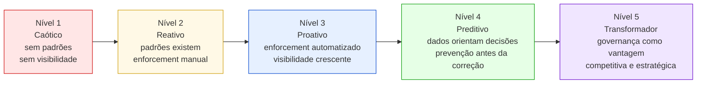
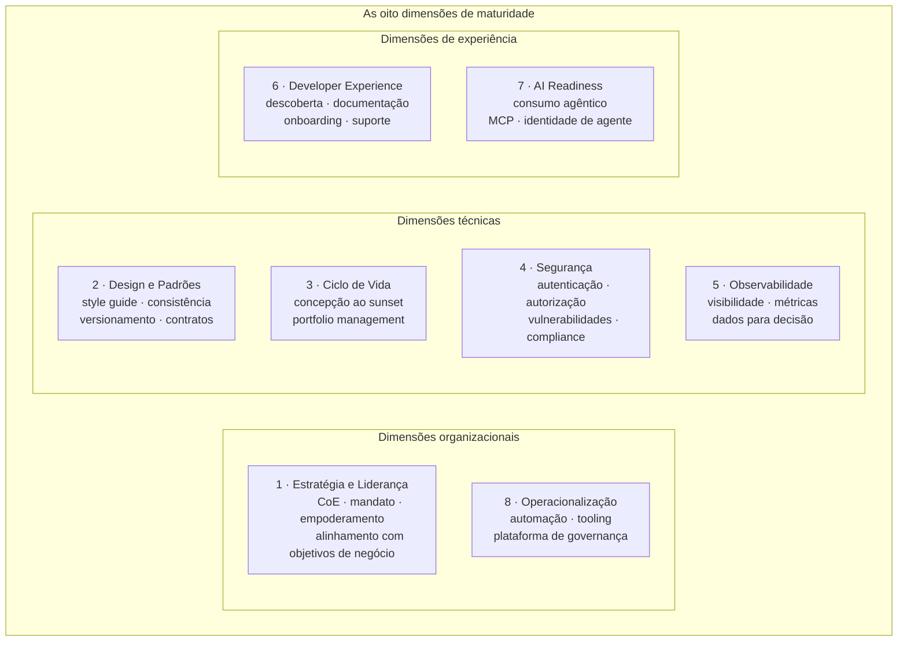
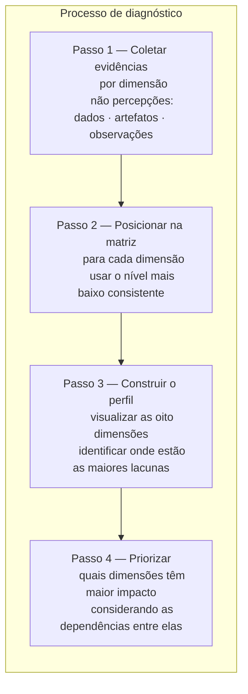
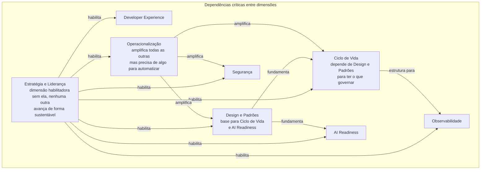

# Módulo 7 · Maturidade em Governança de APIs
## Capítulo 7.3 · A linguagem unificada

> **Série:** Gerenciamento e Governança de APIs
> **Nível:** Referencial — o framework desta série
> **Pré-requisito:** Cap 7.1 · Cap 7.2

---

## Sumário

- [7.3.1 · Por que uma linguagem unificada](#731--por-que-uma-linguagem-unificada)
- [7.3.2 · Os cinco níveis](#732--os-cinco-níveis)
- [7.3.3 · As oito dimensões](#733--as-oito-dimensões)
- [7.3.4 · A matriz de maturidade](#734--a-matriz-de-maturidade)
- [7.3.5 · Como usar o framework para diagnóstico](#735--como-usar-o-framework-para-diagnóstico)
- [7.3.6 · Dependências entre dimensões](#736--dependências-entre-dimensões)
- [7.3.7 · Conexões com os módulos anteriores](#737--conexões-com-os-módulos-anteriores)

---

## 7.3.1 · Por que uma linguagem unificada

O Cap 7.2 mostrou que os frameworks existentes usam vocabulários diferentes para descrever progressões similares. O Platformable fala em "consolidando", o Zuplo em "padronizado", o Gartner em "emerging" — mas todos descrevem aproximadamente o mesmo fenômeno: uma organização que reconheceu a necessidade de governança mas ainda não a tornou sistemática.

Essa fragmentação de vocabulário tem um custo prático: quando times diferentes numa mesma organização usam frameworks diferentes, o diagnóstico fica incoerente. O time de segurança avalia maturidade com um modelo, o CoE com outro, a liderança com um terceiro.

O framework desta série não substitui os existentes — complementa. Sua justificativa é tripla: incorpora as lacunas identificadas no Cap 7.2 (especialmente AI Readiness), alinha vocabulário com os conceitos desenvolvidos nos Módulos 1 a 6, e oferece granularidade suficiente para diagnóstico acionável sem complexidade desnecessária.

---

## 7.3.2 · Os cinco níveis

Os cinco níveis descrevem o estado geral de maturidade de uma dimensão. São progressivos — cada nível pressupõe que o anterior foi consolidado — mas não lineares no tempo: diferentes dimensões evoluem em ritmos diferentes.



**Nível 1 — Caótico**
O estado de partida da maioria das organizações. APIs existem, são usadas, mas não há padrões consistentes. Cada time decide por conta própria. O portfólio existe como conceito mas não como objeto gerenciado. Governança, quando existe, depende do conhecimento tácito de indivíduos específicos.

**Nível 2 — Reativo**
Alguém — ou algum evento — provoca uma tomada de consciência. Padrões são documentados, processos são propostos. O problema característico deste nível: as regras existem mas não são enforçadas. A organização reage a problemas quando eles aparecem, mas ainda não os previne. O CoE pode existir formalmente mas sem autoridade real.

**Nível 3 — Proativo**
O ponto de inflexão. A diferença entre o Nível 2 e o Nível 3 é a automação do enforcement. Não basta ter políticas — é necessário que as políticas sejam verificadas automaticamente no processo de desenvolvimento. Gates no pipeline de CI/CD, lint automático de specs, validações de segurança sem intervenção manual. A visibilidade sobre o portfólio começa a emergir.

**Nível 4 — Preditivo**
Dados acumulados começam a orientar decisões. A organização não apenas previne problemas — começa a antecipar tendências. Qual domínio está regredindo em qualidade? Qual política está sendo consistentemente violada — sinal de que a política pode estar errada? Decisões de investimento em governança são baseadas em evidências, não em intuição.

**Nível 5 — Transformador**
A governança deixa de ser um processo de controle e passa a ser um habilitador estratégico. APIs são tratadas como ativos de negócio que criam vantagem competitiva. O portfólio é gerenciado com a mesma seriedade que outros ativos estratégicos. A governança é invisível para quem desenvolve — está incorporada ao fluxo de trabalho — mas suas consequências são visíveis nos resultados de negócio.

---

## 7.3.3 · As oito dimensões

As oito dimensões foram selecionadas a partir de três critérios: cobertura dos temas centrais dos Módulos 1 a 6, incorporação das lacunas dos frameworks existentes, e granularidade suficiente para diagnóstico sem fragmentação excessiva.



**Dimensão 1 — Estratégia e Liderança**
Avalia se a governança tem suporte executivo, mandato claro e estrutura organizacional adequada. É a dimensão habilitadora — sem ela, as demais dimensões encontram resistência estrutural para evoluir. Conecta diretamente com o Cap 3.3 desta série.

**Dimensão 2 — Design e Padrões**
Avalia a consistência do design das APIs no portfólio: nomenclatura, versionamento, estrutura de erros, contratos. O style guide do Cap 3.4 é o artefato central desta dimensão.

**Dimensão 3 — Ciclo de Vida**
Avalia o quão estruturado é o processo de gestão de APIs da concepção ao sunset: gates de qualidade, processo de aprovação, gestão de versões, processo de depreciação. O Módulo 2 desta série é o fundamento teórico desta dimensão.

**Dimensão 4 — Segurança**
Avalia a maturidade dos controles de segurança no portfólio de APIs: padrões de autenticação, autorização, gestão de vulnerabilidades, compliance com frameworks como OWASP. O Módulo 5 é o fundamento desta dimensão.

**Dimensão 5 — Observabilidade**
Avalia a visibilidade sobre o portfólio: a organização sabe o estado de cada API? Tem dados sobre uso, qualidade e tendências? Consegue detectar problemas antes que virem incidentes? Conecta com o Cap 3.8.

**Dimensão 6 — Developer Experience**
Avalia a qualidade da experiência de quem cria e consome APIs: facilidade de descoberta, qualidade da documentação, onboarding, suporte. O Cap 3.5 e 3.6 desta série cobrem o catálogo e o portal como artefatos desta dimensão.

**Dimensão 7 — AI Readiness**
Avalia a prontidão do portfólio para consumo por agentes de IA: qualidade das descrições semânticas, exposição via MCP, suporte a identidade agêntica. Esta é a dimensão ausente nos frameworks existentes — o Módulo 6 desta série estabelece seu fundamento teórico.

**Dimensão 8 — Operacionalização**
Avalia o quanto a governança está automatizada e suportada por ferramentas: pipeline de CI/CD com gates de governança, políticas como código, plataforma de suporte ao CoE. Conecta com o Módulo 8 desta série.

---

## 7.3.4 · A matriz de maturidade

A matriz descreve o que cada nível parece na prática para cada dimensão. É o artefato central do framework — use-o para posicionar a organização em cada dimensão.

| Dimensão | Nível 1 · Caótico | Nível 2 · Reativo | Nível 3 · Proativo | Nível 4 · Preditivo | Nível 5 · Transformador |
|---|---|---|---|---|---|
| **1 · Estratégia e Liderança** | Sem CoE · APIs são responsabilidade individual | Alguém defende governança sem mandato formal | CoE formalmente constituído com escopo definido e políticas publicadas | CoE com autoridade real · decisões baseadas em dados de portfólio | APIs como ativo estratégico · governança alinhada com objetivos de negócio |
| **2 · Design e Padrões** | Cada dev usa suas próprias convenções | Style guide existe mas não é enforçado | Lint automatizado em CI/CD · portfólio com estilo consistente | Padrões evoluem baseados em dados de uso e feedback dos consumidores | Design é habilitador de ecossistema · APIs interoperáveis por design |
| **3 · Ciclo de Vida** | APIs surgem e morrem sem processo | Processo documentado mas não seguido · depreciações surpresa | Gates de ciclo de vida automatizados · depreciações planejadas com aviso | Lifecycle orientado por dados de uso · sunset baseado em evidências | Portfolio management contínuo · APIs como produtos com roadmap |
| **4 · Segurança** | Auth ad hoc · cada serviço decide | Padrões de segurança documentados · compliance manual | Segurança verificada automaticamente em CI/CD · gestão centralizada de credenciais | Threat modeling contínuo · detecção de anomalias no portfólio | Segurança como feature do produto · zero-trust nativo |
| **5 · Observabilidade** | Logs isolados por serviço · portfólio invisível | Dashboard centralizado básico · reativo a incidentes | SLOs definidos · alertas configurados · visibilidade do estado do portfólio | Decisões de portfólio orientadas por dados · tendências detectadas cedo | Observabilidade preditiva · problemas antecipados antes de virarem incidentes |
| **6 · Developer Experience** | README ad hoc · integração por tentativa e erro | Portal básico · documentação manual frequentemente desatualizada | Portal com try-it · onboarding guiado · catálogo pesquisável | Self-service completo · DX medida e otimizada continuamente | DX como vantagem competitiva para atração de desenvolvedores e parceiros |
| **7 · AI Readiness** | APIs não consideradas para consumo agêntico | Algumas APIs têm descrições mínimas · sem critério formal | AI Readiness como critério de publicação · primeiros MCP Servers | Portfólio majoritariamente AI-ready · identidade agêntica suportada | APIs projetadas nativamente para ecossistema agêntico · governança de agentes integrada |
| **8 · Operacionalização** | Processos totalmente manuais · governança depende de pessoas | Automações pontuais · sem plataforma integrada | Pipeline de governança automatizado · políticas como código | Plataforma de governança integrada ao ciclo de desenvolvimento dos times | Governança invisível para o desenvolvedor · automação total do enforcement |

---

## 7.3.5 · Como usar o framework para diagnóstico

O framework não é um questionário a ser respondido em uma reunião. É um instrumento que exige evidências — não percepções. A diferença entre "achamos que estamos no Nível 3" e "estamos no Nível 3" é a diferença entre autoilusão e diagnóstico.

### Princípios do diagnóstico

**Avaliar pelo nível mais baixo consistente, não pelo mais alto esporádico**

Uma organização que tem um bom processo de depreciação para suas APIs mais importantes, mas que não aplica o mesmo processo para APIs menores, está no Nível 2 de Ciclo de Vida — não no Nível 3. Maturidade é sobre consistência. O nível correto é aquele que descreve o que acontece na maior parte do portfólio, na maior parte do tempo.

**Usar evidências, não percepções**

```
Não: "Achamos que temos um bom style guide"
Sim: "O style guide está publicado, 78% das APIs passam no lint automatizado"

Não: "Nossa segurança é bastante madura"
Sim: "100% das APIs em produção têm OAuth 2.0 · 23% ainda usam API Keys"
```

**Fazer o diagnóstico com múltiplas perspectivas**

O CoE tende a superestimar a maturidade — porque está próximo dos processos que criou. Os desenvolvedores tendem a subestimar — porque vivenciam a fricção dos processos. A liderança tende a confundir intenção com execução. Um diagnóstico robusto combina as três perspectivas.

### O processo de diagnóstico em quatro passos



O Anexo N desta série contém o questionário de autodiagnóstico estruturado — perguntas específicas por dimensão para orientar a coleta de evidências.

---

## 7.3.6 · Dependências entre dimensões

Nem todas as dimensões são independentes. Algumas têm dependências funcionais — avançar numa dimensão sem antes consolidar outra produz resultados frágeis.



**A dimensão 1 — Estratégia e Liderança — é pré-requisito para todas as outras.**

Uma organização no Nível 1 de Estratégia e Liderança que investe pesadamente em Operacionalização vai criar automação de regras que ninguém valida e que nenhum time é obrigado a seguir. Uma organização no Nível 1 de Design e Padrões que tenta construir AI Readiness vai criar MCP Servers sobre APIs inconsistentes que agentes não conseguirão usar de forma confiável.

A implicação prática: quando o diagnóstico revela lacunas em múltiplas dimensões, a ordem de priorização importa tanto quanto as prioridades em si.

---

## 7.3.7 · Conexões com os módulos anteriores

O framework de maturidade desta série não é autônomo — é uma lente diagnóstica aplicada sobre o corpo teórico dos Módulos 1 a 6. Cada dimensão tem seu fundamento teórico num módulo específico.

| Dimensão | Módulos e capítulos de referência |
|---|---|
| **1 · Estratégia e Liderança** | Cap 3.2 · Governança organizacional · Cap 3.3 · O CoE |
| **2 · Design e Padrões** | Cap 2.2 · Design de APIs · Cap 3.4 · Style Guide |
| **3 · Ciclo de Vida** | Módulo 2 completo · Cap 4.4 · Change management |
| **4 · Segurança** | Módulo 5 completo · Cap 5.1 · Fundamentos · Cap 5.4 · Zero Trust |
| **5 · Observabilidade** | Cap 3.8 · Métricas · Cap 4.6 · Monitoramento e SLA |
| **6 · Developer Experience** | Cap 3.5 · Catálogo · Cap 3.6 · Portal de desenvolvedores |
| **7 · AI Readiness** | Módulo 6 completo · Cap 6.8 · AI Readiness do portfólio |
| **8 · Operacionalização** | Cap 3.7 · Automação de governança · Módulo 8 desta série |

Quando o Cap 7.7 — Dimensão: Segurança — descreve o que é maturidade de Nível 3 nessa dimensão, ele está descrevendo o quanto das práticas do Módulo 5 estão efetivamente em operação. A maturidade não é medida em abstrato — é medida em relação ao que o estado da arte do campo estabelece como referência.

---

## Pontos-chave do capítulo

- A linguagem unificada existe para resolver a fragmentação de vocabulário entre frameworks e criar coerência com os conceitos dos Módulos 1 a 6
- Os cinco níveis descrevem estados progressivos: Caótico → Reativo → Proativo → Preditivo → Transformador. O ponto de inflexão crítico é a transição do Nível 2 para o 3 — a automação do enforcement
- As oito dimensões cobrem as organizacionais (Estratégia, Operacionalização), as técnicas (Design, Ciclo de Vida, Segurança, Observabilidade) e as de experiência (Developer Experience, AI Readiness)
- A matriz 5×8 é o artefato central — descreve o que cada nível parece na prática para cada dimensão
- Diagnóstico de maturidade usa o nível mais baixo consistente, não o mais alto esporádico, e requer evidências — não percepções
- Estratégia e Liderança é a dimensão habilitadora — sem ela, avanços em outras dimensões são frágeis
- Cada dimensão tem fundamento teórico num módulo anterior desta série — maturidade é medida em relação ao estado da arte, não em abstrato

---

## Próximo capítulo

**7.4 · Dimensão: Estratégia e Liderança** — o que significa maturidade nessa dimensão, como são os cinco níveis na prática e os desafios mais comuns de progressão.

---

*Série: Gerenciamento e Governança de APIs · Módulo 7 · Capítulo 7.3*