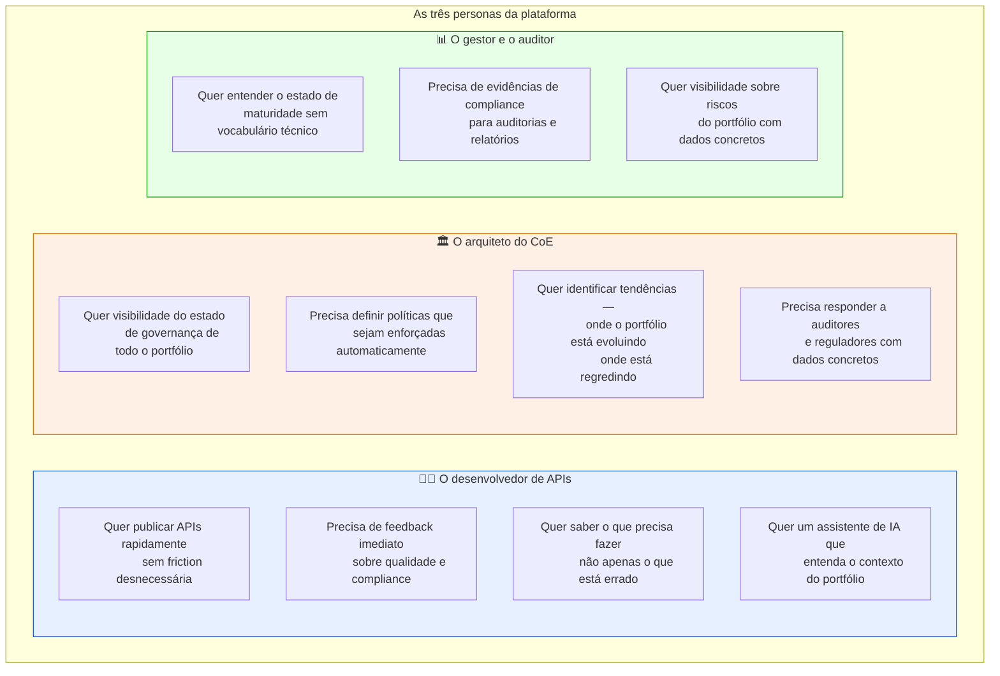
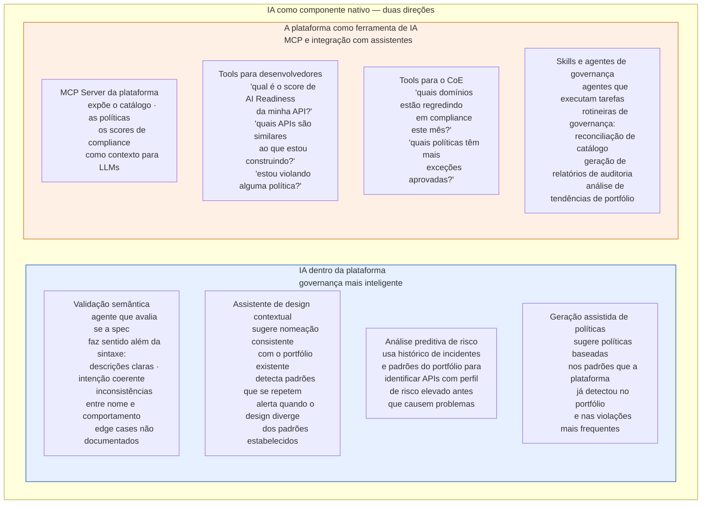
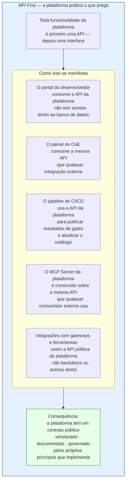
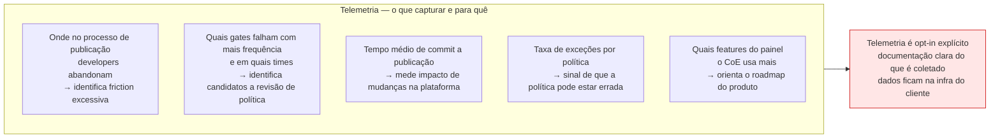
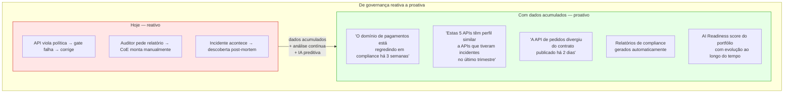

# Módulo 7 · A Plataforma de Governança
## Capítulo 7.1 · Visão e posicionamento do produto

> **Série:** Gerenciamento e Governança de APIs
> **Nível:** Estratégico
> **Pré-requisito:** Prefácio · Módulos 1 a 6

---

## Sumário

- [7.1.1 · O problema que a plataforma existe para resolver](#711--o-problema-que-a-plataforma-existe-para-resolver)
- [7.1.2 · Para quem](#712--para-quem)
- [7.1.3 · O landscape atual — benchmark honesto](#713--o-landscape-atual--benchmark-honesto)
- [7.1.4 · O posicionamento](#714--o-posicionamento)
- [7.1.5 · IA como componente nativo](#715--ia-como-componente-nativo)
- [7.1.6 · API First — a plataforma pratica o que prega](#716--api-first--a-plataforma-pratica-o-que-prega)
- [7.1.7 · A estratégia de dados](#717--a-estratégia-de-dados)
- [7.1.8 · Os princípios de design do produto](#718--os-princípios-de-design-do-produto)
- [Requisitos derivados](#requisitos-derivados)

---

## 7.1.1 · O problema que a plataforma existe para resolver

Organizações que desenvolvem APIs em escala enfrentam um problema que nenhuma ferramenta técnica isolada resolve: a **governança fragmentada**.

O portfólio cresce. Os times multiplicam. Cada time toma suas próprias decisões de design — nomeação de campos, padrões de autenticação, tratamento de erros, versionamento. O catálogo existe em alguma planilha que ninguém atualiza. As políticas de segurança estão num documento que ninguém lê. O CoE tenta revisar APIs manualmente antes de cada publicação e torna-se um gargalo. Quando um auditor pergunta quais APIs têm acesso a dados pessoais, a resposta honesta é "não sabemos exatamente".

Esse é o estado de maturidade de governança da maioria das organizações — não por incompetência, mas por ausência de infraestrutura adequada. As ferramentas disponíveis resolvem partes do problema individualmente, mas nenhuma conecta o ciclo de vida das APIs às políticas do CoE, ao CMDB, aos controles de segurança e à observabilidade de maturidade em um sistema coerente.

A plataforma que este módulo especifica existe para preencher essa lacuna.

---

## 7.1.2 · Para quem

A plataforma serve três personas com necessidades distintas que precisam falar a mesma língua:

A plataforma é instalada na infraestrutura da própria organização — on-premises, Kubernetes privado, cloud account própria. A organização tem controle total sobre seus dados, suas políticas e sua configuração.

---

## 7.1.3 · O landscape atual — benchmark honesto

O benchmark a seguir não tem por objetivo denegrir produtos existentes — tem por objetivo posicionar com precisão o que cada categoria faz e onde o gap real está. Todas as ferramentas mencionadas são produtos sérios que resolvem bem os problemas para os quais foram projetados.

| Capacidade | Gateways (Kong, Apigee, AWS APIM) | Lint/Qualidade (Spectral, 42Crunch) | Design (Stoplight, Postman) | **Esta plataforma** |
|---|---|---|---|---|
| Catálogo como fonte de verdade do portfólio | Parcial — registry de runtime | ❌ | Parcial — foco em design | ✅ |
| Políticas enforçadas automaticamente no pipeline | ❌ | Parcial — spec isolada | ❌ | ✅ |
| Ciclo de vida integrado — concepção ao sunset | ❌ | ❌ | Parcial — foco em design | ✅ |
| Observabilidade de maturidade do portfólio | ❌ | ❌ | ❌ | ✅ |
| Descoberta ativa de shadow APIs | Parcial — via logs | ❌ | ❌ | ✅ |
| IA nativa — validação semântica e assistente | ❌ | ❌ | ❌ | ✅ |
| MCP da plataforma — integração com assistentes | ❌ | ❌ | ❌ | ✅ |
| Governança agêntica — MCP registry · AI Readiness | ❌ | ❌ | ❌ | ✅ |
| API First — plataforma consumível via API | Sim | Parcial | Sim | ✅ |
| Self-hosted · dados na infra do cliente | Parcial | Sim | Parcial | ✅ |
| Open source · core auditável | Parcial — Kong CE | Sim — Spectral | Parcial | ✅ |

---

### A distinção crítica: API Management vs. API Governance

**API Management** é sobre operar APIs em runtime — roteamento de tráfego, autenticação, rate limiting, monitoramento de disponibilidade. É o trabalho do gateway.

**API Governance** é sobre garantir que o portfólio está sendo desenvolvido e mantido de acordo com os padrões, políticas e práticas que a organização definiu. É o trabalho do CoE materializado em software.

A plataforma não compete com gateways. Integra com eles — lendo logs para observabilidade, publicando políticas que o gateway aplica, detectando divergências entre o catálogo declarado e o que o gateway está servindo.

---

## 7.1.4 · O posicionamento

A plataforma é a **primeira plataforma de governança de APIs open source projetada nativamente para o ecossistema agêntico, com IA como componente de primeira classe**.

**"Governança de APIs"** — não API management. O foco é o ciclo de vida, as políticas, o catálogo, a maturidade.

**"Open source"** — instalada na infraestrutura do cliente. Sem vendor lock-in. Sem dados saindo da organização. Auditável em cada linha de código. Extensível pela comunidade.

**"Projetada nativamente para o ecossistema agêntico"** — MCP Server registry, AI Readiness e identidade agêntica são componentes de primeira classe desde o primeiro commit — não add-ons adicionados depois.

**"IA como componente de primeira classe"** — a plataforma usa IA para fazer governança melhor: validação semântica que lint não consegue, assistência contextual ao desenvolvedor, análise preditiva de risco. E a plataforma expõe suas capacidades via MCP para que assistentes de IA externos possam usá-la como ferramenta.

**O que a plataforma não é:**
- Não é um gateway — não gerencia tráfego em runtime
- Não é uma ferramenta de desenvolvedor individual — é uma plataforma organizacional
- Não compete com Kong, Apigee ou AWS API Gateway — é complementar

---

## 7.1.5 · IA como componente nativo

A plataforma usa IA em duas direções: como capacidade interna que melhora a governança, e como interface que expõe a plataforma para o ecossistema agêntico externo.

---

### A distinção que o Módulo 6 estabeleceu

O Módulo 6 documentou que IA tem uma dupla face nas APIs: como consumidora e como produtora/operadora. A plataforma implementa ambas:

Como **consumidora de IA** — usa modelos para fazer validação semântica, análise de risco e geração de sugestões. O modelo é um componente interno que o CoE pode configurar — modelo local, modelo da organização, ou modelo de terceiro.

Como **exposta para IA** — o MCP Server da plataforma torna toda a inteligência de governança acessível a qualquer assistente de IA que o desenvolvedor ou o arquiteto esteja usando. A plataforma não compete com os assistentes existentes — os enriquece com contexto de governança.

---

## 7.1.6 · API First — a plataforma pratica o que prega

Uma plataforma de governança de APIs que não é construída com as próprias práticas que preconiza seria uma contradição. API First não é apenas um princípio de design para os clientes da plataforma — é o princípio de design da própria plataforma.

Isso tem uma implicação direta para o desenvolvimento: o time que constrói a plataforma usa a própria plataforma para governar a API da plataforma. Dogfooding como prática desde o primeiro dia — e como sinal de qualidade para a comunidade open source.

---

## 7.1.7 · A estratégia de dados

Dados são o ativo mais subestimado em plataformas de governança. A plataforma coleta, processa e expõe dois tipos de dados com propósitos distintos.

---

### Telemetria da plataforma — inteligência de produto

---

### Dados de governança — inteligência do portfólio

**Privacidade e controle:** todos os dados de governança ficam na infraestrutura do cliente. A plataforma não envia dados para nenhum serviço externo por padrão.

---

## 7.1.8 · Os princípios de design do produto

**1 · Governança como habilitador, não obstáculo**
Cada feature é avaliada pela seguinte pergunta: isso ajuda o desenvolvedor a fazer a coisa certa, ou apenas bloqueia a coisa errada? A plataforma que só bloqueia é um obstáculo. A plataforma que orienta e então verifica é um habilitador.

**2 · Políticas explícitas e legíveis**
Toda política deve ser legível por um desenvolvedor sem treinamento especializado em governança. Uma política que não pode ser explicada em linguagem simples provavelmente precisa ser redesenhada.

**3 · Feedback imediato e acionável**
Quando um gate falha, a mensagem diz o que está errado, por que está errado e como corrigir. "Validation failed" não é feedback. "O campo `userId` viola a política de exposição mínima — considere removê-lo ou marcá-lo como `writeOnly`" é feedback.

**4 · Integrações, não substituições**
A plataforma não substitui o que o cliente já tem — integra. Uma plataforma que exige abandono da infraestrutura existente não será adotada.

**5 · API First**
Toda funcionalidade é primeiro uma API, depois uma interface. A plataforma consome sua própria API. O que não tem API não existe como produto.

**6 · IA como amplificador**
IA amplifica o que a plataforma já faz — não substitui o julgamento humano. Validação semântica amplifica o lint. Análise preditiva amplifica a observabilidade. O arquiteto do CoE ainda decide — com mais inteligência.

**7 · Dados como produto**
Cada interação gera dados com valor além da interação imediata. A arquitetura acumula, preserva e expõe esses dados para que o portfólio se torne mais inteligente ao longo do tempo.

**8 · Segurança como propriedade, não camada**
Autenticação, autorização, auditoria e criptografia são requisitos do core — não features adicionadas depois.

**9 · Unenforced rules breed contempt for all rules. Unless the rule was wrong.**
Toda política tem um mecanismo de enforcement. Toda violação consistente de uma regra é um sinal de que a regra pode estar errada.

---

## Requisitos derivados

| # | Requisito | Origem |
|---|---|---|
| R-7.1.1 | A plataforma deve ser instalável em Kubernetes via Helm chart sem dependência de serviços externos pagos | Modelo self-hosted |
| R-7.1.2 | A plataforma deve integrar com pelo menos Kong, AWS API Gateway e Azure APIM no lançamento | Posicionamento complementar |
| R-7.1.3 | A plataforma deve ser licenciada sob Apache 2.0 | Open source |
| R-7.1.4 | Toda mensagem de erro deve incluir o que está errado, por que está errado e como corrigir | Princípio 3 |
| R-7.1.5 | MCP Server registry e AI Readiness são componentes do core — não extensões opcionais | Diferenciação agêntica |
| R-7.1.6 | A plataforma deve expor um MCP Server que dá acesso ao catálogo, políticas e scores de compliance | IA como interface |
| R-7.1.7 | Toda funcionalidade da plataforma deve ser acessível via API pública antes de qualquer interface gráfica | API First |
| R-7.1.8 | Telemetria de produto deve ser opt-in explícito com documentação clara do que é coletado | Privacidade |
| R-7.1.9 | Todos os dados de governança devem permanecer na infraestrutura do cliente por padrão | Privacidade |
| R-7.1.10 | A plataforma deve expor uma API de dados para consulta de histórico de compliance, scores e tendências | Dados como produto |

---

## Próximo capítulo

**7.2 · Arquitetura de referência** — os componentes da plataforma, suas responsabilidades, suas interfaces e o blueprint técnico.

---

*Série: Gerenciamento e Governança de APIs · Módulo 7 · Capítulo 7.1*