# Módulo 7 · A Plataforma de Governança
## Capítulo 7.2 · Arquitetura de referência

> **Série:** Gerenciamento e Governança de APIs
> **Nível:** Técnico e arquitetural
> **Pré-requisito:** Cap 7.1

---

## Sumário

- [7.2.1 · Visão geral da arquitetura](#721--visão-geral-da-arquitetura)
- [7.2.2 · O modelo de produto — API, CLI, SDK e Console](#722--o-modelo-de-produto--api-cli-sdk-e-console)
- [7.2.3 · Os seis serviços](#723--os-seis-serviços)
- [7.2.4 · A camada analítica — separação OLTP e OLAP](#724--a-camada-analítica--separação-oltp-e-olap)
- [7.2.5 · O CLI em detalhe](#725--o-cli-em-detalhe)
- [7.2.6 · O modelo de integração](#726--o-modelo-de-integração)
- [7.2.7 · Fluxos principais](#727--fluxos-principais)
- [Requisitos derivados](#requisitos-derivados)

---

## 7.2.1 · Visão geral da arquitetura

A plataforma é organizada em quatro camadas com responsabilidades não sobrepostas. Cada camada tem uma função precisa — e a separação entre elas é o que permite que cada uma evolua sem quebrar as outras.

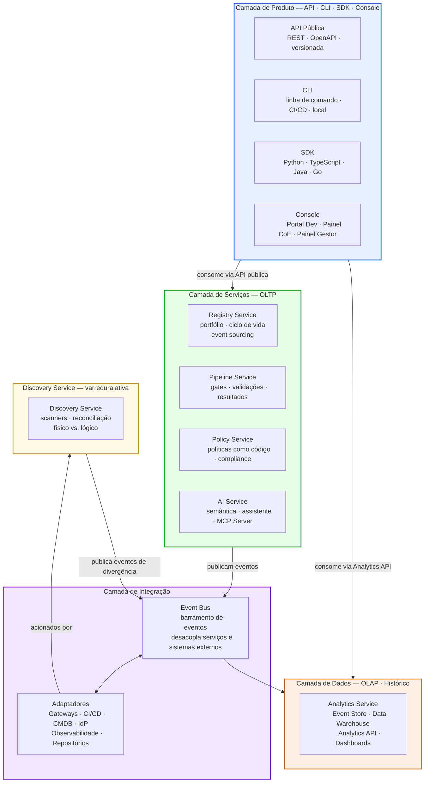
```mermaid
graph TB
    subgraph produto["Camada de Produto — API · CLI · SDK · Console"]
        api_pub["API Pública
        REST · OpenAPI · versionada"]
        cli["CLI
        linha de comando · CI/CD · local"]
        sdk["SDK
        Python · TypeScript · Java · Go"]
        console["Console
        Portal Dev · Painel CoE · Painel Gestor"]
    end

    subgraph servicos["Camada de Serviços — OLTP"]
        registry["Registry Service
        portfólio · ciclo de vida
        event sourcing"]
        pipeline["Pipeline Service
        gates · validações · resultados"]
        policy["Policy Service
        políticas como código · compliance"]
        ai["AI Service
        semântica · assistente · MCP Server"]
    end

    subgraph discovery_layer["Discovery Service — varredura ativa"]
        discovery["Discovery Service
        scanners · reconciliação
        físico vs. lógico"]
    end

    subgraph dados["Camada de Dados — OLAP · Histórico"]
        analytics["Analytics Service
        Event Store · Data Warehouse
        Analytics API · Dashboards"]
    end

    subgraph integracao["Camada de Integração"]
        eventbus["Event Bus
        barramento de eventos
        desacopla serviços e sistemas externos"]
        adapters["Adaptadores
        Gateways · CI/CD · CMDB · IdP
        Observabilidade · Repositórios"]
    end

    produto -->|"consome via API pública"| servicos
    produto -->|"consome via Analytics API"| dados
    servicos -->|"publicam eventos"| eventbus
    eventbus --> dados
    eventbus <--> adapters
    adapters -->|"acionados por"| discovery_layer
    discovery_layer -->|"publica eventos de divergência"| eventbus

    style produto fill:#e6f0ff,stroke:#0044cc,stroke-width:2px
    style servicos fill:#e6ffe6,stroke:#009900,stroke-width:2px
    style dados fill:#fff0e6,stroke:#cc6600,stroke-width:2px
    style integracao fill:#f0e6ff,stroke:#6600cc,stroke-width:2px
    style discovery_layer fill:#fff9e6,stroke:#cc9900,stroke-width:2px
```

---

### Os princípios que guiam a arquitetura

**Serviços, não microserviços** — seis serviços com responsabilidades claras e boundaries bem definidos. Cada serviço é deployável independentemente, tem seu próprio banco de dados e se comunica com os demais via API e eventos. Sem a granularidade excessiva que torna microserviços operacionalmente pesados para equipes pequenas.

**Event-driven como padrão de integração** — operações que não precisam de resposta síncrona são publicadas como eventos. Isso desacopla os serviços internos e viabiliza integrações com sistemas externos sem acoplamento direto.

**Separação OLTP / OLAP** — a camada de serviços é transacional, otimizada para leitura e escrita de baixa latência. A camada de dados é analítica, otimizada para queries históricas e agregações. As duas nunca compartilham o mesmo armazenamento.

**API First sem exceções** — toda funcionalidade é acessível via API pública antes de qualquer interface. O Console é um consumidor da API como qualquer outro.

---

## 7.2.2 · O modelo de produto — API, CLI, SDK e Console

O modelo de produto segue o padrão das plataformas de infraestrutura mais bem-sucedidas: a API é o produto primário, e CLI, SDK e Console são interfaces que a consomem.

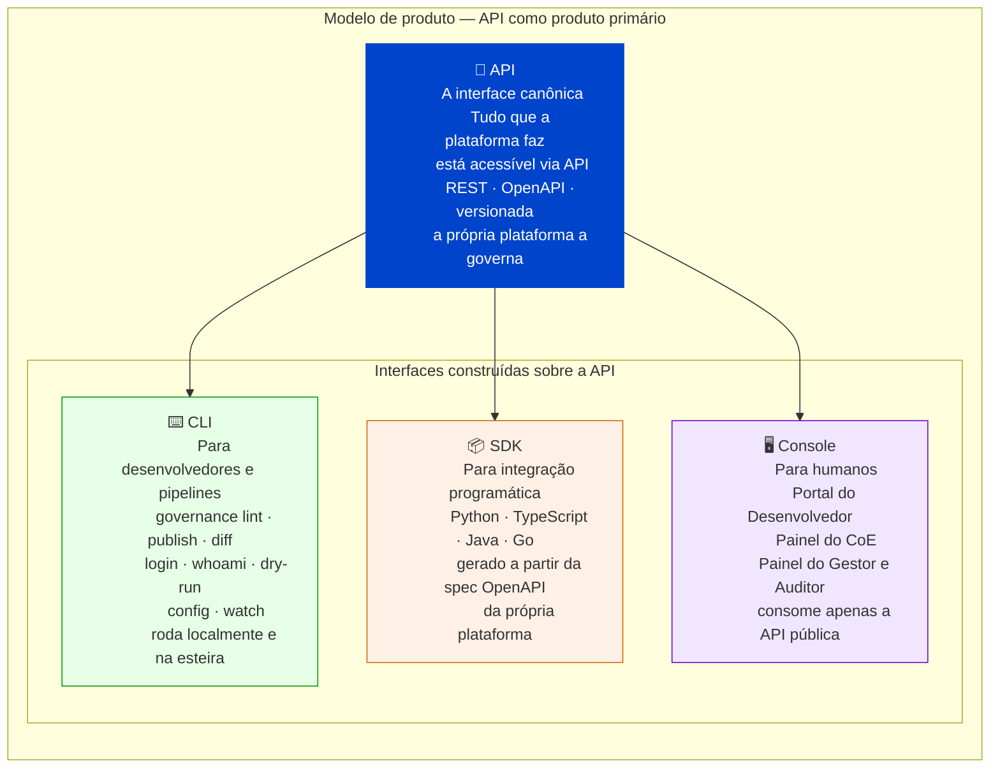
```mermaid
graph TB
    subgraph modelo_produto["Modelo de produto — API como produto primário"]
        direction TB

        api_core["🔌 API
        A interface canônica
        Tudo que a plataforma faz
        está acessível via API
        REST · OpenAPI · versionada
        a própria plataforma a governa"]

        subgraph interfaces["Interfaces construídas sobre a API"]
            cli_box["⌨️ CLI
            Para desenvolvedores e pipelines
            governance lint · publish · diff
            login · whoami · dry-run
            config · watch
            roda localmente e na esteira"]

            sdk_box["📦 SDK
            Para integração programática
            Python · TypeScript · Java · Go
            gerado a partir da spec OpenAPI
            da própria plataforma"]

            console_box["🖥️ Console
            Para humanos
            Portal do Desenvolvedor
            Painel do CoE
            Painel do Gestor e Auditor
            consome apenas a API pública"]
        end

        api_core --> cli_box
        api_core --> sdk_box
        api_core --> console_box
    end

    style api_core fill:#0044cc,color:#ffffff,stroke:#0044cc,stroke-width:3px
    style cli_box fill:#e6ffe6,stroke:#009900
    style sdk_box fill:#fff0e6,stroke:#cc6600
    style console_box fill:#f0e6ff,stroke:#6600cc
```

**A elegância do modelo:** o SDK é gerado a partir da spec OpenAPI da plataforma — a plataforma usa sua própria infraestrutura de geração para produzir seus próprios clientes. O Console é um consumidor da API exatamente como um cliente externo seria — sem atalhos, sem acesso direto a bancos de dados. Qualquer coisa que o Console faz, um script Python com o SDK também pode fazer.

---

## 7.2.3 · Os seis serviços

### Registry Service

O coração da plataforma. Armazena o estado de tudo que a plataforma governa — APIs, specs, owners, scores, dependências, relacionamentos. É o único serviço com autoridade sobre o estado atual do portfólio.

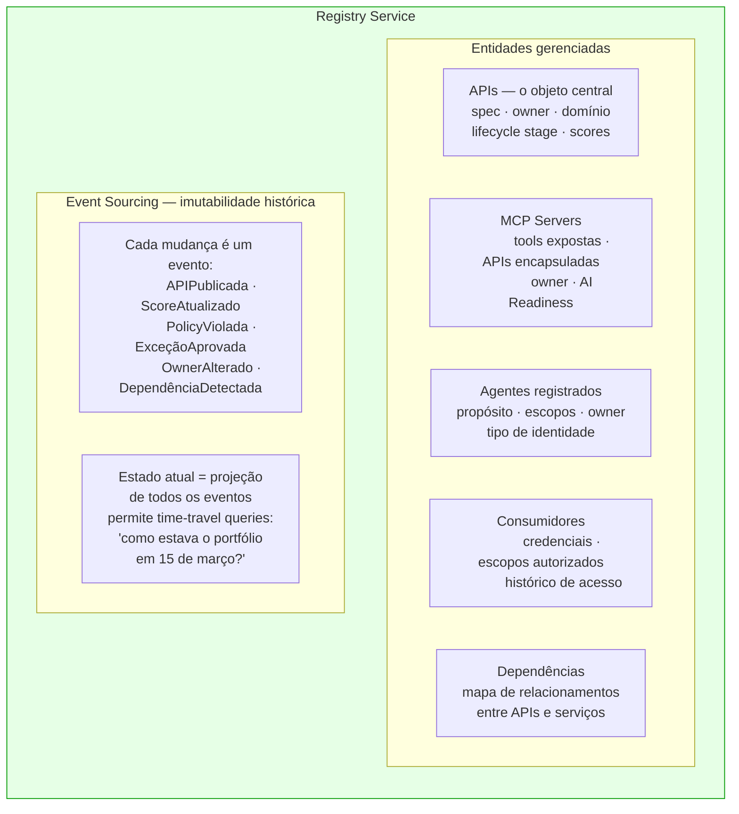
```mermaid
graph LR
    subgraph registry_svc["Registry Service"]
        direction TB

        subgraph entidades["Entidades gerenciadas"]
            e1["APIs — o objeto central
            spec · owner · domínio
            lifecycle stage · scores"]
            e2["MCP Servers
            tools expostas · APIs encapsuladas
            owner · AI Readiness"]
            e3["Agentes registrados
            propósito · escopos · owner
            tipo de identidade"]
            e4["Consumidores
            credenciais · escopos autorizados
            histórico de acesso"]
            e5["Dependências
            mapa de relacionamentos
            entre APIs e serviços"]
        end

        subgraph event_sourcing["Event Sourcing — imutabilidade histórica"]
            es1["Cada mudança é um evento:
            APIPublicada · ScoreAtualizado
            PolicyViolada · ExceçãoAprovada
            OwnerAlterado · DependênciaDetectada"]
            es2["Estado atual = projeção
            de todos os eventos
            permite time-travel queries:
            'como estava o portfólio
            em 15 de março?'"]
        end
    end

    style registry_svc fill:#e6ffe6,stroke:#009900
```

**Por que event sourcing no registry:** cada mudança de estado é um evento imutável — não uma sobrescrita. Isso dá auditoria completa de graça, rastreabilidade total e a capacidade de reconstruir o estado do portfólio em qualquer ponto no passado. Para relatórios regulatórios e investigação forense, esse histórico é inestimável.

---

### Pipeline Service

O motor de validação. Orquestra a execução dos gates de qualidade — lint, segurança, AI Readiness, contract testing — e publica os resultados de volta no Registry.

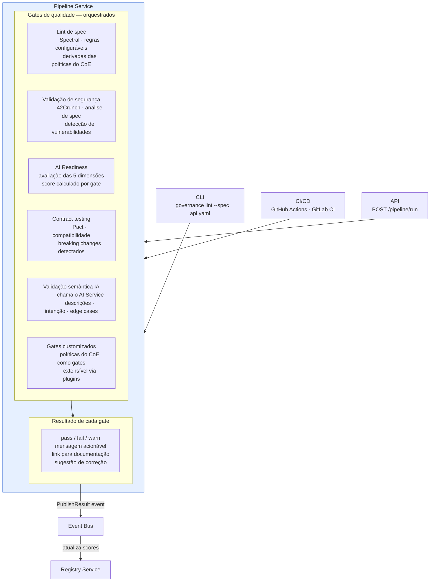
```mermaid
graph TB
    subgraph pipeline_svc["Pipeline Service"]
        direction LR

        subgraph gates["Gates de qualidade — orquestrados"]
            g1["Lint de spec
            Spectral · regras configuráveis
            derivadas das políticas do CoE"]
            g2["Validação de segurança
            42Crunch · análise de spec
            detecção de vulnerabilidades"]
            g3["AI Readiness
            avaliação das 5 dimensões
            score calculado por gate"]
            g4["Contract testing
            Pact · compatibilidade
            breaking changes detectados"]
            g5["Validação semântica IA
            chama o AI Service
            descrições · intenção · edge cases"]
            g6["Gates customizados
            políticas do CoE como gates
            extensível via plugins"]
        end

        subgraph resultado["Resultado de cada gate"]
            r1["pass / fail / warn
            mensagem acionável
            link para documentação
            sugestão de correção"]
        end

        gates --> resultado
    end

    cli_input["CLI
    governance lint --spec api.yaml"]
    ci_input["CI/CD
    GitHub Actions · GitLab CI"]
    api_input["API
    POST /pipeline/run"]

    cli_input & ci_input & api_input --> pipeline_svc
    resultado -->|"PublishResult event"| eventbus2["Event Bus"]
    eventbus2 -->|"atualiza scores"| registry2["Registry Service"]

    style pipeline_svc fill:#e6f0ff,stroke:#0044cc
```

---

### Policy Service

O sistema de políticas como código. Armazena políticas definidas pelo CoE, avalia compliance de APIs contra essas políticas e gerencia o ciclo de vida de exceções.

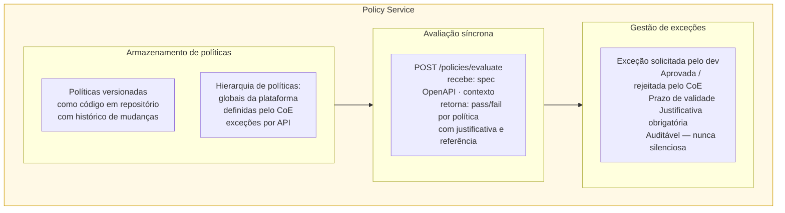
```mermaid
graph TB
    subgraph policy_svc["Policy Service"]
        direction LR

        subgraph armazenamento["Armazenamento de políticas"]
            p1["Políticas versionadas
            como código em repositório
            com histórico de mudanças"]
            p2["Hierarquia de políticas:
            globais da plataforma
            definidas pelo CoE
            exceções por API"]
        end

        subgraph avaliacao["Avaliação síncrona"]
            av1["POST /policies/evaluate
            recebe: spec OpenAPI · contexto
            retorna: pass/fail por política
            com justificativa e referência"]
        end

        subgraph excecoes["Gestão de exceções"]
            ex1["Exceção solicitada pelo dev
            Aprovada / rejeitada pelo CoE
            Prazo de validade
            Justificativa obrigatória
            Auditável — nunca silenciosa"]
        end

        armazenamento --> avaliacao
        avaliacao --> excecoes
    end

    style policy_svc fill:#fff9e6,stroke:#cc9900
```

---

### AI Service

O serviço que agrupa todas as capacidades de inteligência artificial da plataforma — tanto as que a plataforma usa internamente quanto as que expõe para o ecossistema externo.

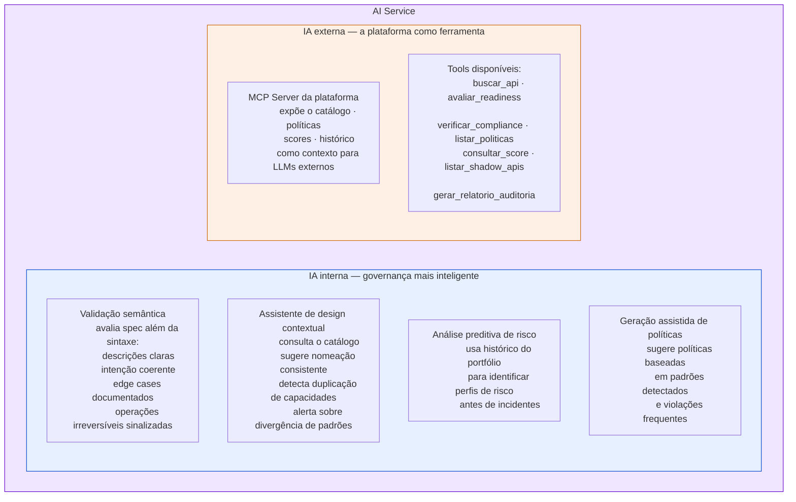
```mermaid
graph TB
    subgraph ai_svc["AI Service"]
        direction LR

        subgraph interno["IA interna — governança mais inteligente"]
            ai1["Validação semântica
            avalia spec além da sintaxe:
            descrições claras
            intenção coerente
            edge cases documentados
            operações irreversíveis sinalizadas"]

            ai2["Assistente de design contextual
            consulta o catálogo
            sugere nomeação consistente
            detecta duplicação de capacidades
            alerta sobre divergência de padrões"]

            ai3["Análise preditiva de risco
            usa histórico do portfólio
            para identificar perfis de risco
            antes de incidentes"]

            ai4["Geração assistida de políticas
            sugere políticas baseadas
            em padrões detectados
            e violações frequentes"]
        end

        subgraph externo["IA externa — a plataforma como ferramenta"]
            mcp["MCP Server da plataforma
            expõe o catálogo · políticas
            scores · histórico
            como contexto para LLMs externos"]

            tools["Tools disponíveis:
            buscar_api · avaliar_readiness
            verificar_compliance · listar_politicas
            consultar_score · listar_shadow_apis
            gerar_relatorio_auditoria"]
        end
    end

    style ai_svc fill:#f0e6ff,stroke:#6600cc
    style interno fill:#e6f0ff,stroke:#0044cc
    style externo fill:#fff0e6,stroke:#cc6600
```

**O modelo de LLM é plugável** — o AI Service define as interfaces de capacidade, não o modelo específico. O administrador da plataforma configura qual modelo usar: local (Ollama), da organização (Azure OpenAI, Bedrock), ou externo via API. A plataforma não tem opinião sobre qual modelo é melhor — tem opinião sobre o que o modelo precisa fazer.

---

### Analytics Service

A camada que transforma eventos brutos em inteligência de portfólio. É a separação OLAP que permite que queries históricas e analíticas não interfiram nos serviços transacionais.

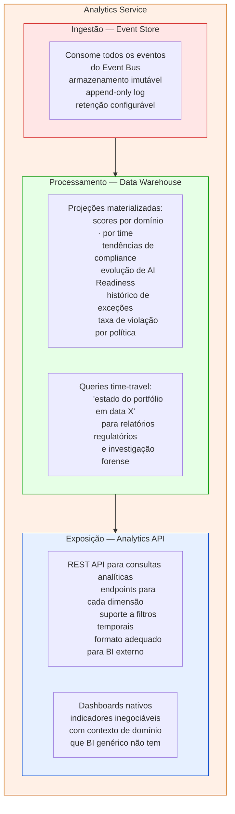
```mermaid
graph TB
    subgraph analytics_svc["Analytics Service"]
        direction TB

        subgraph ingestao["Ingestão — Event Store"]
            i1["Consome todos os eventos
            do Event Bus
            armazenamento imutável
            append-only log
            retenção configurável"]
        end

        subgraph processamento["Processamento — Data Warehouse"]
            dw1["Projeções materializadas:
            scores por domínio · por time
            tendências de compliance
            evolução de AI Readiness
            histórico de exceções
            taxa de violação por política"]
            dw2["Queries time-travel:
            'estado do portfólio em data X'
            para relatórios regulatórios
            e investigação forense"]
        end

        subgraph exposicao["Exposição — Analytics API"]
            exp1["REST API para consultas analíticas
            endpoints para cada dimensão
            suporte a filtros temporais
            formato adequado para BI externo"]
            exp2["Dashboards nativos
            indicadores inegociáveis
            com contexto de domínio
            que BI genérico não tem"]
        end

        ingestao --> processamento --> exposicao
    end

    style analytics_svc fill:#fff0e6,stroke:#cc6600
    style ingestao fill:#ffe6e6,stroke:#cc0000
    style processamento fill:#e6ffe6,stroke:#009900
    style exposicao fill:#e6f0ff,stroke:#0044cc
```

---

### Os indicadores inegociáveis do Console

Os dashboards que só fazem sentido com contexto de governança — que nenhuma ferramenta de BI genérica produz sem integrações profundas:

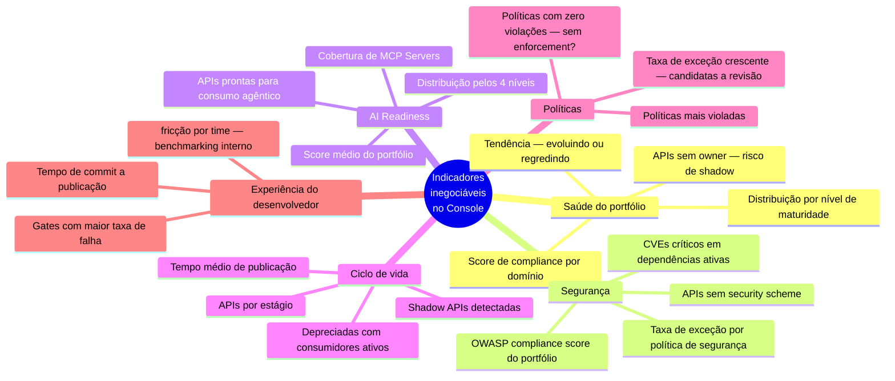
```mermaid
mindmap
  root((Indicadores
  inegociáveis
  no Console))
    Saúde do portfólio
      Score de compliance por domínio
      Tendência — evoluindo ou regredindo
      Distribuição por nível de maturidade
      APIs sem owner — risco de shadow
    Segurança
      APIs sem security scheme
      CVEs críticos em dependências ativas
      Taxa de exceção por política de segurança
      OWASP compliance score do portfólio
    AI Readiness
      Score médio do portfólio
      Distribuição pelos 4 níveis
      APIs prontas para consumo agêntico
      Cobertura de MCP Servers
    Ciclo de vida
      APIs por estágio
      Depreciadas com consumidores ativos
      Shadow APIs detectadas
      Tempo médio de publicação
    Políticas
      Políticas mais violadas
      Taxa de exceção crescente — candidatas a revisão
      Políticas com zero violações — sem enforcement?
    Experiência do desenvolvedor
      Gates com maior taxa de falha
      fricção por time — benchmarking interno
      Tempo de commit a publicação
```

---

### Discovery Service

O sexto serviço — e o único que age de forma ativa sobre o mundo externo. Enquanto os outros cinco serviços são reativos — respondem a chamadas e eventos — o Discovery Service é proativo: varre periodicamente sistemas externos para comparar o que existe na realidade com o que o Registry declara que deveria existir.

A analogia é direta: o Registry é o estoque lógico — o que o sistema diz que tem. O Discovery Service é o inventário físico — alguém que vai na prateleira verificar se o produto está lá de verdade.

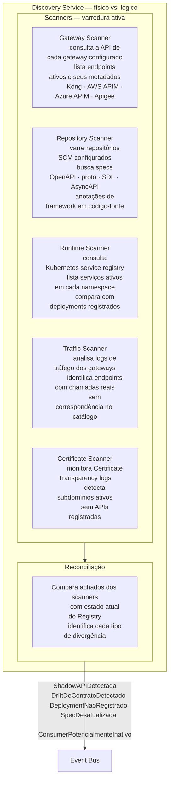
```mermaid
graph TB
    subgraph discovery_svc["Discovery Service — físico vs. lógico"]
        direction LR

        subgraph scanners["Scanners — varredura ativa"]
            s1["Gateway Scanner
            consulta a API de cada gateway configurado
            lista endpoints ativos e seus metadados
            Kong · AWS APIM · Azure APIM · Apigee"]

            s2["Repository Scanner
            varre repositórios SCM configurados
            busca specs OpenAPI · proto · SDL · AsyncAPI
            anotações de framework em código-fonte"]

            s3["Runtime Scanner
            consulta Kubernetes service registry
            lista serviços ativos em cada namespace
            compara com deployments registrados"]

            s4["Traffic Scanner
            analisa logs de tráfego dos gateways
            identifica endpoints com chamadas reais
            sem correspondência no catálogo"]

            s5["Certificate Scanner
            monitora Certificate Transparency logs
            detecta subdomínios ativos
            sem APIs registradas"]
        end

        subgraph reconciliation_svc["Reconciliação"]
            r1["Compara achados dos scanners
            com estado atual do Registry
            identifica cada tipo de divergência"]
        end

        scanners --> reconciliation_svc
    end

    bus2["Event Bus"]

    reconciliation_svc -->|"ShadowAPIDetectada
    DriftDeContratoDetectado
    DeploymentNaoRegistrado
    SpecDesatualizada
    ConsumerPotencialmenteInativo"| bus2
```

**O que cada divergência significa:**

- **ShadowAPIDetectada** — endpoint com tráfego real ou ativo no gateway mas ausente no Registry. É o problema mais crítico — uma API sem governança.
- **DriftDeContratoDetectado** — API registrada com spec v2 mas gateway servindo comportamento divergente da spec. O físico e o lógico não batem.
- **DeploymentNaoRegistrado** — serviço ativo no Kubernetes mas sem deployment correspondente no Registry.
- **SpecDesatualizada** — o repositório tem uma versão mais recente da spec do que o Registry tem registrado.
- **ConsumerPotencialmenteInativo** — consumer registrado no Registry mas sem chamadas detectadas nos últimos N dias.

**O Discovery não decide — ele reporta.** A reconciliação é responsabilidade do CoE — o Discovery publica os eventos, o Registry os registra, o Console os exibe, e um humano decide o que fazer com cada divergência.

---

## 7.2.4 · A camada analítica — separação OLTP e OLAP

A separação entre a camada transacional e a analítica não é otimização — é requisito arquitetural. Uma query que agrega compliance score de 500 APIs ao longo de 12 meses não pode competir com a escrita de um gate de pipeline por recursos de banco de dados.

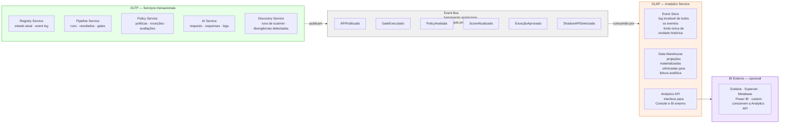
```mermaid
graph LR
    subgraph oltp["OLTP — Serviços transacionais"]
        direction TB
        ot1["Registry Service
        estado atual · event log"]
        ot2["Pipeline Service
        runs · resultados · gates"]
        ot3["Policy Service
        políticas · exceções · avaliações"]
        ot4["AI Service
        requests · responses · logs"]
        ot5["Discovery Service
        runs de scanner · divergências detectadas"]
    end

    subgraph bus["Event Bus
    barramento assíncrono
    desacopla produção de consumo"]
        direction TB
        ev1["APIPublicada"]
        ev2["GateExecutado"]
        ev3["PolicyAvaliada"]
        ev4["ScoreAtualizado"]
        ev5["ExceçãoAprovada"]
        ev6["ShadowAPIDetectada"]
    end

    subgraph olap["OLAP — Analytics Service"]
        direction TB
        ol1["Event Store
        log imutável de todos os eventos
        fonte única de verdade histórica"]
        ol2["Data Warehouse
        projeções materializadas
        otimizadas para leitura analítica"]
        ol3["Analytics API
        interface para Console e BI externo"]
    end

    subgraph bi["BI Externo — opcional"]
        bi1["Grafana · Superset · Metabase
        Power BI · custom
        consomem a Analytics API"]
    end

    oltp -->|"publicam"| bus
    bus -->|"consumido por"| olap
    ol3 --> bi

    style oltp fill:#e6ffe6,stroke:#009900
    style bus fill:#f0f0f0,stroke:#666666
    style olap fill:#fff0e6,stroke:#cc6600
    style bi fill:#f0e6ff,stroke:#6600cc
```

---

## 7.2.5 · O CLI em detalhe

O CLI é o artefato que conecta a plataforma ao fluxo de trabalho diário do desenvolvedor — tanto localmente quanto na esteira de CI/CD.

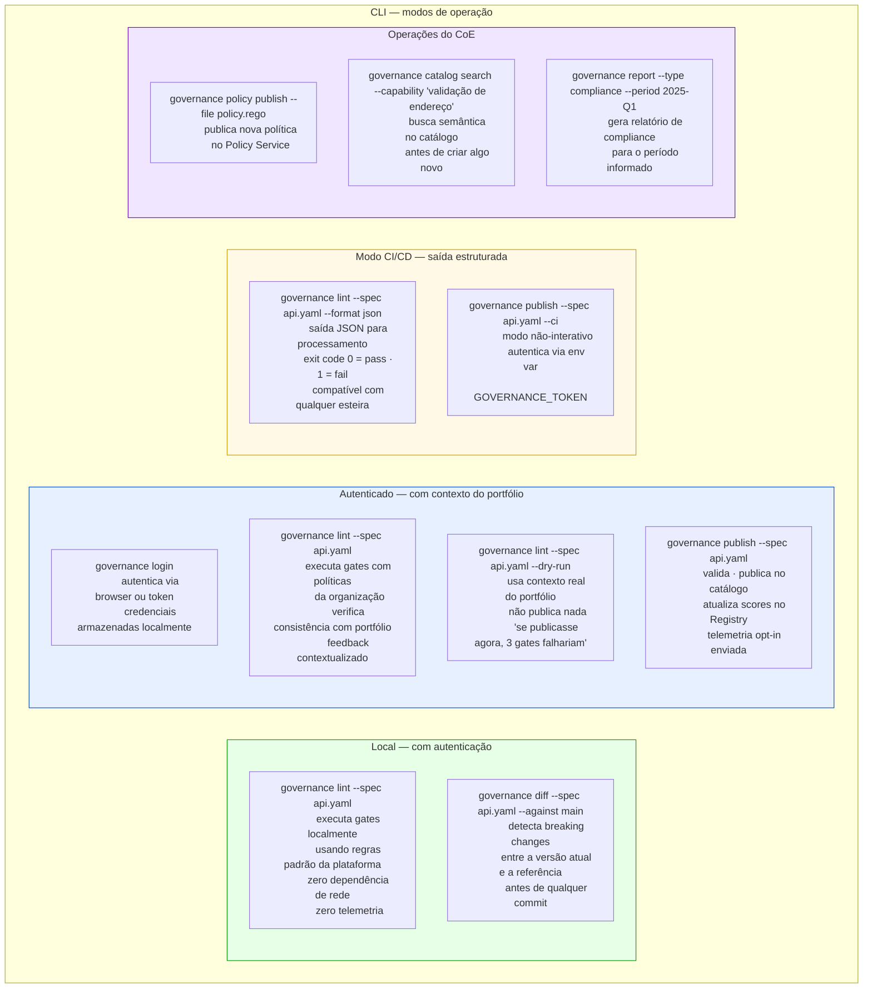
```mermaid
graph TB
    subgraph cli_detail["CLI — modos de operação"]
        direction LR

        subgraph local["Local — com autenticação"]
            l1["governance lint --spec api.yaml
            executa gates localmente
            usando regras padrão da plataforma
            zero dependência de rede
            zero telemetria"]

            l2["governance diff --spec api.yaml --against main
            detecta breaking changes
            entre a versão atual e a referência
            antes de qualquer commit"]
        end

        subgraph autenticado["Autenticado — com contexto do portfólio"]
            a1["governance login
            autentica via browser ou token
            credenciais armazenadas localmente"]

            a2["governance lint --spec api.yaml
            executa gates com políticas
            da organização
            verifica consistência com portfólio
            feedback contextualizado"]

            a3["governance lint --spec api.yaml --dry-run
            usa contexto real do portfólio
            não publica nada
            'se publicasse agora, 3 gates falhariam'"]

            a4["governance publish --spec api.yaml
            valida · publica no catálogo
            atualiza scores no Registry
            telemetria opt-in enviada"]
        end

        subgraph ci_mode["Modo CI/CD — saída estruturada"]
            ci1["governance lint --spec api.yaml --format json
            saída JSON para processamento
            exit code 0 = pass · 1 = fail
            compatível com qualquer esteira"]

            ci2["governance publish --spec api.yaml --ci
            modo não-interativo
            autentica via env var
            GOVERNANCE_TOKEN"]
        end

        subgraph admin["Operações do CoE"]
            ad1["governance policy publish --file policy.rego
            publica nova política
            no Policy Service"]

            ad2["governance catalog search --capability 'validação de endereço'
            busca semântica no catálogo
            antes de criar algo novo"]

            ad3["governance report --type compliance --period 2025-Q1
            gera relatório de compliance
            para o período informado"]
        end
    end

    style local fill:#e6ffe6,stroke:#009900
    style autenticado fill:#e6f0ff,stroke:#0044cc
    style ci_mode fill:#fff9e6,stroke:#cc9900
    style admin fill:#f0e6ff,stroke:#6600cc
```

---

### O dry-run como ferramenta de adoção

O dry-run autenticado é o mecanismo que mais reduz fricção de adoção. O desenvolvedor não precisa esperar o pipeline para saber se sua API vai passar nos gates — consegue o feedback completo, com as políticas reais da organização, antes de qualquer commit. O loop de feedback vai de minutos para segundos.

---

## 7.2.6 · O modelo de integração

A plataforma integra com o ecossistema existente do cliente via adaptadores — sem exigir que o cliente abandone nada. Os adaptadores têm dois modos distintos de operação: **passivos**, que respondem a eventos externos, e **ativos**, que são acionados pelo Discovery Service para varrer sistemas externos periodicamente.

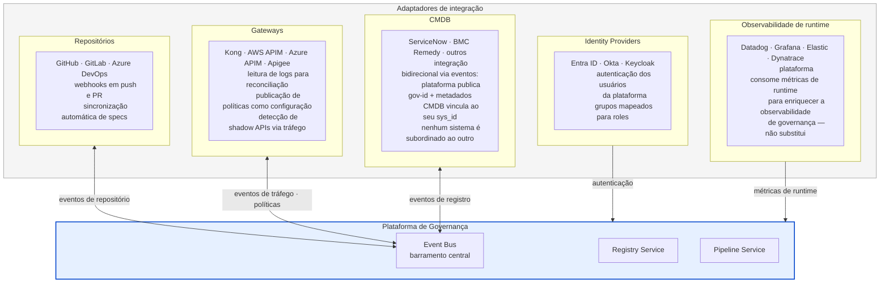
```mermaid
graph TB
    subgraph plataforma_core["Plataforma de Governança"]
        eb["Event Bus
        barramento central"]
        registry_ref["Registry Service"]
        pipeline_ref["Pipeline Service"]
    end

    subgraph adaptadores["Adaptadores de integração"]
        direction LR

        subgraph repos["Repositórios"]
            r1["GitHub · GitLab · Azure DevOps
            webhooks em push e PR
            sincronização automática de specs"]
        end

        subgraph gateways["Gateways"]
            g1["Kong · AWS APIM · Azure APIM · Apigee
            leitura de logs para reconciliação
            publicação de políticas como configuração
            detecção de shadow APIs via tráfego"]
        end

        subgraph cmdb_int["CMDB"]
            c1["ServiceNow · BMC Remedy · outros
            integração bidirecional via eventos:
            plataforma publica gov-id + metadados
            CMDB vincula ao seu sys_id
            nenhum sistema é subordinado ao outro"]
        end

        subgraph idp_int["Identity Providers"]
            i1["Entra ID · Okta · Keycloak
            autenticação dos usuários
            da plataforma
            grupos mapeados para roles"]
        end

        subgraph obs_int["Observabilidade de runtime"]
            o1["Datadog · Grafana · Elastic · Dynatrace
            plataforma consome métricas de runtime
            para enriquecer a observabilidade
            de governança — não substitui"]
        end
    end

    repos <-->|"eventos de repositório"| eb
    gateways <-->|"eventos de tráfego · políticas"| eb
    cmdb_int <-->|"eventos de registro"| eb
    idp_int -->|"autenticação"| plataforma_core
    obs_int -->|"métricas de runtime"| plataforma_core

    style plataforma_core fill:#e6f0ff,stroke:#0044cc,stroke-width:2px
    style adaptadores fill:#f5f5f5,stroke:#999999
```

---

### A integração com CMDB — o problema do ovo e da galinha resolvido

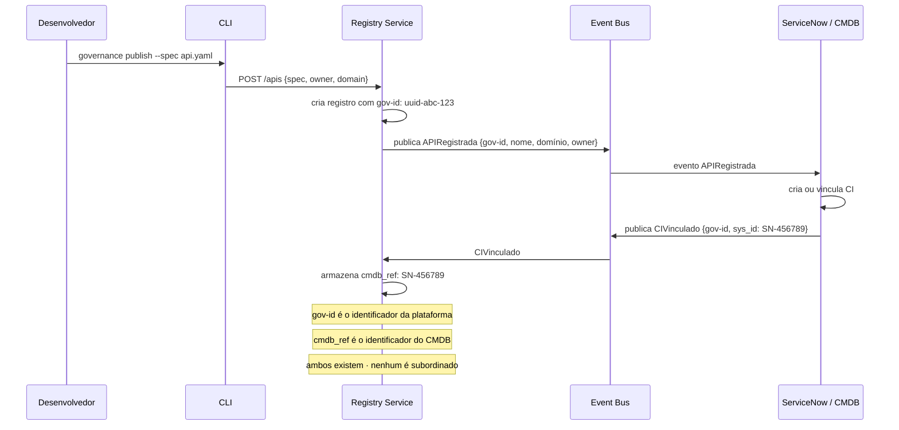
```mermaid
sequenceDiagram
    participant Dev as Desenvolvedor
    participant CLI as CLI
    participant Registry as Registry Service
    participant Bus as Event Bus
    participant CMDB as ServiceNow / CMDB

    Dev->>CLI: governance publish --spec api.yaml
    CLI->>Registry: POST /apis {spec, owner, domain}
    Registry->>Registry: cria registro com gov-id: uuid-abc-123
    Registry->>Bus: publica APIRegistrada {gov-id, nome, domínio, owner}

    Bus->>CMDB: evento APIRegistrada
    CMDB->>CMDB: cria ou vincula CI
    CMDB->>Bus: publica CIVinculado {gov-id, sys_id: SN-456789}

    Bus->>Registry: CIVinculado
    Registry->>Registry: armazena cmdb_ref: SN-456789
    Note over Registry: gov-id é o identificador da plataforma
    Note over Registry: cmdb_ref é o identificador do CMDB
    Note over Registry: ambos existem · nenhum é subordinado
```

---

## 7.2.7 · Fluxos principais

### Fluxo 1 — Desenvolvedor publica uma API

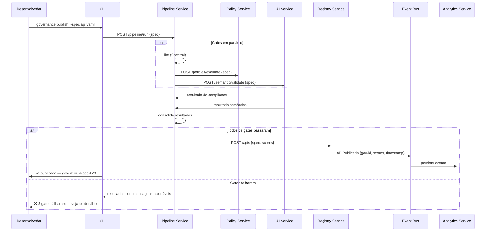
```mermaid
sequenceDiagram
    participant Dev as Desenvolvedor
    participant CLI as CLI
    participant Pipeline as Pipeline Service
    participant Policy as Policy Service
    participant AI as AI Service
    participant Registry as Registry Service
    participant Bus as Event Bus
    participant Analytics as Analytics Service

    Dev->>CLI: governance publish --spec api.yaml
    CLI->>Pipeline: POST /pipeline/run {spec}

    par Gates em paralelo
        Pipeline->>Pipeline: lint (Spectral)
        Pipeline->>Policy: POST /policies/evaluate {spec}
        Pipeline->>AI: POST /semantic/validate {spec}
    end

    Policy->>Pipeline: resultado de compliance
    AI->>Pipeline: resultado semântico
    Pipeline->>Pipeline: consolida resultados

    alt Todos os gates passaram
        Pipeline->>Registry: POST /apis {spec, scores}
        Registry->>Bus: APIPublicada {gov-id, scores, timestamp}
        Bus->>Analytics: persiste evento
        CLI->>Dev: ✅ publicada — gov-id: uuid-abc-123
    else Gates falharam
        Pipeline->>CLI: resultados com mensagens acionáveis
        CLI->>Dev: ❌ 3 gates falharam — veja os detalhes
    end
```

---

### Fluxo 2 — CoE publica uma nova política

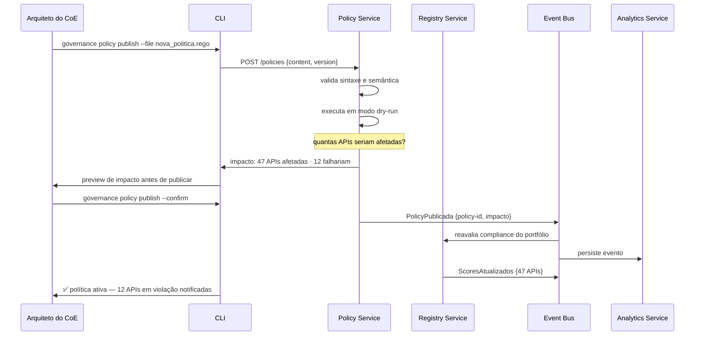
```mermaid
sequenceDiagram
    participant CoE as Arquiteto do CoE
    participant CLI as CLI
    participant Policy as Policy Service
    participant Registry as Registry Service
    participant Bus as Event Bus
    participant Analytics as Analytics Service

    CoE->>CLI: governance policy publish --file nova_politica.rego
    CLI->>Policy: POST /policies {content, version}
    Policy->>Policy: valida sintaxe e semântica
    Policy->>Policy: executa em modo dry-run
    Note over Policy: quantas APIs seriam afetadas?

    Policy->>CLI: impacto: 47 APIs afetadas · 12 falhariam
    CLI->>CoE: preview de impacto antes de publicar

    CoE->>CLI: governance policy publish --confirm
    Policy->>Bus: PolicyPublicada {policy-id, impacto}
    Bus->>Registry: reavalia compliance do portfólio
    Bus->>Analytics: persiste evento
    Registry->>Bus: ScoresAtualizados {47 APIs}
    CLI->>CoE: ✅ política ativa — 12 APIs em violação notificadas
```

## 7.2.8 · Product Analytics — entendendo como a plataforma é usada

A arquitetura de referência inclui uma camada de product analytics que captura o comportamento dos usuários em todos os canais da plataforma. Essa camada é distinta da observabilidade de governança — serve o time de produto da plataforma, não o CoE ou os gestores.

### A distinção entre os dois fluxos analíticos

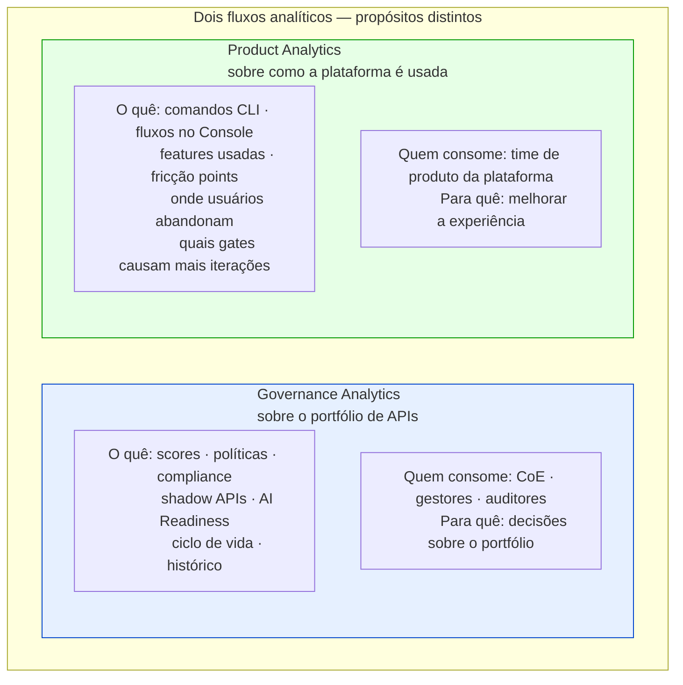
```mermaid
graph TB
    subgraph dois_fluxos["Dois fluxos analíticos — propósitos distintos"]
        direction LR

        subgraph gov["Governance Analytics
        sobre o portfólio de APIs"]
            g1["O quê: scores · políticas · compliance
            shadow APIs · AI Readiness
            ciclo de vida · histórico"]
            g2["Quem consome: CoE · gestores · auditores
            Para quê: decisões sobre o portfólio"]
        end

        subgraph prod["Product Analytics
        sobre como a plataforma é usada"]
            p1["O quê: comandos CLI · fluxos no Console
            features usadas · fricção points
            onde usuários abandonam
            quais gates causam mais iterações"]
            p2["Quem consome: time de produto da plataforma
            Para quê: melhorar a experiência"]
        end
    end

    style gov fill:#e6f0ff,stroke:#0044cc
    style prod fill:#e6ffe6,stroke:#009900
```

---

### Coleta em todos os canais

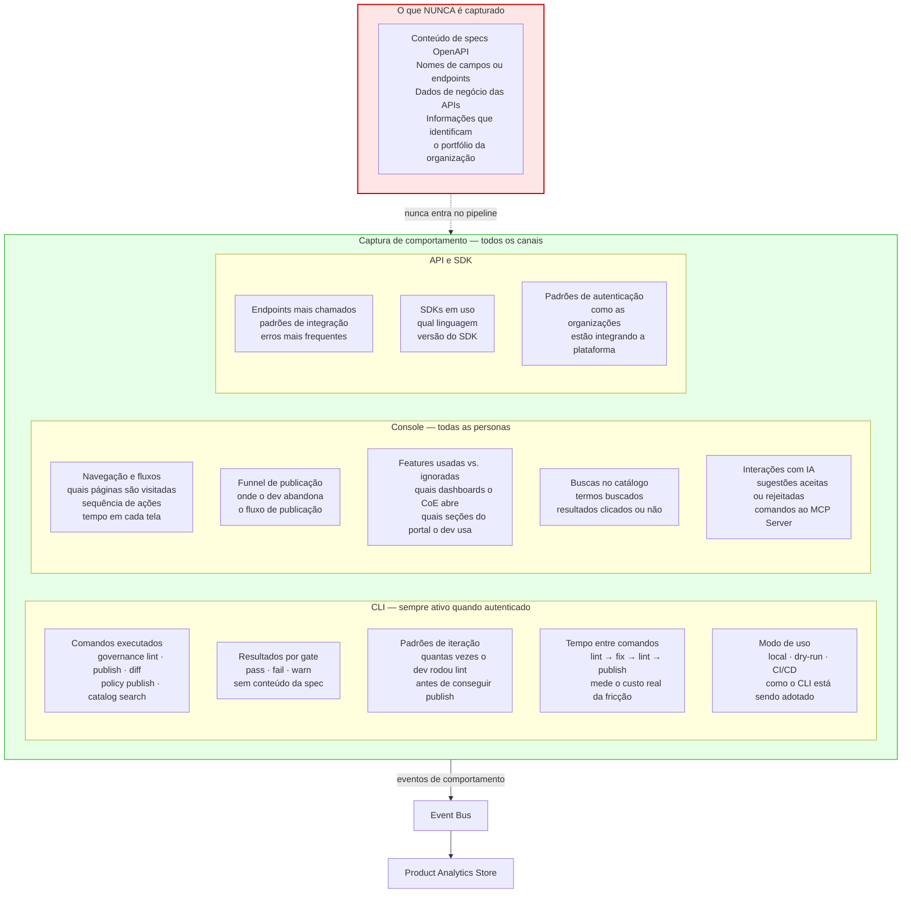
```mermaid
graph TB
    subgraph canais["Captura de comportamento — todos os canais"]
        direction LR

        subgraph cli_capture["CLI — sempre ativo quando autenticado"]
            c1["Comandos executados
            governance lint · publish · diff
            policy publish · catalog search"]
            c2["Resultados por gate
            pass · fail · warn
            sem conteúdo da spec"]
            c3["Padrões de iteração
            quantas vezes o dev rodou lint
            antes de conseguir publish"]
            c4["Tempo entre comandos
            lint → fix → lint → publish
            mede o custo real da fricção"]
            c5["Modo de uso
            local · dry-run · CI/CD
            como o CLI está sendo adotado"]
        end

        subgraph console_capture["Console — todas as personas"]
            co1["Navegação e fluxos
            quais páginas são visitadas
            sequência de ações
            tempo em cada tela"]
            co2["Funnel de publicação
            onde o dev abandona
            o fluxo de publicação"]
            co3["Features usadas vs. ignoradas
            quais dashboards o CoE abre
            quais seções do portal o dev usa"]
            co4["Buscas no catálogo
            termos buscados
            resultados clicados ou não"]
            co5["Interações com IA
            sugestões aceitas ou rejeitadas
            comandos ao MCP Server"]
        end

        subgraph api_capture["API e SDK"]
            a1["Endpoints mais chamados
            padrões de integração
            erros mais frequentes"]
            a2["SDKs em uso
            qual linguagem
            versão do SDK"]
            a3["Padrões de autenticação
            como as organizações
            estão integrando a plataforma"]
        end
    end

    subgraph o_que_nunca["O que NUNCA é capturado"]
        n1["Conteúdo de specs OpenAPI
        Nomes de campos ou endpoints
        Dados de negócio das APIs
        Informações que identificam
        o portfólio da organização"]
    end

    canais -->|"eventos de comportamento"| eventbus3["Event Bus"]
    eventbus3 --> product_store["Product Analytics Store"]
    o_que_nunca -.->|"nunca entra no pipeline"| canais

    style canais fill:#e6ffe6,stroke:#009900
    style o_que_nunca fill:#ffe6e6,stroke:#cc0000,stroke-width:2px
```

---

### O Analytics Service completo — dois sub-sistemas

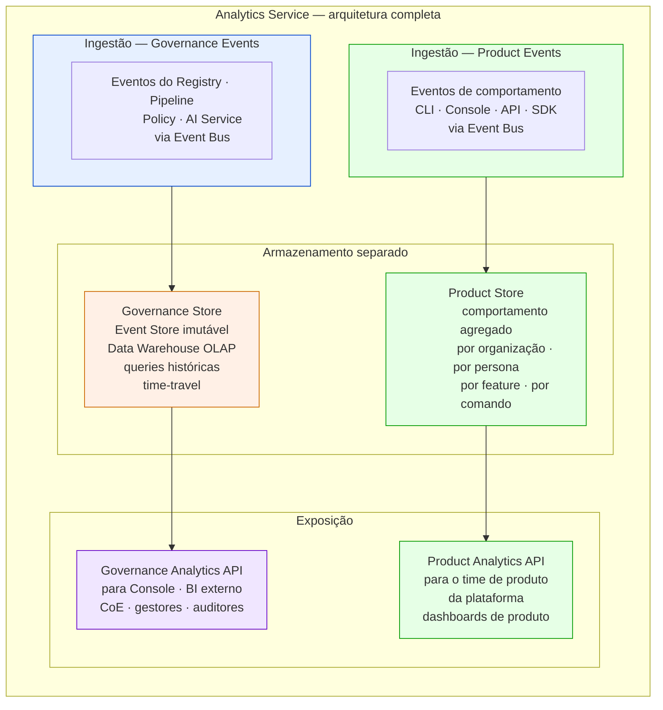
```mermaid
graph TB
    subgraph analytics_completo["Analytics Service — arquitetura completa"]
        direction TB

        subgraph ingestao_gov["Ingestão — Governance Events"]
            ig1["Eventos do Registry · Pipeline
            Policy · AI Service
            via Event Bus"]
        end

        subgraph ingestao_prod["Ingestão — Product Events"]
            ip1["Eventos de comportamento
            CLI · Console · API · SDK
            via Event Bus"]
        end

        subgraph storage["Armazenamento separado"]
            sg["Governance Store
            Event Store imutável
            Data Warehouse OLAP
            queries históricas
            time-travel"]

            sp["Product Store
            comportamento agregado
            por organização · por persona
            por feature · por comando"]
        end

        subgraph exposicao_completa["Exposição"]
            exp_gov["Governance Analytics API
            para Console · BI externo
            CoE · gestores · auditores"]

            exp_prod["Product Analytics API
            para o time de produto
            da plataforma
            dashboards de produto"]
        end

        ingestao_gov --> sg
        ingestao_prod --> sp
        sg --> exp_gov
        sp --> exp_prod
    end

    style ingestao_gov fill:#e6f0ff,stroke:#0044cc
    style ingestao_prod fill:#e6ffe6,stroke:#009900
    style sg fill:#fff0e6,stroke:#cc6600
    style sp fill:#e6ffe6,stroke:#009900
    style exp_gov fill:#f0e6ff,stroke:#6600cc
    style exp_prod fill:#e6ffe6,stroke:#009900
```

---

### O que product analytics revela

Com captura em todos os canais, o time de produto consegue responder perguntas que antes eram impossíveis sem esse dado:

**Sobre o CLI:**
- Qual gate tem a maior taxa de abandono? — o dev viu o erro e parou de tentar
- Qual é o número médio de iterações lint → publish? — mede o custo real da fricção
- O dry-run está reduzindo iterações subsequentes? — valida o valor da feature
- Quais organizações têm developers com maior fricção? — candidatas a suporte proativo

**Sobre o Console:**
- Onde no funnel de publicação os desenvolvedores abandonam?
- Quais dashboards o CoE nunca abre? — features potencialmente desnecessárias
- As sugestões do assistente de IA estão sendo aceitas? — valida a qualidade das sugestões

**Sobre a plataforma como um todo:**
- Quais features têm adoção baixa mas fricção alta? — candidatas a redesign
- Qual é o tempo médio de onboarding — primeira autenticação a primeira publicação?
- Quais organizações estão usando a plataforma de forma mais madura? — casos de sucesso para documentar

---

## Requisitos derivados

| # | Requisito | Origem |
|---|---|---|
| R-7.2.1 | Os seis serviços são deployáveis independentemente como containers | Arquitetura de serviços |
| R-7.2.2 | Cada serviço tem seu próprio armazenamento — sem banco de dados compartilhado entre serviços | Boundary de serviços |
| R-7.2.3 | Toda mudança de estado no Registry Service é armazenada como evento imutável — sem sobrescrita | Event sourcing |
| R-7.2.4 | O Analytics Service nunca escreve nos bancos de dados dos serviços transacionais | Separação OLTP/OLAP |
| R-7.2.5 | O CLI deve funcionar com autenticação para operações de validação local | Adoção sem fricção |
| R-7.2.6 | O CLI deve suportar dry-run autenticado — usa contexto do portfólio sem publicar | Feedback local |
| R-7.2.7 | O modelo de LLM do AI Service é plugável — local, da organização ou externo via API | Neutralidade de modelo |
| R-7.2.8 | A integração com CMDB é bidirecional via eventos — nenhum sistema é subordinado ao outro | CMDB integration |
| R-7.2.9 | Toda nova política publicada deve gerar um preview de impacto antes de ser ativada | Prevenção de disrupção |
| R-7.2.10 | A plataforma deve suportar integração com ferramentas de BI externas via Analytics API | Dados como produto |
| R-7.2.11 | Os adaptadores de integração são plugáveis — a plataforma define as interfaces, o adaptador implementa | Extensibilidade |
| R-7.2.12 | O CLI deve capturar eventos de comportamento em todas as operações autenticadas — nunca conteúdo de specs | Product analytics |
| R-7.2.13 | O Console deve capturar eventos de navegação, fluxos e interações com IA em todas as sessões | Product analytics |
| R-7.2.14 | A coleta de dados de comportamento é sempre ativa em todos os canais autenticados | Product analytics |
| R-7.2.15 | Governance Analytics e Product Analytics são armazenados separadamente com consumidores distintos | Separação de propósito |
| R-7.2.16 | Nenhum evento de produto deve conter conteúdo de specs, nomes de campos ou dados de negócio | Privacidade |
| R-7.2.17 | O Discovery Service executa varreduras de forma independente dos outros serviços — via adaptadores ativos configuráveis | Discovery |
| R-7.2.18 | O Discovery Service apenas publica eventos de divergência — nunca escreve diretamente no Registry | Separação de responsabilidades |
| R-7.2.19 | Cada scanner do Discovery Service é habilitável e configurável independentemente | Flexibilidade de implantação |

---

## Próximo capítulo

**7.3 · O Registry Service — o coração da plataforma** — o modelo de dados em profundidade, o event sourcing aplicado ao registro de governança e a API do catálogo.

---

*Série: Gerenciamento e Governança de APIs · Módulo 7 · Capítulo 7.2*

---