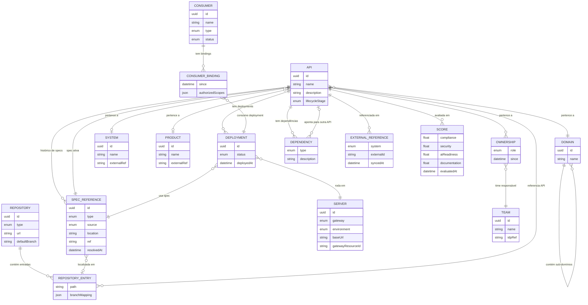
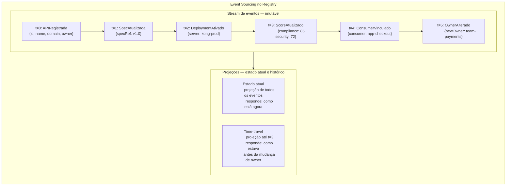
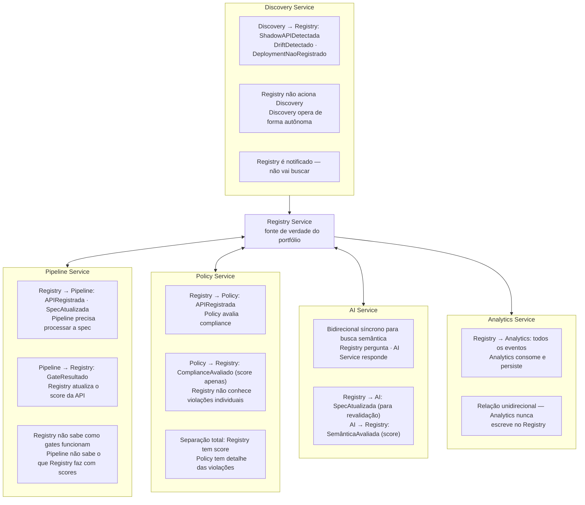

# Módulo 7 · A Plataforma de Governança
## Capítulo 7.3 · O Registry Service — o coração da plataforma

> **Série:** Gerenciamento e Governança de APIs
> **Nível:** Técnico — especificação de serviço
> **Pré-requisito:** Cap 7.2

---

## Sumário

- [7.3.1 · Responsabilidade e limites](#731--responsabilidade-e-limites)
- [7.3.2 · O modelo de domínio](#732--o-modelo-de-domínio)
- [7.3.3 · As entidades em detalhe](#733--as-entidades-em-detalhe)
- [7.3.4 · Event sourcing — o estoque lógico com memória](#734--event-sourcing--o-estoque-lógico-com-memória)
- [7.3.5 · O catálogo de eventos](#735--o-catálogo-de-eventos)
- [7.3.6 · As queries de governança](#736--as-queries-de-governança)
- [7.3.7 · O context map](#737--o-context-map)
- [7.3.8 · A API do Registry](#738--a-api-do-registry)
- [Requisitos derivados](#requisitos-derivados)

---

## 7.3.1 · Responsabilidade e limites

O Registry Service tem uma responsabilidade única e não compartilhada: **ser a fonte de verdade sobre o estado de governança do portfólio de APIs**.

Ele sabe o que existe, quem é dono, onde está deployado, em qual estágio do ciclo de vida se encontra, qual contrato expõe, quem o consome e como está avaliado em cada dimensão de qualidade.

O que o Registry **não** faz — e é tão importante quanto o que faz:

- Não executa gates de qualidade — isso é do Pipeline Service
- Não avalia políticas — isso é do Policy Service
- Não faz análise semântica — isso é do AI Service
- Não vai buscar o que existe na infraestrutura real — isso é do Discovery Service
- Não armazena histórico analítico de longo prazo — isso é do Analytics Service

O Registry é notificado sobre o mundo — não vai ao mundo buscar. Recebe eventos dos outros serviços e atualiza seu estado. Publica eventos quando seu estado muda. É o árbitro do estado declarado — não do estado real.

---

## 7.3.2 · O modelo de domínio



---

## 7.3.3 · As entidades em detalhe

### API — o aggregate raiz

A entidade central em torno da qual tudo orbita. Uma API não é um endpoint técnico — é um contrato de negócio que tem dono, tem propósito, tem história e tem consumidores.

```
API {
  id:             UUID gerado pela plataforma
  name:           nome canônico único no domínio
  description:    propósito em linguagem natural
  lifecycleStage: conception | development | production
                  deprecated | sunset

  domain:         → Domain      (obrigatório)
  system:         → System      (opcional — referência leve)
  product:        → Product     (opcional — referência leve)

  activeSpec:     → SpecReference
  specHistory:    [SpecReference] (imutável — append only)

  deployments:    [Deployment]
  owners:         [Ownership]
  scores:         [Score]       (último score por dimensão)
  dependencies:   [Dependency]
  externalRefs:   [ExternalReference]
}
```

**Invariantes do aggregate API:**
- Não pode transitar para `production` sem pelo menos um `Ownership` com role `technical_owner`
- Não pode transitar para `sunset` enquanto há `ConsumerBinding` ativos em deployments de produção
- Não pode ter dois `Deployment` com o mesmo `Server` e status `active` simultaneamente

---

### SpecReference — onde o contrato vive

A plataforma não armazena o conteúdo da spec — armazena **onde ela está** e **como acessá-la**. O conteúdo vive no repositório ou no artifact store da organização.

```
SpecReference {
  id
  type:        openapi | graphql | grpc | asyncapi | mcp
  source:      git | artifactory | s3 | url
  location:    o endereço — URL do repositório, bucket S3, etc.
  ref:         branch | tag | commit SHA | artifact version
               o que determina qual versão exata é esta spec
  resolvedAt:  quando a plataforma fez o último fetch para processar
}
```

O `type` é o que determina como os outros serviços processam a spec:
- Pipeline Service seleciona os gates corretos por type
- AI Service usa o parser correto por type
- Console renderiza a documentação no formato adequado

---

### Repository — o repositório que contém as specs

```
Repository {
  id
  type:          github | gitlab | azure-devops | bitbucket
                 artifactory | s3 | generic-url
  url:           https://github.com/org/repo
  defaultBranch: main

  entries: [RepositoryEntry] {
    path:          /specs/pedidos-api.yaml
    apiRef:        → API
    branchMapping: {
      main:         production
      develop:      development
      "release/*":  staging
      "feature/*":  experimental
    }
  }
}
```

Um repositório contém muitas APIs — monorepo. O `branchMapping` é o que conecta o gitflow ao lifecycle de governança: quando uma spec no branch `main` muda, a plataforma sabe que é uma mudança de produção.

---

### Deployment — a versão rodando em algum lugar

```
Deployment {
  id
  api:         → API
  specRef:     → SpecReference   qual versão do contrato
  server:      → Server          onde está rodando
  status:      active | deprecated | inactive
  deployedAt:  timestamp
}
```

A pergunta "esta API tem breaking changes que afetam consumidores em produção?" é respondida atravessando: `API → Deployments[status=active, server.environment=production] → ConsumerBindings → Consumer`.

---

### Consumer — quem consome, de que tipo

```
Consumer {
  id
  name
  type:    application | developer | agent | mcp_server
  status:  active | suspended | revoked
  team:    → Team

  profile: ConsumerProfile    atributos específicos por type
    application  → clientId, techStack
    developer    → idpRef
    agent        → purpose, identityType, maxScopes
    mcp_server   → toolsExposed, apisEncapsulated
}
```

O `type` é um discriminador — não cria entidades separadas. Agent e MCP Server são tipos de Consumer com atributos adicionais no profile. A governança específica de agentes (do Módulo 6) é implementada nos serviços corretos — o Registry apenas registra o tipo e o profile.

---

### Domain, System, Product — agrupamentos sem governança própria

```
Domain {
  id, name
  parent: → Domain    (sub-domínios)
}

System {
  id, name
  externalRef: link para onde o sistema é governado
               (CMDB sys_id, ServiceNow reference)
}

Product {
  id, name
  externalRef: link para onde o produto é gerido
               (Jira, ProductBoard, etc.)
}
```

Nenhum dos três tem lifecycle próprio na plataforma. São agrupamentos que a plataforma usa para organizar e agregar — a governança de cada um vive fora da plataforma.

---

## 7.3.4 · Event sourcing — o estoque lógico com memória

O Registry usa event sourcing: **cada mudança de estado é armazenada como um evento imutável**, não como uma sobrescrita. O estado atual de uma entidade é a projeção de todos os seus eventos desde a criação.



**O que event sourcing resolve para o Registry:**

**Auditoria completa de graça** — quem mudou o quê, quando e a partir de qual evento. Não há tabela de auditoria separada que alguém pode esquecer de alimentar — a auditoria é o próprio modelo de dados.

**Time-travel queries** — "como estava o portfólio em 15 de março?" é uma query de projeção até aquela data. Para relatórios de auditoria regulatória — "mostre o estado do portfólio no dia da auditoria" — isso é inestimável.

**Reconstrução de estado** — se uma projeção é corrompida, ela pode ser reconstruída a partir do stream de eventos sem perda de dados.

---

## 7.3.5 · O catálogo de eventos

Os eventos que o Registry publica — e quem os consome:

| Evento | Produzido quando | Consumido por |
|---|---|---|
| `APIRegistrada` | Nova API adicionada ao Registry | Pipeline · Policy · Analytics |
| `SpecAtualizada` | Nova versão de spec registrada | Pipeline · AI Service · Analytics |
| `DeploymentAtivado` | API deployada em um servidor | Analytics · Adaptador CMDB |
| `DeploymentDepreciado` | Deployment marcado como deprecated | Analytics · Consumidores notificados |
| `OwnerAlterado` | Owner de uma API mudou | Analytics |
| `ScoreAtualizado` | Score de qualidade recalculado | Analytics · Alertas |
| `ConsumerVinculado` | Novo consumer binding criado | Analytics |
| `ConsumerRevogado` | Consumer binding revogado | Analytics · Adaptador Gateway |
| `ShadowAPIRegistrada` | Discovery Service detectou API não catalogada | Analytics · CoE alertado |
| `DriftDetectado` | Estado real diverge do Registry | Analytics · CoE alertado |
| `DependênciaDetectada` | Nova dependência entre APIs mapeada | Analytics |
| `ExternalRefSincronizada` | CMDB confirmou vinculação | Analytics |

Os eventos que o Registry **consome** — de outros serviços:

| Evento | Produzido por | O que Registry faz |
|---|---|---|
| `GateResultado` | Pipeline Service | Atualiza score de qualidade da API |
| `ComplianceAvaliado` | Policy Service | Atualiza score de compliance |
| `SemânticaAvaliada` | AI Service | Atualiza score de documentação |
| `ShadowAPIDetectada` | Discovery Service | Cria registro pendente para triagem |
| `DriftDeContratoDetectado` | Discovery Service | Marca deployment com status divergente |

---

## 7.3.6 · As queries de governança

O Registry não é apenas CRUD. É um sistema de perguntas de governança — as queries que o CoE, o portal e as integrações precisam responder:

### Queries sobre o portfólio

```
APIs em production sem technical_owner
→ APIs em risco de tornar-se shadow

APIs com consumers ativos em deployment deprecated
→ Risco de impacto — consumidores não migraram

APIs sem spec atualizada há mais de 180 dias
→ Possível drift entre o que está documentado e o que roda

Deployments em produção com spec diferente do que
está no branch main do repositório
→ Divergência entre o que foi aprovado e o que está rodando
```

### Queries de impacto

```
Se a API X for depreciada:
→ Quais consumers têm binding ativo em deployments de produção?
→ Quais APIs têm dependency do tipo runtime para a API X?
→ Quais MCP Servers encapsulam a API X como tool?

Se a spec da API X mudar com breaking change:
→ Quais consumers estão no deployment que usa a versão atual?
→ Quais repositórios têm integrações com esta API?
```

### Queries de descoberta

```
Busca semântica: "quais APIs fazem validação de endereço?"
→ Delega ao AI Service que retorna APIs com specs semanticamente similares
→ Resposta inclui spec type · domain · owner · lifecycleStage

Deduplicação: "existe algo parecido com o que estou prestes a construir?"
→ AI Service compara a spec candidata com o portfólio
→ Retorna candidatas a reutilização com score de similaridade

APIs por domínio com score de compliance abaixo de threshold
→ Query composta: domain + scores.compliance < X
```

---

## 7.3.7 · O context map

Como o Registry se relaciona com cada serviço da plataforma:



---

## 7.3.8 · A API do Registry

A API do Registry é o contrato público que todos os outros componentes da plataforma e os clientes externos usam. Seguindo o princípio API First, toda operação é acessível via esta API — sem backdoors.

### Recursos principais

```
/apis
  GET    → lista APIs com filtros (domain, lifecycle, score range)
  POST   → registra nova API

/apis/{id}
  GET    → retorna API com estado atual
  PATCH  → atualiza atributos (nome, descrição, domínio)

/apis/{id}/spec
  GET    → retorna SpecReference ativa
  PUT    → registra nova versão de spec

/apis/{id}/spec/history
  GET    → histórico de specs com timestamps

/apis/{id}/deployments
  GET    → lista deployments da API
  POST   → registra novo deployment

/apis/{id}/consumers
  GET    → lista consumers vinculados via bindings

/apis/{id}/dependencies
  GET    → lista dependências da API
  POST   → registra nova dependência

/apis/{id}/impact
  GET    → análise de impacto — quem seria afetado
           se esta API mudar ou for depreciada

/apis/search
  GET    → busca textual e semântica no catálogo
           parâmetros: q (texto), type, domain, lifecycle
           semântica: delega ao AI Service

/domains
  GET, POST, PATCH

/consumers
  GET, POST

/consumers/{id}/bindings
  GET, POST, DELETE

/repositories
  GET, POST, PATCH

/events
  GET    → stream de eventos com filtros
           para integrações e auditoria
```

### O endpoint de impacto

O endpoint `GET /apis/{id}/impact` é um dos mais importantes — e um dos mais complexos. Responde a pergunta "o que acontece se eu mudar ou deprecar esta API?":

```json
GET /apis/uuid-abc-123/impact?change=deprecation&environment=production

{
  "api": "pedidos-api",
  "change": "deprecation",
  "environment": "production",
  "impact": {
    "consumers": [
      {
        "consumer": "app-checkout",
        "type": "application",
        "team": "team-ecommerce",
        "binding": "v2.1 em kong-prod desde 2024-03-01"
      }
    ],
    "dependentApis": [
      {
        "api": "notificacoes-api",
        "dependencyType": "runtime",
        "description": "chama pedidos-api para obter status"
      }
    ],
    "mcpServers": [
      {
        "server": "mcp-operacoes",
        "tool": "consultar_pedido",
        "owner": "team-operacoes"
      }
    ]
  }
}
```

---

## Requisitos derivados

| # | Requisito | Origem |
|---|---|---|
| R-7.3.1 | O Registry é a única fonte de verdade sobre o estado de governança — nenhum outro serviço mantém estado de portfólio | Responsabilidade única |
| R-7.3.2 | O conteúdo de specs nunca é armazenado no Registry — apenas referências a onde o artefato vive | SpecReference |
| R-7.3.3 | Todo evento produzido pelo Registry é imutável — nenhum evento pode ser modificado após publicação | Event sourcing |
| R-7.3.4 | O Registry deve suportar time-travel queries — reconstruir o estado do portfólio em qualquer ponto no passado | Auditoria regulatória |
| R-7.3.5 | A API do Registry deve expor endpoint de análise de impacto para qualquer API do portfólio | Governance queries |
| R-7.3.6 | A busca semântica delega ao AI Service — o Registry não implementa lógica de similaridade semântica | Context map |
| R-7.3.7 | Uma API não pode transitar para `production` sem `technical_owner` registrado | Invariante |
| R-7.3.8 | Uma API não pode transitar para `sunset` com ConsumerBindings ativos em produção | Invariante |
| R-7.3.9 | O SpecReference.type determina como Pipeline e AI Service processam a spec — suporte mínimo: openapi, graphql, grpc, asyncapi, mcp | Agnóstico a protocolo |
| R-7.3.10 | O Repository suporta branchMapping configurável — cada branch pode mapear para um lifecycle stage | Gitflow |
| R-7.3.11 | Consumer.type é o discriminador que determina o profile — sem entidades separadas para Agent ou MCP Server | Modelo simplificado |

---

## Próximo capítulo

**7.4 · O Pipeline Service** — o motor de validação, os gates configuráveis e como o CLI se integra ao pipeline de governança.

---

*Série: Gerenciamento e Governança de APIs · Módulo 7 · Capítulo 7.3*