# Módulo 7 · A Plataforma de Governança
## Capítulo 7.4 · O Pipeline Service

> **Série:** Gerenciamento e Governança de APIs
> **Nível:** Técnico — especificação de serviço
> **Pré-requisito:** Cap 7.2 · Cap 7.3

---

## Sumário

- [7.4.1 · Responsabilidade e limites](#741--responsabilidade-e-limites)
- [7.4.2 · CI e CD — dois contextos distintos](#742--ci-e-cd--dois-contextos-distintos)
- [7.4.3 · A taxonomia de políticas do pipeline](#743--a-taxonomia-de-políticas-do-pipeline)
- [7.4.4 · O modelo assíncrono](#744--o-modelo-assíncrono)
- [7.4.5 · O spec bundle — resolver antes de enviar](#745--o-spec-bundle--resolver-antes-de-enviar)
- [7.4.6 · Gates platform-side vs. runner-side](#746--gates-platform-side-vs-runner-side)
- [7.4.7 · A interface de gate](#747--a-interface-de-gate)
- [7.4.8 · Environment profiles](#748--environment-profiles)
- [7.4.9 · O fluxo de exceções](#749--o-fluxo-de-exceções)
- [7.4.10 · agctl build — geração de configuração de gateway](#7410--agctl-build--geração-de-configuração-de-gateway)
- [7.4.11 · O ciclo de vida do deployment](#7411--o-ciclo-de-vida-do-deployment)
- [7.4.12 · Como os eventos alimentam o Analytics](#7412--como-os-eventos-alimentam-o-analytics)
- [Requisitos derivados](#requisitos-derivados)

---

## 7.4.1 · Responsabilidade e limites

O Pipeline Service tem uma responsabilidade única: **orquestrar a avaliação de qualidade e compliance de uma API ao longo do seu ciclo de vida**. Recebe specs, distribui avaliações, consolida resultados e publica eventos.

O que o Pipeline Service **não** faz:

- Não define políticas — isso é do Policy Service
- Não implementa lint, SAST ou DAST — ferramentas externas implementam a interface de gate
- Não faz deploy no gateway — o tooling de CD do time faz isso
- Não armazena o histórico analítico — isso é do Analytics Service
- Não acessa diretamente repositórios ou gateways — usa os adaptadores da camada de integração

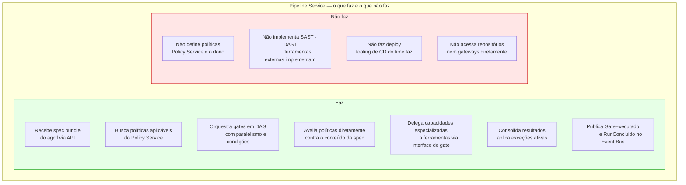

---

## 7.4.2 · CI e CD — dois contextos distintos

A mesma spec pode ser avaliada em dois contextos com propósitos e gates diferentes.

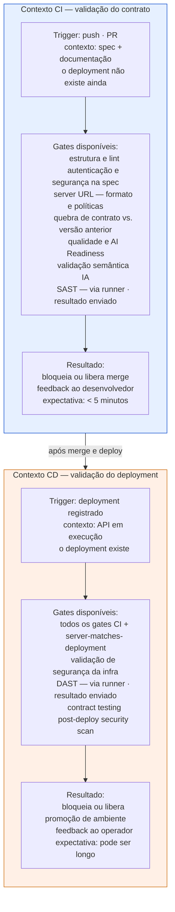

**A regra fundamental:** validar server-matches-deployment ou segurança de infraestrutura em CI é impossível — o deployment não existe ainda. Esses gates são exclusivos do contexto CD.

---

## 7.4.3 · A taxonomia de políticas do pipeline

Políticas vivem no Policy Service. O Pipeline as busca e as avalia — cada categoria com sua lógica de avaliação própria.

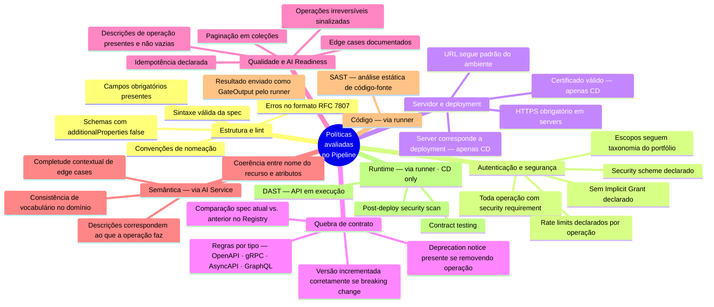

**O princípio que organiza essa taxonomia:** o Policy Service define as regras. O Pipeline decide como avaliá-las — diretamente contra a spec, delegando ao AI Service, ou aguardando resultado do runner.

---

## 7.4.4 · O modelo assíncrono

Gates têm latências muito diferentes — de centésimos de segundo (lint) a dezenas de minutos (DAST). Uma API síncrona geraria timeouts inevitáveis. O modelo correto é **job creation + polling**.

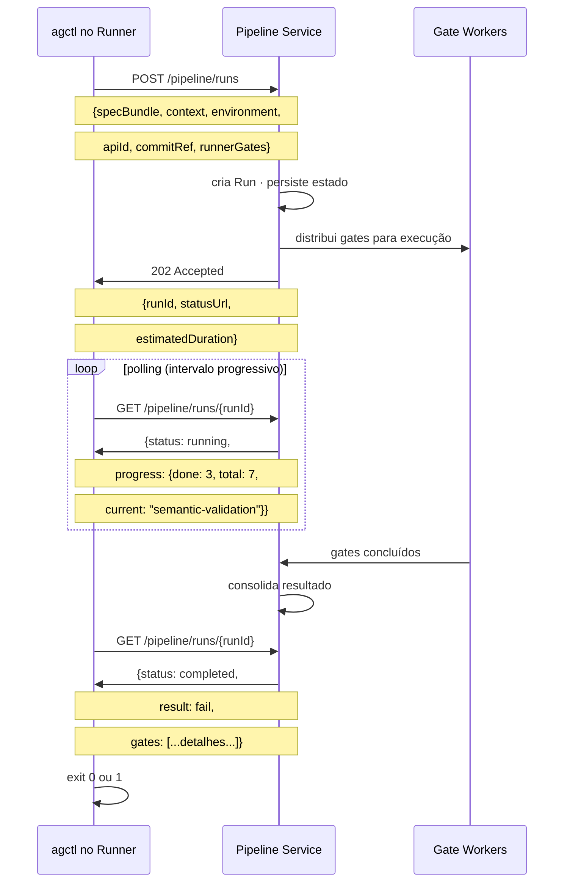

---

### Modos de execução do agctl

```bash
# Modo padrão — polling transparente com barra de progresso
agctl lint --spec api.yaml

✓ estrutura-lint          0.8s
✓ auth-policy             0.6s
✓ breaking-change         1.1s
⟳ semantic-validation     running...
✓ semantic-validation     8.3s
✗ doc-coherence           4.1s — 2 issues encontrados

Run: ❌ failed · run-id: run-abc-123
Ver detalhes: agctl run show run-abc-123

# Modo assíncrono — para pipelines com steps paralelos
agctl lint --spec api.yaml --async
# → RUN_ID=run-abc-123 (exit imediato)

# Em step posterior — aguarda resultado
agctl run wait --id $RUN_ID --timeout 15m

# Modo CI/CD — saída JSON para processamento
agctl lint --spec api.yaml --format json
# exit 0 = pass · exit 1 = fail
# stdout: JSON com detalhes completos
```

---

### Dois mecanismos de notificação — polling e webhook

O Pipeline Service suporta dois mecanismos para entregar o resultado de um run. A escolha depende de quem iniciou o run e se há alguém aguardando ativamente.

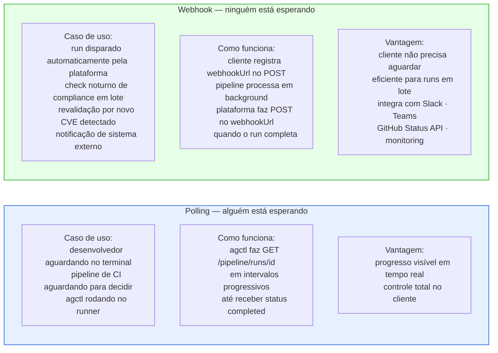

**Polling — o fluxo do agctl:**
```bash
# agctl abstrai o polling — transparente para o desenvolvedor
agctl lint --spec api.yaml
# internamente: POST → runId → GET em loop → exibe progresso → exit
```

**Webhook — o fluxo de sistemas automatizados:**
```json
POST /pipeline/runs
{
  "specBundle": "...",
  "context": "ci",
  "webhookUrl": "https://ci.empresa.com/hooks/agctl/run-complete"
}
→ 202 Accepted {runId}
→ cliente segue com outras tarefas
→ plataforma faz POST no webhookUrl quando termina
```

**Segurança do webhook — o payload é assinado:**
```
POST https://ci.empresa.com/hooks/agctl/run-complete
X-AGCTL-Signature: sha256=<HMAC com secret compartilhado>
X-AGCTL-Run-Id: run-abc-123
X-AGCTL-Timestamp: 1700000000
```
O destinatário verifica o HMAC antes de processar. Mesmo padrão do GitHub, Stripe e Slack.

**Quando usar cada um:**

| Situação | Mecanismo |
|---|---|
| Desenvolvedor aguardando no terminal | Polling — agctl mostra progresso |
| Pipeline de CI decidindo se faz merge | Polling — agctl no runner |
| Run disparado automaticamente pela plataforma | Webhook |
| Notificação para Slack · Teams · monitoring | Webhook |
| Check noturno em lote de muitas APIs | Webhook |
| Revalidação por novo CVE em múltiplas APIs | Webhook |
| DAST longo com steps paralelos no CD | Ambos — `--async` + webhook de backup |

---

## 7.4.5 · O spec bundle — resolver antes de enviar

Specs OpenAPI frequentemente referem a outros arquivos via `$ref`. O agctl resolve essas referências antes de enviar qualquer coisa para a plataforma — gerando um documento único e auto-contido.

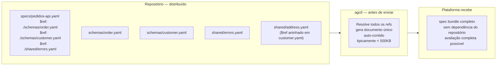

**Por tipo de spec:**
- **OpenAPI**: `$ref` para schemas, paths, components — bundling via `@apidevtools/swagger-parser` ou equivalente
- **gRPC proto**: `import` statements — bundling agrupa todos os .proto referenciados
- **AsyncAPI**: `$ref` para schemas e channels
- **GraphQL SDL**: arquivos de schema separados

O agctl detecta automaticamente o tipo pelo conteúdo ou pela extensão e usa o bundler adequado.

---

## 7.4.6 · Gates platform-side vs. runner-side

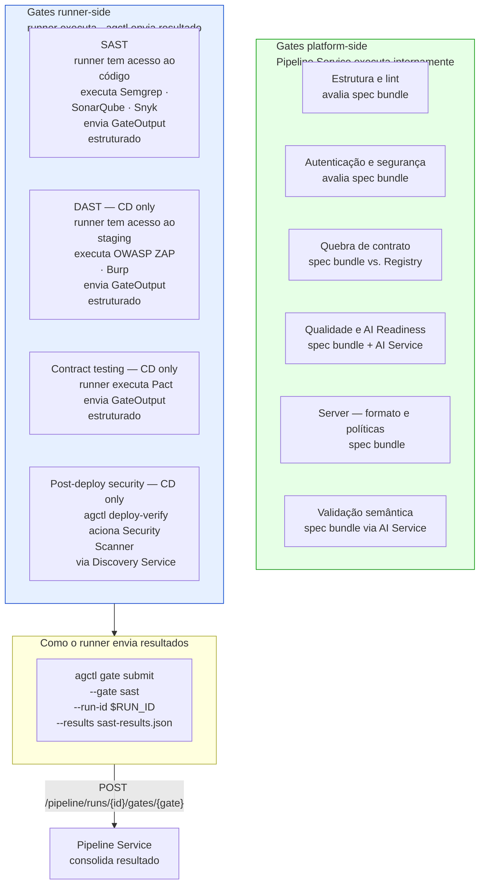

O run fica em `waiting-for-runner-gates` até que todos os runner gates sejam submetidos ou o timeout configurado seja atingido.

---

## 7.4.7 · A interface de gate

Todo gate — seja executado internamente pela plataforma ou por uma ferramenta externa — implementa a mesma interface.

```
GateInput {
  gateId:      string          identificador único do gate
  gateName:    string          nome legível
  specBundle:  string          spec resolvida
  specType:    openapi | graphql | grpc | asyncapi | mcp
  context:     ci | cd
  environment: experimental | development | staging | production
  apiId:       UUID            referência ao Registry
  runId:       UUID            identificador do run
  policies:    [Policy]        políticas aplicáveis a este gate
}

GateOutput {
  gateId:      string
  status:      pass | fail | warn | skip | info
  issues:      [Issue] {
    severity:  block | warn | info
    code:      string          código da política violada
    message:   string          o que está errado
    suggestion:string          como corrigir
    path:      string          onde na spec — ex: paths./pedidos.get.security
  }
  duration:    milliseconds
  metadata:    {}              dados adicionais específicos do gate
}
```

A interface é o contrato. Qualquer ferramenta que produz um `GateOutput` válido pode ser usada como gate. O CoE adiciona um novo gate configurando a ferramenta e mapeando seu output para a interface — sem modificar o Pipeline Service.

---

## 7.4.8 · Environment profiles

O mesmo gate tem comportamentos diferentes dependendo do ambiente de destino. O CoE configura profiles no Policy Service — o Pipeline os aplica automaticamente baseado no ambiente do run.

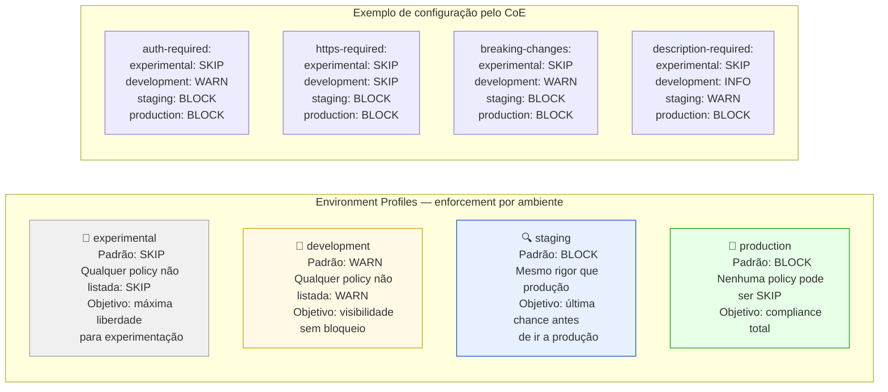

O branchMapping do Repository (Cap 7.3) conecta branches a ambientes — e ambientes a profiles. O desenvolvedor faz push para `feature/nova-ideia` e automaticamente recebe o profile `experimental`. Sem configuração adicional.

---

## 7.4.9 · O fluxo de exceções

Quando um gate falha, o desenvolvedor pode solicitar uma exceção formal. A exceção é **detectada pelo Pipeline, decidida pelo Policy Service**.

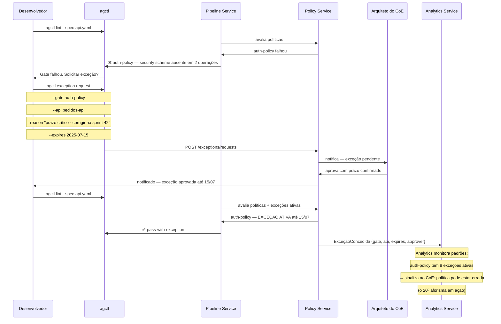

**O que torna a exceção governada:**
- Justificativa obrigatória — o desenvolvedor explica o porquê
- Prazo obrigatório — sem exceções eternas
- Aprovação explícita do CoE — não apenas notificação
- Auditável — aparece no resultado como `pass-with-exception`, não `pass`
- Expiração automática — quando o prazo vence, o gate volta a falhar
- Analytics detecta padrões — muitas exceções para o mesmo gate é sinal de política incorreta

---

## 7.4.10 · agctl build — geração de configuração de gateway

O `agctl build` gera configurações de gateway **derivadas da spec e das políticas do CoE**. A governança que a plataforma define se materializa na configuração que vai ao gateway.

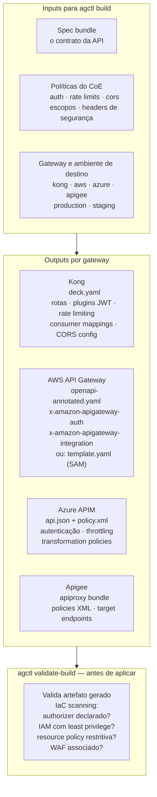

```bash
# Gera artefato para Kong em staging
agctl build --spec api.yaml --gateway kong --environment staging
# output: deck-staging.yaml

# Valida segurança do artefato antes de aplicar
agctl validate-build --artifact deck-staging.yaml --gateway kong

✓ JWT plugin declarado
✓ Rate limiting configurado
✓ CORS restrito às origens aprovadas
✗ mTLS não está configurado — WARN (staging: WARN, production: BLOCK)

# O time aplica com o tooling que já usa
deck apply -s deck-staging.yaml
```

**Por que o agctl build, não o desenvolvedor manualmente:**
Um artefato gerado pelo agctl **garante que as políticas do CoE estão aplicadas**. Um artefato criado manualmente pode divergir — intencionalmente ou por descuido. O mesmo sistema que define as políticas gera a infraestrutura que as implementa.

---

## 7.4.11 · O ciclo de vida do deployment

O Pipeline Service coordena o registro do deployment no Registry via agctl — sem fazer o deploy em si.

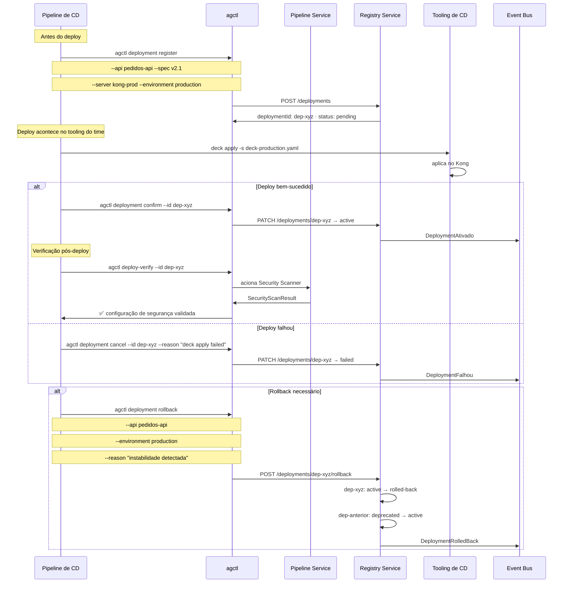

---

## 7.4.12 · Como os eventos alimentam o Analytics

Cada gate executado e cada run concluído produz eventos que o Analytics Service consome para construir inteligência de portfólio.

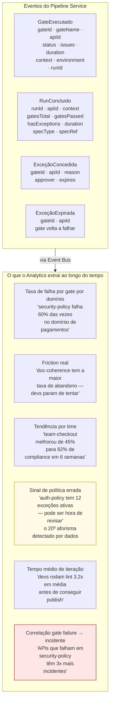

A correlação gate failure → incidente — o último item — é o insight que só aparece depois de meses de dados acumulados. É o que transforma a plataforma de ferramenta de enforcement em sistema de inteligência de governança.

---

## Requisitos derivados

| # | Requisito | Origem |
|---|---|---|
| R-7.4.1 | O Pipeline Service é orquestrador — não implementa lint, SAST, DAST nem define políticas | Responsabilidade única |
| R-7.4.2 | Toda chamada ao Pipeline Service é assíncrona — POST retorna 202 com runId | Modelo assíncrono |
| R-7.4.3 | O agctl executa polling progressivo internamente — transparente para o desenvolvedor | CLI como abstração |
| R-7.4.4 | O agctl bundleia a spec resolvendo todos os refs antes de enviar | Spec bundle |
| R-7.4.5 | O Pipeline Service suporta gates platform-side e runner-side via agctl gate submit | Conectividade |
| R-7.4.6 | Todo gate implementa GateInput/GateOutput — a plataforma não assume nada além dessa interface | Interface de gate |
| R-7.4.7 | Políticas têm enforcement level configurável por ambiente — BLOCK · WARN · SKIP · INFO | Environment profiles |
| R-7.4.8 | Exceções são aprovadas pelo CoE via Policy Service — o Pipeline apenas detecta a necessidade | Separação de responsabilidades |
| R-7.4.9 | Exceções têm prazo obrigatório e expiram automaticamente | Governança de exceções |
| R-7.4.10 | agctl build gera configuração de gateway derivada da spec e das políticas — sem intervenção manual | Build de gateway |
| R-7.4.11 | agctl validate-build valida o artefato gerado antes de qualquer deploy | IaC scanning |
| R-7.4.12 | O ciclo de deployment tem três passos via agctl: register → confirm/cancel → rollback opcional | Ciclo de deployment |
| R-7.4.13 | GateExecutado e RunConcluido são publicados no Event Bus para consumo pelo Analytics Service | Dados como produto |
| R-7.4.14 | O Analytics Service detecta padrões de exceções repetidas e sinaliza políticas candidatas a revisão | O 20º aforisma por dados |

---

## Próximo capítulo

**7.5 · O Policy Service** — o sistema que define, versiona e avalia políticas como código — com o ciclo de vida das políticas e o mecanismo de exceções em profundidade.

---

*Série: Gerenciamento e Governança de APIs · Módulo 7 · Capítulo 7.4*