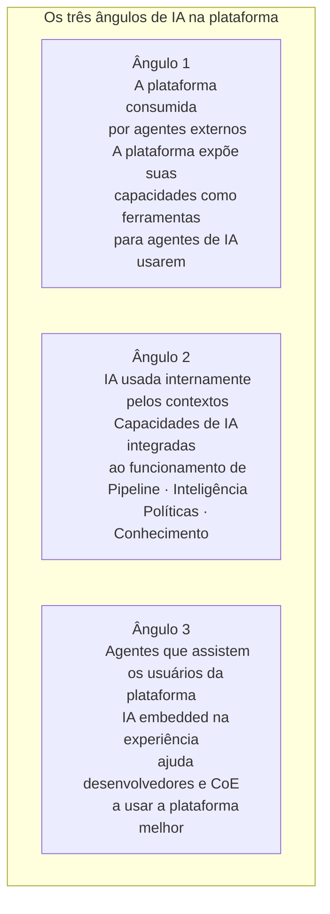
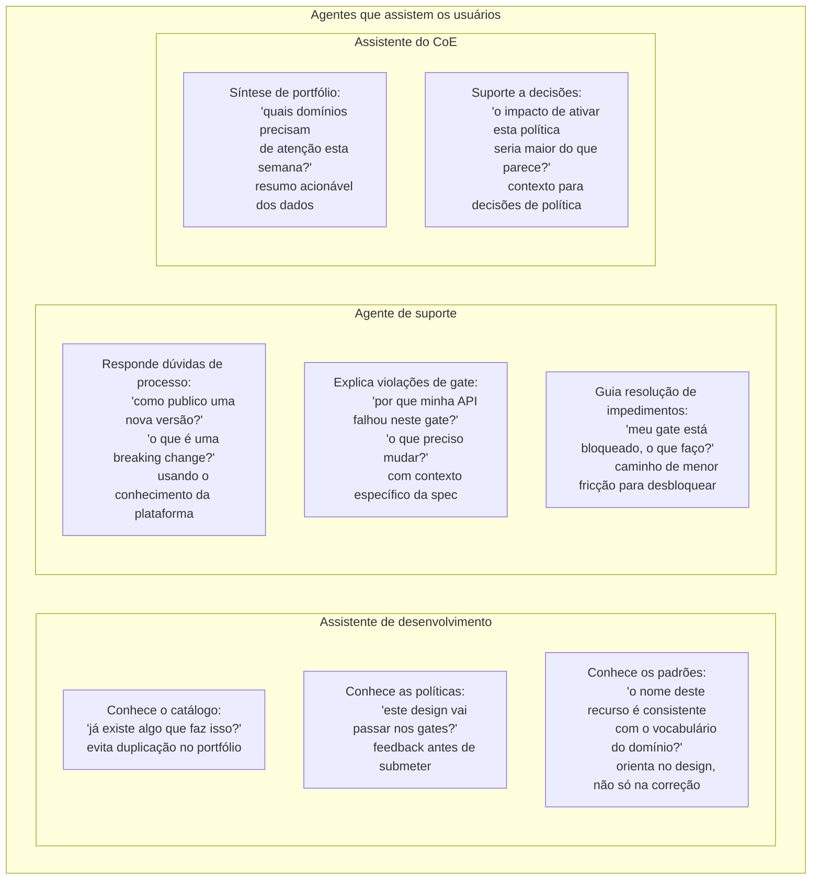

# Módulo 8 · Operacionalizando a Governança de APIs
## Capítulo 8.10 · Assistência inteligente

> **Série:** Gerenciamento e Governança de APIs
> **Nível:** Capacidade — os três ângulos de IA na plataforma
> **Pré-requisito:** Cap 8.2 · Cap 8.9 · Módulo 6

---

## Sumário

- [8.10.1 · Três ângulos distintos](#8101--três-ângulos-distintos)
- [8.10.2 · A plataforma como serviço consumido por agentes](#8102--a-plataforma-como-serviço-consumido-por-agentes)
- [8.10.3 · IA usada pelos contextos internos](#8103--ia-usada-pelos-contextos-internos)
- [8.10.4 · Agentes que assistem os usuários](#8104--agentes-que-assistem-os-usuários)
- [8.10.5 · Princípios para IA em governança](#8105--princípios-para-ia-em-governança)
- [8.10.6 · Desafios comuns](#8106--desafios-comuns)

---

## 8.10.1 · Três ângulos distintos

IA aparece na plataforma de governança de três formas que é importante não confundir — porque cada uma serve um propósito diferente, tem requisitos diferentes e apresenta riscos diferentes.

Os três ângulos coexistem e se complementam — mas são implementados com padrões diferentes, têm audiências diferentes e produzem valor de formas diferentes. Confundi-los leva a expectativas erradas: esperar que um agente externo resolva o problema de assistência ao usuário interno, ou usar IA interna do pipeline para tentar responder perguntas de suporte.

---

## 8.10.2 · A plataforma como serviço consumido por agentes

O MCP Server é a interface pela qual a plataforma se torna parte do ecossistema agêntico — não apenas como objeto de governança (como vimos no Cap 7.10), mas como ferramenta que agentes externos usam para completar tarefas.

Um desenvolvedor que usa um assistente de IA no seu editor de código pode pedir: "verifique se já existe uma API no catálogo que resolve o que estou tentando construir". O assistente consulta o MCP Server da plataforma, recebe a lista de APIs relevantes do catálogo e responde com contexto — sem que o desenvolvedor tenha aberto o portal, sem que tenha feito uma busca manual.

O MCP Server expõe capacidades da plataforma como ferramentas discretas:

| Ferramenta | O que faz | Quem usa |
|---|---|---|
| `buscar_apis` | Busca semântica no catálogo por intenção ou palavras-chave | Agentes de desenvolvimento |
| `verificar_compliance` | Avalia uma spec contra as políticas ativas | Agentes de CI/CD |
| `consultar_politicas` | Retorna as políticas aplicáveis a um contexto | Agentes de arquitetura |
| `obter_score` | Retorna o score de qualidade de uma API específica | Agentes de revisão |
| `consultar_conhecimento` | Busca na base de conhecimento por contexto | Agentes de suporte |
| `listar_divergencias` | Retorna divergências detectadas para um domínio | Agentes de operação |

A plataforma que expõe um MCP Server de qualidade torna-se um componente natural no fluxo de trabalho de desenvolvedores que já usam assistentes de IA — não mais um sistema separado que precisa ser visitado intencionalmente.

---

## 8.10.3 · IA usada pelos contextos internos

Vários contextos da plataforma se beneficiam de capacidades de IA para fazer o que regras determinísticas não conseguem — ou não conseguem com a mesma qualidade.

**Pipeline — validação semântica**

Gates determinísticos verificam se campos obrigatórios existem, se escopos seguem o padrão, se a estrutura está correta. Mas não verificam se o nome de um recurso faz sentido com seus atributos, se a descrição de uma operação corresponde ao que ela realmente faz, ou se o vocabulário usado é consistente com o restante do domínio.

Validação semântica via IA não substitui os gates determinísticos — acrescenta uma camada de verificação que detecta problemas de coerência e clareza que regras fixas não capturam. O resultado é tratado como qualquer outro gate: pass, fail, warn — com a indicação de que foi produzido por análise semântica.

**Inteligência — análise preditiva e síntese**

A inteligência de portfólio alimentada por IA vai além de agregar métricas. Detecta padrões que humanos dificilmente identificariam manualmente: correlações entre características de design e taxas de incidentes, anomalias no comportamento de uso que podem indicar problemas iminentes, tendências de qualidade em domínios específicos antes que se tornem visíveis nos indicadores tradicionais.

A síntese é igualmente valiosa: em vez de apresentar dezenas de métricas ao CoE, um assistente de análise pode formular hipóteses — "o domínio X está acelerando o ritmo de publicações enquanto regride em qualidade de segurança — pode ser útil investigar se a pressão de entrega está impactando o processo de revisão" — que o CoE valida ou descarta.

**Políticas — sugestão baseada em padrões**

O CoE que observa que 40% das violações do portfólio se concentram em três categorias de políticas tem informação para criar políticas mais direcionadas. Um assistente de sugestão de políticas pode ir além: analisar o perfil de violações, identificar padrões que indicam lacunas na cobertura de políticas existentes e propor rascunhos de novas políticas para revisão do CoE.

A sugestão é sempre para revisão humana — não para ativação automática. O CoE mantém o julgamento sobre o que é adequado para o portfólio.

**Conhecimento — recuperação contextual**

A busca semântica na base de conhecimento permite que agentes e o portal recuperem conteúdo relevante não por correspondência de palavras-chave, mas por similaridade de contexto. Uma violação de gate que descreve "security scheme ausente em operações do recurso /pedidos" pode recuperar artigos sobre autenticação mesmo que o artigo não contenha exatamente essas palavras — porque semanticamente é o artigo mais relevante para aquela situação.

---

## 8.10.4 · Agentes que assistem os usuários

O terceiro ângulo — agentes embedded na experiência da plataforma que assistem seus usuários — é o mais próximo do dia a dia de quem usa a plataforma e o que tem potencial de maior impacto na adoção.

### O assistente de desenvolvimento

O assistente de desenvolvimento é o agente com maior potencial de impacto na adoção da governança — porque atua no momento em que o desenvolvedor está tomando decisões de design, não depois que essas decisões foram tomadas e precisam ser corrigidas.

Um desenvolvedor que recebe feedback no momento do design — "este nome de recurso não é consistente com o vocabulário do domínio de pagamentos" ou "já existe uma API com capacidades similares no catálogo" — incorpora o feedback no artefato que está criando. Um desenvolvedor que recebe esse mesmo feedback após submeter para revisão precisa retornar ao design e refazer trabalho já feito.

A diferença não é apenas de velocidade — é de qualidade. Feedback no momento certo produz um artefato melhor. Feedback tardio produz um artefato corrigido — que é diferente.

### O agente de suporte

O agente de suporte responde perguntas que seriam respondidas por um arquiteto experiente do CoE — se esse arquiteto estivesse disponível, tivesse tempo e a pergunta fosse feita no momento certo. Na prática, desenvolvedores adiam perguntas, tentam resolver sozinhos, abrem tickets que demoram a ser respondidos, ou simplesmente encontram atalhos que evitam o processo.

Um agente de suporte que responde em segundos, no contexto onde o desenvolvedor está trabalhando, com informação específica para a situação — não genérica — reduz esse atrito de forma significativa. Não substitui o CoE em casos complexos — escala os casos simples que não precisam de julgamento humano.

### O assistente do CoE

O CoE gerencia um portfólio de centenas ou milhares de APIs, dezenas de políticas, múltiplas exceções pendentes e dados de qualidade em constante mudança. Sem assistência, sintetizar esse volume de informação para tomar decisões semanais é uma tarefa que consome tempo desproporcional.

Um assistente que sintetiza o estado do portfólio, identifica o que mudou desde a última revisão, destaca o que precisa de atenção e formula perguntas que o CoE deveria estar fazendo — amplifica a capacidade do CoE sem substituir seu julgamento.

---

## 8.10.5 · Princípios para IA em governança

A aplicação de IA em governança requer alguns princípios que não são necessários em outros contextos de uso de IA — porque o domínio de governança tem características específicas que criam riscos específicos.

**IA sugere, humanos decidem em casos com consequências**

Gates semânticos podem recomendar revisão — não bloquear automaticamente baseados em interpretação ambígua. Políticas sugeridas por IA vão para rascunho — não são ativadas automaticamente. Sínteses de portfólio são hipóteses — não diagnósticos definitivos. O julgamento humano é insubstituível onde as consequências de uma decisão errada são significativas.

**Transparência sobre o que é IA e o que é determinístico**

Quando um gate falha por uma regra determinística, o resultado é reproduzível e auditável. Quando falha por análise semântica via IA, o resultado pode variar. Os usuários precisam saber a diferença — para calibrar sua confiança nos resultados e para saber quando questionar.

**Degradação graciosa quando IA não está disponível**

A plataforma precisa funcionar quando os serviços de IA não estão disponíveis. Gates determinísticos continuam operando. Políticas continuam sendo avaliadas. Apenas as camadas de IA ficam indisponíveis — e o usuário sabe que está operando sem elas.

**Dados de governança não alimentam modelos externos**

Dados do portfólio — quais APIs existem, quais violações foram detectadas, quais exceções foram aprovadas — têm sensibilidade organizacional. Qualquer modelo de IA que processa esses dados precisa operar dentro dos limites de soberania de dados que a organização estabeleceu. Isso é especialmente relevante para organizações em setores regulados.

---

## 8.10.6 · Desafios comuns

### IA como substituto de processo, não amplificador

A organização tem um processo de revisão de APIs que demora dias. Em vez de melhorar o processo, decide usar IA para automatizar a revisão. O resultado: revisões automáticas que aprovam o que deveria ser revisado com cuidado e bloqueiam o que deveria passar. A IA foi usada para evitar o trabalho de melhorar o processo — não para amplificar um processo que já funciona.

IA amplifica o que existe. Se o processo de revisão é bom, IA o torna mais rápido e abrangente. Se o processo é ruim, IA o torna mais rápido — e o problema escala.

### Confiança sem calibração

Os resultados de IA são aceitos sem questionamento porque "o sistema disse". Uma violação de gate semântico que é um falso positivo não é questionada porque questionar parece ir contra a plataforma. Uma síntese de portfólio imprecisa orienta decisões do CoE porque veio do sistema.

Confiança em sistemas de IA precisa ser calibrada com experiência real — validando resultados, questionando casos duvidosos, identificando onde o sistema erra sistematicamente. Sem calibração, a confiança é ingenuidade.

### Expectativas desalinhadas

A organização espera que o assistente de desenvolvimento elimine completamente as falhas de gate — que nenhuma API enviada para revisão falhe depois de passar pelo assistente. O assistente não oferece essa garantia — oferece feedback que reduz a probabilidade de falha. A diferença entre "reduz" e "elimina" é a diferença entre expectativa razoável e decepção inevitável.

---

## Pontos-chave do capítulo

- Os três ângulos de IA são distintos: plataforma consumida por agentes externos, IA nos contextos internos e agentes que assistem usuários — cada um com propósito, audiência e riscos diferentes
- O MCP Server torna a plataforma parte do ecossistema agêntico — ferramenta que agentes de desenvolvimento usam sem precisar visitar o portal explicitamente
- IA nos contextos internos adiciona camadas de verificação e síntese que regras determinísticas não oferecem — validação semântica no pipeline, análise preditiva na inteligência, sugestão de políticas
- O assistente de desenvolvimento tem o maior potencial de impacto na adoção — atua no momento do design, quando feedback produz artefatos melhores, não no momento da correção, quando feedback produz artefatos corrigidos
- IA sugere, humanos decidem em casos com consequências — o princípio mais importante para IA em governança
- IA amplifica o que existe — um bom processo fica mais rápido, um processo ruim fica mais rápido ruim

---

## Próximo capítulo

**8.11 · DX e inteligência de produto** — como medir a experiência de usar a plataforma de governança e como dados de produto orientam a evolução da plataforma com base em evidências.

---

*Série: Gerenciamento e Governança de APIs · Módulo 8 · Capítulo 8.10*