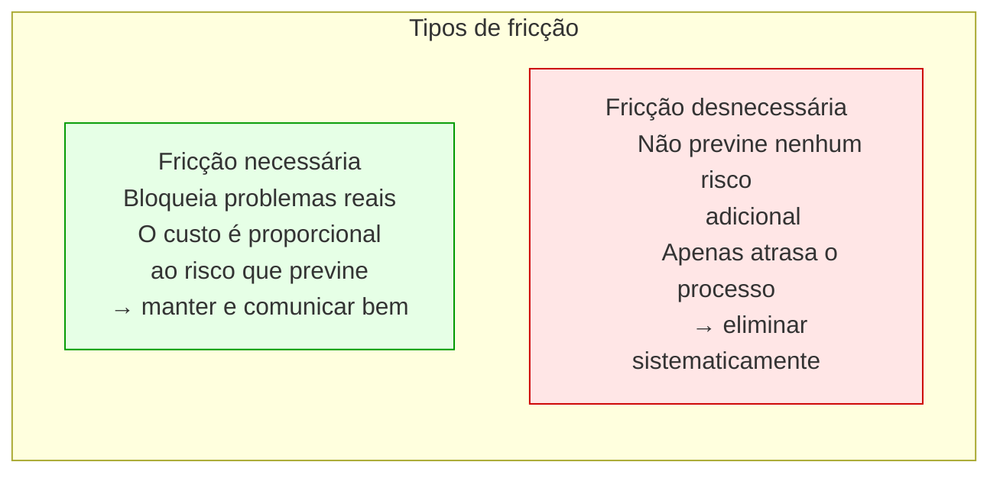
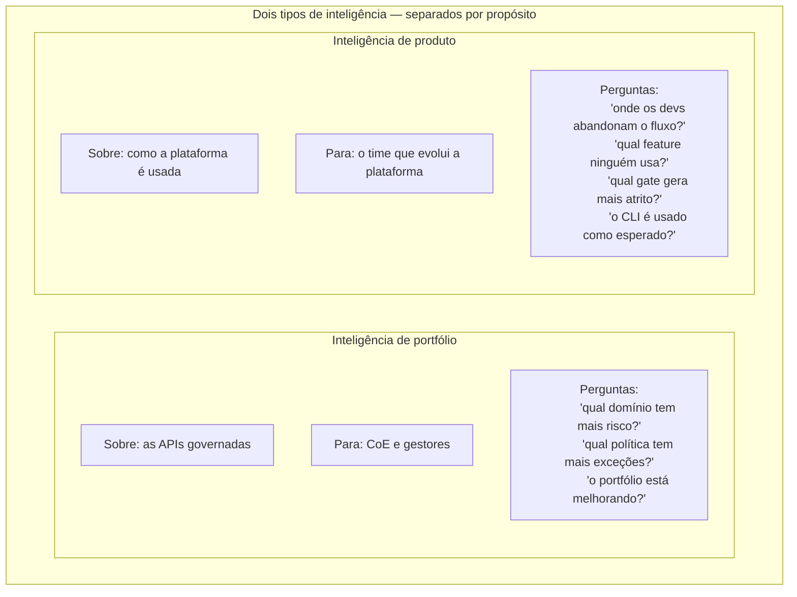
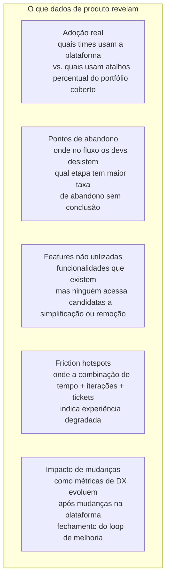
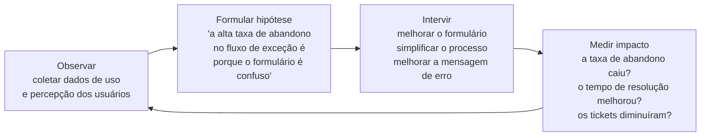

# Módulo 8 · Operacionalizando a Governança de APIs
## Capítulo 8.11 · DX e inteligência de produto

> **Série:** Gerenciamento e Governança de APIs
> **Nível:** Capacidade — medir e evoluir a experiência de usar a plataforma
> **Pré-requisito:** Cap 8.2 · Cap 8.6 · Cap 8.8

---

## Sumário

- [8.11.1 · DX além do portal](#8111--dx-além-do-portal)
- [8.11.2 · O que DX significa em governança](#8112--o-que-dx-significa-em-governança)
- [8.11.3 · Como medir DX](#8113--como-medir-dx)
- [8.11.4 · Inteligência de produto](#8114--inteligência-de-produto)
- [8.11.5 · Do dado à decisão de produto](#8115--do-dado-à-decisão-de-produto)
- [8.11.6 · Desafios comuns](#8116--desafios-comuns)

---

## 8.11.1 · DX além do portal

Developer Experience em governança de APIs não é sinônimo de qualidade do portal. O portal é o componente mais visível da DX — mas a experiência de um desenvolvedor com a plataforma de governança começa muito antes de abrir o portal e continua muito depois de fechar.

A DX da governança é a experiência completa de navegar o processo de criação, publicação e evolução de APIs dentro das regras e expectativas da organização. Ela engloba:

- O feedback do CLI quando uma spec tem problema
- A clareza da mensagem de erro quando um gate falha
- A facilidade de entender o que corrigir e como
- O tempo de espera pelo resultado do pipeline
- A facilidade de solicitar e obter uma exceção
- A qualidade da documentação e do suporte disponível
- A confiança de que o processo vai funcionar da mesma forma da próxima vez

Uma plataforma com excelente portal mas mensagens de erro crípticas tem DX ruim. Uma plataforma com documentação rica mas processo de exceção que demora dias tem DX ruim. Uma plataforma com ótimos dashboards mas CLI que demora minutos para responder tem DX ruim.

DX é uma propriedade do conjunto — e precisa ser medida como tal.

---

## 8.11.2 · O que DX significa em governança

Há uma tensão intrínseca entre DX e governança que é importante nomear antes de tentar medir. Governança, por definição, impõe restrições. Restrições criam fricção. Fricção degrada DX.

A conclusão ingênua seria que boa governança e boa DX são mutuamente excludentes. A conclusão correta é que a fricção pode ser **necessária** ou **desnecessária** — e a diferença é enorme.

**Fricção necessária** é a que serve ao propósito da governança. Um gate que bloqueia uma API sem autenticação cria fricção necessária — o desenvolvedor precisa corrigir um problema real antes de publicar. Essa fricção tem valor.

**Fricção desnecessária** é a que não serve ao propósito da governança. Um pipeline que demora 12 minutos quando poderia demorar 3. Uma mensagem de erro que diz "policy violation" sem explicar qual política ou como corrigir. Um processo de exceção que exige aprovação de três pessoas para casos que poderiam ser aprovados automaticamente por critério.

O objetivo da DX em governança não é eliminar fricção — é eliminar a fricção desnecessária enquanto torna a fricção necessária o mais clara e eficiente possível.

---

## 8.11.3 · Como medir DX

DX é difícil de medir porque é uma propriedade da experiência — não do sistema. O mesmo pipeline com o mesmo tempo de resposta pode ter DX boa para um desenvolvedor experiente e DX ruim para um que está começando. As métricas de DX precisam capturar a experiência real, não apenas o comportamento do sistema.

**Métricas comportamentais** — o que os desenvolvedores fazem, não o que dizem:

| Métrica | O que mede | Sinal de DX ruim |
|---|---|---|
| Iterações até publicação | Quantas vezes o dev roda o pipeline antes de passar | Alto número indica gates crípticos ou processo confuso |
| Taxa de abandono | Percentual de specs submetidas que nunca são publicadas | Desenvolvimento abandonado sugere fricção intransponível |
| Taxa de solicitação de exceção | Exceções em relação a publicações totais | Alto pode indicar políticas muito restritivas ou processo de correção confuso |
| Tempo médio de resolução de gate | Quanto tempo entre gate falhar e dev corrigir | Tempo alto indica mensagem de erro pouco acionável |
| Volume de tickets de suporte por gate | Tickets para o mesmo gate sistematicamente | Gate com muitos tickets tem comunicação insuficiente |

**Métricas de percepção** — o que os desenvolvedores relatam:

Surveys periódicos com perguntas específicas — não "você está satisfeito com a plataforma?" mas "a última vez que um gate falhou, você entendeu o que corrigir sem precisar de ajuda externa?" ou "quanto tempo você estimaria que gasta por semana em atividades relacionadas à governança que considera desnecessárias?".

A combinação de métricas comportamentais e de percepção produz um quadro mais completo do que qualquer uma isolada. Um desenvolvedor que passa no pipeline de primeira mas relata alta fricção pode estar seguindo atalhos que contornam a governança. Um que itera muitas vezes mas relata boa DX pode simplesmente ter aprendido a usar a ferramenta iterativamente.

---

## 8.11.4 · Inteligência de produto

Assim como a plataforma produz inteligência sobre o portfólio de APIs, ela precisa produzir inteligência sobre si mesma — como está sendo usada, onde está funcionando bem e onde está falhando em servir seus usuários.

A inteligência de produto e a inteligência de portfólio são separadas por propósito e por audiência:

**O que a inteligência de produto coleta**

Eventos de uso de todas as interface layers:

Do CLI: quais comandos são executados, com quais opções, com quais resultados — tempos de execução, taxas de erro por comando, sequências de comandos que indicam fricção.

Do Console: navegação por páginas, cliques em features, tempo em cada seção, sequências de ação antes de sair, features que são acessadas e abandonadas sem completar.

Da API: endpoints mais chamados, padrões de uso, erros mais frequentes, latências por operação.

Do Pipeline: gates que falham com mais frequência, tempo médio por tipo de gate, taxas de iteração por time, conversão de submissão para publicação.

**O que a inteligência de produto revela**

---

## 8.11.5 · Do dado à decisão de produto

Inteligência de produto só tem valor quando conectada a um processo de decisão sobre a evolução da plataforma. Isso requer que o time responsável pela plataforma opere com mentalidade de produto — com backlog priorizado, ciclos de melhoria baseados em dados e métricas de sucesso definidas.

**Ciclo de melhoria baseado em dados**

O ciclo fecha o loop — não basta melhorar, é necessário confirmar que a melhoria produziu o efeito esperado. Um time que melhora sem medir pode estar resolvendo os problemas errados.

**Priorização por impacto**

Nem toda fricção vale o mesmo esforço de resolver. A priorização considera:

- Quantos usuários são afetados? Fricção num fluxo usado por todos os times tem mais impacto do que fricção num fluxo raro.
- Qual é a frequência? Fricção que acontece todo dia tem mais impacto cumulativo do que fricção que acontece uma vez por mês.
- Qual é a magnitude? Fricção que bloqueia completamente tem mais impacto do que fricção que apenas atrasa.
- Qual é o custo da solução? Uma melhoria com alto impacto e baixo esforço tem prioridade sobre uma com alto impacto e alto esforço.

---

## 8.11.6 · Desafios comuns

### Coletar dados sem agir

A plataforma coleta dados de uso. Os dados estão disponíveis num dashboard. O time olha os números periodicamente. Mas nenhuma mudança na plataforma é rastreável a um insight específico dos dados. Os dados existem como informação, não como base de decisão.

O sinal mais claro desse problema: quando alguém pergunta "por que fizemos essa mudança?", a resposta é "alguém sugeriu" ou "pareceu uma boa ideia" — não "dados mostraram que X% dos usuários abandonavam o fluxo nesse ponto".

### DX como justificativa para remover restrições

Dados de DX mostram que o processo de exceção tem alta taxa de abandono e muitos tickets de suporte. A conclusão que parece óbvia: simplificar o processo de exceção, reduzir as etapas, facilitar a aprovação. A conclusão que pode ser mais correta: melhorar a comunicação do processo, tornar a mensagem de gate mais acionável, criar atalhos para os casos mais comuns — sem remover o controle que o processo garante.

DX ruim raramente é resolvida removendo governança. É resolvida tornando a governança mais clara, mais eficiente e mais assistida — sem comprometer o que a governança existe para garantir.

### A plataforma como legado antes do tempo

A plataforma foi lançada e funciona. O time que a construiu passou para outros projetos. Não há mais ninguém com responsabilidade pela evolução da plataforma. Dados de DX existem mas ninguém os analisa. Fricções acumulam. Desenvolvedores encontram atalhos. A adoção cai.

Uma plataforma de governança sem um time responsável pela sua evolução contínua começa a se tornar legado no dia em que é lançada. A decisão de construir ou adotar uma plataforma precisa vir acompanhada da decisão de manter um time responsável pela sua evolução.

---

## Pontos-chave do capítulo

- DX em governança é a experiência completa do processo — não apenas a qualidade do portal. Mensagens de erro, tempo do pipeline, processo de exceção e confiabilidade do processo compõem a DX tanto quanto a interface
- A distinção entre fricção necessária e desnecessária é central: o objetivo é eliminar a desnecessária, não toda fricção
- Métricas comportamentais (o que os devs fazem) e de percepção (o que relatam) se complementam — cada uma revela o que a outra não consegue
- Inteligência de produto e inteligência de portfólio são separadas por propósito e audiência: uma sobre as APIs governadas, outra sobre como a plataforma é usada
- O ciclo observar → hipótese → intervir → medir é o que fecha o loop de melhoria contínua
- Uma plataforma sem time responsável pela sua evolução começa a se tornar legado no dia do lançamento

---

## Próximo capítulo

**8.12 · Identidade e acesso** — o modelo de papéis da plataforma de governança, integração com sistemas externos de identidade e governança de identidade agêntica.

---

*Série: Gerenciamento e Governança de APIs · Módulo 8 · Capítulo 8.11*