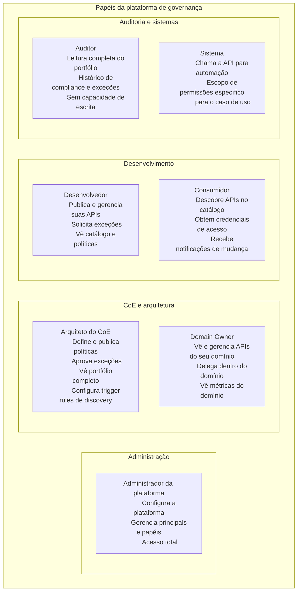
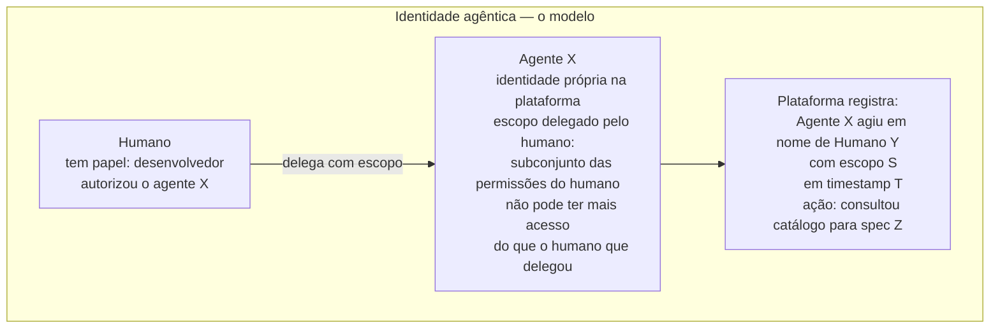

# Módulo 8 · Operacionalizando a Governança de APIs
## Capítulo 8.12 · Identidade e acesso

> **Série:** Gerenciamento e Governança de APIs
> **Nível:** Capacidade — quem pode fazer o quê na plataforma
> **Pré-requisito:** Cap 8.2 · Cap 5.4

---

## Sumário

- [8.12.1 · Os três tipos de principal](#8121--os-três-tipos-de-principal)
- [8.12.2 · O modelo de papéis](#8122--o-modelo-de-papéis)
- [8.12.3 · Integração com sistemas externos de identidade](#8123--integração-com-sistemas-externos-de-identidade)
- [8.12.4 · Autossuficiência — operar sem IdP externo](#8124--autossuficiência--operar-sem-idp-externo)
- [8.12.5 · Identidade agêntica](#8125--identidade-agêntica)
- [8.12.6 · Autenticação por canal](#8126--autenticação-por-canal)
- [8.12.7 · Desafios comuns](#8127--desafios-comuns)

---

## 8.12.1 · Os três tipos de principal

Uma plataforma de governança é acessada por três tipos distintos de principal — cada um com características de identidade, padrões de uso e requisitos de autenticação diferentes.

**Humanos** — desenvolvedores que publicam APIs, arquitetos do CoE que definem políticas, gestores que consultam dashboards, auditores que revisam históricos de compliance. Autenticam-se interativamente — via navegador no Console ou via dispositivo de autorização no CLI. Têm identidades persistentes que existem enquanto fazem parte da organização.

**Sistemas** — pipelines de CI/CD que submetem specs para verificação, ferramentas de build que consultam políticas, integrações que sincronizam o catálogo com outros sistemas. Não interagem via interface visual — chamam a API diretamente. Precisam de credenciais que funcionem de forma autônoma, sem interação humana em cada execução.

**Agentes de IA** — assistentes de desenvolvimento que consultam o catálogo, agentes de suporte que buscam na base de conhecimento, agentes externos que usam o MCP Server. Têm características de ambos os tipos anteriores: como sistemas, operam de forma autônoma; como humanos, atuam em nome de uma pessoa ou contexto específico. Requerem identidade própria — separada das credenciais humanas e dos sistemas.

A separação entre os três tipos não é apenas técnica — é semântica. Quando um agente de IA faz uma chamada à API da plataforma usando as credenciais do desenvolvedor humano, a plataforma não consegue distinguir o que foi feito por humano e o que foi feito por agente. A auditabilidade é comprometida. A revogação de acesso de um agente específico se torna impossível sem revogar também o acesso do humano.

---

## 8.12.2 · O modelo de papéis

O modelo de papéis da plataforma define o que cada tipo de principal pode fazer. Papéis são atribuídos a principals — não a identidades específicas — e definem o conjunto de permissões que o principal tem em cada contexto.



O modelo de papéis deve ser simples o suficiente para ser compreendido por quem precisa administrar a plataforma — e extensível o suficiente para acomodar casos específicos. Para casos que o modelo de papéis padrão não cobre — uma organização que precisa que certos arquitetos tenham permissão de aprovar exceções apenas no seu domínio, não em todo o portfólio — políticas customizadas de autorização complementam os papéis.

---

## 8.12.3 · Integração com sistemas externos de identidade

A maioria das organizações já tem um sistema de identidade — Active Directory, Okta, Microsoft Entra ID, Keycloak ou equivalente. A plataforma de governança deve federar com esse sistema, não criar um silo de identidade paralelo.

**Federação via OIDC**

O padrão OIDC (OpenID Connect) é o mecanismo de federação. A plataforma configura o IdP organizacional como provedor de identidade — e delega a autenticação para ele. O usuário faz login via seu SSO organizacional, recebe um token do IdP, e a plataforma valida esse token para conceder acesso.

**Mapeamento de grupos para papéis**

O IdP geralmente tem grupos que refletem a estrutura organizacional — grupos por time, por domínio, por função. A plataforma deve permitir mapear esses grupos para papéis da plataforma:

```
Grupo "api-architects" no AD → papel "arquiteto-do-coe" na plataforma
Grupo "domain-payments" no AD → papel "domain-owner" para o domínio de pagamentos
Grupo "developers" no AD → papel "desenvolvedor" na plataforma
```

Esse mapeamento significa que quando alguém entra no grupo "api-architects" no diretório organizacional, automaticamente ganha o papel correspondente na plataforma — sem que um administrador da plataforma precise ser notificado.

**Provisionamento just-in-time**

Um usuário que autentica na plataforma pela primeira vez — sem ter sido previamente cadastrado — pode ter sua conta criada automaticamente a partir dos atributos do token do IdP: nome, email, grupos. O perfil na plataforma é criado no momento do primeiro acesso, com os papéis derivados dos grupos do usuário.

---

## 8.12.4 · Autossuficiência — operar sem IdP externo

A federação com IdP é o modo de operação preferível em produção. Mas a plataforma precisa operar sem IdP externo em cenários legítimos: ambientes de desenvolvimento isolados, organizações menores que não têm IdP centralizado, fase inicial de adoção antes da integração com o IdP estar configurada.

Para esses casos, a plataforma tem gestão de identidade própria: criação de usuários locais, atribuição direta de papéis, autenticação com credenciais locais. A gestão local é deliberadamente mais simples do que a via IdP — funcional, sem as capacidades avançadas de um sistema de identidade especializado.

A coexistência de identidades locais e federadas é gerenciada pela plataforma. Um usuário que existe localmente pode ser "adotado" pelo IdP quando a federação é configurada — sem perder histórico de acesso ou atribuições de papel.

---

## 8.12.5 · Identidade agêntica

Agentes de IA requerem uma classe de identidade distinta — que reflete sua natureza de operadores autônomos atuando em nome de humanos ou contextos específicos.

**Por que identidade própria para agentes**

Quando um agente de desenvolvimento consulta o catálogo em nome de um desenvolvedor, três informações são necessárias para auditoria completa:
- Quem é o agente? (qual agente específico fez a chamada)
- Em nome de quem? (qual desenvolvedor autorizou o agente)
- Com quais permissões? (o subconjunto das permissões do humano delegado ao agente)

Um agente usando as credenciais do humano não permite separar as três informações — tudo aparece como ação do humano. Uma credencial de serviço genérica não indica em nome de quem o agente está atuando.

**O modelo de identidade agêntica**



**Credenciais de agentes**

O mecanismo preferível para autenticação de agentes é a identidade de carga de trabalho federada — o agente usa um token emitido por uma plataforma de execução confiável (o sistema de CI/CD, o ambiente de cloud) para autenticar-se na plataforma de governança. Sem credenciais estáticas, sem secret que pode vazar, com token efêmero por execução.

Para agentes que não têm acesso a uma plataforma de execução confiável, tokens de serviço com escopos mínimos e rotação periódica são a alternativa — com as desvantagens inerentes de credenciais estáticas.

---

## 8.12.6 · Autenticação por canal

Cada canal de acesso à plataforma tem um padrão de autenticação adequado à sua natureza.

| Canal | Audiência | Mecanismo de autenticação |
|---|---|---|
| Console | Humanos | OIDC Authorization Code com PKCE via IdP organizacional. Token armazenado na sessão do navegador |
| CLI | Humanos e automação | Para humanos: OIDC com fluxo de dispositivo — usuário autentica no navegador, token armazenado de forma segura localmente. Para automação: token de serviço via variável de ambiente |
| API | Sistemas e integrações | OAuth 2.0 Client Credentials para sistemas. Workload Identity Federation para sistemas com plataforma de execução confiável |
| MCP Server | Agentes externos | Token com escopo de acesso específico, emitido com prazo de validade curto |
| SDK | Sistemas | Herda o mecanismo do canal subjacente — o SDK é uma abstração, não um mecanismo de autenticação separado |

**O princípio de menor privilégio por canal**

Cada canal deve ter acesso apenas ao que precisa para seu propósito. Um pipeline de CI/CD que submete specs para verificação não precisa de acesso a funcionalidades de gestão de políticas. Um agente que consulta o catálogo não precisa de acesso a dados de auditoria de exceções. O escopo de acesso é definido no momento de emissão das credenciais — não como uma permissão genérica.

---

## 8.12.7 · Desafios comuns

### Credenciais de serviço compartilhadas

Múltiplos pipelines de CI/CD usam o mesmo token de serviço porque criar tokens individuais parecia trabalhoso. Quando o token precisa ser revogado — porque um pipeline foi comprometido, porque o escopo precisa ser reduzido — todos os pipelines são afetados. O histórico de auditoria não permite distinguir qual pipeline fez o quê.

Credenciais de serviço compartilhadas são o equivalente de uma chave mestra: convenientes até o momento em que precisam ser invalidadas. O overhead de criar credenciais individuais é pequeno comparado ao risco de compartilhamento.

### Papéis muito amplos

O administrador da plataforma cria um papel genérico "usuário-da-governança" com acesso a todas as funcionalidades para "simplificar a gestão". Com o tempo, todos os usuários ficam com o mesmo papel. O modelo de papéis perde seu propósito: não é mais possível distinguir quem tem autoridade para aprovar exceções, quem pode modificar políticas, quem tem acesso apenas a leitura.

Papéis amplos são o equivalente de permissões admin para todos — o caminho de menor resistência que cria o maior risco de longo prazo.

### Identidade agêntica como reflexão tardia

A plataforma foi construída para humanos e sistemas. Agentes de IA começaram a ser usados pelos times e usam as credenciais dos desenvolvedores porque é o mecanismo disponível. Agora há tráfego de agentes misturado com tráfego humano no histórico de auditoria, não é possível revogar o acesso de um agente específico sem impactar o humano correspondente, e ninguém sabe exatamente o que os agentes estão fazendo na plataforma.

Incorporar identidade agêntica depois que os agentes já estão em uso é significativamente mais difícil do que projetar para ela desde o início. A decisão de suportar identidades agênticas deve ser feita antes de os agentes se tornarem comuns no ecossistema da organização.

---

## Pontos-chave do capítulo

- Três tipos de principal requerem modelos de identidade distintos: humanos, sistemas e agentes de IA — confundi-los compromete auditabilidade e capacidade de controle
- O modelo de papéis deve ser simples o suficiente para administrar e extensível para casos específicos — menor privilégio por papel é o princípio central
- Federação com IdP via OIDC é o modo de operação preferível — mapeamento de grupos para papéis e provisionamento just-in-time tornam a gestão contínua automática
- Autossuficiência sem IdP externo é necessária para ambientes de desenvolvimento e organizações menores — mas é o modo secundário, não o preferível
- Identidade agêntica requer que o agente tenha identidade própria, escopo delegado pelo humano e auditabilidade separada das ações humanas
- Projetar para identidade agêntica desde o início é muito mais fácil do que incorporá-la depois

---

## Próximo capítulo

**8.13 · Build, buy ou compor** — como avaliar o que construir internamente, o que adquirir de mercado e como compor capacidades existentes para operacionalizar a governança.

---

*Série: Gerenciamento e Governança de APIs · Módulo 8 · Capítulo 8.12*