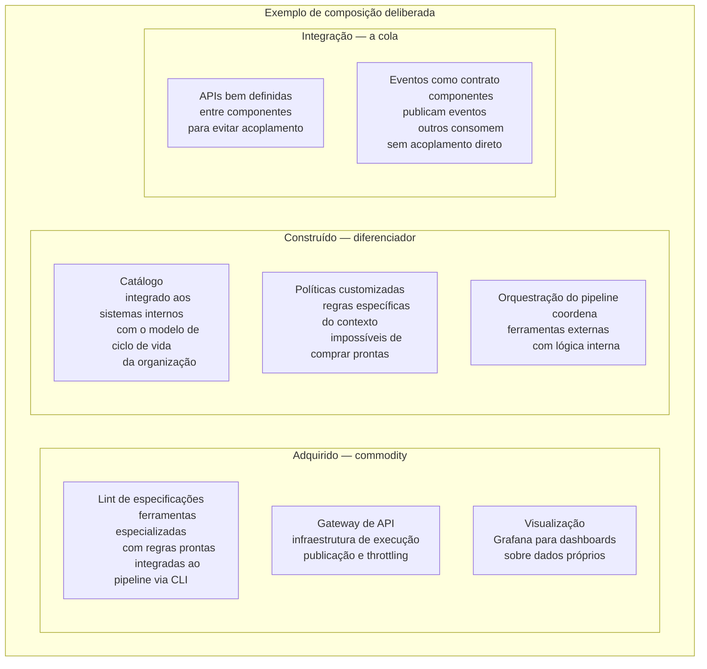

# Módulo 8 · Operacionalizando a Governança de APIs
## Capítulo 8.13 · Build, buy ou compor

> **Série:** Gerenciamento e Governança de APIs
> **Nível:** Estratégico — como decidir o que construir, adquirir ou compor
> **Pré-requisito:** Cap 8.2 a 8.12

---

## Sumário

- [8.13.1 · O falso binário](#8131--o-falso-binário)
- [8.13.2 · O que o mercado oferece](#8132--o-que-o-mercado-oferece)
- [8.13.3 · Critérios de avaliação](#8133--critérios-de-avaliação)
- [8.13.4 · Riscos de acoplamento a vendors](#8134--riscos-de-acoplamento-a-vendors)
- [8.13.5 · A abordagem de composição](#8135--a-abordagem-de-composição)
- [8.13.6 · Desafios comuns](#8136--desafios-comuns)

---

## 8.13.1 · O falso binário

A decisão de operacionalizar governança de APIs frequentemente é enquadrada como binary: construir uma plataforma do zero ou adquirir uma solução de mercado. Na prática, a maioria das implementações bem-sucedidas não é nem um nem outro — é uma composição deliberada de capacidades existentes com desenvolvimento customizado onde necessário.

O raciocínio por trás do falso binário é compreensível. Construir do zero parece custoso demais — é um investimento significativo de engenharia para algo que "outros já resolveram". Comprar uma solução parece o caminho mais rápido — até o momento em que as necessidades específicas da organização excedem o que o produto oferece.

A pergunta mais útil não é "build ou buy?" — é "o que no meu contexto específico é commodity e o que é diferenciador?".

**Commodity** — capacidades que a maioria das organizações precisa da mesma forma: lint de especificações OpenAPI, gateway de API, portal básico de documentação. Para isso, soluções de mercado bem estabelecidas geralmente oferecem qualidade superior ao que uma equipe interna construiria com recursos realistas.

**Diferenciador** — capacidades que refletem como a organização específica governa seu portfólio: o modelo de policies que corresponde à cultura de governance da empresa, o catálogo que integra com os sistemas internos existentes, as métricas que fazem sentido para o contexto do negócio. Para isso, soluções de mercado genéricas frequentemente precisam ser adaptadas de formas que acabam sendo mais custosas do que construir diretamente.

---

## 8.13.2 · O que o mercado oferece

O mercado de ferramentas para operacionalização de governança de APIs é fragmentado — nenhuma ferramenta única cobre todos os bounded contexts descritos no Cap 8.2 com profundidade equivalente.

**Plataformas de API management**

Ferramentas como Kong, AWS API Gateway, Azure APIM, Google Apigee e outras cobrem bem a camada de gateway — publicação, throttling, autenticação, monitoramento de tráfego. Algumas têm capacidades de catálogo e portal. Poucas têm governança profunda: políticas como código, ciclo de vida formal de APIs, gestão estruturada de exceções.

A armadilha dessas plataformas é que resolvem bem o problema do gateway mas podem criar a ilusão de que governança está resolvida quando na verdade apenas a infraestrutura de execução está resolvida.

**Ferramentas especializadas de design e lint**

Ferramentas como Stoplight, 42Crunch, Redocly e outras focam na qualidade das especificações — design assistido, lint configurável, documentação interativa. São fortes no design e na validação do contrato, mas frequentemente não cobrem ciclo de vida, políticas organizacionais ou analytics de portfólio.

**Plataformas de developer portal**

Ferramentas focadas exclusivamente na experiência do consumidor — descoberta, documentação interativa, gestão de credenciais. Cobrem bem o contexto de Portal mas raramente têm integração com pipeline de governança ou políticas como código.

**Ferramentas de observabilidade e analytics**

Grafana, ferramentas de BI, plataformas de analytics como Amplitude ou PostHog (adaptadas) podem cobrir partes da inteligência de portfólio. Mas requerem que os dados de governança já estejam disponíveis em formato adequado — o que pressupõe que os outros contextos já estejam produzindo dados estruturados.

---

## 8.13.3 · Critérios de avaliação

Avaliar ferramentas de governança requer critérios que vão além das funcionalidades listadas na página de produto.

**Adequação ao contexto, não à lista de features**

Uma ferramenta que oferece 200 funcionalidades das quais a organização usa 20 não é melhor do que uma que oferece 30 funcionalidades que correspondem exatamente às necessidades. A pergunta não é "ela tem X?" — é "ela resolve Y no contexto da nossa organização?".

**Capacidade de customização das políticas**

Toda organização tem regras de governança específicas que nenhuma ferramenta de prateleira vai cobrir exatamente. A questão é o quanto a ferramenta permite customização: é possível adicionar novas políticas? Em qual linguagem? Quão difícil é manter políticas customizadas ao longo do tempo?

**Integração com o ecossistema existente**

A ferramenta precisa integrar com o IdP organizacional, com os pipelines de CI/CD existentes, com os gateways em uso, com os sistemas de ticketing. Integrações incompletas criam ilhas de dados — o catálogo sabe de um conjunto de APIs, o gateway sabe de outro, e ninguém tem a visão completa.

**Modelo de dados aberto ou proprietário**

Uma ferramenta que armazena dados de governança em formato proprietário cria dependência: migrar para outra ferramenta no futuro requer exportar, transformar e importar dados que podem não ter equivalente claro no novo sistema. Ferramentas com modelos de dados baseados em padrões abertos (OpenAPI para specs, formatos padrão para eventos) são preferíveis.

**Operabilidade no ambiente da organização**

SaaS, cloud específica, self-hosted — cada modelo tem implicações operacionais e de soberania de dados. Uma organização em setor regulado pode não conseguir usar SaaS para armazenar dados de portfólio. Uma organização sem time de infraestrutura pode não conseguir operar uma plataforma self-hosted complexa.

---

## 8.13.4 · Riscos de acoplamento a vendors

O acoplamento a um vendor específico não é inevitável — mas é um risco que precisa ser gerenciado ativamente desde as primeiras decisões de adoção.

**Acoplamento via formato de dados**

Políticas escritas na linguagem proprietária de um vendor, catálogos em formatos que só aquele vendor entende, métricas calculadas de formas que dependem de como aquela ferramenta instrumenta o ambiente. Quando a organização decide migrar, descobre que o conhecimento acumulado nas políticas e no catálogo não é transferível.

A mitigação é preferir padrões abertos onde existem: especificações em OpenAPI, AsyncAPI, gRPC padrão; políticas em linguagens open source como Rego (OPA); catálogos com formatos exportáveis em JSON/YAML estruturado.

**Acoplamento via integração profunda**

A ferramenta foi integrada de forma tão profunda ao fluxo de desenvolvimento que removê-la requer refazer todo o pipeline de CI/CD, o processo de publicação e as integrações com o gateway. O vendor se torna infraestrutura crítica não porque é a melhor escolha, mas porque o custo de substituição é proibitivo.

A mitigação é manter camadas de abstração: o pipeline de CI/CD não chama a ferramenta de governança diretamente — chama um wrapper que pode ser redirecionado para outra ferramenta. O catálogo não é construído sobre a API proprietária de um vendor — é construído sobre uma API interna que usa o vendor como backend.

**Acoplamento via roadmap**

A organização depende de funcionalidades que estão no roadmap do vendor — que podem ou não ser entregues, podem mudar de forma, podem ser descontinuadas. A estratégia de governança fica refém das prioridades do produto de terceiro.

A mitigação é não construir estratégia sobre funcionalidades prometidas. Avaliar o que existe hoje, não o que está prometido para amanhã.

---

## 8.13.5 · A abordagem de composição

A abordagem mais robusta para a maioria das organizações é composição deliberada: usar ferramentas de mercado para o que é commodity, construir o que é diferenciador, e fazer as peças trabalharem juntas através de integrações bem definidas.

A chave da composição bem-sucedida é que cada componente seja substituível sem comprometer os outros. O lint de especificações pode mudar de ferramenta sem impactar o catálogo — porque a integração é via evento com formato definido, não via chamada direta entre sistemas.

**Quando construir mais**

- O contexto de negócio é suficientemente específico que ferramentas genéricas precisariam ser tão customizadas que o custo equivale ao de construir
- A organização tem requisitos de soberania de dados ou compliance que excluem opções SaaS
- A diferença competitiva da organização passa pela qualidade do seu portfólio de APIs — e a governança é parte dessa vantagem

**Quando comprar mais**

- O time de engenharia é pequeno e o custo de manutenção de soluções construídas internamente é significativo
- As necessidades são suficientemente padronizadas que ferramentas de mercado cobrem bem sem customização extensiva
- A velocidade de adoção é mais importante do que a adequação perfeita ao contexto

---

## 8.13.6 · Desafios comuns

### A solução de mercado que resolveu 80%

A ferramenta foi adquirida porque resolvia 80% das necessidades. Os 20% restantes — o modelo de ciclo de vida específico, as políticas customizadas, a integração com um sistema interno legado — foram deixados para depois. Depois nunca chega. A organização opera com 80% de governança e os 20% mais difíceis ficam descobertos indefinidamente.

A alternativa não é rejeitar ferramentas que não cobrem 100% — é ser explícito sobre o que os 20% representam e ter um plano concreto para endereçá-los antes de começar a depender da ferramenta para os 80%.

### O projeto de plataforma que nunca termina

A organização decidiu construir uma plataforma própria. Começou com todos os contextos — catálogo, políticas, pipeline, inteligência, descoberta, portal, conhecimento, identidade. Dezoito meses depois, nenhum contexto está completo o suficiente para ser usado em produção. Times continuam operando sem governança porque a plataforma "está quase pronta".

Plataformas precisam de MVPs (Minimum Viable Products) com escopo deliberadamente limitado. Começar com catálogo e pipeline básicos — e entregar valor real para os times antes de construir o restante — produz mais adoção do que esperar uma plataforma completa que nunca chega.

### Comparar ferramentas pelo que prometem, não pelo que entregam

A avaliação foi feita com base em demos, documentação de marketing e roadmaps. A ferramenta escolhida tem as funcionalidades certas no papel. Na adoção, descobre-se que a customização de políticas requer escrever em uma linguagem que ninguém domina, que a integração com o IdP existente tem limitações não documentadas, e que o suporte para casos além do básico é inexistente.

Avaliações de ferramentas de governança precisam ser feitas com casos de uso reais — não demos controlados. Tempo de prova de conceito com dados e requisitos reais da organização vale muito mais do que qualquer apresentação de vendor.

---

## Pontos-chave do capítulo

- A decisão não é build ou buy — é identificar o que é commodity e o que é diferenciador, e tomar decisões distintas para cada
- O mercado é fragmentado: nenhuma ferramenta cobre todos os bounded contexts com profundidade equivalente — composição é a abordagem mais robusta
- Critérios de avaliação que importam: adequação ao contexto, capacidade de customização, integração com ecossistema existente, modelo de dados aberto, operabilidade
- Acoplamento a vendors se manifesta em três formas: formato de dados, integração profunda e dependência de roadmap — cada uma com sua mitigação
- A composição deliberada usa ferramentas para o que é commodity e constrói o que é diferenciador, conectando tudo via integrações substituíveis
- Plataformas próprias precisam de MVPs com escopo limitado — entregar valor cedo produz mais adoção do que esperar completude

---

## Próximo capítulo

**8.14 · Adoção — o problema mais difícil** — por que boas plataformas falham na adoção, estratégias para introduzir governança sem alienar os times que precisam adotá-la, e como medir se a governança está funcionando.

---

*Série: Gerenciamento e Governança de APIs · Módulo 8 · Capítulo 8.13*