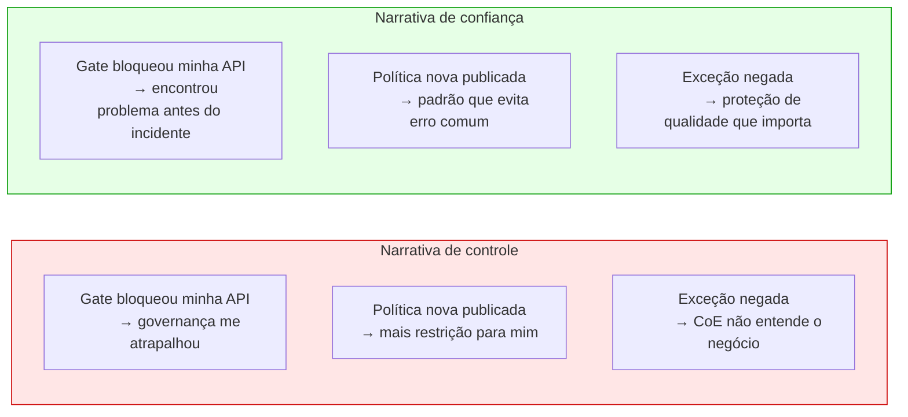
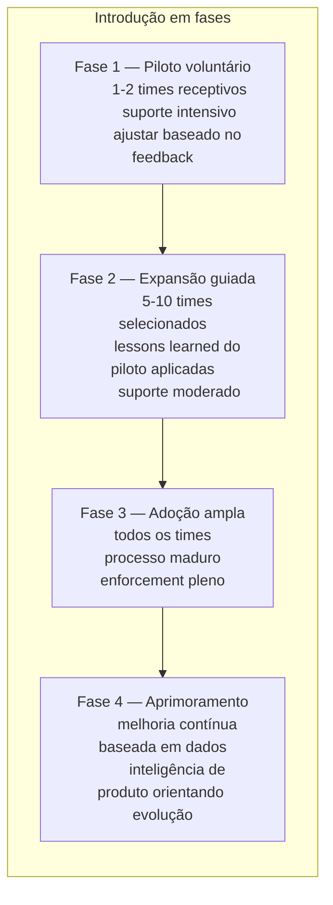
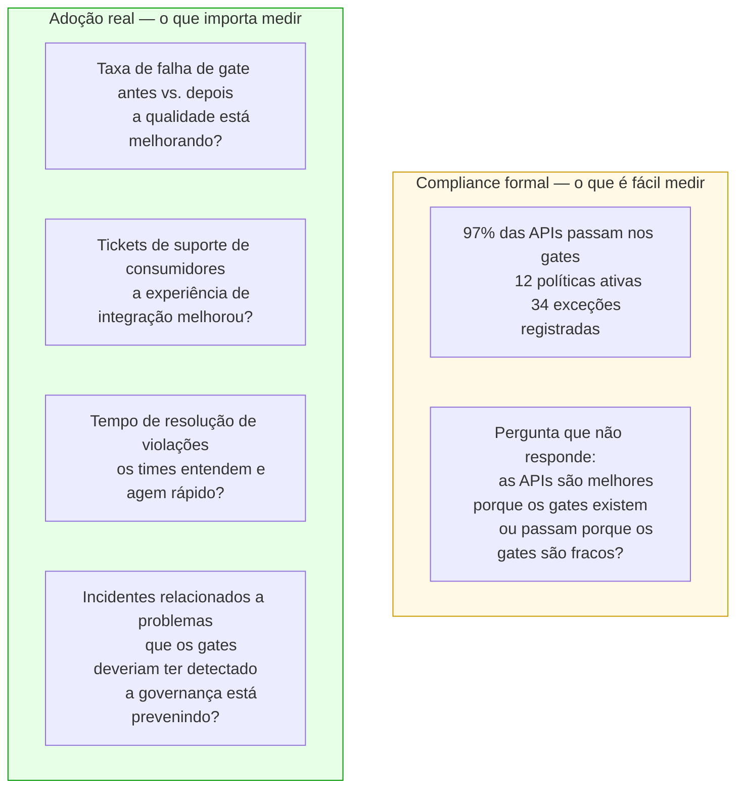

# Módulo 8 · Operacionalizando a Governança de APIs
## Capítulo 8.14 · Adoção — o problema mais difícil

> **Série:** Gerenciamento e Governança de APIs
> **Nível:** Estratégico — o lado humano da operacionalização
> **Pré-requisito:** Cap 8.1 a 8.13

---

## Sumário

- [8.14.1 · Por que boas plataformas falham na adoção](#8141--por-que-boas-plataformas-falham-na-adoção)
- [8.14.2 · O problema da narrativa](#8142--o-problema-da-narrativa)
- [8.14.3 · Estratégias de introdução](#8143--estratégias-de-introdução)
- [8.14.4 · Champions e primeiros adotantes](#8144--champions-e-primeiros-adotantes)
- [8.14.5 · Medindo adoção real](#8145--medindo-adoção-real)
- [8.14.6 · O jogo longo](#8146--o-jogo-longo)

---

## 8.14.1 · Por que boas plataformas falham na adoção

Uma plataforma de governança tecnicamente excelente pode ter adoção mínima. Isso acontece com frequência suficiente para ser um padrão — não uma exceção.

Os motivos são conhecidos mas frequentemente subestimados por quem constrói a plataforma:

**A plataforma foi construída para o CoE, não para o desenvolvedor**

O CoE tinha necessidades claras — visibilidade do portfólio, enforcement de políticas, gestão de exceções. A plataforma foi construída para satisfazê-las. A experiência do desenvolvedor — que é quem precisa usar a plataforma no dia a dia — foi tratada como requisito secundário. O resultado é uma plataforma que o CoE ama e os desenvolvedores evitam.

**A plataforma foi lançada, não introduzida**

Houve um "lançamento" — uma apresentação, um email anunciando a nova plataforma, links para documentação. Não houve introdução: acompanhamento ativo dos primeiros times na adoção, suporte durante o período de curva de aprendizado, ajustes baseados no feedback inicial. Sem introdução, a plataforma existe mas não é usada.

**A plataforma adicionou burocracia sem remover equivalente**

Antes da plataforma, os times tinham seus próprios processos informais — nem sempre bons, mas familiares. A plataforma adicionou processos formais sem remover os informais. O time agora tem o processo antigo mais o processo novo, sem perceber claramente qual substituiu qual. O custo de processo dobrou; o benefício não é óbvio.

**A plataforma foi mandatória antes de ser útil**

O CoE decretou que todos os times precisam usar a plataforma a partir de uma data específica. Parte dos times não estava pronta, a plataforma tinha bugs de adoção, o suporte estava sobrecarregado. A primeira experiência com a plataforma foi negativa para a maioria — e primeira impressão em sistemas é difícil de reverter.

---

## 8.14.2 · O problema da narrativa

Governança tem um problema de narrativa. A narrativa mais comum — e mais prejudicial — é:

*"A governança existe para controlar os times de desenvolvimento."*

Quando essa é a narrativa dominante, cada novo gate é percebido como mais controle. Cada política nova é mais restrição. Cada aprovação necessária é mais burocracia. A resistência é racional dado o enquadramento.

A narrativa alternativa — que é também mais verdadeira — é:

*"A governança existe para que times desenvolvam com mais confiança e menos retrabalho."*

Um time que sabe que sua API vai passar pelos gates antes de ser publicada não descobre problemas em produção que causam incidentes. Um time que tem um catálogo confiável não duplica APIs que já existem. Um time que recebe feedback de segurança no design não reescreve código depois que a vulnerabilidade foi encontrada em auditoria.

A diferença entre as duas narrativas não é de spin — é de enquadramento que determina como cada interação com a governança é interpretada.

Mudar a narrativa não acontece por decreto — acontece por experiências reais. Cada vez que um gate detecta um problema que teria causado incidente, é uma oportunidade de narrar o evento como "a governança evitou um problema" em vez de "a governança atrasou a publicação". Essas narrativas, acumuladas ao longo do tempo, mudam a percepção.

---

## 8.14.3 · Estratégias de introdução

**Começar com valor visível, não com enforcement**

A primeira coisa que os times devem experimentar da plataforma não deveria ser um gate que bloqueia — deveria ser algo que ajuda. Um catálogo que resolve a pergunta "já existe uma API para isso?". Uma ferramenta de lint que detecta problemas antes do peer review. Um portal que documenta APIs que antes não tinham documentação.

Quando times experimentam o valor antes de experienciar o enforcement, a relação com a plataforma começa diferente. O enforcement que vem depois é mais fácil de aceitar quando já existe uma percepção positiva da plataforma.

**Adoção em fases, não big bang**

A introdução em um time por vez — começando pelos times mais receptivos — permite aprender com cada adoção antes de expandir. O que funcionou? O que gerou atrito desnecessário? Quais perguntas surgiram que a documentação não respondeu?

**Enforcement gradual por política**

Cada nova política passa por um período de observação antes de enforcement. O Cap 8.4 descreveu esse padrão: INFO para coleta de dados, WARN para visibilidade, BLOCK para enforcement. Isso aplica à introdução de toda a plataforma também: começar com visibilidade — "aqui estão as violações que existem no seu portfólio" — antes de bloquear.

Times que sabem o que precisam corrigir antes que seja mandatório chegam ao enforcement com menos surpresas e menos resistência.

---

## 8.14.4 · Champions e primeiros adotantes

Nenhuma plataforma de governança se expande por mandato — se expande por evidência de valor propagada por pessoas que acreditam nela.

**Champions internos**

Em cada time de desenvolvimento há pessoas que naturalmente se preocupam com qualidade e consistência — que já tentavam enforçar padrões informalmente, que reclamavam da ausência de catálogo, que queriam processos mais claros. Essas pessoas são champions naturais: quando a plataforma resolve problemas que elas já sentiam, tornam-se advogados espontâneos.

Identificar e apoiar champions não é manipulação — é reconhecer que mudança acontece de dentro para fora. Um champion que explica para o seu time por que a plataforma é útil tem mais credibilidade do que o CoE fazendo a mesma explicação de fora.

**O primeiro case de sucesso**

O primeiro caso em que a plataforma claramente salvou um time de um problema real — um gate que detectou uma vulnerabilidade antes da publicação, um catálogo que evitou duplicar uma API que já existia — precisa ser narrado amplamente. Não como propaganda, mas como evidência concreta de que a governança tem valor prático.

Esse primeiro case muda a percepção de abstract para concreto. "Governança evita problemas" é uma afirmação. "O gate de segurança detectou que a API de autenticação do time X estava exposta sem autorizer — problema que teria virado incidente em duas semanas" é uma história.

---

## 8.14.5 · Medindo adoção real

A métrica mais fácil de medir é também a menos informativa: compliance formal. Quantas APIs passam pelos gates. Quantas políticas estão ativas. Quantas exceções foram registradas. Esses números existem e têm valor, mas não medem se a governança está realmente funcionando.

**Compliance formal vs. adoção real**

**Os indicadores de adoção que importam**

- **Taxa de iteração decrescente**: times que precisam de menos iterações para passar nos gates estão aprendendo os padrões — a plataforma está sendo incorporada ao fluxo de trabalho, não contornada.

- **Uso proativo do catálogo**: times consultando o catálogo antes de começar desenvolvimento, não só quando são obrigados — indicador de que o catálogo tem valor percebido.

- **Redução de tickets de integração**: menos dúvidas de consumidores sobre como usar APIs — indicador de que a qualidade do contrato melhorou.

- **Champions que emergem espontaneamente**: times adicionando verificações de governança em seus próprios processos internos, além do obrigatório — o sinal mais forte de adoção genuína.

---

## 8.14.6 · O jogo longo

Governança de APIs não é um projeto com data de conclusão — é uma prática que a organização desenvolve ao longo de anos. Isso tem implicações importantes para como o programa é gerido e como o sucesso é medido.

**O ciclo de melhoria nunca termina**

O portfólio cresce. Novas tecnologias emergem — o que hoje são GraphQL e gRPC, amanhã são protocolos que ainda não existem. O ecossistema agêntico está transformando o que significa uma API bem governada. A plataforma precisa evoluir junto com o contexto.

Uma governança que parou de evoluir é uma governança em regressão — porque o ambiente ao redor continua mudando.

**O investimento em cultura é tão importante quanto o investimento em tecnologia**

Uma plataforma técnica sem cultura de qualidade produz compliance sem convicção — times que passam nos gates porque são obrigados, não porque entendem por quê. Uma cultura de qualidade sem plataforma produz intenções sem consistência — times que querem fazer certo mas não têm os meios.

O programa de governança que funciona a longo prazo investe nos dois: na plataforma que torna o enforcement consistente e na cultura que torna o enforcement compreendido e aceito.

**O sinal de maturidade máxima**

O indicador mais claro de que um programa de governança atingiu maturidade é quando desenvolvedores defendem a governança por conta própria — quando um time resiste a uma solicitação de exceção que percebem como prejudicial à qualidade do portfólio, quando arquitetos argumentam pela adoção de novas políticas baseados em problemas que experienciaram, quando a governança deixou de ser "o que o CoE exige" e virou "o que fazemos para entregar com qualidade".

Esse estado não é alcançado por mandate — é conquistado pela acumulação de experiências em que a governança demonstrou valor real, pela narrativa consistente de que qualidade e velocidade não são opostos, e pela plataforma que tornou o caminho correto o caminho mais fácil.

---

## Pontos-chave do capítulo

- Boas plataformas falham por razões humanas e organizacionais, não técnicas: construídas para o CoE em vez do desenvolvedor, lançadas sem introdução, burocratizantes sem valor percebido
- A narrativa de controle vs. a narrativa de confiança é uma escolha — e é construída por experiências reais, não por comunicação
- Introdução em fases com pilots voluntários e enforcement gradual reduz resistência e permite aprender antes de expandir
- Champions internos propagam adoção com mais credibilidade do que o CoE — identificá-los e apoiá-los é estratégia, não manipulação
- Compliance formal (APIs que passam nos gates) e adoção real (qualidade que melhora, incidentes que não acontecem) são métricas diferentes — as segundas são o que importa
- O sinal de maturidade máxima é quando desenvolvedores defendem a governança por conta própria — e isso é conquistado, não decretado

---

## Conclusão do módulo

Este módulo percorreu as capacidades que tornam a governança de APIs operacional — do catálogo como fonte de verdade ao pipeline de qualidade, da inteligência de portfólio à descoberta e reconciliação, do portal ao conhecimento, da assistência inteligente à identidade. E terminou onde termina todo programa de transformação bem-sucedido: nas pessoas.

A tecnologia é necessária. Não é suficiente. A governança que funciona é a que foi construída com a mesma atenção para a experiência de quem a usa e para a cultura em que opera que para a solidez técnica dos seus componentes.

---

*Série: Gerenciamento e Governança de APIs · Módulo 8 · Capítulo 8.14*