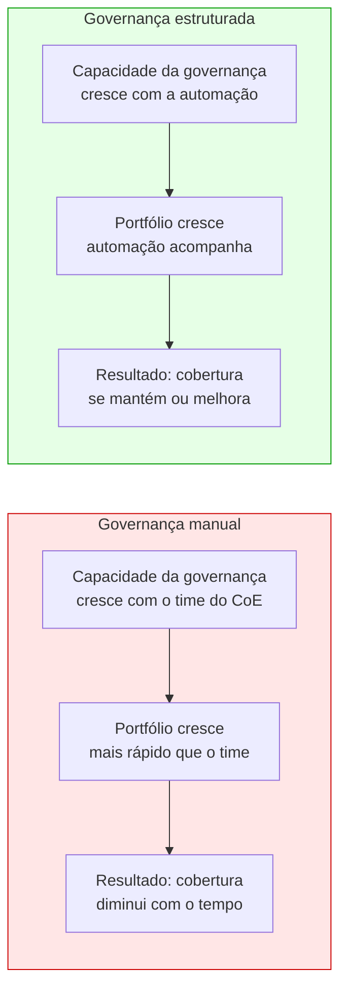
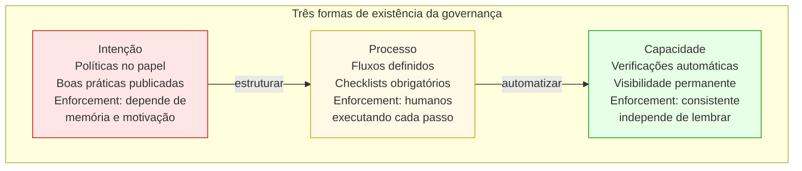

# Módulo 8 · Operacionalizando a Governança de APIs
## Capítulo 8.1 · Da intenção à infraestrutura

> **Série:** Gerenciamento e Governança de APIs
> **Nível:** Estratégico — a transição da governança como processo para governança como capacidade
> **Pré-requisito:** Módulos 1 a 7

---

## Sumário

- [8.1.1 · O limite da governança manual](#811--o-limite-da-governança-manual)
- [8.1.2 · O que significa operacionalizar](#812--o-que-significa-operacionalizar)
- [8.1.3 · A plataforma como produto interno](#813--a-plataforma-como-produto-interno)
- [8.1.4 · O que este módulo cobre](#814--o-que-este-módulo-cobre)

---

## 8.1.1 · O limite da governança manual

Os módulos anteriores construíram o caso para governança de APIs — por que ela importa, o que ela deve cobrir, como avaliar onde a organização está. Esse corpo de conhecimento é necessário. Não é suficiente.

Uma organização pode ter o CoE mais bem estruturado, as políticas mais bem escritas e o style guide mais completo — e ainda assim ter governança que não funciona quando ninguém está olhando. A razão é simples: governança manual não escala.

Considere o que acontece quando o portfólio cresce de 30 para 300 APIs. Com 30 APIs, um arquiteto sênior pode revisar cada publicação, conhecer cada contrato, identificar inconsistências de estilo pelo olho clínico. Com 300 APIs, esse mesmo arquiteto não consegue mais ter visão do portfólio inteiro. Com 3000 APIs — realidade de organizações de médio porte em setores digitalmente intensivos — a governança manual colapsa completamente.

O colapso da governança manual não é visível imediatamente. Ele acontece gradualmente: primeiro, revisões de APIs menos importantes são puladas. Depois, o style guide deixa de ser verificado em todas as publicações. Por fim, o CoE torna-se reativo — respondendo a problemas reportados em vez de prevenindo-os. O portfólio cresce, a qualidade degrada, e o programa de governança perde credibilidade.

---

## 8.1.2 · O que significa operacionalizar

Operacionalizar governança não significa automatizar tudo. Significa criar as **capacidades** que tornam o enforcement consistente, a visibilidade permanente e o aprendizado contínuo — independentemente do volume do portfólio e do tamanho do time de governança.

Há uma distinção importante entre três formas de existência da governança:

**Governança como intenção** — políticas existem no papel. Processos estão documentados. Há boas práticas publicadas numa wiki. A intenção é real, mas o enforcement depende da memória e da motivação de cada pessoa envolvida.

**Governança como processo** — existe um fluxo de trabalho definido. Há revisões obrigatórias antes de publicações. Um checklist precisa ser preenchido. O enforcement é mais consistente, mas ainda depende de humanos executando cada passo.

**Governança como capacidade** — as verificações acontecem automaticamente. O portfólio é monitorado continuamente. Políticas são testadas a cada mudança. O CoE tem visibilidade permanente sobre o estado de qualidade. O enforcement é consistente porque não depende de ninguém lembrar de executá-lo.

A maioria dos programas de governança está presa entre intenção e processo. Têm políticas documentadas e algum grau de processo formal, mas não têm as capacidades que tornam o enforcement automático e a visibilidade permanente. O Módulo 7 identificou esse gap como a diferença entre o Nível 2 e o Nível 3 de maturidade em praticamente todas as dimensões.

Operacionalizar é construir o caminho do processo para a capacidade.

---

## 8.1.3 · A plataforma como produto interno

A forma mais madura de operacionalizar governança é construir ou adotar uma plataforma de governança tratada como produto interno — com usuários definidos, métricas de sucesso, roadmap e processo de melhoria baseado em feedback.

Essa perspectiva é herdada diretamente do movimento de platform engineering: a plataforma não é infraestrutura que existe para ser tolerada — é um produto que existe para ser usado, que deve reduzir fricção e que deve evoluir baseado na experiência de quem o usa.

Os usuários de uma plataforma de governança são de dois tipos com necessidades diferentes:

**O CoE e os arquitetos** — precisam de visibilidade sobre o portfólio, ferramentas para definir e publicar políticas, dados para tomar decisões e mecanismos para gerenciar exceções e desvios.

**Os times de desenvolvimento** — precisam de feedback rápido sobre a qualidade do que estão construindo, acesso ao catálogo para evitar duplicação, documentação para entender as regras que precisam seguir e processo claro quando precisam de exceção.

Tratar a plataforma como produto significa que esses dois grupos são usuários com necessidades legítimas — não apenas alvos de enforcement. Uma plataforma que só funciona para o CoE e gera fricção excessiva para os times de desenvolvimento vai ser contornada. Uma plataforma que só serve os times de desenvolvimento e não dá visibilidade ao CoE não tem valor de governança.

O equilíbrio entre as duas necessidades é a decisão de design mais importante na operacionalização da governança.

---

## 8.1.4 · O que este módulo cobre

Este módulo descreve as capacidades que compõem uma plataforma de governança de APIs — o que cada capacidade faz, por que existe, como se relaciona com as demais e quais princípios orientam sua implementação.

A descrição é deliberadamente agnóstica de tecnologia e de implementação específica. O objetivo não é prescrever como construir uma plataforma, mas o que uma plataforma de governança precisa ser capaz de fazer para viabilizar os níveis de maturidade descritos no Módulo 7.

O Cap 8.2 apresenta o mapa das capacidades — as interface layers que definem como a plataforma é acessada e os bounded contexts que definem como as responsabilidades se organizam internamente. Os capítulos seguintes aprofundam cada capacidade.

---

## Pontos-chave do capítulo

- Governança manual não escala: à medida que o portfólio cresce, a cobertura degrada — a menos que o enforcement seja automatizado
- Operacionalizar significa mover da governança como processo para governança como capacidade: verificações automáticas, visibilidade permanente, enforcement que não depende de ninguém lembrar
- A plataforma de governança é um produto interno com dois grupos de usuários: o CoE que precisa de visibilidade e controle, e os times de desenvolvimento que precisam de feedback e acesso
- O equilíbrio entre as necessidades dos dois grupos é a decisão de design mais importante

---

## Próximo capítulo

**8.2 · Os contextos de uma plataforma de governança** — as interface layers que definem como a plataforma é acessada e os bounded contexts que organizam suas responsabilidades internas.

---

*Série: Gerenciamento e Governança de APIs · Módulo 8 · Capítulo 8.1*