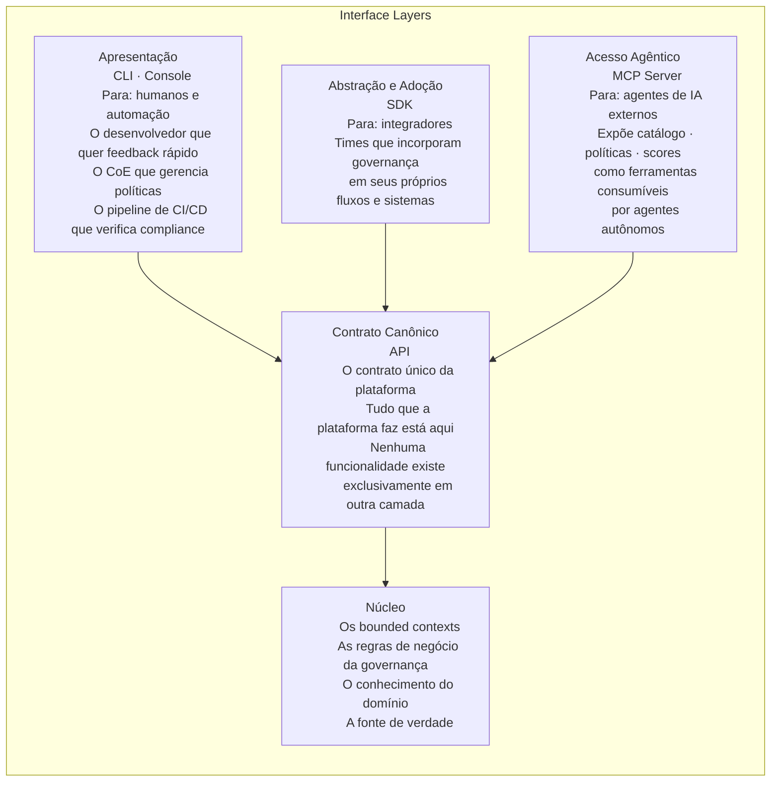
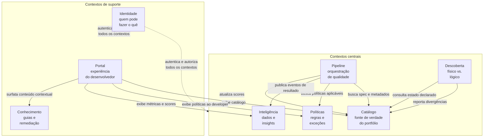

# Módulo 8 · Operacionalizando a Governança de APIs
## Capítulo 8.2 · Os contextos de uma plataforma de governança

> **Série:** Gerenciamento e Governança de APIs
> **Nível:** Arquitetural — o mapa das responsabilidades
> **Pré-requisito:** Cap 8.1 · Cap 1.2 (DDD e bounded contexts)

---

## Sumário

- [8.2.1 · Como ler este capítulo](#821--como-ler-este-capítulo)
- [8.2.2 · As interface layers](#822--as-interface-layers)
- [8.2.3 · Os bounded contexts](#823--os-bounded-contexts)
- [8.2.4 · O context map](#824--o-context-map)

---

## 8.2.1 · Como ler este capítulo

Uma plataforma de governança de APIs é um sistema com responsabilidades diversas que precisam ser organizadas de forma que cada parte saiba exatamente o que é sua — e o que não é. Sem essa separação, o sistema cresce de forma acoplada: uma mudança num lugar quebra outro, a complexidade acumula sem direção, e a manutenção torna-se progressivamente mais cara.

O Cap 1.2 desta série introduziu Domain-Driven Design e o conceito de bounded context — a fronteira dentro da qual um modelo de domínio tem significado consistente. Uma plataforma de governança de APIs é um domínio suficientemente complexo para que a organização em bounded contexts seja não apenas útil, mas necessária.

Este capítulo apresenta dois modelos complementares:

**As interface layers** — como a plataforma é acessada de fora: quais canais existem, para quem cada canal foi projetado e como se relacionam entre si.

**Os bounded contexts** — como as responsabilidades se organizam internamente: o que cada contexto sabe, o que faz e, crucialmente, o que não é responsabilidade sua.

Juntos, os dois modelos formam o mapa arquitetural que orienta os capítulos seguintes.

---

## 8.2.2 · As interface layers

Toda plataforma de governança madura é estruturada em camadas de acesso sobrepostas. Cada camada serve um propósito distinto e uma audiência diferente — e todas são construídas sobre um contrato canônico único: a API.

### A API como contrato canônico

O princípio mais importante da arquitetura em camadas é que a API é o contrato canônico — a fonte de verdade sobre o que a plataforma faz e como faz. Nenhuma funcionalidade deve existir exclusivamente no CLI, no Console ou no SDK sem estar acessível via API.

Esse princípio tem consequências práticas. Qualquer ferramenta externa consegue integrar com a plataforma usando a API — sem dependência de um cliente específico. O CLI pode ser substituído por outro CLI sem perda de funcionalidade. O Console pode ser customizado ou substituído. A plataforma não cria lock-in via camada de apresentação.

### O CLI e o Console — apresentação

O CLI serve dois públicos distintos com necessidades semelhantes: o desenvolvedor individual que quer feedback rápido sobre a qualidade de uma spec, e o pipeline de CI/CD que precisa de saídas processáveis por máquina para tomar decisões de bloqueio ou liberação.

O Console serve quem prefere interfaces visuais: o arquiteto do CoE gerenciando políticas, o gestor lendo o estado do portfólio, o desenvolvedor entendendo por que um gate falhou. O Console não tem acesso privilegiado à plataforma — consome a mesma API que qualquer outro cliente.

### O SDK — abstração e adoção

O SDK existe para reduzir a barreira de adoção para times que querem integrar a governança em seus próprios sistemas. Ele encapsula os detalhes de autenticação, paginação, tratamento de erros e serialização — permitindo que um integrador foque no que quer fazer, não em como chamar a API.

Um SDK bem projetado é uma camada de abstração, não uma camada de restrição. Ele não limita o que é possível fazer — torna mais fácil fazer o que é comum. Para casos que o SDK não cobre, a API sempre está disponível.

---

## 8.2.3 · Os bounded contexts

Oito bounded contexts organizam as responsabilidades internas da plataforma. Cada um é descrito pelo que é sua responsabilidade exclusiva, pelos conceitos centrais do seu modelo de domínio e pelo que explicitamente não é seu — as fronteiras que previnem o acoplamento.

---

### Catálogo

**Responsabilidade:** ser a fonte de verdade sobre o que existe no portfólio de APIs — cada API, sua especificação, seu ciclo de vida, seus consumidores, seus deployments e seus owners.

**O que só o Catálogo sabe:**
- Quais APIs existem, em qual estado do ciclo de vida e quem é responsável
- Qual é a especificação atual e o histórico de versões de cada API
- Quais consumidores dependem de quais APIs
- Onde cada API está deployada

**Linguagem ubíqua:** API, Especificação, Versão, Deployment, Consumidor, Owner, Stage de Ciclo de Vida, Depreciação

**O que não é responsabilidade do Catálogo:** avaliar se uma API está em compliance com políticas, descobrir APIs que existem na infraestrutura mas não foram registradas, armazenar o histórico analítico do portfólio.

---

### Políticas

**Responsabilidade:** ser a fonte de verdade sobre as regras que governam o portfólio — quais políticas existem, como são avaliadas, quais exceções foram concedidas e a quem.

**O que só Políticas sabe:**
- Quais políticas estão ativas, para quais APIs se aplicam e com qual nível de enforcement por ambiente
- Como avaliar uma especificação contra uma política — a lógica de avaliação
- Quais exceções foram aprovadas, por quem e até quando
- O histórico de avaliações e exceções para auditoria

**Linguagem ubíqua:** Política, Regra, Violação, Gate, Enforcement Level, Exceção, Escopo de Política, Aprovação

**O que não é responsabilidade de Políticas:** armazenar especificações, decidir quando uma API deve ser avaliada, acumular dados históricos de tendência.

---

### Pipeline

**Responsabilidade:** orquestrar o processo de verificação de qualidade de uma API — coordenar quais gates precisam ser executados, em qual ordem, e consolidar os resultados.

**O que só Pipeline sabe:**
- Como coordenar a execução de múltiplos gates em paralelo ou em sequência
- A diferença entre um contexto de CI e um contexto de CD — e quais gates se aplicam em cada um
- O estado atual de cada execução de verificação

**Linguagem ubíqua:** Run, Gate, Resultado, Contexto (CI/CD), Ambiente, Spec Bundle, Gate Platform-side, Gate Runner-side

**O que não é responsabilidade de Pipeline:** definir as regras de cada política, armazenar o histórico analítico de execuções, descobrir APIs na infraestrutura.

---

### Inteligência

**Responsabilidade:** transformar os eventos produzidos pela plataforma em dois tipos de inteligência com audiências e propósitos distintos: inteligência de portfólio e inteligência de produto.

**Inteligência de portfólio** — para o CoE e gestores, sobre as APIs governadas:
- O histórico de eventos de governança — execuções de gates, scores, exceções, mudanças de ciclo de vida
- Tendências de qualidade por dimensão, por domínio, por time
- Padrões que indicam problemas sistêmicos ou oportunidades de melhoria no portfólio

**Inteligência de produto** — para o time que evolui a plataforma, sobre como ela é usada:
- Quais capacidades e features são mais utilizadas
- Onde os usuários encontram atrito no fluxo de governança
- Métricas de adoção por time, por domínio, por canal de acesso
- O que orienta a evolução da plataforma com base em evidências — não em percepção

A separação entre as duas inteligências é intencional: misturá-las cria confusão de audiência e de propósito. O CoE não precisa saber quantas vezes o CLI foi chamado na semana. O time da plataforma não precisa dos scores de compliance do portfólio para decidir o que melhorar no produto.

**Linguagem ubíqua:** Score, Tendência, Insight, Métrica, Portfolio Health, Adoção, Atrito, Feature Usage

**O que não é responsabilidade de Inteligência:** enforçar políticas, manter o catálogo atualizado, produzir alertas operacionais sobre a saúde da própria infraestrutura da plataforma.

---

### Descoberta

**Responsabilidade:** comparar o estado declarado no Catálogo com o estado real da infraestrutura — identificar divergências e reportá-las para que possam ser tratadas.

**O que só Descoberta sabe:**
- Como acessar diferentes tipos de infraestrutura para verificar o que realmente existe
- Quais divergências foram detectadas e quando
- O estado de reconciliação entre o inventário lógico e o físico

**Linguagem ubíqua:** Shadow API, Drift de Contrato, Reconciliação, Divergência, Scanner, Inventário Físico, Inventário Lógico

**O que não é responsabilidade de Descoberta:** decidir o que fazer com as divergências encontradas — isso é do CoE. Manter o catálogo atualizado — isso é do Catálogo após receber os eventos de divergência.

---

### Identidade

**Responsabilidade:** gerenciar quem pode fazer o quê na plataforma — humanos, sistemas e agentes — e como esse acesso é autenticado, autorizado e auditado.

**O que só Identidade sabe:**
- Quais usuários, service accounts e agentes existem na plataforma
- Quais papéis e permissões cada um tem
- Como federar com sistemas externos de identidade organizacional
- O histórico de acesso para auditoria

**Linguagem ubíqua:** Usuário, Papel, Permissão, Credencial, Service Account, Identidade Agêntica, Federação, Token, Escopo de Acesso

**O que não é responsabilidade de Identidade:** conhecer as regras de negócio da governança, decidir se uma API está em compliance, gerenciar o catálogo do portfólio.

---

### Portal

**Responsabilidade:** ser a interface entre a plataforma e as pessoas que criam e consomem APIs — proporcionando descoberta, documentação, onboarding e self-service.

**O que só Portal sabe:**
- Como apresentar o catálogo de APIs de forma que seja útil para descoberta
- O estado do onboarding de cada consumidor
- Como renderizar documentação interativa a partir das especificações

**Linguagem ubíqua:** Descoberta, Documentação Interativa, Sandbox, Onboarding, Self-service, Assinatura, Try-it-out

**O que não é responsabilidade de Portal:** armazenar as especificações (consulta o Catálogo), definir as políticas (consulta Políticas), autenticar usuários (delega para Identidade), produzir o conteúdo de conhecimento (consome o Conhecimento).

---

### Conhecimento

**Responsabilidade:** gerenciar o conhecimento acumulado da governança — guias, artigos de remediação, boas práticas — com ciclo de vida próprio, processo de revisão e capacidade de ser consumido de forma contextual e semântica.

**O que só Conhecimento sabe:**
- Quais artigos e guias existem, em qual versão, quem os mantém e qual é seu estado de validade
- Como organizar e recuperar conteúdo por contexto — quando um gate falha, qual conteúdo é relevante
- Como expor o conhecimento para consumo por agentes de IA de forma semântica

**Linguagem ubíqua:** Artigo, Guia de Remediação, Categoria, Versão de Conteúdo, Revisão, Validade, Busca Semântica

**O que não é responsabilidade de Conhecimento:** produzir dados de portfólio, enforçar políticas, substituir o Portal — é um contexto que alimenta o Portal com conteúdo, não que é o Portal.

---

## 8.2.4 · IA e DX como dimensões transversais

Além dos bounded contexts, duas dimensões permeiam a plataforma de forma transversal — não pertencem a um contexto único, mas se manifestam em múltiplos contextos e nas interface layers.

### IA — três ângulos de uso

A inteligência artificial aparece na plataforma em três formas complementares:

**A plataforma consumida por agentes** — o MCP Server expõe as capacidades da plataforma como ferramentas para agentes de IA externos. Um agente pode buscar APIs no catálogo, verificar compliance de uma spec, consultar políticas ativas. A plataforma torna-se um componente ativo no ecossistema agêntico.

**IA usada pelos contextos internos** — Pipeline usa IA para validação semântica que vai além do que regras determinísticas capturam. Inteligência usa IA para análise preditiva e detecção de anomalias. Políticas usa IA para sugerir regras baseadas em padrões detectados. Conhecimento usa IA para busca semântica e recuperação contextual.

**Agentes que assistem os usuários** — a plataforma oferece assistência inteligente aos seus próprios usuários: um assistente que conhece o catálogo e as políticas e ajuda o desenvolvedor a construir APIs alinhadas antes de submeter, um agente de suporte que responde dúvidas de processo com base no KB, um guia de impedimentos que orienta como resolver bloqueios de governança.

O Cap 8.10 aprofunda cada um desses três ângulos.

### DX — uma propriedade das interface layers

Developer Experience não é apenas o Portal — é uma propriedade que permeia todas as interface layers. O feedback do CLI quando um gate falha, a clareza das mensagens de erro, a facilidade do processo de exceção, o tempo de resposta do pipeline de verificação — tudo isso compõe a DX da governança.

Uma plataforma que enforça corretamente mas comunica mal tem DX ruim. Uma plataforma que tem ótimos dashboards mas processo de onboarding confuso tem DX ruim. A DX é medida como parte da inteligência de produto — e orienta a evolução das interface layers assim como dados de portfólio orientam a evolução das políticas.

O Cap 8.11 trata DX e inteligência de produto como capacidades complementares.

---

## 8.2.5 · O context map

O context map descreve como os bounded contexts se relacionam — quem depende de quem e como a informação flui entre contextos.

### Três padrões de relação

**Downstream de eventos** — Pipeline e Discovery publicam eventos que Inteligência consome. Não há chamada direta — os contextos são desacoplados via eventos. Isso significa que Inteligência pode ser evoluída ou substituída sem afetar Pipeline ou Discovery.

**Consulta por necessidade** — Pipeline consulta Catálogo e Políticas para obter o que precisa para cada execução. Portal consulta Catálogo, Políticas e Inteligência para compor a experiência de cada usuário. A consulta é pontual e o contexto consultado não sabe quem o consultou.

**Identidade como contexto transversal** — Identidade autentica e autoriza acessos em todos os outros contextos. É o único contexto com relação transversal — mas mesmo assim não conhece as regras de negócio dos outros contextos. Sabe quem pode fazer o quê, não o que cada coisa significa para o negócio.

---

## Pontos-chave do capítulo

- Interface layers e bounded contexts são dois modelos complementares: um descreve como a plataforma é acessada de fora, o outro como as responsabilidades se organizam por dentro
- Quatro interface layers: Apresentação (CLI/Console), Abstração (SDK), Acesso Agêntico (MCP Server) e o Contrato Canônico (API)
- A API como contrato canônico é o princípio mais importante: tudo que a plataforma faz está na API, nenhuma funcionalidade existe exclusivamente em outra camada
- O MCP Server expõe as capacidades da plataforma para agentes de IA externos — uma quarta forma de acesso ao lado do CLI, SDK e API direta
- Oito bounded contexts organizam as responsabilidades: Catálogo, Políticas, Pipeline, Inteligência, Descoberta, Identidade, Portal e Conhecimento
- O contexto de Inteligência tem duas responsabilidades separadas: inteligência de portfólio (para o CoE) e inteligência de produto (para o time da plataforma)
- IA e DX são dimensões transversais — IA aparece em três ângulos distintos, DX é uma propriedade das interface layers medida pela inteligência de produto
- A clareza sobre o que não é responsabilidade de cada contexto é tão importante quanto a clareza sobre o que é

---

## Próximo capítulo

**8.3 · O catálogo como fonte de verdade** — o que precisa estar registrado, como o catálogo se mantém fiel à realidade e o ciclo de vida do registro de uma API.

---

*Série: Gerenciamento e Governança de APIs · Módulo 8 · Capítulo 8.2*