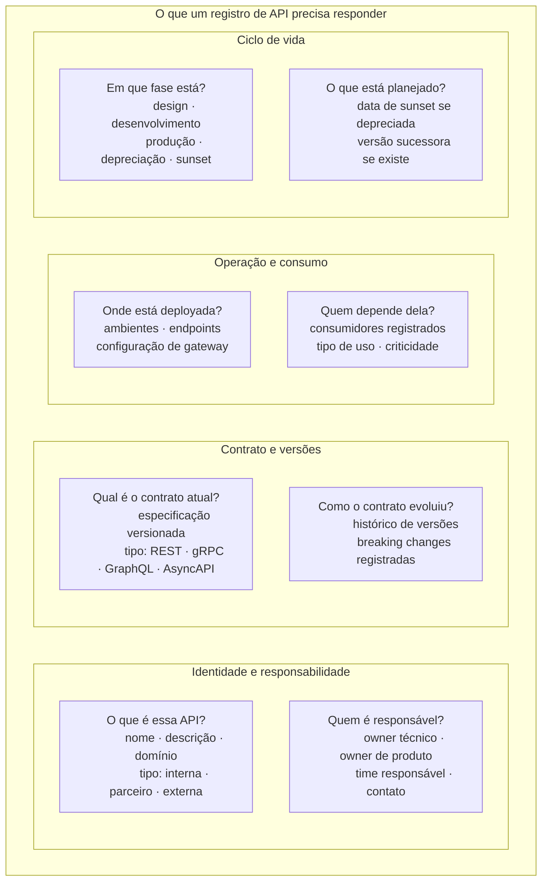
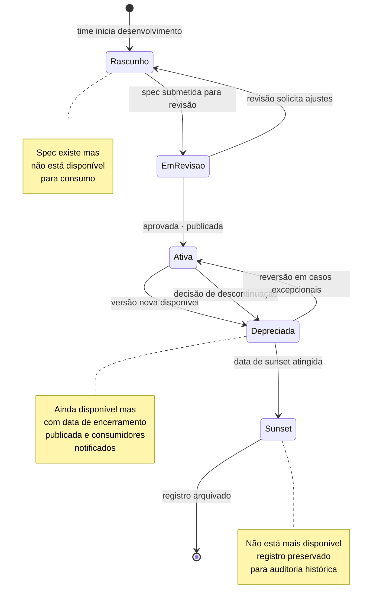
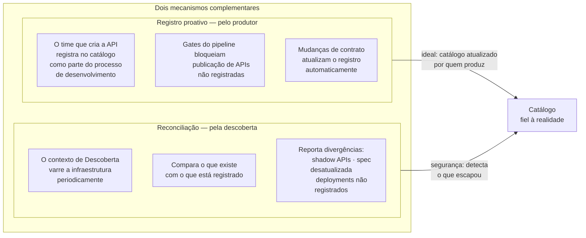

# Módulo 8 · Operacionalizando a Governança de APIs
## Capítulo 8.3 · O catálogo como fonte de verdade

> **Série:** Gerenciamento e Governança de APIs
> **Nível:** Capacidade — o que o catálogo precisa ser
> **Pré-requisito:** Cap 8.2 · Cap 3.5

---

## Sumário

- [8.3.1 · O problema que o catálogo resolve](#831--o-problema-que-o-catálogo-resolve)
- [8.3.2 · O que um registro precisa conter](#832--o-que-um-registro-precisa-conter)
- [8.3.3 · O ciclo de vida do registro](#833--o-ciclo-de-vida-do-registro)
- [8.3.4 · Como o catálogo se mantém fiel à realidade](#834--como-o-catálogo-se-mantém-fiel-à-realidade)
- [8.3.5 · O catálogo como fundação das outras capacidades](#835--o-catálogo-como-fundação-das-outras-capacidades)
- [8.3.6 · Desafios comuns](#836--desafios-comuns)

---

## 8.3.1 · O problema que o catálogo resolve

Toda organização com mais de algumas dezenas de APIs enfrenta uma versão do mesmo problema: ninguém sabe com certeza o que existe. Times diferentes têm listas diferentes. A lista do time de segurança não bate com a lista do time de infraestrutura. A lista do CoE está desatualizada. Nenhuma das listas inclui as APIs internas que nunca foram "oficialmente" publicadas mas que têm consumidores ativos.

Esse estado — portfólio sem inventário confiável — não é apenas inconveniente. É o pré-requisito para todos os outros problemas de governança: você não pode enforçar políticas sobre APIs que não sabe que existem, não pode medir compliance de um portfólio que não está inventariado, não pode planejar depreciações de APIs cujos consumidores você desconhece.

O catálogo existe para resolver esse problema de forma permanente — não como uma planilha ou uma wiki que alguém mantém manualmente, mas como um sistema que é a **fonte de verdade** sobre o portfólio: o lugar ao qual todos os outros sistemas recorrem quando precisam saber o que existe.

A distinção entre catálogo como lista e catálogo como fonte de verdade é fundamental. Uma lista é um instantâneo. Uma fonte de verdade é um sistema vivo que reflete o estado atual do portfólio, é alimentado por eventos reais e é consultado por outras capacidades como referência canônica.

---

## 8.3.2 · O que um registro precisa conter

Um registro de API no catálogo é mais do que metadados básicos. Para ser útil como fonte de verdade, cada entrada precisa responder a um conjunto de perguntas que diferentes atores do ecossistema fazem com propósitos diferentes.

Um registro incompleto é melhor que nenhum registro — mas um registro desatualizado pode ser pior que nenhum, porque cria falsa confiança. Um consumidor que encontra a API no catálogo e vê a especificação da versão anterior pode construir uma integração baseada em contrato obsoleto.

A qualidade do catálogo não é medida pelo número de APIs registradas. É medida pela confiabilidade do que está registrado.

---

## 8.3.3 · O ciclo de vida do registro

O registro de uma API no catálogo não é um evento único — é o início de um relacionamento entre a API e o sistema de governança que dura toda a vida útil da API.

Cada transição de estado é um evento no catálogo — registrado com timestamp, autor e razão. Esse histórico de estados tem valor além da auditoria: permite análises de ciclo de vida do portfólio. Quanto tempo em média as APIs passam em cada fase? Quais domínios têm mais APIs em depreciação sem sunset definido?

O estado de **depreciação** merece atenção especial. Uma API depreciada não é uma API esquecida — é uma API com compromissos ativos com consumidores e uma data de encerramento que precisa ser honrada. O catálogo deve tornar visível o que está pendente nessa fase: quantos consumidores ainda estão ativos, se migraram ou não, quanto tempo falta para o sunset.

---

## 8.3.4 · Como o catálogo se mantém fiel à realidade

O maior risco de um catálogo é o desalinhamento entre o que está registrado e o que existe na realidade. Esse desalinhamento acontece de três formas:

**APIs que existem mas não estão no catálogo** — criadas sem passar pelo processo de registro, ou criadas antes do catálogo existir.

**APIs no catálogo que não existem mais** — desativadas sem atualizar o registro.

**APIs com especificação desatualizada** — a implementação evoluiu mas o contrato registrado não foi atualizado.

Manter o catálogo fiel à realidade requer dois mecanismos complementares:

O registro proativo é o mecanismo ideal — mas depende de processo e disciplina. A reconciliação é o mecanismo de segurança — detecta o que escapou do processo. Os dois juntos criam um sistema resiliente: se o processo falha em capturar uma API, a reconciliação a detecta.

---

## 8.3.5 · O catálogo como fundação das outras capacidades

O catálogo não é apenas uma das oito capacidades da plataforma — é a fundação sobre a qual várias outras dependem. Sem um catálogo confiável, as outras capacidades perdem eficácia.

**Pipeline** — para avaliar uma spec submetida, o Pipeline consulta o catálogo para entender o contexto da API: qual domínio, qual tipo, qual é a versão anterior para comparação de breaking changes. Sem catálogo, o Pipeline avalia specs em isolamento — sem o contexto que torna as políticas aplicáveis.

**Inteligência** — as métricas e tendências que a Inteligência produz são sobre APIs específicas, domínios específicos, times específicos. A dimensão analítica — "o domínio de pagamentos está regredindo em qualidade" — só é possível porque o catálogo sabe a qual domínio cada API pertence.

**Descoberta** — para saber quais APIs estão faltando no catálogo ou têm spec desatualizada, a Descoberta precisa do catálogo como referência do estado declarado. O catálogo é o "estoque lógico" que a Descoberta compara com o "estoque físico" da infraestrutura.

**Portal** — o que o desenvolvedor vê no portal é uma apresentação do catálogo. A qualidade da experiência de descoberta e documentação é limitada pela qualidade do que está no catálogo.

---

## 8.3.6 · Desafios comuns

### O catálogo como destino, não como caminho

A organização decide criar um catálogo e começa pelo levantamento: quantas APIs existem? Em qual estado? Quem é o owner? Esse levantamento revela um número maior do que o esperado, com grande parte em estado desconhecido. O trabalho de preencher as lacunas é significativo — e enquanto não está completo, o catálogo não pode ser usado como fonte de verdade.

A armadilha é tratar o catálogo como um projeto com data de início e fim, em vez de uma capacidade que começa pequena e cresce. Começar com as APIs mais críticas e de maior visibilidade — e tornar o registro obrigatório para novas APIs — produz um catálogo parcial mas confiável mais rápido do que tentar registrar tudo de uma vez.

### Ownership sem responsabilidade real

Toda API tem um owner no catálogo. Mas quando a API muda, o owner não atualiza o registro. Quando o owner muda de time, o registro não é transferido. Com o tempo, "owner" torna-se um campo que existe no registro mas não corresponde a ninguém que se sente responsável pelo que está registrado.

Ownership no catálogo precisa ser conectado a processos reais — notificações de expiração de spec, alertas de consumidores ativos em APIs depreciadas, revisões periódicas de estado. O campo "owner" só tem valor se gerar responsabilidade observável.

### A ilusão de completude

O catálogo tem 500 APIs registradas. O CoE divulga o número como evidência de maturidade da governança. Mas 40% das APIs registradas têm specs desatualizadas, 25% não têm consumidores registrados, 15% têm owners que saíram da organização. O catálogo é grande mas não é confiável.

Um catálogo de 100 APIs com alta qualidade de registro é mais valioso — como fonte de verdade e como fundação para as outras capacidades — do que um catálogo de 500 APIs com registro de baixa qualidade.

---

## Pontos-chave do capítulo

- O catálogo existe para tornar o portfólio governável: sem inventário confiável, nenhuma outra capacidade de governança funciona bem
- A diferença entre catálogo como lista e catálogo como fonte de verdade: uma lista é um instantâneo, uma fonte de verdade é um sistema vivo consultado por outras capacidades
- Um registro precisa responder às perguntas de múltiplos atores: identidade e responsabilidade, contrato e versões, operação e consumo, ciclo de vida
- Dois mecanismos complementares mantêm o catálogo fiel à realidade: registro proativo pelo produtor e reconciliação pela Descoberta
- O catálogo é a fundação do Pipeline, da Inteligência, da Descoberta e do Portal — sua qualidade limita a qualidade de todas essas capacidades
- A qualidade do catálogo é medida pela confiabilidade do que está registrado, não pelo número de entradas

---

## Próximo capítulo

**8.4 · Políticas como código** — o que significa gerir políticas como artefatos versionados, como o ciclo de vida de uma política é gerido e como exceções fazem parte do modelo sem comprometer o enforcement.

---

*Série: Gerenciamento e Governança de APIs · Módulo 8 · Capítulo 8.3*