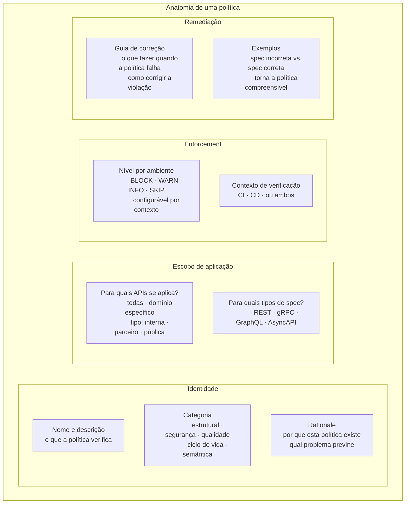
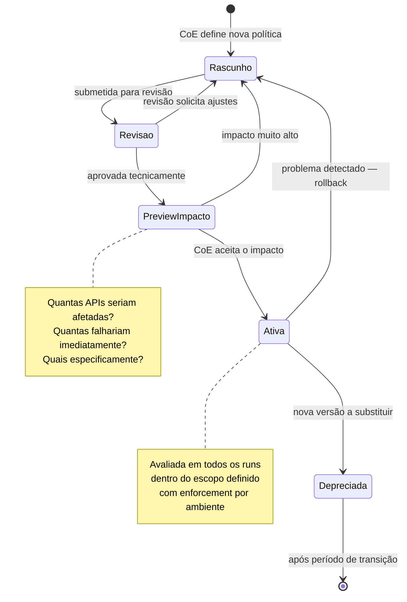
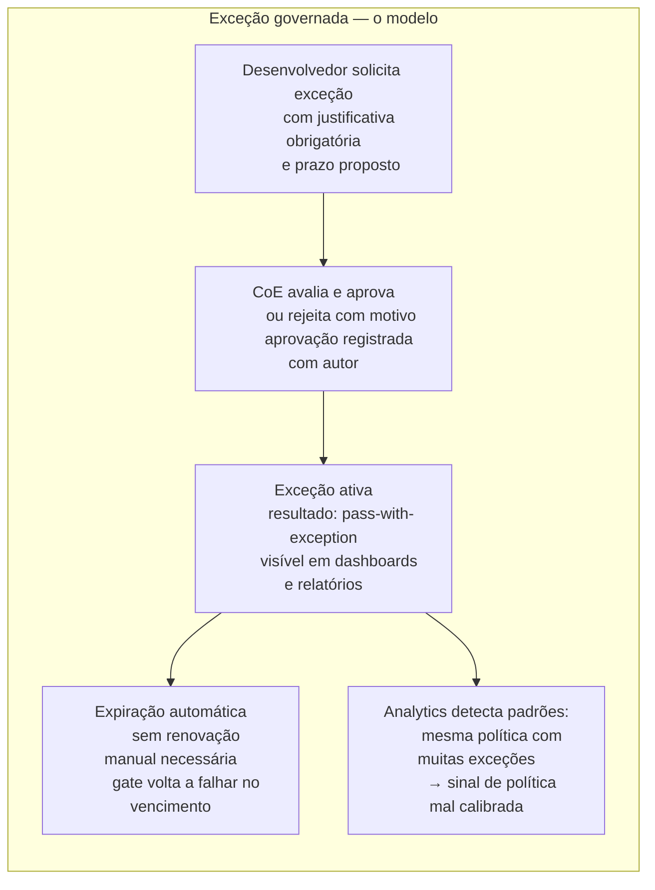

# Módulo 8 · Operacionalizando a Governança de APIs
## Capítulo 8.4 · Políticas como código

> **Série:** Gerenciamento e Governança de APIs
> **Nível:** Capacidade — o que significa gerir políticas como artefatos
> **Pré-requisito:** Cap 8.2 · Cap 8.3 · Cap 3.4

---

## Sumário

- [8.4.1 · O argumento por políticas como código](#841--o-argumento-por-políticas-como-código)
- [8.4.2 · O que uma política contém](#842--o-que-uma-política-contém)
- [8.4.3 · O ciclo de vida de uma política](#843--o-ciclo-de-vida-de-uma-política)
- [8.4.4 · Enforcement por ambiente](#844--enforcement-por-ambiente)
- [8.4.5 · Exceções como parte do modelo](#845--exceções-como-parte-do-modelo)
- [8.4.6 · Preview de impacto antes de ativar](#846--preview-de-impacto-antes-de-ativar)
- [8.4.7 · Desafios comuns](#847--desafios-comuns)

---

## 8.4.1 · O argumento por políticas como código

Políticas de governança — "toda API deve declarar mecanismo de autenticação", "operações irreversíveis devem ser sinalizadas no contrato", "schemas de entrada devem recusar campos desconhecidos" — podem existir de três formas.

Na primeira forma, existem na cabeça de arquitetos experientes. São aplicadas quando esses arquitetos estão envolvidos e ignoradas quando não estão. Não são auditáveis, não são consistentes, não sobrevivem a mudanças de equipe.

Na segunda forma, existem em documentos — wikis, PDFs, páginas de confluence. São acessíveis mas não verificáveis. Um desenvolvedor pode lê-las, concordar com elas e involuntariamente não as aplicar. A conformidade depende de memória e atenção individual.

Na terceira forma, existem como código — artefatos versionados, revisados, testados e avaliados automaticamente contra as specs do portfólio. Cada política é uma regra executável. A conformidade é verificada, não presumida.

A expressão "políticas como código" herda a lógica de "infraestrutura como código": trazer para o domínio das políticas de governança as disciplinas que a engenharia de software desenvolveu para gerenciar complexidade — controle de versão, revisão por pares, testes automatizados, histórico de mudanças.

A diferença não é apenas operacional. É epistemológica: uma política que existe como código pode ser testada — você pode demonstrar que funciona, que detecta o que deveria detectar e que não gera falsos positivos inaceitáveis. Uma política que existe como documento não pode ser testada da mesma forma.

---

## 8.4.2 · O que uma política contém

Uma política bem modelada contém mais do que a regra em si. O contexto que explica por que a regra existe e o guia que ajuda quem violou a corrigi-la são tão importantes quanto a regra — porque determinam se a política será compreendida, respeitada e bem aplicada.



O **rationale** merece atenção especial. Uma política sem justificativa é uma regra arbitrária — o desenvolvedor que a recebe sem contexto tende a cumpri-la mecanicamente ou a resistir a ela. Uma política com justificativa clara — "esta regra existe porque schemas sem restrição de campos desconhecidos causaram vazamentos de dados em produção em organizações como a nossa" — transforma compliance em compreensão.

O **guia de remediação** é a diferença entre uma política que bloqueia e uma que ensina. Quando um gate falha, o desenvolvedor precisa saber o que fazer. Uma mensagem de erro sem orientação de correção transfere o custo do aprendizado inteiramente para o desenvolvedor.

---

## 8.4.3 · O ciclo de vida de uma política



O estágio de **Preview de Impacto** é crítico e frequentemente ausente em sistemas menos maduros. Antes de ativar uma política, o CoE precisa saber o que vai acontecer: quantas APIs passariam a falhar, quais são elas, quais times seriam impactados. Ativar uma política sem essa visibilidade pode bloquear dezenas de publicações simultaneamente — o que gera resistência ao programa de governança inteiro.

O **rollback** de uma política ativa deve ser possível. Políticas bem-intencionadas às vezes revelam problemas na prática que não eram visíveis em revisão — geram falsos positivos em casos legítimos, são mais disruptivas do que o esperado, ou revelam que a regra estava mal calibrada. A capacidade de voltar ao rascunho sem cerimônia protege o CoE do custo político de políticas problemáticas.

---

## 8.4.4 · Enforcement por ambiente

Uma das contribuições mais práticas do modelo de políticas como código é a capacidade de configurar o nível de enforcement por ambiente — aplicar a mesma política com rigor diferente dependendo de onde a API será publicada.

| Nível | Significado | Uso típico |
|---|---|---|
| **BLOCK** | A publicação é bloqueada até a violação ser corrigida | Produção e staging para políticas críticas |
| **WARN** | A violação é reportada mas não bloqueia | Ambientes de desenvolvimento para políticas em adoção |
| **INFO** | A violação é registrada sem notificação ativa | Políticas em observação, ainda sem enforcement |
| **SKIP** | A política não é verificada neste ambiente | Ambientes experimentais, políticas não aplicáveis |

Essa graduação tem uma implicação importante para a adoção: uma nova política pode ser introduzida em modo **INFO** — apenas observando o portfólio sem bloquear nada — antes de ser gradualmente elevada para **WARN** e depois **BLOCK**. Isso permite que o CoE calibre a política com dados reais antes de torná-la bloqueante.

A sequência típica de adoção de uma nova política:

```
Fase 1: INFO em todos os ambientes
        Coletar dados: quantas violações? Quais são legítimas?
        Calibrar a regra se necessário

Fase 2: WARN em desenvolvimento e staging
        Tornar visível sem bloquear
        Times tomam conhecimento e começam a corrigir

Fase 3: BLOCK em staging
        Enforcement real antes de produção
        Última chance de correção sem impacto

Fase 4: BLOCK em produção
        Enforcement completo
        Novas APIs precisam estar em conformidade para publicar
```

---

## 8.4.5 · Exceções como parte do modelo

Exceções são inevitáveis em qualquer sistema de governança realista. Existem situações legítimas em que uma API não pode satisfazer uma política imediatamente — prazo crítico de negócio, dependência de migração de sistema legado, caso de uso genuinamente não coberto pela regra.

A questão não é se exceções devem existir — é se existem de forma governada ou de forma não governada.

**Exceção não governada:** o desenvolvedor pressiona o CoE, que cede informalmente. A exceção não está documentada, não tem prazo, não tem responsável. Meses depois, a violação ainda está lá e ninguém sabe por quê.

**Exceção governada:** um processo formal com justificativa obrigatória, aprovação explícita, prazo de validade e expiração automática. A violação aparece nos relatórios como "pass-with-exception" — visível, rastreável, temporária.



Dois princípios tornam o modelo de exceções robusto:

**Prazo obrigatório** — toda exceção tem data de vencimento. Não há exceções permanentes. Uma exceção que precisaria ser permanente não é uma exceção — é um sinal de que a política está errada para aquele caso.

**Expiração automática** — quando o prazo vence, o gate volta a falhar sem intervenção manual. Isso evita que exceções temporárias se tornem permanentes por inércia.

---

## 8.4.6 · Preview de impacto antes de ativar

Antes de ativar uma política, o sistema deve ser capaz de simular o impacto sobre o portfólio atual — sem aplicar o enforcement, apenas calculando o que aconteceria.

O preview responde a perguntas concretas:

- Quantas das 847 APIs ativas seriam afetadas por esta política?
- Quantas falhariam com BLOCK?
- Quais domínios têm a maior concentração de violações?
- Quais times precisariam ser notificados antes da ativação?

Essa visibilidade antes da ação tem dois efeitos. Primeiro, permite que o CoE calibre a política — se 60% do portfólio violaria uma nova regra, talvez a regra seja muito restritiva ou precise de período de transição mais longo. Segundo, permite comunicação proativa — os times afetados podem ser notificados com antecedência, evitando surpresas na próxima publicação.

---

## 8.4.7 · Desafios comuns

### Política como código sem governança da política

A organização adotou políticas como código — todas as regras são versionadas em um repositório. O problema é que o processo de revisão de mudanças de política não tem o rigor que o impacto merece. Uma mudança que vai bloquear publicações em todo o portfólio passa pelo mesmo processo que uma correção de typo na documentação. Não há preview de impacto, não há período de transição, não há comunicação estruturada.

Política como código é uma prática de engenharia. Governança de políticas é uma prática organizacional. As duas precisam coexistir — o repositório de código não substitui o processo de decisão.

### Proliferação de exceções

O processo de exceção foi criado para casos genuinamente excepcionais. Com o tempo, tornou-se o caminho padrão para APIs que não satisfazem as políticas — não porque o caso é excepcional, mas porque é mais fácil pedir exceção do que corrigir a violação. O portfólio acumula dezenas de exceções ativas e o CoE passa mais tempo gerenciando exceções do que gerenciando políticas.

A proliferação de exceções é um sinal diagnóstico valioso: se uma política acumula muitas exceções, ou a política está mal calibrada ou falta suporte para que os times a satisfaçam. Em qualquer caso, a resposta não é restringir exceções — é entender por que elas são necessárias.

### Políticas sem remediação

A política bloqueia a publicação. A mensagem de erro diz "violação de auth-policy". O desenvolvedor não sabe o que isso significa nem o que fazer. Abre um ticket de suporte. Aguarda. A publicação atrasa.

Uma política sem guia de remediação transfere o custo de aprendizado inteiramente para o desenvolvedor e para o suporte. O tempo investido em escrever um bom guia de remediação retorna imediatamente na redução de tickets de suporte e no aumento da velocidade com que desenvolvedores resolvem violações.

---

## Pontos-chave do capítulo

- Políticas como código traz para a governança as disciplinas da engenharia de software: versionamento, revisão, teste, histórico — e torna políticas verificáveis, não apenas declaradas
- Uma política bem modelada contém regra, categoria, rationale, escopo, enforcement por ambiente e guia de remediação — o rationale e o guia são tão importantes quanto a regra
- O ciclo de vida de uma política inclui preview de impacto antes da ativação e rollback quando necessário
- Enforcement por ambiente permite introdução gradual de políticas: INFO para observação, WARN para visibilidade, BLOCK para enforcement real
- Exceções são parte do modelo — a questão não é se devem existir mas se existem de forma governada: com justificativa, prazo obrigatório e expiração automática
- Proliferação de exceções é um sinal diagnóstico: ou a política está mal calibrada ou falta suporte para satisfazê-la

---

## Próximo capítulo

**8.5 · O pipeline de governança** — o que é um gate de governança, como CI e CD são contextos distintos e como equilibrar rigor e velocidade no processo de verificação de qualidade.

---

*Série: Gerenciamento e Governança de APIs · Módulo 8 · Capítulo 8.4*