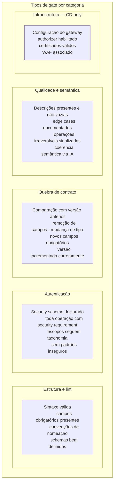
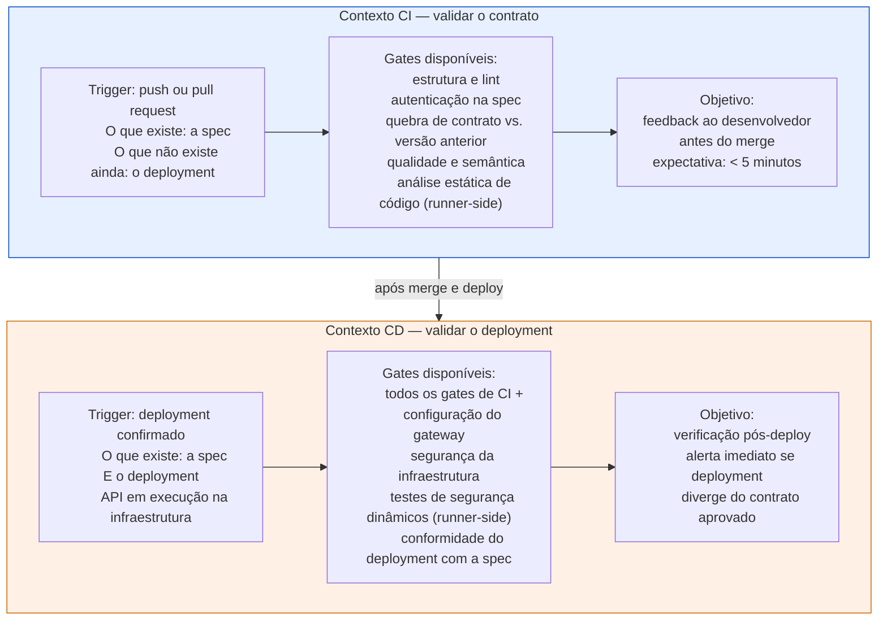
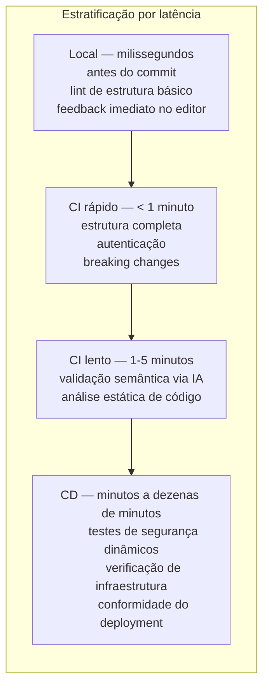
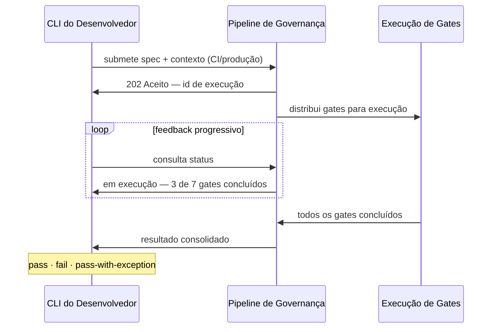

# Módulo 8 · Operacionalizando a Governança de APIs
## Capítulo 8.5 · O pipeline de governança

> **Série:** Gerenciamento e Governança de APIs
> **Nível:** Capacidade — o que o pipeline de governança precisa fazer
> **Pré-requisito:** Cap 8.2 · Cap 8.4

---

## Sumário

- [8.5.1 · O que é um pipeline de governança](#851--o-que-é-um-pipeline-de-governança)
- [8.5.2 · Gates — as unidades de enforcement](#852--gates--as-unidades-de-enforcement)
- [8.5.3 · CI e CD — dois contextos distintos](#853--ci-e-cd--dois-contextos-distintos)
- [8.5.4 · A tensão entre rigor e velocidade](#854--a-tensão-entre-rigor-e-velocidade)
- [8.5.5 · Integração e modelo de execução](#855--integração-e-modelo-de-execução)
- [8.5.6 · Desafios comuns](#856--desafios-comuns)

---

## 8.5.1 · O que é um pipeline de governança

Um pipeline de governança é o mecanismo pelo qual as políticas definidas no contexto anterior — Políticas — são aplicadas automaticamente no fluxo de desenvolvimento de APIs. Ele é o elo entre a política como artefato e a política como enforcement real.

Sem um pipeline, políticas existem como intenções. Com um pipeline, políticas existem como verificações que acontecem a cada mudança, a cada publicação, independentemente de quem está envolvido e de qual é a pressão do momento. É a automação do enforcement que o Cap 7.11 identificou como o ponto de inflexão entre o Nível 2 e o Nível 3 de maturidade.

A analogia mais próxima é o pipeline de CI/CD que a engenharia de software já utiliza — um conjunto de verificações automáticas que devem passar antes que código avance para o próximo estágio. O pipeline de governança estende essa lógica ao contrato da API: a especificação precisa passar por verificações de qualidade antes de ser publicada, da mesma forma que o código precisa passar por testes antes de ser deployado.

Três responsabilidades definem o pipeline de governança:

**Orquestrar** — coordenar quais gates precisam ser executados, em qual ordem, com quais dados de entrada. O pipeline não implementa as regras — as políticas fazem isso. O pipeline decide o que verificar e consolida os resultados.

**Enforçar** — aplicar os níveis de enforcement configurados por ambiente. Um gate que resulta em violação BLOCK em produção impede a publicação. O mesmo gate em desenvolvimento resulta em WARN — visível mas não bloqueante.

**Reportar** — produzir resultados estruturados que o desenvolvedor, o pipeline de CI/CD e o CoE conseguem consumir. O feedback deve ser específico o suficiente para orientar correção — não apenas "falhou".

---

## 8.5.2 · Gates — as unidades de enforcement

Um gate é uma verificação atômica que avalia um aspecto específico da qualidade ou compliance de uma spec de API. Cada gate implementa um conjunto de políticas de uma categoria.

Um gate tem dois modos de execução. No modo **platform-side**, o pipeline avalia a spec diretamente — tudo que pode ser verificado a partir do contrato sem acesso à infraestrutura real. No modo **runner-side**, a verificação requer acesso a sistemas externos — código-fonte para análise estática, infraestrutura deployada para testes de segurança — e é executada no ambiente do time, com o resultado enviado ao pipeline.

Essa distinção é importante porque determina onde cada tipo de verificação pode acontecer. Verificar se um security scheme está declarado na spec é platform-side — o pipeline pode fazer isso sem precisar de acesso ao ambiente do time. Verificar se o gateway está com o authorizer corretamente configurado é runner-side — requer acesso à infraestrutura que só existe no ambiente do time.

---

## 8.5.3 · CI e CD — dois contextos distintos

O mesmo conjunto de políticas pode e deve ser avaliado em dois momentos distintos do ciclo de desenvolvimento — com propósitos e gates diferentes em cada momento.

A separação entre CI e CD não é apenas técnica — é semântica. Verificar se o contrato declara autenticação em CI faz sentido porque o contrato existe. Verificar se o gateway tem o authorizer configurado em CI não faz sentido porque o gateway ainda não foi configurado.

Misturar os dois contextos — exigir verificações de infraestrutura em CI, ou relaxar verificações de contrato em CD — produz pipelines que bloqueiam no momento errado ou que não detectam o que deveriam detectar.

---

## 8.5.4 · A tensão entre rigor e velocidade

A tensão mais comum em programas de governança com pipeline automatizado é entre rigor e velocidade. Um pipeline que executa dezenas de gates em série pode levar minutos — ou dezenas de minutos com testes de segurança dinâmicos — e isso afeta diretamente o ciclo de feedback do desenvolvedor.

Essa tensão não tem uma solução única, mas tem princípios que a gerenciam:

**Paralelismo onde possível** — gates que não dependem uns dos outros podem ser executados simultaneamente. Lint de estrutura, verificação de autenticação e análise de breaking changes são independentes entre si e podem rodar em paralelo.

**Fast fail** — gates que são mais rápidos e que têm maior taxa de falha devem rodar primeiro. Se a spec tem erro de sintaxe, não há razão para executar gates de semântica que demoram mais.

**Separação por latência** — gates rápidos (< 1 segundo) devem estar disponíveis como feedback local antes mesmo do push. Gates lentos (testes de segurança dinâmicos) pertencem ao contexto CD e não devem bloquear o ciclo de CI.

**Transparência sobre o que está rodando** — o desenvolvedor deve saber em qual gate o pipeline está e qual é a estimativa de tempo restante. Um pipeline opaco que demora 10 minutos sem feedback intermediário é mais frustrante do que um que leva 10 minutos mas mostra progresso.

---

## 8.5.5 · Integração e modelo de execução

O pipeline de governança não é um sistema isolado — precisa se integrar ao fluxo de CI/CD que o time já utiliza. Isso requer um modelo de execução que acomode diferentes ferramentas, diferentes latências e diferentes formas de submissão.

**O modelo assíncrono** é a base. Quando o CLI submete uma spec para verificação, o pipeline não responde com o resultado imediato — responde com um identificador de execução e o cliente aguarda ou recebe notificação quando completo. Isso permite que gates lentos rodem em background sem bloquear o cliente.

**A notificação por webhook** complementa o polling para casos onde o cliente não aguarda ativamente — um sistema de CD que quer ser notificado quando a verificação pós-deploy completa, ou um sistema de notificação que quer informar o CoE sobre falhas críticas.

**O modelo de submissão de resultados externos** permite que gates runner-side participem do pipeline. O time executa análise estática no seu ambiente e envia o resultado ao pipeline — que os consolida com os gates platform-side para produzir o resultado final.

---

## 8.5.6 · Desafios comuns

### O pipeline como obstáculo

O pipeline bloqueia publicações. Times com pressão de prazo sentem o pipeline como obstáculo, não como aliado. A narrativa que se forma é "a governança atrasa a entrega" — e isso mina o suporte político ao programa.

A raiz do problema raramente é o pipeline em si. É a combinação de três fatores: políticas mal calibradas que geram falsos positivos, feedback pouco claro sobre o que corrigir, e ausência de assistência ao desenvolvedor no momento do bloqueio. Resolver esses três fatores — não relaxar o enforcement — é o caminho correto.

### Gates sem manutenção

Os gates foram configurados quando o programa de governança começou. Com o tempo, o portfólio evoluiu, as políticas foram revisadas, mas os gates não acompanharam. Alguns gates bloqueiam casos que o CoE já decidiu aceitar. Outros não bloqueiam casos que deveriam bloquear. A taxa de falsos positivos cresce, a credibilidade do pipeline cai.

Gates requerem manutenção contínua — revisão periódica das políticas que implementam, atualização quando as políticas mudam, remoção quando se tornam obsoletos. Um pipeline abandonado é pior do que nenhum pipeline porque cria ilusão de enforcement.

### Resultado de pipeline como fim, não como meio

O pipeline passou — a API está publicada. O resultado da execução é descartado. Nenhum dado é acumulado sobre quais gates falharam com maior frequência, quais times têm mais dificuldade com quais políticas, como a qualidade do portfólio está evoluindo.

O pipeline produz dados que têm valor além de cada execução individual. O contexto de Inteligência existe para transformar esses dados em insights de portfólio. Mas isso só é possível se os resultados do pipeline são persistidos e disponibilizados para análise — não apenas usados para decidir se bloqueia ou não.

---

## Pontos-chave do capítulo

- O pipeline de governança é o elo entre políticas como artefatos e políticas como enforcement real — sem ele, políticas são intenções
- Gates são verificações atômicas por categoria; dois modos de execução: platform-side (avalia a spec) e runner-side (executa no ambiente do time e envia resultado)
- CI e CD são contextos distintos com propósitos diferentes: CI valida o contrato, CD valida o deployment — misturar os dois produz pipelines que bloqueiam no momento errado
- A tensão entre rigor e velocidade é gerenciada por paralelismo, fast-fail, separação por latência e transparência sobre o que está executando
- O modelo assíncrono com feedback progressivo é a base da integração — o cliente não fica bloqueado aguardando gates lentos
- Resultado de pipeline é dado de portfólio — não apenas uma decisão de bloqueio ou liberação

---

## Próximo capítulo

**8.6 · Inteligência de portfólio** — como os dados produzidos pela plataforma se transformam em inteligência que orienta decisões do CoE e como detectar padrões que nenhuma regra individual consegue capturar.

---

*Série: Gerenciamento e Governança de APIs · Módulo 8 · Capítulo 8.5*