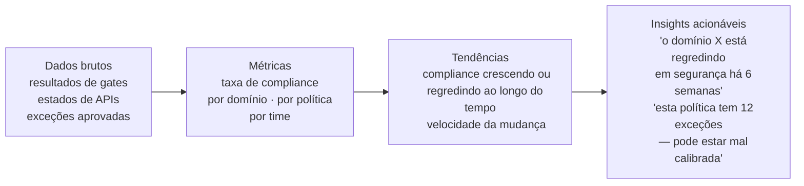
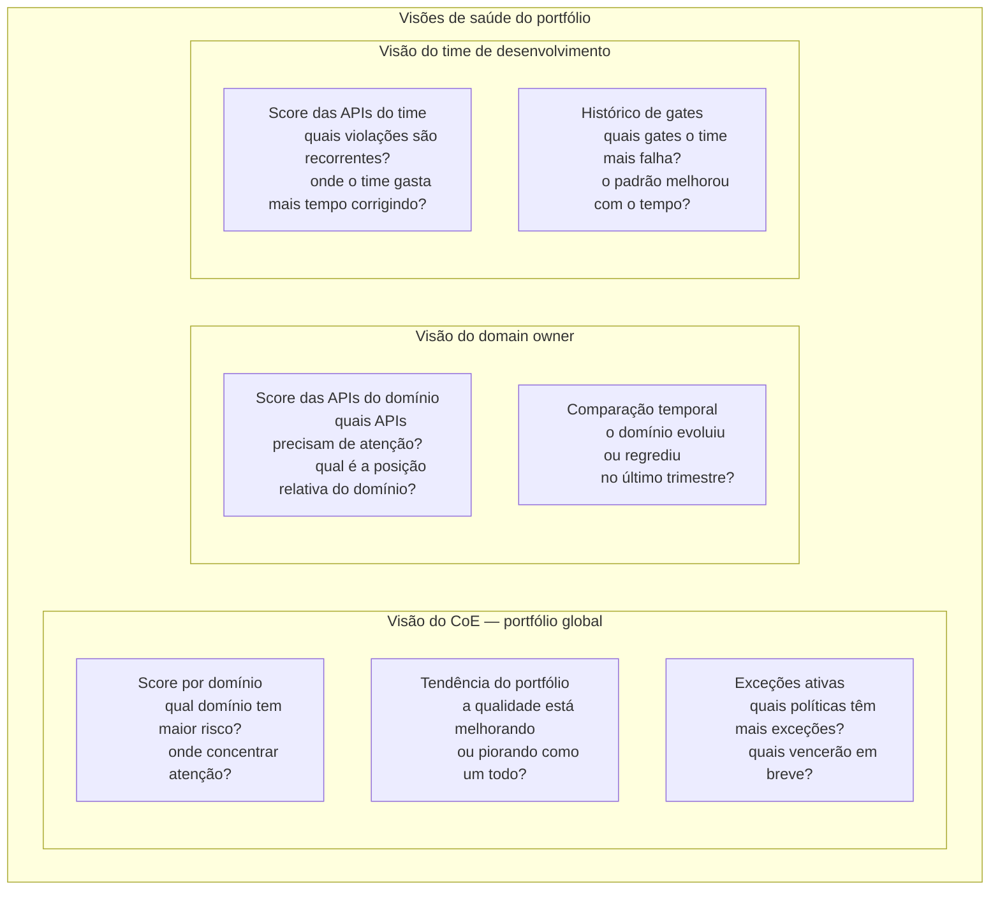
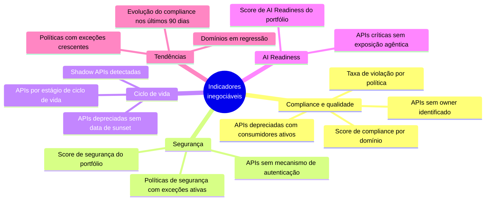

# Módulo 8 · Operacionalizando a Governança de APIs
## Capítulo 8.6 · Inteligência de portfólio

> **Série:** Gerenciamento e Governança de APIs
> **Nível:** Capacidade — como dados se transformam em decisões
> **Pré-requisito:** Cap 8.2 · Cap 8.5

---

## Sumário

- [8.6.1 · Do dado à decisão](#861--do-dado-à-decisão)
- [8.6.2 · O modelo de saúde do portfólio](#862--o-modelo-de-saúde-do-portfólio)
- [8.6.3 · Tendências vs. instantâneos](#863--tendências-vs-instantâneos)
- [8.6.4 · Padrões que dados revelam e regras não capturam](#864--padrões-que-dados-revelam-e-regras-não-capturam)
- [8.6.5 · O papel da IA na inteligência de portfólio](#865--o-papel-da-ia-na-inteligência-de-portfólio)
- [8.6.6 · Os indicadores inegociáveis](#866--os-indicadores-inegociáveis)
- [8.6.7 · Desafios comuns](#867--desafios-comuns)

---

## 8.6.1 · Do dado à decisão

Cada execução do pipeline de governança produz dados: quais gates passaram, quais falharam, com quais violações específicas, em qual ambiente, para qual API, de qual domínio. Cada exceção aprovada é um dado. Cada mudança de estado no ciclo de vida de uma API é um dado. Cada acesso ao portal por um consumidor é um dado.

Dados, sozinhos, não orientam decisões. Um relatório com 847 linhas de resultados de gates não ajuda o CoE a decidir onde investir o próximo ciclo de melhoria. O que transforma dados em inteligência é a capacidade de agregar, correlacionar e contextualizar — produzindo respostas a perguntas que têm consequências práticas.

Há uma progressão nessa transformação:

A maioria das organizações consegue chegar a métricas. Poucas chegam a insights acionáveis — porque isso requer não apenas acumular dados mas desenvolver a capacidade analítica de interpretá-los e conectá-los a decisões reais.

---

## 8.6.2 · O modelo de saúde do portfólio

A saúde do portfólio não é um número único — é um perfil multidimensional que reflete o estado do portfólio ao longo das dimensões que o Módulo 7 estabeleceu. O mesmo framework de maturidade usado para diagnóstico organizacional pode ser operacionalizado como modelo de monitoramento contínuo.

Para cada API, para cada domínio, para cada time, a inteligência de portfólio calcula scores por dimensão e os agrega em visões que respondem a perguntas diferentes para audiências diferentes.

A granularidade das visões não é apenas uma questão de conveniência — é uma questão de responsabilidade. O CoE é responsável pelo portfólio global. O domain owner é responsável pelo seu domínio. O time é responsável pelas suas APIs. A inteligência de portfólio só é acionável quando entrega os dados certos para a audiência certa.

---

## 8.6.3 · Tendências vs. instantâneos

Um dashboard que mostra o estado atual do portfólio é útil. Um dashboard que mostra como o portfólio está evoluindo é decisivo.

A diferença entre um portfólio estagnado no Nível 3 e um portfólio em trajetória para o Nível 4 não é visível num instantâneo — é visível na tendência. Da mesma forma, um portfólio que era Nível 4 há seis meses e está regredindo para o Nível 3 parece igual a um portfólio que sempre foi Nível 3 quando você olha apenas o estado atual.

Tendências respondem perguntas que instantâneos não conseguem:

- O domínio de pagamentos tem score 72% agora. Isso é bom ou ruim? — a tendência diz se está melhorando ou piorando.
- O time Y tem a menor taxa de compliance do portfólio. É um problema estrutural ou um desvio pontual? — a tendência diz há quanto tempo isso ocorre.
- Uma nova política foi ativada há 30 dias. Funcionou? — a tendência de compliance para essa política depois da ativação responde.

Produzir tendências requer que os dados históricos sejam preservados — não apenas o estado atual. Um catálogo que só guarda a versão atual de uma API não permite análise histórica de sua trajetória de qualidade. Um pipeline que só reporta o último resultado não permite calcular a taxa de melhoria de um time ao longo do tempo.

---

## 8.6.4 · Padrões que dados revelam e regras não capturam

Alguns problemas de governança não são visíveis na avaliação de uma API individual — só emergem quando se observa o portfólio como um todo ao longo do tempo. Esses são os padrões que a inteligência de portfólio é capaz de detectar e que nenhuma regra de política individual consegue capturar.

**O sinal de política mal calibrada**

Uma política que acumula muitas exceções num curto período não está sendo enforçada mal — está sinalizando que pode estar errada. Se 15 times diferentes solicitaram exceção para a mesma política nas últimas 8 semanas, há duas hipóteses: ou a política é genuinamente necessária e os times estão sistematicamente descumprindo um padrão importante, ou a política não se aplica tão universalmente quanto parecia quando foi criada.

Dados de exceções permitem distinguir entre as duas hipóteses — e isso é informação que o CoE precisa para revisar políticas com base em evidências, não em intuição.

**A correlação entre qualidade de contrato e incidentes**

Portfólios com histórico suficiente de dados começam a revelar correlações que antes eram apenas suspeitas. APIs com menor score de qualidade de contrato têm maior taxa de tickets de suporte? APIs sem SLO definido têm maior variabilidade de disponibilidade? Essas correlações, quando detectadas nos dados, transformam hipóteses em argumentos baseados em evidências para investimentos em qualidade.

**O efeito de iniciativas de governança**

Quando o CoE lança uma iniciativa — um ciclo de melhoria de qualidade em um domínio, um treinamento sobre um aspecto específico de segurança — a inteligência de portfólio consegue medir o impacto dessa iniciativa nos dados. Isso fecha o loop de feedback que transforma governança de programa de boas intenções em programa de melhoria contínua.

---

## 8.6.5 · O papel da IA na inteligência de portfólio

A inteligência de portfólio baseada em regras e agregações tem um limite: detecta o que foi antecipado quando as métricas foram definidas. A IA amplia esse limite de duas formas.

**Detecção de anomalias sem regras explícitas**

Um modelo de aprendizado treinado no histórico de comportamento do portfólio consegue identificar desvios do padrão que nenhuma regra determinística descreveria adequadamente. Uma API cujo tempo de publicação é 10 vezes maior que a média do domínio pode ser um sinal de problema que merece investigação — não necessariamente uma violação, mas uma anomalia que justifica atenção.

**Síntese de insights a partir de múltiplas fontes**

O CoE recebe dados de compliance, dados de uso, dados de exceções e dados de ciclo de vida. Sintetizar manualmente essas fontes para chegar a um insight acionável demanda tempo e atenção que nem sempre estão disponíveis. Um assistente de análise que processa essas fontes e formula hipóteses — "o domínio X está regredindo em segurança enquanto acelera o ritmo de publicações; pode valer investigar se a pressão de prazo está impactando a qualidade" — amplifica a capacidade analítica do CoE sem substituir o julgamento humano.

A IA na inteligência de portfólio não é uma caixa preta que toma decisões. É uma capacidade de síntese que processa volume de dados que humanos não processariam manualmente e formula hipóteses que humanos avaliam e confirmam — ou descartam.

---

## 8.6.6 · Os indicadores inegociáveis

Independentemente do tamanho do portfólio ou do nível de maturidade da organização, um conjunto de indicadores não pode estar ausente de uma plataforma de governança operacional.

Esses indicadores são inegociáveis não porque são os mais sofisticados — são os que respondem às perguntas que o CoE precisa responder semanalmente para gerir o portfólio com responsabilidade.

---

## 8.6.7 · Desafios comuns

### Dados sem processo de consumo

A plataforma produz dados ricos. Dashboards estão disponíveis. Mas não há processo estabelecido de quando e como o CoE consome esses dados para tomar decisões. Os dashboards são abertos esporadicamente, os dados são apresentados em reuniões sem consequências práticas, e o ciclo de melhoria nunca fecha.

Inteligência de portfólio só tem valor quando conectada a um processo de decisão. Uma revisão periódica do portfólio — com pauta estruturada a partir dos indicadores, responsáveis definidos para cada área de atenção e decisões documentadas — transforma dados em governança real.

### Score único como substituto do perfil

O portfólio tem um "score de governança" de 78%. Esse número vai para a apresentação da liderança e cria a ilusão de que a governança está funcionando bem. O que o número não mostra: que a segurança está em 45%, que o domínio de pagamentos está em regressão há dois meses, que há 23 APIs depreciadas sem data de sunset.

Um score único agrega demais. O perfil multidimensional — por dimensão, por domínio, com tendências — entrega a complexidade que um programa de governança real precisa gerenciar.

### Inteligência sem ação

O sistema detectou que uma política tem 15 exceções ativas — sinal de que pode estar mal calibrada. O insight está disponível no dashboard. Mas não há processo que conecte esse insight à revisão da política. O dado existe, o insight existe, mas a ação não acontece.

A inteligência de portfólio não gera ações automaticamente — gera hipóteses que humanos precisam investigar e agir sobre. Conectar insights a processos de decisão é a parte organizacional que a tecnologia não resolve sozinha.

---

## Pontos-chave do capítulo

- Dados se tornam inteligência quando agregados, correlacionados e contextualizados para responder perguntas com consequências práticas
- A saúde do portfólio é um perfil multidimensional — não um número único — entregue em visões calibradas para diferentes audiências: CoE, domain owners e times
- Tendências são mais decisivas que instantâneos: permitem distinguir portfólios em trajetória de melhoria de portfólios em regressão
- Alguns padrões só emergem do portfólio como um todo: política mal calibrada identificada por acúmulo de exceções, correlação entre qualidade de contrato e incidentes
- IA na inteligência de portfólio amplifica a capacidade analítica — detecta anomalias sem regras explícitas e sintetiza hipóteses a partir de múltiplas fontes — mas não substitui o julgamento humano
- Inteligência sem processo de consumo e decisão não fecha o ciclo de melhoria contínua

---

## Próximo capítulo

**8.7 · Descoberta e reconciliação** — como manter o catálogo fiel à realidade quando o portfólio muda continuamente e como detectar APIs que existem mas ninguém sabe.

---

*Série: Gerenciamento e Governança de APIs · Módulo 8 · Capítulo 8.6*