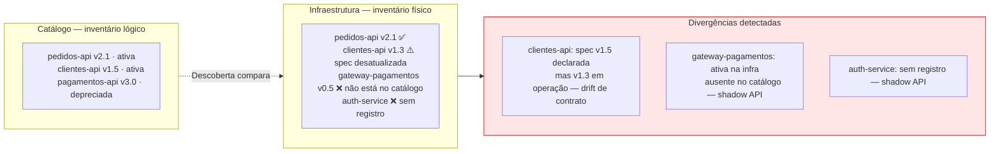
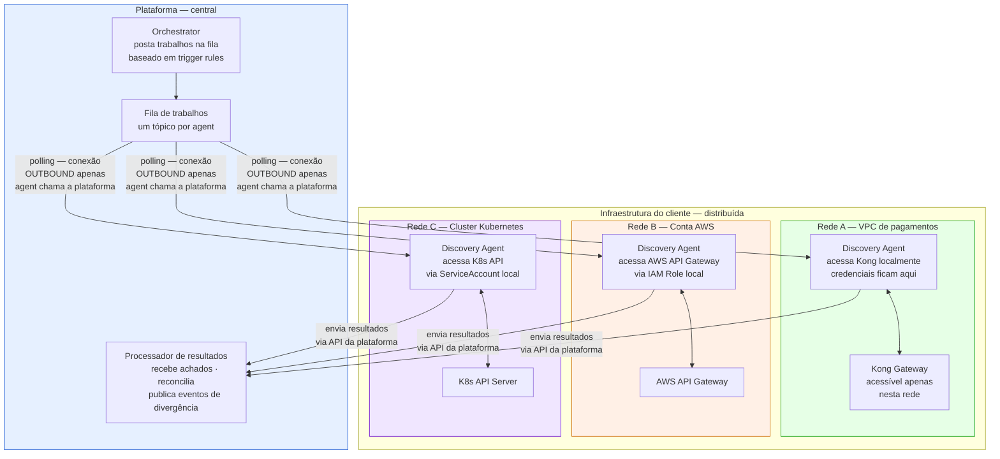

# Módulo 8 · Operacionalizando a Governança de APIs
## Capítulo 8.7 · Descoberta e reconciliação

> **Série:** Gerenciamento e Governança de APIs
> **Nível:** Capacidade — como manter o catálogo fiel à realidade
> **Pré-requisito:** Cap 8.2 · Cap 8.3

---

## Sumário

- [8.7.1 · O problema da divergência](#871--o-problema-da-divergência)
- [8.7.2 · O modelo de agent distribuído](#872--o-modelo-de-agent-distribuído)
- [8.7.3 · Capabilities — o que cada agent faz](#873--capabilities--o-que-cada-agent-faz)
- [8.7.4 · Orchestrator e trigger rules](#874--orchestrator-e-trigger-rules)
- [8.7.5 · O catálogo de divergências](#875--o-catálogo-de-divergências)
- [8.7.6 · Descoberta não decide — reporta](#876--descoberta-não-decide--reporta)
- [8.7.7 · Desafios comuns](#877--desafios-comuns)

---

## 8.7.1 · O problema da divergência

O catálogo declara o que deveria existir. A infraestrutura contém o que realmente existe. Entre os dois há sempre alguma distância — e quanto maior o portfólio e mais distribuída a infraestrutura, maior tende a ser essa distância.

A divergência entre o declarado e o real se manifesta de formas diferentes:

**APIs que existem mas não estão no catálogo** — criadas sem passar pelo processo de registro, criadas antes do catálogo existir, ou criadas por times que não conheciam o processo. São as shadow APIs: endpoints com tráfego real, potencialmente expostos à internet, sem nenhuma governança aplicada.

**APIs no catálogo com contrato desatualizado** — a implementação evoluiu, o contrato registrado não acompanhou. Consumidores que consultam o catálogo encontram uma especificação que não reflete o comportamento atual.

**APIs deployadas com configuração divergente** — o gateway está configurado diferente do que a especificação aprovada descreve. A autenticação declarada na spec não bate com o que está configurado no gateway.

**APIs no catálogo que não existem mais na infraestrutura** — desativadas sem atualizar o registro. O catálogo declara que existem, mas nenhuma requisição chega a nenhum lugar.



A descoberta é o mecanismo que sistematicamente detecta essas divergências — não como auditoria periódica, mas como processo contínuo integrado à operação da plataforma.

---

## 8.7.2 · O modelo de agent distribuído

A abordagem mais simples para descoberta seria um scanner centralizado — um componente da plataforma que acessa diretamente todos os gateways, repositórios e sistemas de runtime para verificar o que existe. Essa abordagem funciona em ambientes simples. Em organizações reais, raramente funciona.

Organizações com infraestrutura madura têm múltiplas redes segmentadas: VPCs isoladas em diferentes contas de cloud, clusters Kubernetes sem conectividade entre si, redes corporativas com firewalls que restringem acesso externo. Um scanner centralizado precisaria de acesso de rede a todos esses ambientes simultaneamente — o que requer regras de firewall complexas, credenciais distribuídas e uma superfície de ataque significativa.

O modelo de **agent distribuído** resolve esse problema de forma mais elegante. Em vez de a plataforma ir até a infraestrutura, a infraestrutura vem até a plataforma — na forma de agents que rodam dentro de cada zona de rede.



**A propriedade mais importante: conexão outbound apenas.**

O agent faz polling da fila de trabalhos — a plataforma nunca precisa "entrar" na rede do cliente. Isso significa que o único requisito de rede é que o agent consiga acessar a plataforma de saída — o que é muito mais simples de permitir em firewalls do que conexões de entrada.

**As credenciais ficam onde pertencem.**

O agent tem acesso às credenciais dos sistemas que cobre — Kong Admin Token, IAM Role, ServiceAccount do Kubernetes. Essas credenciais nunca chegam à plataforma central. A plataforma recebe apenas os resultados das varreduras, não as credenciais que possibilitaram as varreduras.

---

## 8.7.3 · Capabilities — o que cada agent faz

Um agent de descoberta não é especializado em um único tipo de varredura. É um componente com capabilities plugáveis — o mesmo agent pode executar diferentes tipos de descoberta dependendo de quais capabilities foram habilitadas na sua configuração.

| Capability | O que verifica | Contexto de uso |
|---|---|---|
| **gateway.scan** | APIs registradas no gateway · suas configurações · rotas e operações | Qualquer gateway API |
| **repository.scan** | Specs de API em repositórios de código · versões · estado de atualização | SCM com acesso ao agent |
| **runtime.scan** | Serviços ativos em runtime · ingresses expostos · endpoints sem registro | Kubernetes e equivalentes |
| **security.verify** | Configuração de segurança do gateway pós-deploy · authorizers · WAF · TLS | CD — acionado após deploy |
| **external.monitor** | Disponibilidade e SLA de APIs externas · correlação com logs de tráfego | APIs de parceiros e fornecedores |

A configuração de um agent registra quais capabilities ele tem e quais recursos cobre:

```
Agent "vpc-pagamentos":
  capabilities: [gateway.scan, security.verify]
  targets:
    - gateway Kong em kong-admin.internal:8001
    - conta AWS us-east-1 (IAM Role configurada)
```

Quando a plataforma precisa executar uma varredura de gateway na VPC de pagamentos, posta um trabalho na fila do agent correto — que tem a capability e o acesso necessários.

---

## 8.7.4 · Orchestrator e trigger rules

O Orchestrator é o componente interno da plataforma que decide **quando** e **o quê** cada agent deve varrer. Ele avalia Trigger Rules configuradas pelo CoE — que definem as condições que acionam cada tipo de descoberta.

Duas categorias de trigger:

**Schedule-based** — varreduras periódicas que acontecem independentemente de eventos. Um scan de gateway a cada 15 minutos para detectar shadow APIs. Um scan de repositório a cada hora para detectar specs desatualizadas. Adequado para descoberta contínua passiva.

**Event-driven** — varreduras acionadas por eventos específicos. Um scan de segurança imediatamente após um deployment ser confirmado. Um scan de repositório quando uma shadow API é detectada — tentando encontrar a spec que pode existir mas não foi registrada. Adequado para verificação contextual e imediata.

```yaml
# Exemplos de Trigger Rules configuradas pelo CoE

# Varredura periódica de todos os gateways
trigger: schedule
  cron: "*/15 * * * *"
  action: gateway.scan
  agents: todos os agents com essa capability

# Verificação de segurança após deploy em produção
trigger: event
  on: DeploymentConfirmado
  where: ambiente == produção
  action: security.verify
  agent: o que cobre aquele servidor

# Busca de spec quando shadow API é detectada
trigger: event
  on: ShadowAPIDetectada
  action: repository.scan
  agents: todos os agents com acesso a repositórios
```

A separação entre Orchestrator e agents tem uma implicação importante: o CoE configura as regras de quando varrer na plataforma central, sem precisar alterar a configuração de nenhum agent. Os agents executam o que a plataforma pede, quando a plataforma pede.

---

## 8.7.5 · O catálogo de divergências

Cada varredura pode resultar em divergências. As divergências têm tipos com significados e urgências diferentes:

| Divergência | O que significa | Urgência típica |
|---|---|---|
| **Shadow API** | API ativa na infraestrutura sem registro no catálogo | Alta — sem governança aplicada |
| **Drift de contrato** | Gateway serve comportamento diferente da spec registrada | Alta — consumidores podem estar integrados com contrato errado |
| **Deployment não registrado** | Serviço ativo em runtime sem deployment correspondente no catálogo | Média — pode ser shadow API ou processo não seguido |
| **Spec desatualizada** | Repositório tem versão mais nova que o catálogo | Média — catálogo pode estar defasado |
| **Consumer potencialmente inativo** | Consumer registrado sem tráfego detectado por período longo | Baixa — oportunidade de limpeza do catálogo |
| **SLA externo violado** | API externa com latência ou disponibilidade abaixo do acordado | Alta — impacto em consumidores dependentes |
| **Configuração de segurança divergente** | Gateway com configuração diferente da spec aprovada | Crítica — risco de segurança ativo |

Divergências não são erros do sistema — são informação. Uma shadow API descoberta não significa que o pipeline falhou. Significa que algo existe na realidade que não estava no mapa — e o mapa precisa ser atualizado ou a realidade precisa ser corrigida.

---

## 8.7.6 · Descoberta não decide — reporta

O contexto de Descoberta tem uma responsabilidade deliberadamente limitada: detectar divergências e reportá-las. Não decide o que fazer com elas.

Essa separação é intencional e importante. O que fazer com uma shadow API descoberta pode ter múltiplas respostas corretas dependendo do contexto:

- Pode ser uma API legada que deve ser registrada retroativamente
- Pode ser um serviço de infraestrutura que não precisa de governança formal
- Pode ser uma API de terceiro que o time está testando e que deve ser removida
- Pode ser uma API criada sem seguir o processo que deve ser bloqueada até ser registrada

Nenhuma dessas decisões pode ser tomada automaticamente com as informações que a descoberta produz. A decisão requer contexto de negócio que o CoE tem e o sistema não tem.

O que a descoberta faz é tornar a situação visível — publicar um evento com o que foi encontrado, disponibilizar o achado no painel do CoE, acionar notificações quando a urgência justifica. O CoE então age com base no que foi descoberto.

---

## 8.7.7 · Desafios comuns

### Cobertura parcial não detectada

O CoE sabe que tem agents em três zonas de rede. O que não sabe é que há uma quarta zona — um ambiente de staging criado há seis meses para um projeto específico — que nunca teve agent instalado. Sem cobertura, divergências nessa zona são invisíveis.

O mapa de cobertura — quais zonas têm agents, quais capabilities estão habilitadas em cada um — precisa ser monitorado ativamente. Um agent que parou de fazer polling não é apenas um problema operacional — é uma lacuna de cobertura que pode acumular divergências silenciosamente.

### Divergências sem processo de tratamento

A descoberta detecta 23 shadow APIs. O CoE é notificado. Não há processo definido para o que fazer com essa informação: quem investiga, em qual prazo, com qual critério de priorização. As notificações acumulam, o CoE fica sobrecarregado, as shadow APIs permanecem sem tratamento.

Descoberta sem processo de tratamento produz dados sem consequências — que é quase tão ruim quanto não ter descoberta. O valor da descoberta é proporcional à qualidade do processo que converte divergências em ações.

### Confundir descoberta com controle

O CoE implanta agentes de descoberta e passa a acreditar que tem visibilidade e controle sobre o portfólio. A descoberta dá visibilidade — não controle. Saber que uma shadow API existe não equivale a ter governança sobre ela. Detectar que um gateway está com configuração divergente não equivale a ter corrigido a configuração.

Descoberta é o primeiro passo de um processo que inclui triagem, decisão e ação. É necessária. Não é suficiente.

---

## Pontos-chave do capítulo

- A divergência entre o declarado no catálogo e o real na infraestrutura é inevitável — e cresce com o tamanho e a distribuição do portfólio
- O modelo de agent distribuído resolve o problema de redes segmentadas: agents rodam dentro de cada zona, fazem polling da plataforma com conexão outbound apenas, e mantêm credenciais locais
- Um agent tem capabilities plugáveis — o mesmo agente pode executar diferentes tipos de varredura dependendo de sua configuração
- O Orchestrator avalia Trigger Rules configuradas pelo CoE e decide quando acionar cada agent — schedule-based para descoberta passiva, event-driven para verificação contextual
- Descoberta detecta e reporta — não decide o que fazer com as divergências. A decisão requer contexto de negócio que o CoE tem
- Descoberta sem processo de tratamento produz dados sem consequências

---

## Próximo capítulo

**8.8 · Portal e a experiência do desenvolvedor** — como o portal operacionaliza a experiência de criação e consumo de APIs, do catálogo pesquisável ao self-service de credenciais.

---

*Série: Gerenciamento e Governança de APIs · Módulo 8 · Capítulo 8.7*