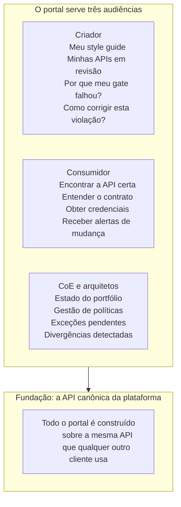
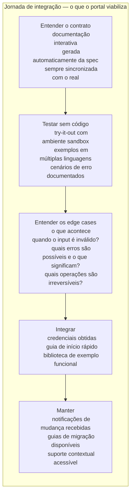

# Módulo 8 · Operacionalizando a Governança de APIs
## Capítulo 8.8 · Portal e a experiência do desenvolvedor

> **Série:** Gerenciamento e Governança de APIs
> **Nível:** Capacidade — como o portal operacionaliza a DX
> **Pré-requisito:** Cap 8.2 · Cap 8.3 · Cap 3.5 · Cap 3.6

---

## Sumário

- [8.8.1 · Duas audiências, um portal](#881--duas-audiências-um-portal)
- [8.8.2 · Descoberta — encontrar a API certa](#882--descoberta--encontrar-a-api-certa)
- [8.8.3 · Integração — do contrato à primeira chamada](#883--integração--do-contrato-à-primeira-chamada)
- [8.8.4 · Self-service — acesso sem burocracia](#884--self-service--acesso-sem-burocracia)
- [8.8.5 · O painel do CoE](#885--o-painel-do-coe)
- [8.8.6 · Desafios comuns](#886--desafios-comuns)

---

## 8.8.1 · Duas audiências, um portal

O portal é a interface humana da plataforma de governança. Mas "humanos" é uma categoria ampla demais — o portal serve audiências com necessidades fundamentalmente diferentes, e tentar servir a todas com a mesma interface frequentemente resulta em não servir bem a nenhuma.

Há três audiências principais:

**O desenvolvedor criador** — está construindo uma API e precisa entender quais padrões seguir, como registrar sua API no catálogo, como submeter para revisão, por que um gate falhou e como corrigir. Sua relação com a plataforma é de produtor — ela é o canal pelo qual sua API entra no portfólio governado.

**O desenvolvedor consumidor** — está integrando uma API criada por outro time e precisa encontrar a API certa, entender seu contrato, obter credenciais e receber notificações quando a API mudar. Sua relação com a plataforma é de descoberta e acesso — ela é a loja onde ele encontra o que precisa.

**O arquiteto do CoE** — está gerenciando o portfólio e precisa de visibilidade sobre o estado de compliance, ferramentas para publicar políticas, dados para tomar decisões e mecanismos para tratar exceções e divergências. Sua relação com a plataforma é de governança — ela é o sistema pelo qual exerce sua responsabilidade sobre o portfólio.

A separação entre as visões não precisa ser uma separação de produto — pode ser uma separação de contexto dentro do mesmo portal. O que não pode acontecer é que as necessidades de uma audiência contaminem a interface da outra: o CoE não deveria ver a complexidade de gestão de políticas na tela que o desenvolvedor usa para descobrir APIs.

---

## 8.8.2 · Descoberta — encontrar a API certa

O catálogo tem valor quando o desenvolvedor consegue encontrar o que procura — sem saber de antemão que existe, ou sem saber exatamente o nome. Descoberta é a capacidade de navegar o portfólio como um espaço de possibilidades, não como uma lista a ser percorrida.

**Busca por intenção, não por nome**

Um desenvolvedor que precisa "consultar o histórico de pedidos de um cliente" não deveria precisar saber que existe uma API chamada "orders-query-service". Deveria ser capaz de descrever o que precisa e encontrar a API relevante. Isso requer que as APIs do catálogo tenham metadados semânticos suficientes — descrições que capturem a intenção e o caso de uso, não apenas o nome técnico.

**Navegação por contexto**

Além da busca, o portal deve permitir navegação por contexto: ver todas as APIs de um domínio, todas as APIs de um sistema, todas as APIs que um time mantém. Isso é útil especialmente quando o desenvolvedor está integrando um conjunto de APIs relacionadas e precisa entender o ecossistema antes de escolher qual usar.

**Informação suficiente para decidir sem integrar**

Antes de começar a integração, o desenvolvedor precisa conseguir avaliar se uma API serve ao seu propósito. O catálogo deve mostrar não apenas o que a API faz, mas como se usa, quais são os casos de uso típicos, qual é o estado do ciclo de vida, quem mantém, qual é o nível de disponibilidade histórico. Essa informação reduz o custo de começar uma integração que vai ser descartada porque a API não era a certa.

---

## 8.8.3 · Integração — do contrato à primeira chamada

Uma vez que o desenvolvedor encontrou a API que precisa, o portal deve minimizar o tempo e o esforço para fazer a primeira chamada bem-sucedida. Cada passo desnecessário nesse percurso é fricção — e fricção acumulada é o que faz desenvolvedores buscarem atalhos ou desistirem.

**Documentação gerada da especificação**

O problema mais comum em portais de API é documentação desatualizada. A solução estrutural é gerar a documentação automaticamente a partir da especificação registrada no catálogo — não manter documentação separada que alguém precisa lembrar de atualizar. Quando a spec muda, a documentação muda.

Isso conecta a qualidade da documentação diretamente à qualidade da especificação. Um portal que gera documentação de specs pobres produz documentação pobre. Mas pelo menos a documentação reflete o estado real — não um estado que pode ter sido correto em algum momento no passado.

**O ambiente de try-it-out**

Fazer chamadas reais antes de escrever uma linha de código de integração elimina ciclos de tentativa e erro que consomem tempo de desenvolvimento. O portal deve oferecer um ambiente onde o desenvolvedor pode executar operações reais — com dados representativos, sem efeitos colaterais em produção — e ver as respostas exatas que vai receber na integração.

**Sustentação da integração**

A jornada não termina na primeira chamada bem-sucedida. O desenvolvedor que integrou uma API precisa saber quando ela muda: breaking changes antes que entrem em produção, novas versões com guias de migração, datas de sunset com antecedência suficiente para planejar. O portal é o canal pelo qual essa comunicação chega ao consumidor certo — não ao time do CoE, não via email genérico, mas ao desenvolvedor que tem aquela integração ativa.

---

## 8.8.4 · Self-service — acesso sem burocracia

O self-service completo — o desenvolvedor obtém credenciais e faz sua primeira chamada sem nenhuma intervenção humana — é um indicador de maturidade em Developer Experience (Cap 7.9). É também um requisito para que a plataforma escale: cada ponto de espera por ação humana no processo de onboarding é um gargalo que cresce com o portfólio.

**O que self-service real significa**

Self-service não significa ausência de controle — significa ausência de espera desnecessária. O processo pode ter aprovações automáticas para APIs públicas, aprovações baseadas em critérios predefinidos para APIs de parceiros, e aprovações humanas para APIs com acesso a dados sensíveis. O que caracteriza o self-service é que o desenvolvedor sabe exatamente o que vai acontecer, em qual prazo, sem precisar perguntar a ninguém.

Um processo que tem aprovação humana genuinamente necessária ainda pode ser self-service na maioria das etapas — se o formulário é claro, se a expectativa de prazo está definida, se o estado da solicitação é visível.

**Tipos de acesso e seus requisitos**

Nem toda API tem o mesmo processo de acesso. O portal deve comunicar claramente o que é necessário para cada tipo:

| Tipo de API | Processo típico de acesso |
|---|---|
| API pública de documentação | Sem autenticação — apenas navegar |
| API pública com rate limiting | Self-service com registro — credenciais imediatas |
| API interna de baixo risco | Self-service com aprovação automática por domínio |
| API com dados sensíveis | Aprovação manual com justificativa obrigatória |
| API de parceiro | Contrato formal com processo de negócio |

---

## 8.8.5 · O painel do CoE

O painel do CoE é a visão do portal orientada à governança — não à descoberta de APIs, mas à gestão do portfólio. Serve ao arquiteto que precisa ter uma visão do estado de saúde do portfólio e dos processos de governança em andamento.

O painel consolida informações de múltiplos contextos em uma interface que permite ao CoE agir:

**Estado do portfólio** — score de compliance por domínio, tendências, APIs que precisam de atenção imediata. Alimentado pela Inteligência de portfólio.

**Gestão de políticas** — políticas ativas, políticas em rascunho aguardando revisão, impacto de políticas pendentes de ativação. Conectado ao contexto de Políticas.

**Exceções pendentes** — solicitações de exceção aguardando aprovação, exceções próximas de vencer, exceções que foram renovadas múltiplas vezes. Conectado ao contexto de Políticas.

**Divergências detectadas** — shadow APIs, drifts de contrato, deployments sem registro. Alimentado pelo contexto de Descoberta.

**Registro e revisão** — APIs aguardando aprovação para publicação, APIs com spec desatualizada. Conectado ao catálogo.

A diferença entre o painel do CoE e um dashboard analítico é o foco na ação: cada item no painel representa algo que precisa de decisão ou atenção, não apenas informação para consumo passivo.

---

## 8.8.6 · Desafios comuns

### Portal como destino, não como ponto de partida

O portal foi construído e lançado. Times são instruídos a usá-lo. Mas o portal não está integrado ao fluxo de trabalho existente dos desenvolvedores — está num endereço separado que precisa ser visitado intencionalmente. Desenvolvedores que já têm fluxos estabelecidos continuam usando os canais antigos: perguntar diretamente ao time responsável, consultar a wiki desatualizada, usar credenciais compartilhadas por mensagem.

Um portal que não está onde os desenvolvedores já estão não será usado. A integração do portal com as ferramentas existentes — IDEs, sistemas de comunicação, pipelines de CI — é tão importante quanto a qualidade do portal em si.

### Documentação como vitrine, não como ferramenta

O portal tem documentação linda — bem estruturada, com exemplos, com navegação clara. Mas quando o desenvolvedor tenta usar a API com base na documentação, encontra comportamentos que a documentação não cobre: campos não documentados que aparecem nas respostas, erros que não estão na lista, casos de borda que funcionam diferente do descrito.

A documentação como vitrine acontece quando o objetivo é impressionar em vez de instrumentalizar. A documentação como ferramenta é aquela que o desenvolvedor usa como referência durante a integração e volta a consultar quando algo não funciona como esperado.

### O CoE que não usa o painel

O painel do CoE foi construído com cuidado. Tem os indicadores certos, as visões de exceções pendentes, o estado de compliance por domínio. Mas o CoE continua usando planilhas para acompanhar o estado das exceções, emails para comunicar políticas novas e reuniões para discutir o estado do portfólio.

A adoção do painel pelo CoE não é automática — depende de que o painel seja mais conveniente do que os processos existentes para as tarefas que o CoE realiza regularmente. Um painel que é consultado mas não substitui nenhum processo existente tem adoção nominal, não real.

---

## Pontos-chave do capítulo

- O portal serve três audiências com necessidades distintas: criadores, consumidores e o CoE — e deve separar as experiências sem fragmentar o produto
- Descoberta eficaz requer busca por intenção, navegação por contexto e informação suficiente para avaliar uma API sem precisar integrá-la
- Documentação gerada da especificação elimina o problema de desatualização — a qualidade da documentação é limitada pela qualidade da spec
- Self-service real é ausência de espera desnecessária, não ausência de controle — processos com aprovação humana podem ser self-service na maioria das etapas
- O painel do CoE é orientado à ação — cada item representa algo que precisa de decisão, não apenas informação para consumo passivo
- Um portal que não está integrado ao fluxo de trabalho existente dos desenvolvedores não será usado

---

## Próximo capítulo

**8.9 · Conhecimento como contexto independente** — por que a base de conhecimento requer ciclo de vida próprio, como conteúdo de governança é organizado para ser consumido por humanos e agentes, e o que torna uma base de conhecimento útil em vez de um arquivo de documentos.

---

*Série: Gerenciamento e Governança de APIs · Módulo 8 · Capítulo 8.8*