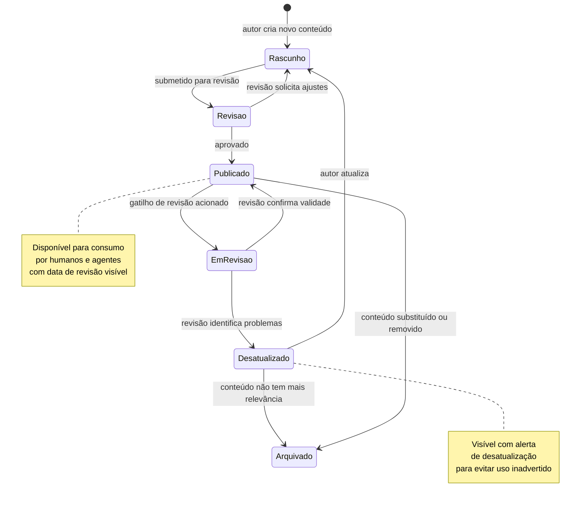
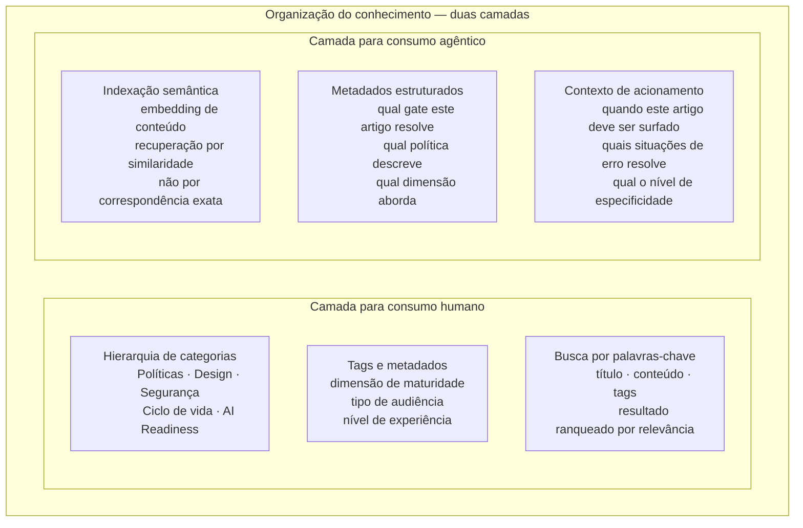

# Módulo 8 · Operacionalizando a Governança de APIs
## Capítulo 8.9 · Conhecimento como contexto independente

> **Série:** Gerenciamento e Governança de APIs
> **Nível:** Capacidade — por que conhecimento requer gestão própria
> **Pré-requisito:** Cap 8.2 · Cap 8.8

---

## Sumário

- [8.9.1 · Por que conhecimento é um contexto, não uma feature](#891--por-que-conhecimento-é-um-contexto-não-uma-feature)
- [8.9.2 · O ciclo de vida do conteúdo](#892--o-ciclo-de-vida-do-conteúdo)
- [8.9.3 · Organização para consumo humano e agêntico](#893--organização-para-consumo-humano-e-agêntico)
- [8.9.4 · Como o conhecimento se conecta com os outros contextos](#894--como-o-conhecimento-se-conecta-com-os-outros-contextos)
- [8.9.5 · Governança do conhecimento](#895--governança-do-conhecimento)
- [8.9.6 · Desafios comuns](#896--desafios-comuns)

---

## 8.9.1 · Por que conhecimento é um contexto, não uma feature

A maioria das plataformas trata conhecimento como um anexo — uma seção de documentação adicionada ao portal, um conjunto de wikis linkadas, uma pasta de PDFs acessível via menu. É tratado como conteúdo estático que alguém criou uma vez e que existe enquanto ninguém o remover.

Essa abordagem tem uma consequência previsível: informação desatualizada acumulando silenciosamente. Uma política muda, o artigo que explica como satisfazê-la não é atualizado, desenvolvedores seguem a orientação antiga e continuam falhando no gate. Um processo é revisado, o guia que descreve o processo antigo continua acessível, times seguem o fluxo errado.

Informação desatualizada em contexto de governança não é apenas inútil — é ativamente prejudicial. Um desenvolvedor que segue uma orientação incorreta gasta mais tempo do que se não tivesse orientação alguma, e conclui — razoavelmente — que a base de conhecimento não é confiável. Uma vez que essa percepção se instala, o conhecimento perde valor mesmo quando está correto.

Tratar conhecimento como contexto independente significa reconhecer que ele tem propriedades que nenhum outro contexto tem:

**Conteúdo tem ciclo de vida próprio**, separado do ciclo de vida dos artefatos que descreve. Um artigo sobre como satisfazer uma política pode ficar válido por meses ou se tornar obsoleto no dia seguinte se a política mudar.

**Conteúdo tem proprietários com responsabilidades ativas**, não apenas autores que criaram algo no passado. O proprietário é responsável por manter o artigo atualizado ao longo do tempo.

**Conteúdo requer processo de revisão antes de publicação**, especialmente quando orienta comportamentos que afetam o compliance do portfólio.

**Conteúdo precisa ser consumível por múltiplas audiências** — desenvolvedores humanos que leem, agentes de IA que recuperam e sintetizam, sistemas que linkam contextualmente.

---

## 8.9.2 · O ciclo de vida do conteúdo

**Gatilhos de revisão** são eventos que sinalizam que um artigo pode precisar ser revisado — não necessariamente que está errado, mas que alguém precisa verificar se ainda está correto:

- Uma política foi modificada → artigos que descrevem como satisfazê-la precisam de revisão
- Uma política foi descontinuada → artigos sobre ela devem ser arquivados
- A data de revisão programada do artigo chegou → revisão periódica obrigatória
- Múltiplos desenvolvedores reportaram que o artigo não resolveu seu problema → sinal de atualização necessária

O estado **Desatualizado** é explícito e visível — não é apenas a ausência de atualização. Um artigo desatualizado que permanece disponível como se estivesse correto é mais perigoso do que um artigo arquivado. A visibilidade do estado desatualizado, com alerta claro para o leitor, preserva a confiança no restante do conhecimento.

---

## 8.9.3 · Organização para consumo humano e agêntico

Conhecimento precisa ser organizado de formas diferentes dependendo de quem o consome.

**Para consumo humano**, a organização tradicional funciona: categorias, tags, breadcrumbs, busca por palavras-chave. Um desenvolvedor que quer entender como corrigir uma violação de autenticação busca "auth-policy" e encontra o artigo relevante.

**Para consumo agêntico**, a organização precisa de semântica adicional. Um agente não busca palavras-chave — recebe um contexto (uma violação de gate específica) e precisa recuperar o conteúdo mais relevante para aquele contexto. Isso requer que o conhecimento seja indexado de forma que permita recuperação por similaridade semântica, não apenas por correspondência de termos.

A camada agêntica não substitui a humana — complementa. Um artigo bem escrito para consumo humano, com metadados estruturados e contexto de acionamento definido, serve ambas as audiências.

---

## 8.9.4 · Como o conhecimento se conecta com os outros contextos

O contexto de Conhecimento tem relações específicas com os outros contextos — todas unidirecionais na direção de consumo:

**Portal → Conhecimento**
O portal é o canal primário pelo qual humanos acessam o conhecimento. Quando um gate falha e o desenvolvedor clica em "como corrigir", o portal consulta o Conhecimento e retorna o artigo mais relevante para aquela violação específica. Quando o CoE acessa a página de uma política, o portal mostra os artigos de conhecimento relacionados àquela política.

O Conhecimento não conhece o Portal — é o Portal que sabe quando e como surfar o conhecimento.

**Políticas → Conhecimento (gatilho)**
Quando uma política é modificada ou descontinuada, o contexto de Políticas publica um evento. O Conhecimento subscreve esses eventos e usa-os como gatilhos de revisão para os artigos relacionados. A relação é via evento — Políticas não sabe que o Conhecimento existe.

**Pipeline → Conhecimento (referência)**
Quando o pipeline reporta uma violação de gate, inclui uma referência ao artigo de remediação correspondente. O pipeline não conhece o conteúdo do artigo — apenas inclui o identificador que o portal usa para recuperá-lo e exibi-lo contextualmente.

**Agentes de IA → Conhecimento (via MCP)**
Agentes externos que têm acesso ao MCP Server da plataforma podem consultar o Conhecimento como fonte de informação de governança. Um assistente de desenvolvimento que sabe que o catálogo existe e que as políticas existem também sabe que existe uma base de conhecimento que explica como navegar as regras de governança.

---

## 8.9.5 · Governança do conhecimento

Governança de APIs requer governança do conhecimento sobre governança de APIs. A ironia não é apenas retórica — é prática. Um programa de governança que não governa seu próprio conhecimento produz os mesmos problemas que um portfólio de APIs sem governança: inconsistência, desatualização, confiança corroída.

**Ownership obrigatório**

Todo artigo tem um proprietário identificado — uma pessoa ou um time responsável por manter o conteúdo atualizado. Artigos sem proprietário são candidatos a arquivamento: se ninguém é responsável, ninguém garante que está correto.

**Revisão periódica**

Artigos têm data de revisão programada. Conteúdo sobre processos que mudam frequentemente deve ser revisado com mais frequência do que conteúdo sobre princípios que mudam raramente. O proprietário recebe notificação antes da data de revisão — não depois que o conteúdo ficou desatualizado.

**Controle de acesso**

Nem todo conhecimento deve ser acessível a todos. Guias operacionais para o CoE, documentação de decisões arquiteturais internas, análises de vulnerabilidades específicas — podem ter acesso restrito a audiências específicas. O controle de acesso do Conhecimento delega ao contexto de Identidade, da mesma forma que os outros contextos.

**Métricas de utilidade**

Um artigo que nunca é lido pode ser desnecessariamente detalhado, pode estar indexado incorretamente ou pode simplesmente não ser necessário. Um artigo que é lido muitas vezes mas continua gerando tickets de suporte para a mesma dúvida não está resolvendo o problema que deveria resolver. Métricas de utilidade — leituras, feedbacks, tickets gerados após leitura — informam quais artigos precisam de melhoria e quais podem ser simplificados ou arquivados.

---

## 8.9.6 · Desafios comuns

### O arquivo de boas intenções

A base de conhecimento foi criada com entusiasmo. Centenas de artigos foram escritos na fase inicial — guias de estilo, explicações de políticas, tutoriais de integração. Um ano depois, 60% dos artigos descrevem processos que mudaram, políticas que foram revisadas, ferramentas que foram substituídas. Ninguém atualizou porque ninguém tem responsabilidade formal de manter.

O arquivo de boas intenções é o estado mais comum de bases de conhecimento corporativas. A prevenção é estrutural: ownership obrigatório, revisão periódica automatizada e remoção ativa de conteúdo desatualizado.

### Conhecimento como cópia da documentação técnica

O time de governança decide que a base de conhecimento deve ter a especificação completa de cada política. Os artigos tornam-se cópias das políticas — tecnicamente precisos, completamente inutilizáveis para um desenvolvedor que quer saber como corrigir uma violação. A pergunta que o desenvolvedor tem é "o que eu faço quando esse gate falha?" — não "qual é a definição formal desta política?".

Conhecimento eficaz responde perguntas práticas que desenvolvedores têm em situações reais. Documentação técnica responde perguntas de referência. As duas coisas têm valor, mas em lugares diferentes.

### Conhecimento desconectado do fluxo de trabalho

Os artigos estão disponíveis no portal em uma seção chamada "Documentação" ou "Recursos". Quando um gate falha, a mensagem de erro diz "violação de auth-policy". O desenvolvedor precisa: lembrar que existe uma base de conhecimento, navegar até ela, buscar por "auth-policy" e encontrar — ou não encontrar — o artigo relevante.

Conhecimento que não está integrado ao fluxo de trabalho não é acessado quando é mais útil — no momento do problema. A integração contextual — artigo surfado automaticamente quando o gate falha, não em resposta a uma busca manual — é o que transforma conhecimento de recurso passivo em assistência ativa.

---

## Pontos-chave do capítulo

- Tratar conhecimento como contexto independente significa reconhecer que conteúdo tem ciclo de vida próprio, proprietários com responsabilidades ativas e requisitos de consumo distintos por audiência
- Informação desatualizada em contexto de governança é ativamente prejudicial — mais danosa do que ausência de informação, porque erode a confiança em toda a base
- O ciclo de vida do conteúdo inclui estados explícitos — incluindo Desatualizado com alerta visível — não apenas publicado ou arquivado
- Organização para consumo agêntico requer indexação semântica e metadados de contexto de acionamento, além da estrutura tradicional para consumo humano
- A conexão com outros contextos é via eventos e referências — Políticas aciona revisão via evento, Pipeline inclui referência ao artigo de remediação
- Conhecimento desconectado do fluxo de trabalho é recurso passivo — integração contextual o transforma em assistência ativa

---

## Próximo capítulo

**8.10 · Assistência inteligente** — os três ângulos de IA na plataforma: a plataforma consumida por agentes externos, IA usada pelos contextos internos e agentes que assistem os usuários da plataforma.

---

*Série: Gerenciamento e Governança de APIs · Módulo 8 · Capítulo 8.9*