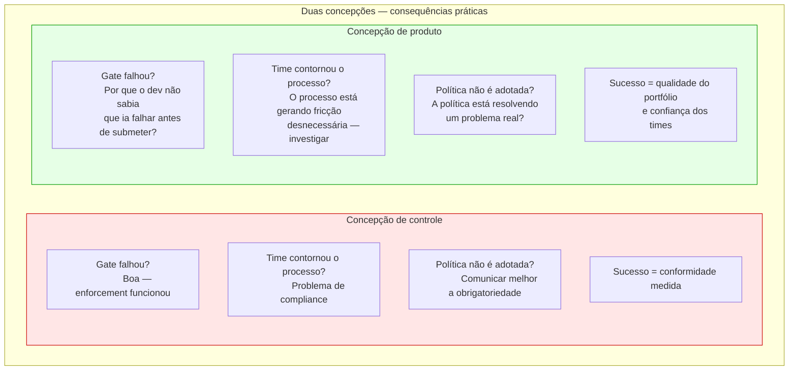

# Módulo 8 · Operacionalizando a Governança de APIs
## Prefácio · A plataforma como produto

> **Série:** Gerenciamento e Governança de APIs

---

Há duas formas de construir uma plataforma de governança de APIs.

Na primeira, a plataforma é construída de dentro para fora — a partir das necessidades do CoE. Define-se o que precisa ser controlado, cria-se as ferramentas para controlar, e entrega-se aos times de desenvolvimento como sistema que eles são obrigados a usar. O sucesso é medido pelo número de políticas ativas, de APIs no catálogo, de gates configurados. A plataforma é um sistema de controle.

Na segunda, a plataforma é construída de fora para dentro — a partir das necessidades de quem a usa. Pergunta-se o que impede times de desenvolverem APIs com qualidade, remove-se esses impedimentos, e entrega-se uma ferramenta que times querem usar porque resolve problemas reais. O sucesso é medido pela qualidade do portfólio, pela redução de incidentes causados por APIs mal projetadas, pela velocidade com que times publicam APIs que seus consumidores conseguem usar. A plataforma é um produto.

A diferença entre as duas formas não é técnica. É filosófica — e determina tudo que vem depois.

---

## O problema que Cagan nomeou

Em *Inspired* e *Empowered*, Marty Cagan articula uma distinção que ressoa além do desenvolvimento de produtos comerciais. Há times que trabalham como **mercenários** — recebem uma lista de funcionalidades para construir e são medidos pela entrega dessas funcionalidades. E há times que trabalham como **missionários** — recebem um problema para resolver e são responsabilizados pelos resultados que produzem.

Times de produto empoderados são responsáveis por entregar resultados de negócio — outcomes — em vez de simplesmente construir funcionalidades — outputs.

Aplicado à governança de APIs, a distinção é precisa. Um time de CoE que opera como mercenário define políticas, configura gates, publica documentação — e mede seu sucesso pela quantidade de artefatos produzidos. Um time que opera como missionário se responsabiliza pela qualidade do portfólio, pela confiança dos times de desenvolvimento no processo de publicação, pela redução de incidentes causados por APIs mal projetadas.

A plataforma que um time mercenário constrói enforça regras. A plataforma que um time missionário constrói habilita excelência.

---

## A armadilha que Perri descreveu

Melissa Perri, em *Escaping the Build Trap*, nomeia o padrão que captura organizações que confundem output com outcome:

O build trap ocorre quando organizações ficam presas medindo seu sucesso por outputs em vez de outcomes — quando focam mais em construir e desenvolver funcionalidades do que no valor real que essas coisas produzem.

O build trap da governança tem uma forma específica. A organização publica dezenas de políticas. Configura um pipeline com múltiplos gates. Lança um portal com documentação. Conta o número de APIs no catálogo. E acredita que está governando bem porque está produzindo muito.

Enquanto isso, a qualidade real do portfólio pode estar estagnada. Times podem estar contornando o pipeline. O portal pode ter documentação que ninguém lê. As políticas podem estar enforçando o que era importante dois anos atrás.

O cliente só realiza valor se seus problemas são resolvidos — o que então leva aos outcomes de negócio desejados. Para isso, a organização precisa investir e se organizar em torno de uma compreensão profunda dos problemas dos seus clientes.

Os clientes da plataforma de governança são os times de desenvolvimento. Seus problemas não são "não ter uma lista de políticas" — são publicar APIs com qualidade sem saber se vão ser bloqueados na revisão, integrar com APIs que têm documentação desatualizada, descobrir tarde demais que a API que estavam construindo já existia.

Uma plataforma que resolve esses problemas entrega valor. Uma plataforma que produce artefatos de governança sem resolver esses problemas está no build trap.

---

## O que Skelton e Pais tornaram explícito

Em *Team Topologies*, Matthew Skelton e Manuel Pais articularam o que as organizações mais avançadas em engenharia de plataforma já praticavam: a plataforma deve ser tratada como produto, com seus usuários internos como clientes.

As plataformas de que falamos colocam forte foco em developer experience — elas veem outros times de desenvolvimento como seus clientes efetivos. Elas operam a plataforma como um produto ou serviço, pensando verdadeiramente sobre qual é a experiência de usá-las. Algumas organizações chegam a usar NPS — Net Promoter Score — para avaliar o quão bem a plataforma está se saindo em termos de developer experience.

O conceito de **Thinnest Viable Platform** (TVP) é particularmente relevante para plataformas de governança. Skelton e Pais definem a TVP como o menor conjunto de APIs, documentação e ferramentas necessários para acelerar os times que desenvolvem serviços e sistemas de software modernos.

Uma plataforma de governança que tenta resolver todos os problemas de uma vez antes de entregar valor — o projeto que nunca termina descrito no Cap 8.13 — viola esse princípio. A plataforma mais útil não é a mais completa. É a que resolve os problemas mais urgentes dos seus usuários da forma mais simples possível — e evolui a partir daí.

A Team Topologies introduz a noção de plataforma mínima viável como comparável ao conceito amplamente utilizado de produto mínimo viável. Ao focar no mínimo — e ter como objetivo uma plataforma just-big-enough em vez de uma grande e inchada — as organizações evitam implementar funcionalidade desnecessária. Também aumentam a probabilidade de criar algo que impacta positivamente seus usuários.

---

## O propósito de produto de uma plataforma de governança

Toda plataforma de produto, no sentido de Cagan, precisa de uma visão clara. Uma visão que responde não "o que construiremos?" mas "que problema resolveremos para quem, e qual é o futuro que imaginamos para eles?"

O propósito de uma plataforma de governança de APIs pode ser articulado de formas muito diferentes dependendo de como ela é concebida:

**Concepção de controle:**
*"Garantir que todas as APIs do portfólio estejam em conformidade com as políticas definidas pelo CoE."*

**Concepção de produto:**
*"Permitir que times de desenvolvimento construam e publiquem APIs excelentes com confiança — sabendo que vão passar pela revisão, que estão alinhadas com os padrões do portfólio, e que seus consumidores vão conseguir usá-las."*

A diferença é profunda. Na primeira concepção, o sucesso é compliance. Na segunda, o sucesso é a qualidade do portfólio e a confiança dos times. Compliance é um meio — não um fim.

Essa distinção tem consequências práticas em cada decisão de design da plataforma:

---

## O que este módulo pressupõe

Os capítulos que seguem descrevem as capacidades de uma plataforma de governança de APIs. Eles foram escritos com uma premissa que vale tornar explícita: a plataforma é um produto interno cujos clientes são os times de desenvolvimento, e cujo sucesso é medido pelo impacto na qualidade do portfólio e na confiança de quem o constrói.

Isso não significa que compliance não importa — significa que compliance é consequência, não objetivo. Uma plataforma que times usam porque ajuda produz compliance como efeito colateral. Uma plataforma que times evitam produz compliance nominal e portfólio real degradado.

A diferença entre as duas — e como construir a primeira — é o que este módulo trata.

---

**Referências**

| Obra | Autores | Contribuição central |
|---|---|---|
| *Inspired: How to Create Tech Products Customers Love* | Marty Cagan | Times de produto vs. times de features; missionaries vs. mercenaries; outcomes vs. outputs |
| *Empowered: Ordinary People, Extraordinary Products* | Marty Cagan | Times empoderados responsabilizados por resultados, não por entregas |
| *Escaping the Build Trap* | Melissa Perri | O build trap: medir sucesso por outputs em vez de outcomes; o valor exchange system |
| *Team Topologies* | Matthew Skelton · Manuel Pais | Platform as product; Thinnest Viable Platform; developer cognitive load; NPS como métrica de plataforma |

---

*Série: Gerenciamento e Governança de APIs · Módulo 8 · Prefácio*